### 打开台北的正确方式！
2015-11-03 携程 携程
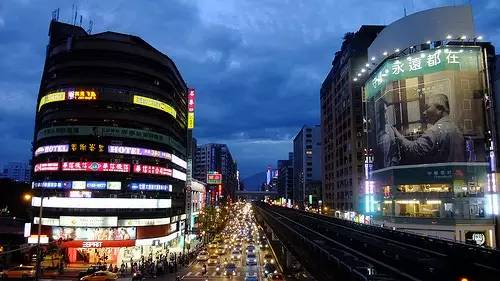

动力火车的一首《忠孝东路走九遍》让许多人跃跃欲试！淡定淡定啦少年~总长10公里的忠孝东路，别说九遍，恐怕要完整的走上一遍，腿就要走断啦。所以为了让大家快准狠的逛到心怡店，小编整理总结了十分精简的tips，简单易懂，方向那是更明确！

Tips
### 忠孝东路逛街指南
到底如何逛忠孝东路？
1. 喜欢买名牌奢侈品的游客，可以去SOGO商圈、敦南商圈与信义商圈
2. 敦南诚品书店：敦化南路1段245号
3. 好样集团系列的系列创意店铺：好样餐厅VVG TABLE、好样公寓、好样本事书店、好样BON BON等，忠孝东路4段181巷40弄13、18、20号
4. 好样棒棒梦幻糖果屋：敦化南路1段161巷13号
5. 创意小店集中地区：忠孝东路4段205巷
6. 旧街蚌面：忠孝东路4段205巷7弄13号
7. 度小月：忠孝东路4段216巷8弄12号，代表美食：卤肉饭、担担面、冻笋
8. SOGO商圈附近一条有“名人巷”之称的大安路，分布着各国风味的平价美食
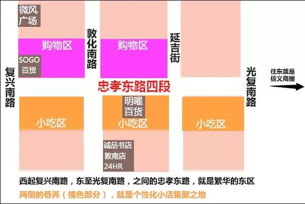

东区个性化小店，都集中在沿著忠孝东路两侧的巷弄之中。西起复兴南路，东至光复南路，之间的忠孝东路，就是繁华的东区。两侧的巷弄，就是个性化小店群聚之地。忠孝东路和延吉街口，还有2011年全新出发的明曜百货，一楼是知名的日本平价服饰UNIQLO。

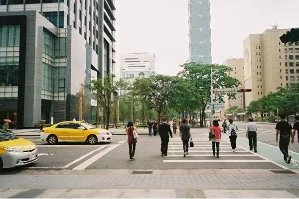
要游玩忠孝东路，最好的方法就是搭捷运

从台北车站搭上捷运，沿着忠孝东路一共有10站捷运车站，每一站的出口都是忠孝东路的繁华商圈。如果喜欢买最新潮的3C产品的游客，可以直接在忠孝新生站下车，车站周边就是被称为台湾秋叶原的光华商场，最新最便宜的平板计算机、智能型手机，在这里一应俱全。

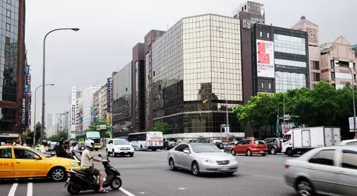
而喜欢买名牌奢侈品的游客，绝对要去SOGO商圈、敦南商圈与信义商圈一游。
推荐1：寻宝——个性小店
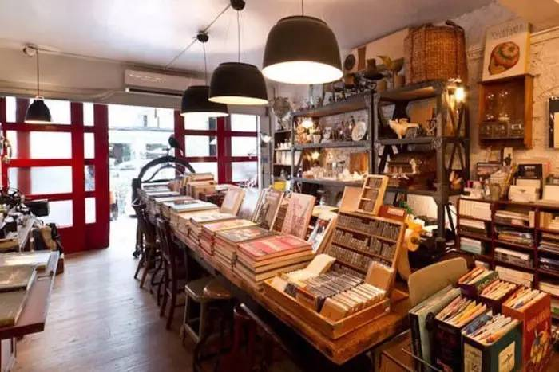

漫步忠孝东路，千万不要只把注意力放在大马路上的大型商店，不妨转个弯，绕进忠孝东路四段的小巷子。忠孝东路四段，数十年来一直是台湾最时髦的地方。一般称之为”东区”。

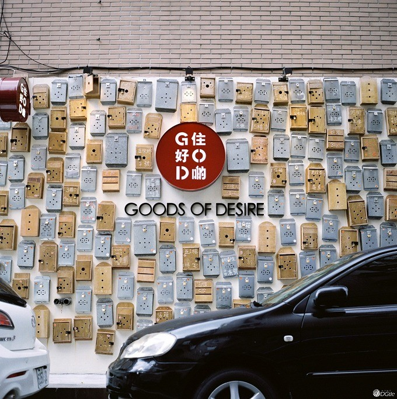

深入这些小巷中，才发现这里并不寂寞，往来穿行的都是衣着打扮时尚的年轻人。原创的商品，个性的主题书店，温馨的咖啡糖果屋，以及各国的风味美食，总会有一样吸引你的目光。

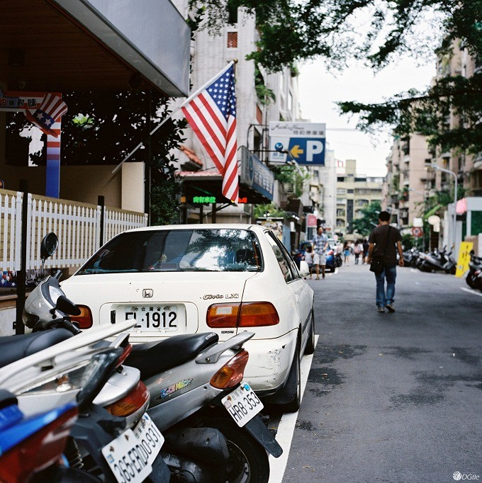

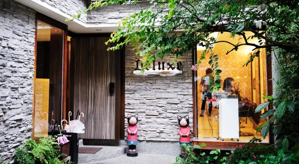

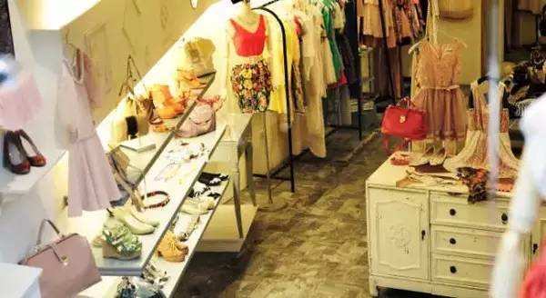

巷子里充满着艺文气息，更有许多年轻人开的个性小店铺，如明曜百货后面的巷子，有一家咖啡馆，闹中取静，吸引了许多艺文界人士青睐。每天午后，导演侯孝贤就是爱坐在窗边的座位，静静地观察窗外的人潮，一会沉思下一部电影的创意。

### 推荐2：小歇——好样餐桌
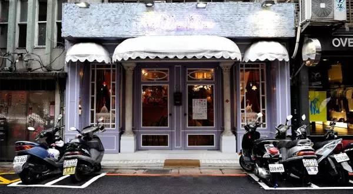

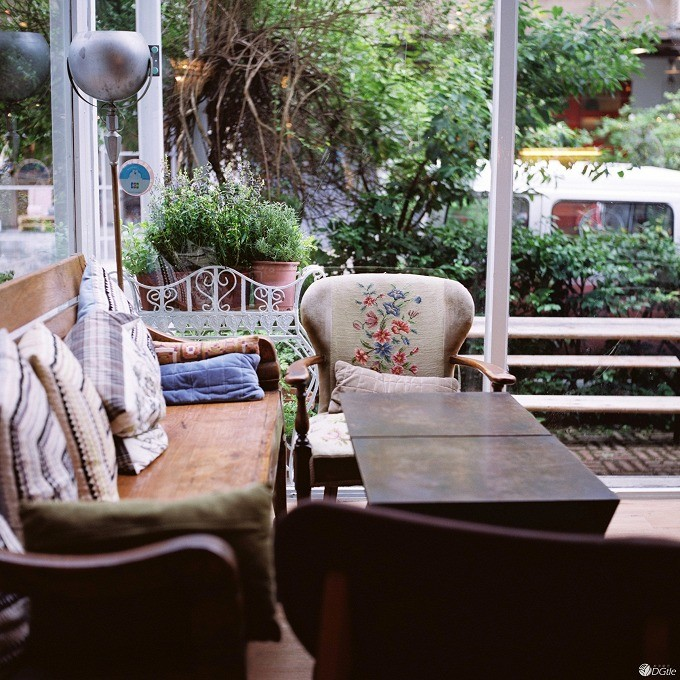

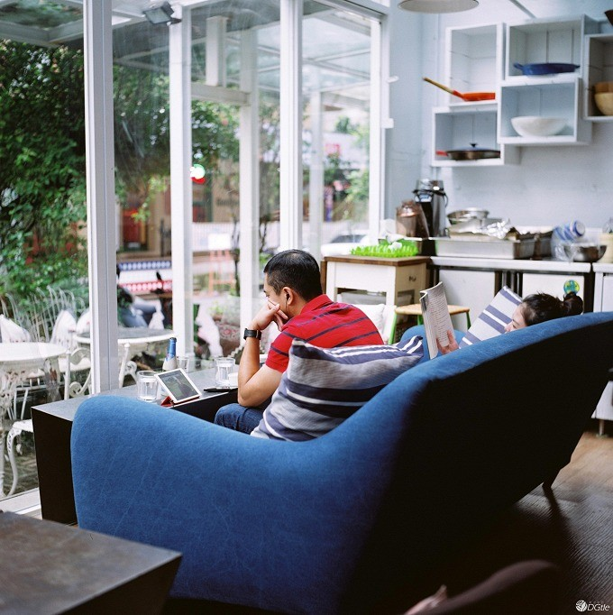
走累的时候，不妨也找家梦幻童话般的咖啡店坐下休息。这家有着淡紫色门脸的小店属于好样集团，是这一带小有名气的法式甜品店：VVG 好样餐桌。

推开门，仿佛置身于一个温馨梦幻的世界，粉色的墙壁，灰色的屋顶，彩色的糖果，营造出一席浪漫、轻松的气氛。
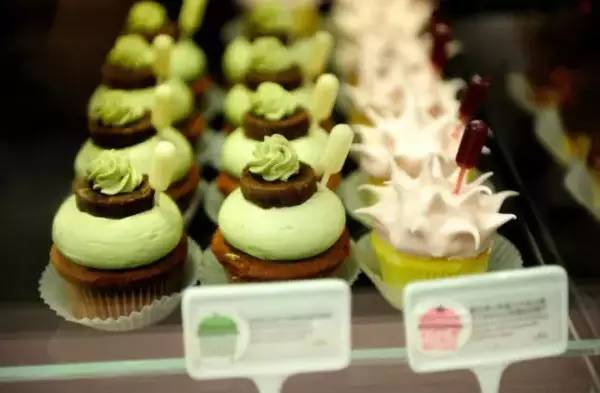

甜品店的招牌就是各种杯子蛋糕，每天下午两点出炉，到黄昏时候就会售卖一空。点一份甜品，坐在靠窗的沙发上，看小巷中往来的男男女女，慢慢的融入忠孝东路的曼妙气氛之中。

### 【好样餐桌 VVG Table】
地址：台北市大安区忠孝东路四段181巷40弄14号
推荐3：师大夜市吃不停
在市立美术馆周边，各种小店，小餐厅林立，以及光点电影院这样的“文艺地标”，随便走走逛逛，会有惊喜。
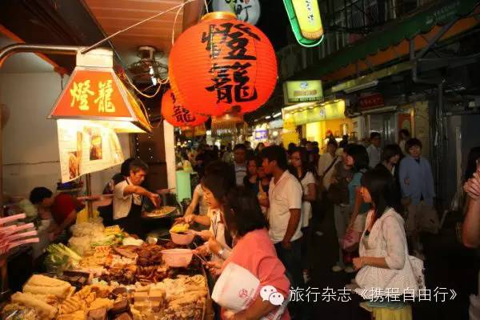

推荐师大夜市的原因是那里非常的学生气，师大夜市有许多创意美食，都很平价。位于街中间的几家卤味，巨好吃！附近的永康街什么的也可逛逛，芒果冰大概不会让你失望。
推荐4：必探——诚品书店
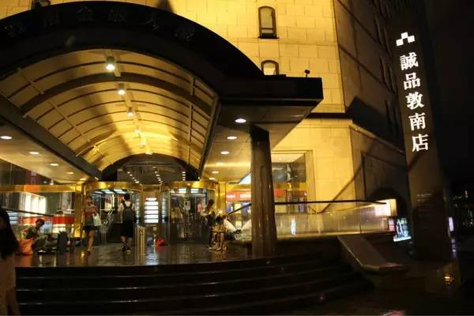
在忠孝东路的最后一站是位于敦化南路和忠孝东路交叉路口的诚品书店敦南旗舰店，这里已然成为旅行者必须要去膜拜的地方。
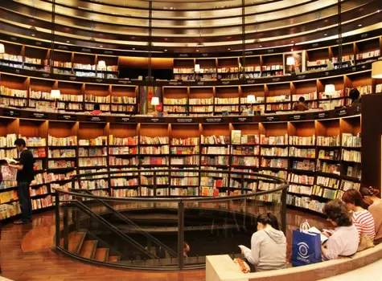
看看这里的图书排行榜，会让你以最快速度对这个城市的文化和动态有所了解。店里人很多却不嘈杂，许多人就坐在过道上，静静的阅读。店里没有书香，却充满了书韵。
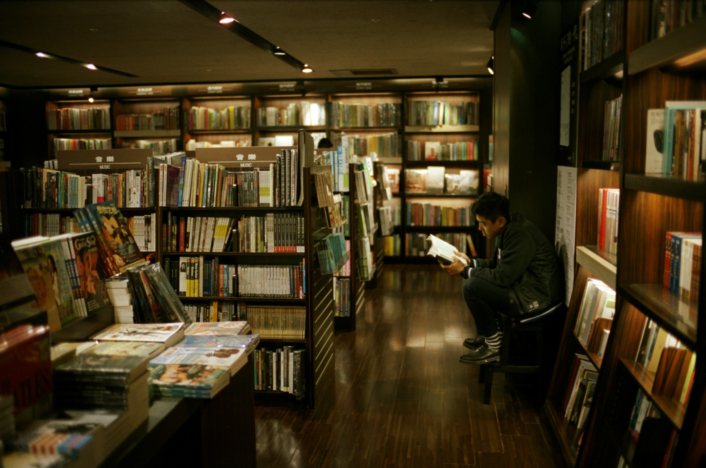
书店分上下六层，除了书之外，也有音像制品、文具和餐厅，在里面泡上一整天都没有问题。
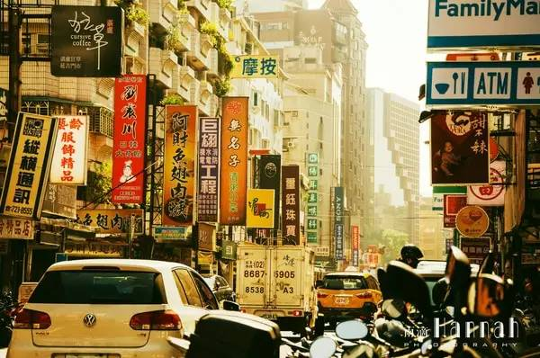
虽然“忠孝东路走九遍”是一种比较夸张的说法，但这里确实是一个让人百逛不厌的地方。这也许就是台湾，虽然并不广袤，但却孕育着无限的创造力。
推荐5：购物集聚SOHO区
忠孝东路商圈，可由复兴南路为起点，切至光复南路为终点，虽在此范围外，仍然有许多商店林立，但最繁荣的区域，则以此区域为主。
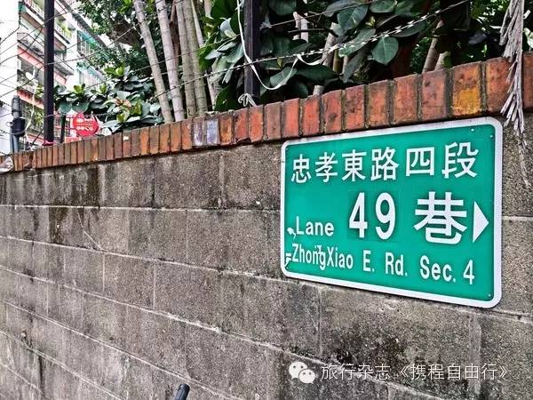

属于忠孝东路自己的特色是“百货公司”，台北一半以上百货公司都在忠孝东路上，整条忠孝东路仿佛是以百货公司为地标架构而成，而百货公司同时也代表了其提供商品的类加别与多样化，吸引了不同的购物者，找寻消费目标；然布就其类型，到东区风购物的人潮，绝大多数仍以购衣为主要大宗，这些知名服饰品牌除了在百货公司中设立专柜，此外，也有许多开设了独立的旗舰店或独立店面。

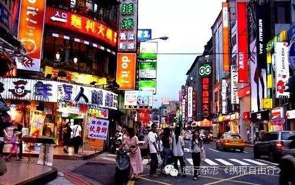

以国际设计师名牌为主，如Donna Karan.Versace, 属高价位商品。SOGO忠孝店是东区销售额最高的百货公司，于东区兴起初期即已开幕，无论何时都是人潮不断，拥有的服饰专柜品牌比一般百货公司多与齐全，另有SOGO敦南店在敦化南路近忠孝东路处，和忠孝店不同的是，这里以比较高价位的知名牌服饰为主。

_________________________________
点击“阅读原文”，查看更多旅游线路！

