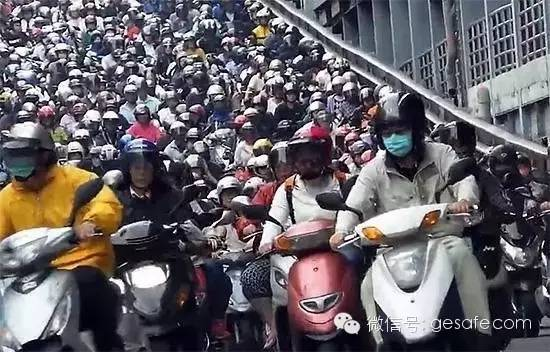
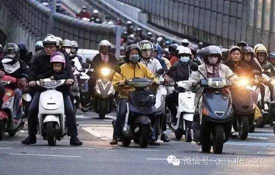
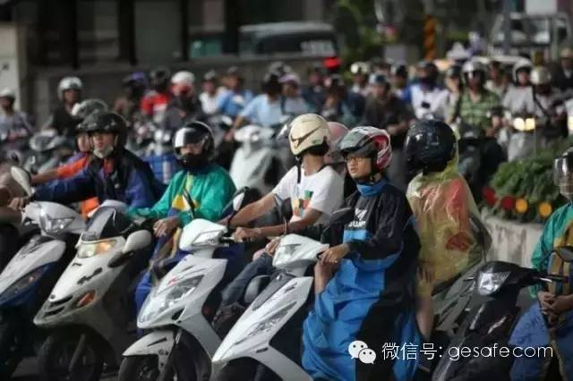
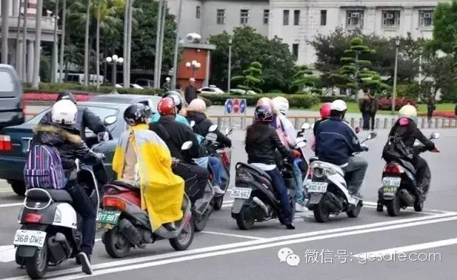
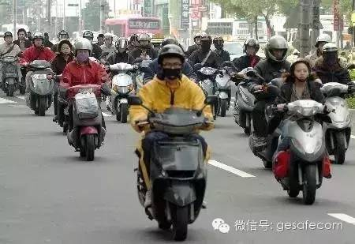

### 台湾为什么不禁摩？
2016-04-04veagoo  格上理财
作者：veagoo
来源：子陵论坛

随着参访团到了台湾几天，最大的印象就是台湾城市里的摩托真是多。
不止在乡下地方是如此，就算在台湾最繁华的三个大都市台北、台中、高雄更是如此。街上停满了摩托，甚至到了令人寸步难行的地步。
而马路上甚至满是摩托在争道，每一个路口在停等红灯时，总是有一大群的摩托等在车阵前，一转绿灯，马上蜂涌而出。最引人注目的是，连排气量大的街车也混杂其中。
这不禁令人感到好奇，为什么台湾的城市不禁摩。禁摩的好处显而易见，对于都市的景观与文明、交通的安全顺畅是有极大帮助的。

只是这个问题一直存在我心中，在繁忙的参访行程中一直没有机会好好与台湾的朋友坐下来深谈。直到参访行程快结束时，在台中丘逢甲大学与几个教授一同坐谈时，才问出了我心中的问题。

其中一名任职于都市设计系的林教授反而大惑不解的反问我，为什么要禁摩，怎么可以禁摩。林教授说摩托是一种很便利的交通工具，最重要的是很便宜，台湾一个工人或刚毕业的大学生，花一个月的薪水就能买一部最阳春的车型。

### 骑摩托的当然都是经济能力较不好的人，如果禁了，他们的生计可怎么办？

对他们来说，摩托是最重要的交通工具，他们靠这部摩托上班上工的，不能说禁就禁。接着林教授就回忆起他年轻时，还在读研究院时，如何骑着他买来的二手摩托在台北市四处兼职当家庭教师，筹足学费，最后让自己这个农村子弟顺利完成学业，如果没有他那辆摩托，他大概无法完成学业吧。

几个教授也都谈到这自己年轻时骑摩托上班工作的经历，甚至其中有一个方教授一直到今天还骑摩托上下班，方教授说摩托便利，他家离学校不过五分钟路程，如果开车那才麻烦，骑摩托方便，他家中就有三辆摩托，分别是教授自己一辆，老婆一辆、也已经读大学的小孩一辆。

方教授说他的老婆任职于地方上的小学，他们小学的教师骑摩托的也是很多，并不是没有钱买车，只是因为路程近，图个方便罢了。

方教授说台湾一般的家庭里像他们家一样，拥有三辆摩托的比比皆是，像小孩上了大学，通常也会买一辆。台湾一辆新摩托的的价钱大约就是一万元人民币，随车种好坏略有上下，一般的工薪阶级都买的起，大学生暑假兼一份工也能存到这个钱，所以在大学里几乎也是一人一辆的。

那我就问他们难道就没有想过城市的景观被无所不在的摩托所破坏，禁摩难道不是文明都市都会做的吗？
况且摩托污染啊，对都市的空气不好。这时林教授说政府不能因为要打造一个「看起来」好的城市就枉顾社会百姓的需求。都市看来乱，不是人民的责任，是政府规划管理的不好。
叫社会底层的百姓不要骑摩托不是治本的办法，那是锯箭疗法，以他本身都市规划的专业，他完全不能同意。

林教授又说如果政府能够提出并兴建完善的大众交通系统让大家都乐意搭公车还是地铁上班，那禁摩也许还有几分道理，但是在还没有做到这一步时禁摩，无疑是剥夺了人民的交通权上，试想还买不能车，但是又要到远方工作的工人或刚毕业的大学生们，要怎么办呢？

这时另一名教公共行政的陈教授笑着说了，在台湾哪一个市长敢禁摩，那他的政治生命就完了，看看路上满街跑的摩托，那上面载着的是一张张的选票啊。

最后这名说笑的陈教授说了一件事，让我感触良多。
陈教授说在台湾摆个小摊，只要不占道、不卖吃了会拉稀的食物，基本上没有人管。
像他们任教的丘逢甲大学外头就是台湾中部有名的摊贩一条街，晚上那是满满的摊贩在经营。公安基本只会抓占道的，抓到一次却也只罚点小钱。
陈教授说，一个失业的工人，与其让政府每个月花钱去求济他，不如让他上街摆个小摊，做点小生意，一家的温饱的就有了保障。
小孩上公立学校的钱一学期是不到二千元人民币的、缴纳医疗健康保险的钱一个月大概要二百元人民币，一个经营还不算太差的小摊是可以维持的。

陈教授说就公共行政上的学术理论来说，执法上也是要讲究「比例原则」的，对于社会的底层要多些宽容，摆小摊的、做小生意的、骑摩托的多是社会上经济能力较差的，执法就是宽松一点。

有些事睁只眼闭只眼就过去了，好过让他们没有了谋生能力而要全靠政府救助。但是对于大企业、政府官员就要执法从严，逃税一元，贪污一元也要追究。

就在与这些教授结束座谈后，同团的人都有很深的感触。我这才发现所谓的「法律平等」不是真正的平等。
执法原来还有所谓的「比例原则」，特别这四个字是从一辈子钻研公共行政的老教授口中说出来，更是令人感到印象深刻，原来所谓执法的「情、理、法」是存在的。
当我们强调要依法行政、建构文明社会时，是否忘了什么是「比例原则」，忘了法律要优先照顾社会上的弱势呢？

