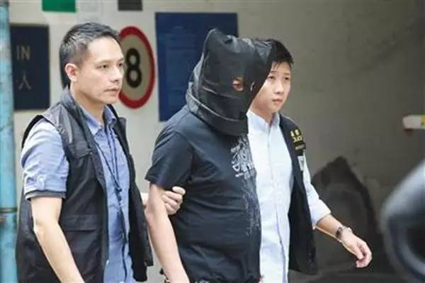

### “香港打死游客”再调查：内地老板隐身幕后
2015-10-24  澎湃新闻 澎湃新闻
澎湃新闻记者 陈竹沁 章文立 蒋子文

香港警方带一名疑犯到红磡民乐街案发现场重组案情。
“内地游客在港被殴打致死”事件调查再升级。
涉事旅行社天马国际（香港）旅游有限公司（以下简称“天马国际”）唯一董事林端虹目前已被香港警方拘捕。

据香港成报网报道，香港旅游业议会（以下简称“香港旅议会”）在调查期间发现，天马国际旅行社涉嫌与内地无牌旅行社交易并提交虚假文件，前往香港北角警署报案。警方经初步调查后，于10月23日晚以涉嫌行使虚假文书罪名拘捕一名42岁林姓女子，并在行动中带走一台电脑及一批文件做进一步调查。

据澎湃新闻记者了解，被捕女子系天马国际旅行社董事林端虹。目前该案由香港九龙城警区重案组跟进调查，其同时正在负责内地游客死亡案调查。
另据香港成报网报道，香港警方相信仍有一至两名操内地口音的人在逃，已按照既定机制，透过广东省公安厅追查涉案人。
涉事旅行社董事疑为内地商人“持牌”

澎湃新闻记者调查发现，天马国际成立于2012年9月，实际由内地商人李先营全资持股，由持香港身份证的林端虹任唯一董事。李先营同时还经营另一家香港旅行社先盈国际旅游有限公司（以下简称“先盈国际”）。

澎湃新闻记者通过查询香港旅议会导游名册确认，天马国际董事林端虹为香港本地持牌导游，导游证号TG04282，明年12月31日过期。
林端虹目前还兼任飞马国际旅游集团有限公司董事，该公司9月8日刚刚在港注册成立。

2002年4月，福建省公安厅发布的一份《单程赴港澳定居名单公告》中，也有一位现年42岁、名叫林端虹的泉州籍女子。其申请香港单程证的类别为 “香港夫妻团聚”。该公告显示，其结婚与分居时间均为1997年3月13日。

而李先营经营的先盈国际，也曾在泉州开设香港先盈国际旅游有限公司（泉州办事处）。

值得注意的是，先盈国际的董事罗祥也是拥有香港身份证的持牌导游。他除了担任先盈国际的董事外，还兼任大运旅游有限公司、扬颐旅游有限公司、香江国际（香港）旅行社有限公司和香江邮轮有限公司董事。

香港旅游界立法会议员姚思荣向澎湃新闻记者介绍，在香港成立旅行社门槛很低，只要50万港币注册资本（随后可以抽走）、一个单独的门面作注册地址，还有一位有经验的香港人做董事。因此，近年来有不少内地人通过人情或金钱关系，招揽香港人替他们做旅行社“持牌人”，业内对此已司空见惯。

香港（内地入境团）导游总工会主席谢北拱告诉澎湃新闻记者，据其所知，目前大概有十几位内地老板在香港成立旅行社接待内地入境团。 “他们每人手上都有至少两三个旅行社牌照，即使其中一个因为违规被旅议会取消会籍或吊销牌照，也不影响继续接团经营。”

“他们控制的公司总数很少，但市场占有率每个季度平均有六成以上，旺季时更是达到七八成，剩下大量香港本地旅行社苟延残喘。”谢北拱称，这些内地老板中，有的人自己在内地还有组团社，同时在港经营珠宝店等，形成了“一条龙”的产业链，不断压低整个行业的团费标准，几乎榨干香港本地旅行社的生存空间，对香港旅游行业生态产生极坏影响。

一位香港旅游业知情人士也向澎湃新闻记者证实，包括天马国际在内的很多旅行社，虽然在香港注册，但主要人员其实都在深圳办公，在香港只租用很小一间门面作为注册地址。此次案件中被控“误杀”的内地领队刘洋也是天马国际的一员，平时就住在深圳，只有带团时来港。

已有与“冒牌旅行社”合作前科

10月22日，香港旅议会总干事董耀中接受媒体群访时透露，天马国际在出事旅行团抵港前向旅议会提交的“团队确认书”显示，组团方为深圳深旅国际旅行社。但深圳市文体旅游局经查证后称，深圳深旅国际旅行社否认有交团给天马国际接待。

香港旅议会因此怀疑天马国际与内地无牌旅行社交易、提交虚假的“团队确认书”文件，并报警。
据香港文汇报报道，同样为李先营经营的先盈国际旅行社，2012年某次被内地游客投诉后，曾向媒体自辩，强调旅行社“只与深圳市深旅国际旅行社有限公司存在合作关系。”

香港旅游界立法会议员姚思荣告诉澎湃新闻记者，香港旅行社与内地无牌旅行社合作的现象确实存在。“内地成立旅行社门槛高，很多无牌旅行社会选择挂靠有牌旅行社，像触角一样，收集了散客团交给他们经营。深圳还有很多派单宣传、假冒知名有牌旅行社的，收了团交钱给有牌旅行社拿到团队过境名单表，也可以过关，再交由香港本地旅行社接待。”

姚思荣称，香港旅游业议会在行程前收到旅行社提交的“团队确认书”，只做备份，未来接到投诉才会审核惩处，因此更多有赖行业自律。
澎湃新闻此前报道，先盈国际早前已被投诉与“冒牌旅行社”合作。

2012年10月14日，天涯网友“SophiaZhong1989”发帖称，2012年1月7日，其报名参加了“国旅（深圳）国际旅行社”的港澳五日游，合同约定全程绝无强制购物、无强制自费项目。但该旅行社在没有与团员协商告知的情况下擅自将团员转给了先盈国际旅行社的纯购物团。

该网友发现，组团的“国旅（深圳）国际旅行社”并没有特许经营出境游资质，但广告上却打出了“国家指定出境游组团社”的许可证编号“L-GD-G100006”。

澎湃新闻记者网上检索发现，有大量以“国旅（深圳）国际旅行社”为名的山寨网站，均号称自己是“深圳国旅唯一官方网站”，网站所列出的许可证号则多是“L-GD-CJ00067”。

这两个许可证编号在国家旅游局2009年公布的979家《经营中国公民出国旅游业务的旅行社名单》中都不存在。真正有组团资质的“中国国旅（深圳）国际旅行社有限公司”，其许可证号为“L-GD-GJ00254”。

据香港旅议会消息透露，天马国际近月牵涉多宗投诉，旅议会稍后会一并调查，确保公正。
而公开资料显示，2013年3月，先盈国际亦曾因严重违反高达五项规定，遭旅议会规条委员会扣罚10分（2年内扣30满分会被暂停会籍）。
近年来，该公司还不断被曝光推出赠送“港澳游免费券”等活动，实质上正是香港旅议会三令五申要打击的“零团费”游。

阅读原文 举报

