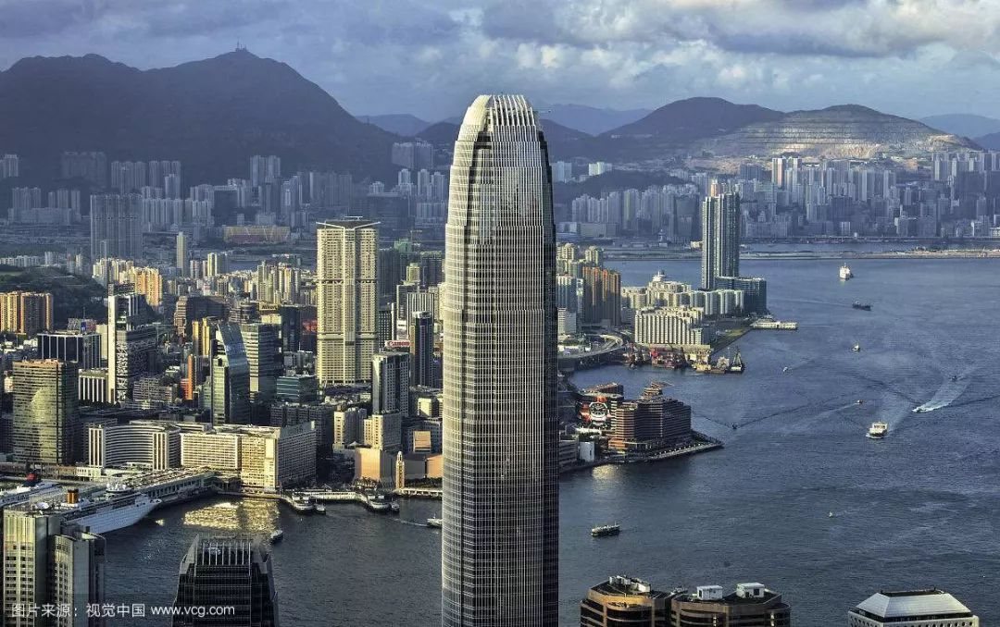
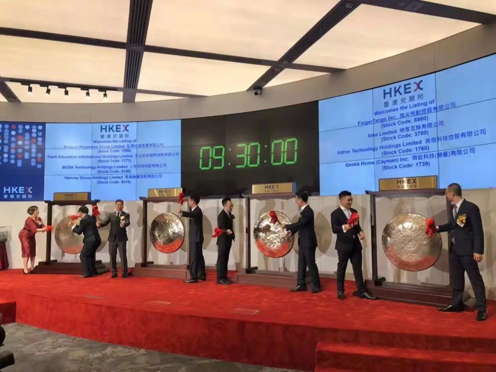
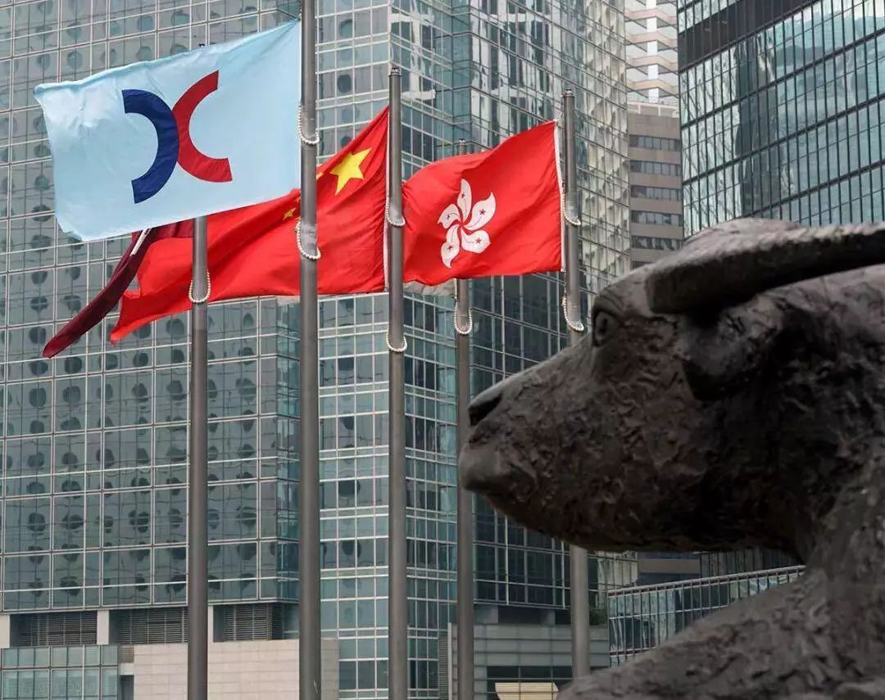
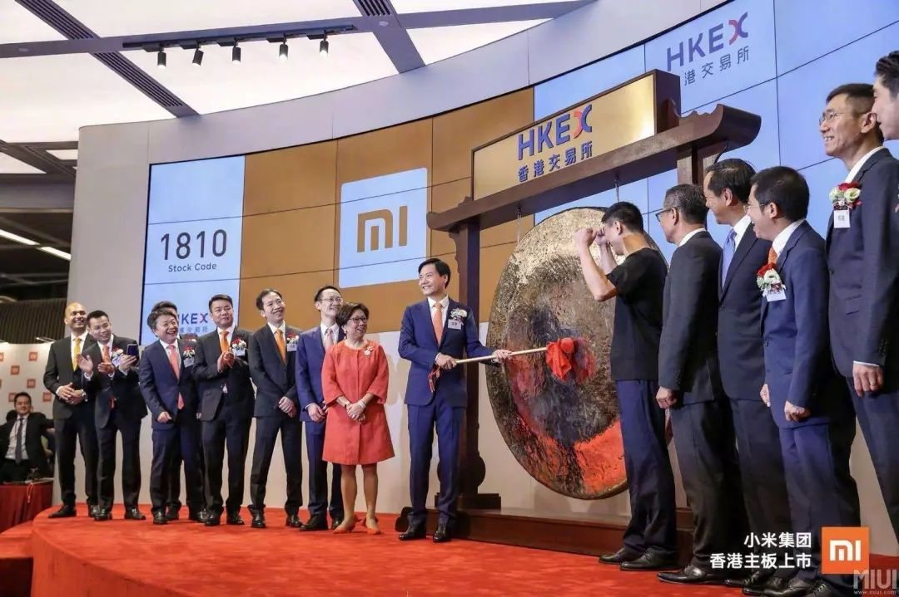

### 去香港，收割一个时代 | 深氪
星期四, 八月 2, 2018
5:39 上午

##

原创： 张雨忻  [36氪]()
关注并标星36氪
每天3次，打卡阅读
更快更深刻洞察互联网商业
━━━━━━

 独角兽鱼贯涌入港股IPO，“造富梦”进入兑现期。小米、美团、蚂蚁金服……一个新经济时代来了。

文 | 张雨忻
编辑 | 杨轩

中环不眠夜

港交所发来最终的聆讯反馈意见时，是夜里11点21分。

港岛的夏季潮湿闷热，51信用卡CEO孙海涛、CFO赵轲和操盘其IPO的所有中介机构都挤在中环环球大厦的一间办公室里，从早上等到了晚上，心不在焉地看着世界杯。他们本来觉得希望渺茫，准备散了。

“没想到港交所居然这么晚还在加班。” 得知聆讯通过的一刻，孙海涛心头终于大石落地。从3月时递交招股说明书到此刻，他已经等了3个月——2018年上半年，大家开始密集向港交所提交上市申请，其中还包括小米这种让所有人都人仰马翻的大案子，这让51的聆讯等待时间变得更长。

隔壁的中环IFC，几间办公室也彻夜灯火通明，气氛剑拔弩张。
佳琪坐在会议室毫无困意。来自两家保荐机构、数家承销商的项目负责人围坐在会议桌前，吵得面红耳赤，而她代表着其中一家。

当IPO进入倒计时阶段，这场至关重要的会议既要决定项目方股票最终的发行定价，也关乎于每一家参与其中的投行各自能拿到多少承销份额，这意味着大家各自能从这单IPO中赚到多少钱。

为了能抢到更多份额，文明一些的投行，会把自己这几个月来做的工作逐一抛出来，比如帮公司找到了多少投资者；但如果争的激烈了，大家势必相互攻击，或是指责对方工作没做好，或是反复强调自己关键时刻是如何帮对方救场的。

自2018年6月以来，像这样能持续一整个通宵、气氛并不友好的“关键会议”变得越来越多。因为从去年底到今年初陆续做出赴港上市决定的公司，在这个时间点都扎堆走到了最后关头。

2018年7月9日，小米的上市，拉开了香港资本市场这一轮狂欢的序幕。之后，无论是体量庞大如美团、比特大陆，还是那些在各自垂直领域做到前几名的独角兽，如猎聘、映客、51信用卡、宝宝树、找钢网，都悉数交表，排队敲钟。有一天，港交所敲钟的公司有8家，但只有4面锣，只能两家“分享”一只锣。

德勤报告显示，2018年来港上市的公司将达到180家，融资规模达1600亿-1900亿港元，这其中过半的融资额将会来自新经济企业。

佳琪告诉36氪，她所在的投行，今年已经接了几十个港股IPO的单子。“上半年我们接的项目太多了，我手上就分到了6、7个。”她这半年来的工作量，达到了往年的3倍，当然，奖金也大抵会是如此。

说这话时，佳琪作为一个项目的主承销商负责人，刚替一家公司完成了招股书的递交，状态十分疲惫。在这之前，她已经在印刷商那儿住了一个礼拜了——在交表之前，所有的中介机构都要聚集在印刷商那，对着打印好的招股书一页页反复核查、挑出错误、重新印刷、然后再核查，如此循环往复。

虽然，为了给“上市团”提供方便，印刷商通常栖身在中环的豪华写字楼里，有着最舒适的办公室——与之对应的，是印刷商有时在一个IPO项目里甚至可以赚取上千万的费用——但这仍然是投行、律所、会计师事务所以及发行方在上市前最“黑暗”的一段日子。

“已经没有下班的概念了，全部材料要在一周内审核定稿。” 为了赶进度，佳琪三餐叫外卖，实在累了就抄起PS4打一会儿游戏，放空大脑。
“在这一两周的时间里，负责写招股书的香港律师几乎不能睡觉。” 竞天公诚律师事务所合伙人高翔告诉36氪，“如果是小米这种体量的项目，需要几个律师轮班倒。”
这种超乎寻常的忙碌，是将8年中国移动互联网的无数场大战、无数人常年的996、以及由此超速发展以至于可被归入“新经济”的业绩，毕其功于一役。

回顾中国互联网的二十年历史，这样的上市潮一共不过出现过三次：第一波是2000年的互联网泡沫时期；第二波在2010年-2011年，PC时代长成的互联网公司，终于在那时寻找到了上市窗口，仅头一年就有42家中国公司在美国IPO，包括优酷、搜房、当当等。

第三波就是现在，长于移动互联网上的公司们，集体成熟了。在一级市场操盘了海量融资和收购案的华兴资本包凡，曾对36氪形容这是“移动互联的最后一口肉”，至此，大鱼们由淡水入海。

背水一战的港交所，“玩命”的投行
过去一年，港交所行政总裁李小加频繁在往内地跑。他要抓住一个可以扭转乾坤、但转瞬即逝的历史机遇。
二十年来，历经多轮融资的中国新经济公司，都是拿美元基金的钱，然后去美国上市，其间的收益跟中国投资者几乎没有关系。

港股市场也几乎没有吃到过这口肉：据港交所数据，过去十年，在港上市的新经济公司仅占香港证券市场总市值的3%，而有“同股不同权”制度的纳斯达克、纽交所，这个比例分别为60%、47%。

香港资本市场已经许久没有“概念”。做了多年港股IPO业务的高翔，用“舒服”来形容自己前两年的状态，“那会儿港股发行市场不行，我2015年和2016年都只做了两单。”

但美股市场也有自己的尴尬：很多投资者并不理解中国公司。“要么你是行业里的领头羊，而且可以在美国找到一个相对标的公司，要么你有一个很fancy的模式，像拼多多就是这样。” 富途证券CEO邬必伟分析道，“否则，你去了美股市场大概率也会被冷落。”

而且美股市场在语言、信息披露要求、投资者沟通以及上市费用等诸多方面都对国内独角兽有着更高的门槛。这对小体量的公司并不友好。
因此，对中国公司来说，在国内上市一直有其吸引力。而且A股的市盈率也高得惊人。

证监会也一度试图改制，以吸引这些公司回国上市。正因如此，2015年开始，大量创业公司拆除VIE架构，准备回国，哪怕已经在美国上市的互联网公司也掀起了一股私有化浪潮。

但令人始料未及的是，2016年3月，原本箭在弦上的战略新兴板和注册制相继被叫停。

“很多准备在A股上的项目现在只能继续排队，遥遥无期。”参与了大量一级市场融资项目的律师Raymond告诉36氪，“而且去年下半年开始证监会否决了很多项目，这让很多公司一下慌了神。”

移动互联的浪潮自2010年伊始，较早成立并吃到最大红利的公司大多已经完成了4-5轮融资，小米甚至已经做了9轮融资。体量庞大、估值高企的独角兽在一级市场面临尴尬的境地：很难有机构再继续给出下一轮了。

“像小米、美团、滴滴这样的公司，估值这么高，已经把能接盘的PE都吸纳进来了，下一步还能怎么办？” 一位PE投资人对36氪说，“到了一定体量后，只有淡马锡、中投这样的主权基金才接得住，顶多软银再接一轮，然后再想融资肯定只能靠上市了。”

这就是港交所和李小加要奋力抓住的历史机遇，否则这些公司迟早会掉头赴美上市。

去年7月，港交所开启了改革意见征询。一位投行人士告诉36氪，李小加那会儿开始频繁造访内地，“跟小米、美团、蚂蚁金服、滴滴的话事人吃饭”，拜见的目的是邀请这些超级独角兽赴港上市。

2017年下半年，众安、阅文、雷蛇和易鑫相继上市，香港资本市场对新经济公司的追逐快速冲到了顶点。另一方面，2015年港股通开闸，越来越多的内地资金也开始流向香港。

在51信用卡去年7月15日的年中大会上，孙海涛决定：去香港。“当时已经看到了港交所关于改革的意见征询，加上香港没有交易时差、语言也通，于是决定放弃美国。” 孙海涛告诉36氪。

猎聘CEO戴科彬也是相似的心理。原本拆除VIE回国上市却遭遇阻力正让他两难，结果，“去年，有个港交所的人突然来公司拜访，跟我们讲了AB股改革的事，邀请我们去上市。” 在做了一番研究后，猎聘在1月13日正式启动赴港上市。

小米赴港是从今年1月开始启动的。一位知情人士对36氪说，李小加在跟小米、美团等巨头会面时，港交所“同股不同权”的改革还没出结果，但李小加表现得非常坚定自信，表示自己一定会说服政府，请对方一定选择港交所。因为李小加的坚决，美团在今年3月开始启动港股上市。

与此同时，所有的投行、律所、中介机构，统统闻风而动。

“过去不到一年飞了30多万公里了，有时候一星期能飞5、6个城市，所有航空公司都飞成了金卡。” 高翔看了一眼自己的航旅纵横后对36氪说。他总是选择坐最早一班飞机出发，再坐夜班飞机回家。“因为最近客户的事情比较着急，怕白天在飞机上接不了电话给耽误了。”

一个礼拜往内地飞2、3趟是佳琪这半年来的常态。“项目早期有大量的细节需要跟客户讨论，光靠电话会是聊不清楚的。” 她团队里的“小朋友们”就更辛苦了：白天跑尽职调查，晚上回酒店处理大量基础性工作，找资料、做数据表、搭财务模型、画PPT，每天都要忙到凌晨2、3点。

跳槽和挖角变得非常频繁。“去年底到今年初，香港很多财富管理机构的销售团队都被投行给连根挖走，工资直接翻倍。” 一位投行人士告诉36氪，“因为投行都是在这个时间段开始接触到大量赴港IPO项目，所以要赶紧扩充销售团队来帮客户卖股票。

还有二线中资行直接高薪从外资行投行部挖人的，现组一个能做新经济公司IPO的团队。而更多的投行，则是从那时候开始大量招聘实习生，以应对即将到来的不眠不休的工作。

传统外资大投行则在改革。为了适应新经济公司的特点，摩根大通将自己的行业分类模式推倒重建。“我们会根据新经济公司的商业逻辑来设置行业组，所有的组都all in tech。” 摩根大通全球投行部中国区主管黄国滨告诉36氪。并且，摩根大通已经计划未来两年在中国增加40%-50%的投行人员。

4月30日，港交所“同股不同权”的新规通过。上游一开闸，淤堵已久的上市需求顿时倾泻而出。

“入行14年了，从来没有经历过行情这么火爆的年份。” 高翔忍不住感慨：尽管已经在接项目上有所取舍，高翔今年的工作量还是翻了倍。光7月之前，他的律所就完成了25个港股IPO项目。

对于中环的投行来说，这也是一个在金融市场上重排座次的机会——而在传统的外资市场里，中资投行很难坐上前排交椅。

虽然，像高盛、摩根士丹利、摩根大通、瑞信这样的一流外资行优势依然明显：耀眼的过往业绩，覆盖全球资本的推销网络。“谁上市都想多融点钱，所以一定会找到一个强有力的销售网络来帮自己。” 一名投行人士告诉36氪。

以美团为例，其联席保荐人还是3家大外资投行：高盛、摩根士丹利、美林美银——一般来说，保荐机构会赚走绝大部分承销费用，超过80%。但华兴资本由于参与了美团过往的多轮融资并购，在其IPO时也拿到了一个“独家财务顾问”的席位。

但如今，在港股市场上，拥有大量中国投资者资源的一流中资投行，变得非常抢手。“这几年，不少在香港IPO的项目有70%的份额卖给了中国的机构投资者。” 中金香港投行部主管陈永兴分享了一个数据。香港二级市场近年来投资者结构在变，这波新经济公司非常在乎内地投资者。

二三梯队的投行，则希望奋力积累几个新经济公司IPO的案例。“我们为了拓展客户，短期内可以不顾成本，把价格压的很低。” 一位来自二线中资投行的员工告诉36氪。
翻盘的可能性，来自对本土资本的撬动能力。
富途证券由此意外地分食了这波IPO红利。原本每个月都要去日本跟朋友聚会的CEO邬必伟，这半年来都没能抽出时间去一趟，毫无防备地进入了“职业生涯最忙的阶段”。

“我们这样的互联网券商，平台上的投资者都是散户，以前来香港IPO的公司根本不会想到我们。” 邬必伟告诉36氪。但如今转机来了，富途手上有着超500万港美股用户，而他们的主要构成就是国内互联网公司的员工，正因如此，“他们发现之前几只新经济股票在富途上的订单非常活跃，所以就想，为什么不在发行阶段就让我们介入进来呢？”

5月的一天，邬必伟飞到北京见了小米联合创始人黎万强，随即成为了最后一家加入小米承销团的券商，并最终贡献了公开认购人数部分20%的份额。

（7月11日的小米股票交易情况，富途用户为最大买方）
不止是投行，为了争夺新经济明星股，所有中介机构都进入了“备战状态”。

为了小米IPO的投标，高翔头一天熬了一整个通宵做准备，对着天眼查画了一个完整的小米股权结构图用来研究与上市结构相关的问题。做律师十多年了，他已经很久没有在一个项目的投标阶段如此亲力亲为。据他所知，所有主流从事证券业务的律师事务所几乎全部都在小米的招标名单上。

最终，动员了7个合伙人和3个资深律师一起前去“选美”的竞天公诚拿下了小米IPO项目，并最终调动了几十位律师，根据不同子公司所处的不同行业、领域划分执行团队，一刻不敢耽搁的足足做了7个月。

不过，从1月开始准备，到7月9日敲锣，半年时间，小米的IPO定价已经被大逆转，小米员工们的财富自由之梦只能打5折兑现。

市场的情绪，独角兽的价格
上市要等“窗口期打开”，是一个市场常用说法。所谓“窗口”，是指市场情绪高涨、股票能卖个好价钱的时候。

从去年下半年开始，众安、阅文、雷蛇、易鑫和平安好医生陆续IPO，这5家公司在首日招股时，分别获得了73倍、120倍、46倍、100倍和166倍的超额认购。当时市场情绪非常高涨。

“去年众安和阅文上市的时候，香港投资人都疯狂的买入，哪怕他们都不知道这两家公司是干嘛的。” 一位香港财富管理机构的销售告诉36氪，“他们就认这公司是腾讯投的。”

一名早期加入小米的人士对36氪说，小米内部一度对员工承诺，估值“最低950亿美元。” 而在小米递交招股书后，媒体也纷纷称小米预期估值能达到1000亿美元。
但市场情绪从年初开始已经发生了变化。

今年1月，恒生指数达到了33484点的历史高点后便掉头下行，这令人感到担忧。港股通南向资金在1月份创下流入高峰之后，就开始逐步下降。5月南向资金净流出19.15亿元，6月借道港股通南下的资金开始卖出，金额达到109亿港元，创下今年以来单月净卖出最高纪录。

“我们4月份开始做非交易路演的时候，很多投资人都表示感兴趣。” 51信用卡CFO赵轲告诉36氪，“可到了6月正式路演时，他们的反应就变冷淡了很多，这跟市况变差直接相关。”

6月23日，小米开始了为期一周的全球路演，但这一周并不好过。

香港四季酒店的宴会厅里没有热烈的气氛，据一位在现场的投资人告诉36氪，提问者寥寥。“而且，在香港，如果是非常受欢迎的股票，路演时坐在前排的一定是香港几大家族财团和大外资机构，但小米这次几乎都是来自内地的机构。”

大家对于小米估值模型的讨论逐渐偏离了小米预设的轨道。面对漫天质疑，雷军在路演现场还说出了一句充满不甘心的话：“这次550亿美元的定价，就是我也不想开价了，你们随便开吧，总不至于连550亿美元都不值吧？”

不出所料的，半年前新经济股被哄抢的盛况并未发生在小米身上，而原计划的“七地路演”最终也缩减到仅剩香港和美国三城，草草收场。在配合了一系列利好消息的推动下，小米最终以超过10倍的港股散户认购结局收场。这是自去年9月新经济上市潮以来，市场反应最冷淡的一次。

一位投行人士告诉36氪，雷军曾经给投行定的目标是700亿美元估值，可投行在向投资者询价的时候发现大家的心理价位普遍低于这个数字，甚至低于500亿美元。“对于投行来说，只能去做雷军的思想工作，其他无非是帮雷军再联系更多投资者，没准就有能接受高估值的。”

在上市前一天的下午，小米IPO前的暗盘交易一直处在拉扯状态下，“明天开盘破发”的消息到处流传。最终，小米以17港元的发行区间下限定价。

“真没想到雷军会以发行区间的下限定价。” 一位参与小米老股交易的投资人有些错愕。曾在今年5月以700亿美元估值的价位购买了小米老股的他，上市当日便直接亏损超过20%，这令他难以接受。

就这样，小米的IPO估值一路从最开始的1000亿美元，最终跌落到了543亿美元。

“现在市场情绪不好，能顺利IPO我们就谢天谢地了。” 一位接近小米承销团的投行人士不禁感慨。

业内人士大卫翁称，小米IPO启用了绿鞋机制——公司授权承销商在二级市场买入股票。IPO后一个月内，一旦股票跌破发行价，承销商用公司IPO募资的资金帮公司回购股票，目的是稳定股价——但还是没能第一时间托住市值。

定价是一个市场行为，发行人和投行最终都难以左右结果。“我们要做的就是把企业的价值以投资者最能理解的方式传达给他们，尽可能减小双方的认知差。” 陈永兴告诉36氪。

佳琪就更加现实了，“如果市场询价回来只有一个比较低的数字，大家也只能接受这个结果，因为发出去比什么都重要。我们会劝发行人，能上就赶紧上，如果重来的话还不一定能有现在这个价了。”

破发也来了。据《证券时报》统计，2018年以来港股发行的新股，破发率达到72%。而除阅文外，上述四家新经济公司股价均呈现较大跌幅，其中易鑫和雷蛇的股价已较发行价下跌超过50%。

今年以来，二级市场的不确定性大大增加。中美贸易战、美国加息将抽走香港市场内的资金，而国内去杠杆的大环境也使得“北水”逐渐干涸。独角兽们害怕上市窗口说关就关，越发要加快步伐。

“对二级市场的投资者来说，不确定的事情就是不好的事情。” 大卫翁对36氪分析，“历史上几次IPO热潮的背后，都能看到市场的不确定性。公司蜂拥上市是为了抢在不确定的风险来临之前，抢占先机。”

所以，哪怕去年10月美团完成40亿美元融资时王兴尚且信誓旦旦的说“如果我们想上市立刻就可以上市，但这不是最好的选择”，但半年后的6月25日，这家超级独角兽已经正式向港交所递交了招股书。

一位擅长做SPV（专项投资基金）的PE投资人告诉36氪，美团在今年4月末时曾寻求一轮Pre-IPO融资，“投前估值400亿美元，投后450亿” 。可已经拿到这轮份额的他万万没想到，自己还在忙着做SPV的募资，竟突然听到了美团交表的消息，而且坊间估值竟然高达600亿美元。

“这是我今年见过的最疯狂的事情。” 对方失信的行为让他损失了一个大单，他感到非常愤懑。
“美团无非是两手准备着，这次Pre-IPO融资很可能是在估值或者融资额上没有达到预期，所以立马放弃，转向上市。” 一位投行人士向36氪如此分析。

无独有偶，因为参与滴滴的老股交易，另一位投资人在今年1月曾接触过滴滴管理层，“对方跟我说上市计划会在未来18-24个月内启动，没想到才过了半年，就传出了今年内要完成上市的说法。”

但扎堆上市、新经济股的供应量大大增加，也会让投资者对内地涌来的互联网公司开始司空见惯，难免变得更加挑剔。

现在一些公司着急上市，使得承销商没有充分的时间做投资者教育。“去年做众安IPO的时候，我们在项目正式启动前就已经开始让公司管理层跟全球潜在投资人沟通，介绍公司的商业模式、特点、未来愿景，整个过程前后沟通了两轮。” 黄国滨告诉36氪。

“路演其实是一个很快速的过程，一旦启动，这一两个礼拜里能不能把股票卖出去是没有回头路的。” 佳琪说，“但让投资人在这么短的时间里去理解一家新经济公司确实比较难。”

在港股，找基石投资者来带动股票发行氛围，也是一种策略。近几年，基石投资者中出现了很多有战略结盟需求的企业，尤其是在新经济领域。“我们在做易居IPO的时候，就引进了淘宝和华侨城作为基石投资者。” 陈永兴告诉36氪。

截止7月底，香港恒生指数相比1月高位跌去了15%。几乎所有投资人和创业者内心都有一个共识：高点不会持续很长时间了，即便现在启动上市，未来6-9个月的过程中也不知道市场会变成怎样。

美团交表当日，还有7家公司也提交了招股书。但为了控制节奏，港交所没有在同一天全部公示。扎堆上市，就意味着大量公司对有限资金的争夺。

随着小米上市，以及接下来的美团、蚂蚁金服、比特大陆、甚至传闻中的滴滴相继上市，投资人们显得更着急了。“现在每个基金都会跟自己的项目说能上赶紧上，不要跟在超级独角兽后面。” VC投资人大多是这个心态。

而根据港交所李小加的说法，预计更多公司会在今年8月以后在港股上市，9-11月将会是一个高峰。

大鱼入海之后
这波港股上市潮，既是这轮移动互联的一个结尾，也是下一个周期的开始：这些公司的股价表现，将让所有投资人、创业者重新审视自己。
热钱涌动的时候，大家都很亢奋，不在乎回报。但如今，账面难看的基金们遭遇了前所未有的尴尬。
在已上市公司中，已经出现了估值倒挂的案例。比如，前不久登陆纳斯达克的优信二手车，现在市值为18亿美元，而其在上市前最后一轮融资时的估值为32亿美元。

而今年4月小米的老股交易高潮期，“甚至有投行卖出了1050亿美元估值的货。” 一名投资人感到不可思议，而他自己接触到的小米老股里最高价也达到了880亿美元，这意味着，一旦上市先亏50%。

回首去过8年的移动互联时代，补贴大战中，公司们募资额和估值一路水涨船高，风险投资家们是乐观的、愿意相信故事的。可一旦走入股票市场，这里的投资人们立刻展现出了他们冷静和讲求实际收益的面孔。

叠加上资管新规出台、金融业一再去杠杆，都预示着一级市场的“水源”缩水。据投中研究院统计，今年一季度，中国VC/PE完成募资的同比减少54.82%；募资规模同比下降74.85%。易凯资本王冉判断，今年下半年流入一级市场的资金将出现断崖式下跌，至少减少50%-60%。

已经有VC投资人表示，接下来，VC对公司的出价不会太大方。王冉的预测则是，一级市场整体估值水平半年内将普降30%，个别泡沫严重的领域甚至会砍掉50%。
一旦成为公众公司，则将面临更严苛的审视。拼多多刚一上市，首日上涨40%，但因为假货等舆论质疑，两日内，市值就从300亿美元跌至250亿美元。

短期来看，上市对于一家处于竞争当中的企业来说，意味着妥协。据一位接近美团的人士告诉36氪，在完成IPO之前，美团将放弃其打车业务继续开新城的计划。但长期来看，美团警告投资人称，自己将长期投入，要做好亏损打算。

上市终归是解决资金问题、获得更多独立性的关键一跃。近期，有媒体援引知情人士消息称，美团IPO的估值已经从600亿美元降至350-400亿美元。但在一位PE投资人看来，这时候流血也要上市：“美团和滴滴如果不赶在市场下行之前再融个几十亿美元，以它们消耗资金的速度，一年后肯定会遇到现金流困境。”

“估值远低于预期，而且股票半年后才能卖，但起码上市了。”上述早期加入小米人士说，对于多年996、薪酬也远低于BAT的小米员工来说，这是他们此刻的感受。另一位小米人士则说，雷军也是慢慢才调平了心态。

另有知情人士对36氪称，雷军把此次IPO定义为“不成功”，而小米CFO周受资，也可能因此离职——该消息已收到小米官方的否认。但可以肯定的是，雷军年初要求小米“四个季度重回国内第一”的目标，已不再仅仅是一个对内要求，如今更变成了面对公开市场的一场自我证明。

（注：文中佳琪为化名）
*我是36氪深度部作者张雨忻，行业交流欢迎加微信：188827500，烦请备注姓名、公司、职位。

推荐阅读

From <http://mp.weixin.qq.com/s?__biz=MzI2NDk5NzA0Mw==&mid=2247516823&idx=1&sn=a3006df0e03eae86538dbfec2cd28aac&chksm=eaa6d34bddd15a5d9aa400e3ad3a5f85076919fcd8568850b8c152a7e024ce04a38172334cb6&mpshare=1&scene=1&srcid=0802Gjh0DjlqykXDf6wkBfgk#rd>

