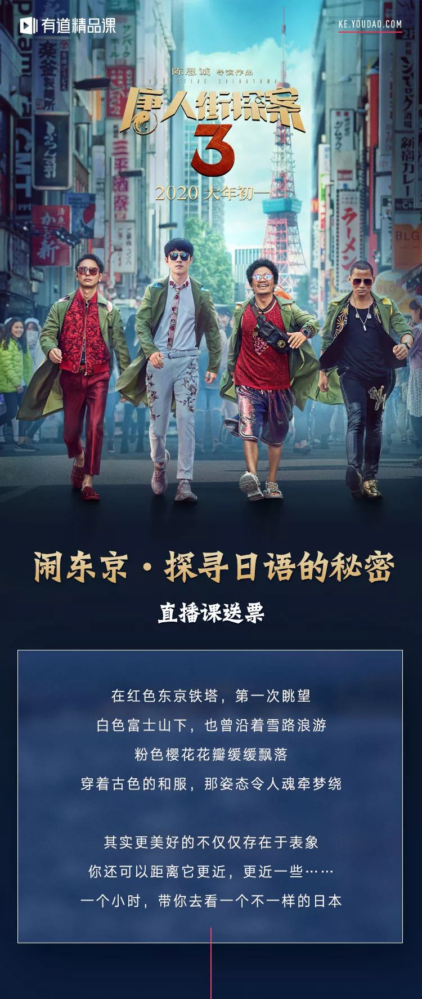

##  “离开”香港，才能找到香港最好玩的地方！

[爱心家庭成长服务社]()**

国庆假期来了
长假里，不妨去香港的离岛
享受一个原始的、自然的和充满民俗乐趣的香港。

图片来源于网络，侵权请联系删除

每到周末，香港人常常要离开喧嚣的香港，去那些散落在海面上的小岛，那些岛被称为离岛。其实，离岛区是香港最大的行政区，包括南及西南面20多个岛，如大屿山、南丫岛、长洲、大澳等。

南丫岛

南丫岛是香港第三大岛屿，就在香港岛南面，岛内平地少，是一个被浓绿的亚热带树木覆盖着的美丽岛屿，岛上的原住民或者从事渔业，或者耕种土地，是一派难得一见的悠闲气息。

图片来源于网络，侵权请联系删除

洪圣爷湾停泊的各色渔船令到南丫岛更添原始渔村的生活气息。

****
图片来源于网络，侵权请联系删除

而如今的南丫岛，已经是香港年轻人和外籍人士最喜欢停留的乐土——生活不羁、渴望自由的人爱去那里，对于生活紧张的都市人来说，它是一个喘息的地方。

图片来源于网络，侵权请联系删除

洪圣爷湾泳滩是南丫岛上最清澈漂亮的海滩。在这里看到本地人在这里游玩。

图片来源于网络，侵权请联系删除

据说来南丫岛不吃这些建兴亚婆豆腐花、南丫岛鸡蛋仔、菜记小食、金卷食品、林记凉茶等于没来南丫岛。

****
图片来源于网络，侵权请联系删除
**
**
**> 线 路******
> 港铁中环站A出口，右转上天桥
> 一直往前走就可到达中环码头
> 从中环4号码头搭乘渡轮前往
> 船程约30-60分钟

长洲岛

相比起南丫岛的文艺气息，长洲岛更像一个原始的小渔村，村民们各自过着悠然自在的生活。

图片来源于网络，侵权请联系删除

因为长洲岛很少有机动车行驶，推荐大家在海傍街上，租自行车，价格也就几十港币。吹着海风一路骑行。

图片来源于网络，侵权请联系删除

长洲居民和渔民都相信，抢到包子能保佑全家平安，因此著名的“抢包山”比赛由此诞生。

图片来源于网络，侵权请联系删除

**> 线 路**
> 中环出发，> 5号码头，船程约40分钟。> 开往长洲岛的渡轮有两种，分别是快船和慢船。普通船大概50分钟左右到达，价格相对便宜一点。

石澳

一部电影成就一个景点，成为无数影迷，周星驰粉丝朝圣的地方。带上自己的男朋友来cos当年景点的pose。

****
图片来源于网络，侵权请联系删除
**
**
无论看多少遍，依然觉得尹天仇在说出那句“我养你啊！”还一如既往的感动。

********
图片来源于网络，侵权请联系删除

在石澳这里不需要担心沙滩人挤人、人比沙多，像下饺子一样。

图片来源于网络，侵权请联系删除

与市区的繁华喧嚣很不一样，这里几乎没什么游客，可以慢慢享受。

****
图片来源于网络，侵权请联系删除

踏入石澳村就像踏入了一个色彩斑斓的世界，每一个地方都有独特的颜色。

****
图片来源于网络，侵权请联系删除

> 图片来源于网络，侵权请联> 系删除
**
**
**> 线 路**
> 箕湾站A3出口外巴士总站
> 乘9线巴士往石澳巴士总站

塔门岛

塔门岛大概也是香港游客最少,最原生态的海岛。四面环海的塔门岛，渔光山色，一年四季都很适合露营，十分安全。

图片来源于网络，侵权请联系删除

这里的美景也被摄影爱好者所偏爱！是香港游玩离岛类必去的好地方。这里什么都不多就是牛多，小心有时候会偷你东西吃哦~

图片来源于网络，侵权请联系删除

坐在草地上，吹着海风，听着海浪声，聊聊天，远离尘嚣，就这样度过安静的假期。

****
图片来源于网络，侵权请联系删除

**> 线 路******
**> 线路1：**
> 从西贡黄石码头搭乘渡轮前往

**> 路线2：**
> 港铁东铁线到大学站B出口
> 左转沿着指示到达马料水码头
> 搭乘渡轮前往，船程约80分钟

大澳

被称为香港威尼斯的大澳。是香港少有交通的相对不方便的地方，因为这是不允许自驾车进去，但是依然阻挡不了游客的到来和每逢周末巴士站总会排起长龙。

图片来源于网络，侵权请联系删除

来大澳千万不能错过乘坐舢板小艇在水道之中穿梭的精力，看看大澳疍家人的渔村文化和生活习惯，穿梭在密密麻麻的棚屋，桥梁之中。

图片来源于网络，侵权请联系删除

对了~在大澳还能有机会看到中华白海豚，不知道你是不是下一个幸运儿呢？

**> 线 路******
> 港铁东涌站B出口的巴士站
> 乘坐11号巴士到大澳巴士总站
> 车程约50分钟

蒲台岛

蒲台岛，位于香港最南端，又叫香港南极。这里有各种各样稀奇古怪的岩石，还有全港最美丽的星空。

图片来源于网络，侵权请联系删除

晚上的时候在这里露营与与星空作伴，在洁净的海滩上肆意玩耍！还能像TVB电视里一样看日出。

图片来源于网络，侵权请联系删除

还有不得不去的蒲台岛地标126灯塔扎营，无论早晚都是取景的好地方，到了晚上这里还能拍到银河和星流迹。吸引众多摄影爱好者来这里打卡。

图片来源于网络，侵权请联系删除

**> 线 路******
**> 线路1：******
> 除周一、三，香港仔乘搭街渡前往
> （周一、周三除外）
**> 路线2：******
> 赤柱（圣士提反湾）搭乘渡轮
> （仅限星期日及公众假期）

****｜文章内容部分图片来源网络，如果侵权请联系删除****

日常结尾

**关于香港幼小中学校申请、国际学校申请、副学士研究生申请，港宝证件更换等事宜都可以咨询爱心家庭成长服务社唐老师哦！****微信：****hkedu1477，或拨打热线电话：0755-82177757**

长按并识别二维码添加微信咨询

**这里有你感兴趣的...**

- [2019全新港岛区20所最优质的小学排名！日后升中入名校还怕什么？](http://mp.weixin.qq.com/s?__biz=MjM5MjIyNjYxNA==&mid=2650113423&idx=2&sn=b9230e7e77dbd70c872d3c0d83ebc2aa&chksm=bea8a9d689df20c0ce328808abfa76439678c939f0234fa7ac7b568531b93c3810c3ca31fa0a&scene=21#wechat_redirect)
- [港宝在内地上学，回乡证过期或遗失竟这么多麻烦事……](http://mp.weixin.qq.com/s?__biz=MjM5MjIyNjYxNA==&mid=2650113412&idx=2&sn=99134cff8315eb3429beff1c8386405b&chksm=bea8a9dd89df20cba5b72b2c2ff0c57a4eb35f06dcfd19de775cd671c841047a4da1989c689c&scene=21#wechat_redirect)
- [香港80后夫妇弃7万月薪，双双回家做全职父母，你怎么看？](http://mp.weixin.qq.com/s?__biz=MjM5MjIyNjYxNA==&mid=2650113403&idx=1&sn=7da847df28fdc3ad5843129694fdaacf&chksm=bea8a92289df20343b841edc7d6418ef9dc6076f47ae37e7a8256394858bb8b779dab0c3b9fb&scene=21#wechat_redirect)
- [曾花2万从内地买地球仪，只为学生能全面认识中国！这位“美心大小姐”却在撑警后惨遭报复...](http://mp.weixin.qq.com/s?__biz=MjM5MjIyNjYxNA==&mid=2650113408&idx=1&sn=a8b2abde336cbd12f9010c7eb8394409&chksm=bea8a9d989df20cf2e21a4024cdca3f4d3745fb2664799c86ac7a2313a66e875ae42d4060919&scene=21#wechat_redirect)
- [外籍孩子上学难题：留在内地还是直接出国？有没有双赢选择？](http://mp.weixin.qq.com/s?__biz=MjM5MjIyNjYxNA==&mid=2650113392&idx=2&sn=404e31aceaf6a45c3863abc17c3ab2fc&chksm=bea8a92989df203fce5824051f748838bbb0121809f1947b9a4c6206c92da39e92dc61118410&scene=21#wechat_redirect)
- [重磅新规！10月起，港澳居民在内地凭回乡证，可直接办理30多项公共服务！](http://mp.weixin.qq.com/s?__biz=MjM5MjIyNjYxNA==&mid=2650113392&idx=1&sn=ae138d9c49f187d4566241949089514a&chksm=bea8a92989df203fdf7a258d7033e5e5c6e37300f8e392e01d6e4eaf9ce8369698078df3018b&scene=21#wechat_redirect)

在看