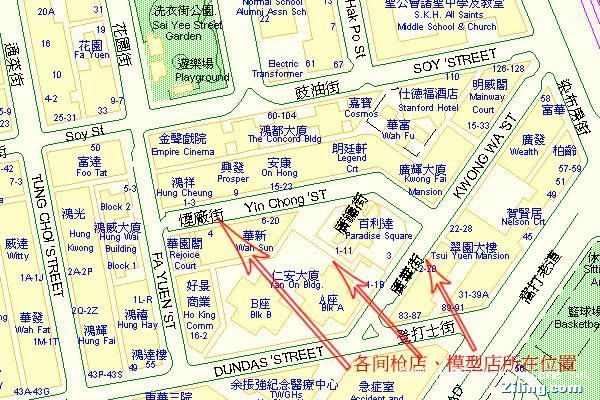
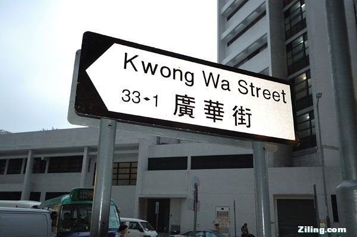
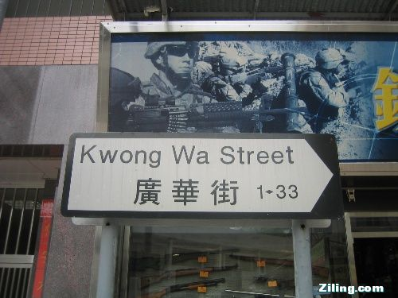

### 带你见识见识香港的枪店

    去香港游玩，特别是男士，有一个地方相信大多数人都爱去，那就是九龙旺角广华街。为什么呢?原来这里是有名的模型一条街,更被人们称为香港最具雄性气质的街道!原来，在这条街上，大大小小的店铺比比皆是，大多是销售电玩(内地称为：电动)遥控飞机和汽车模型店，而最令人瞩目的却是卖各类仿真枪械、弹药、军用物资的商店。

我本人就是个军品迷，来港之前就想争取找时间一定要到军品店看看(知道再好也买不回去)。经过多方打听，我得知香港最有名的军品店就集中在九龙旺角的广华街上。我来的这天不是双休日，又赶上下着小雨，街上意外得很清静，与紧邻的旺角其他街道的人潮呈反比。刚一踏进广华街便感觉到雄性荷尔蒙的气场，它是一条军品街了，街不长，卖气枪、军服、各国军品的店一家挨一家。对广大的军迷朋友来说，广华街是他们朝拜的“麦加”，这里军装、军品的货品全、更新快，更是它受到热烈追捧的重要理由。

说到广华街，言必称“铳工房”，这家军品店开了近10年，几乎所有的军迷都知道他家，地点就在油尖旺区仁安大厦、广安医院附近，离此不远就是油麻地警署。多年的经营令该店名气大振，也几乎成了广华军品一条街的象征。由于制度的不同，内地不允许玩仿真枪，所以，包括我在你内的军迷们就只好进去随便看看，流流口水，过个瘾算了。

    说到广华街，言必称“铳工房”，这家军品店开了近10年，几乎所有的军迷都知道他家，地点就在油尖旺区仁安大厦、广安医院附近，离此不远就是油麻地警署。多年的经营令该店名气大振，也几乎成了广华军品一条街的象征。由于制度的不同，内地不允许玩仿真枪，所以，包括我在你内的军迷们就只好进去随便看看，流流口水，过个瘾算了。

     在这条军品街上，自不必说，店老板们当仁不让地也多是军品迷，热爱让他们开店满足自己不断升级改良军品的控制欲。有的店主原来就是在美国服过兵役，他便用他当年服役的部队番号做店名，以此怀念在美国当兵的日子。随意过去多年，但店主对军品的痴迷无法释怀。那些外形个性又充满阳刚气的军品，放佛又让他回到了那枪弹横飞的战火年代。我了解到，店内几年前一款仿军用弹药袋的宽版腰带，上市不到3天卖断货。众多顶级名牌不时推出袖长可调整的游击队衬衫、多口袋工作裤等，军品已成时尚代名词。各类军队服饰的货业非常全，贝雷帽、帽徽、肩章、头盔、领带应有尽有。这里成了香港真正的时尚军品集散地。

    走进军品店，从橱窗、展柜，到货架上，到处摆满了琳琅满目的各式枪支、弹药与军品，令人眼花缭乱，更令我这出来香港的军品迷惊的是目瞪口呆!这些销售武器全部是按照1：1仿制，虽然不能使用真子弹，但是钢珠的威力也很是厉害，5合板直接穿透，儿童不宜使用，看了很喜欢，可惜带不回来。在这里，店内是不让拍照的，只好拍拍橱窗过把瘾了。不过，我还是比较幸运的，在一家店内，经过店主的特许，又赶上正好有个顾客在挑选枪支，我拍摄下了一些难得的照片。

这就是军品的魅力。

