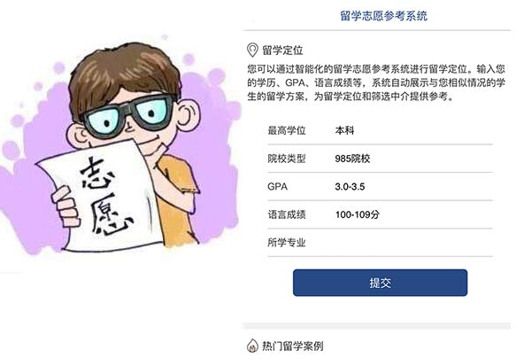

# 2018-2019年日本留学费用清单

时间：2018-07-02
来源：留学监理网
分享：

**你的同学在这里：**
[●(1小时前) 新疆的巢同学申请了 —— 推荐留学中介](https://www.liuxue315.cn/consult/)
[●(1小时前) 重庆的舒同学申请了 —— 预约中介顾问 留学监理服务](https://www.liuxue315.cn/consult/)
[●(1小时前) 黑龙江的曹同学申请了 —— 查询中介口碑 推荐留学中介](https://www.liuxue315.cn/consult/)
[●(1小时前) 甘肃的伯同学申请了 —— 留学监理服务](https://www.liuxue315.cn/consult/)
[●(2小时前) 甘肃的翁同学申请了 —— 查询中介口碑 留学监理服务](https://www.liuxue315.cn/consult/)
[●(2小时前) 广西的贡同学申请了 —— 推荐留学中介 留学监理服务](https://www.liuxue315.cn/consult/)
[●(2小时前) 福建的慎同学申请了 —— 推荐留学中介](https://www.liuxue315.cn/consult/)
[●(2小时前) 天津的能同学申请了 —— 留学监理服务](https://www.liuxue315.cn/consult/)
[●(3小时前) 新疆的廉同学申请了 —— 留学监理服务](https://www.liuxue315.cn/consult/)
[●(3小时前) 港澳台及国外的贺同学申请了 —— 预约中介顾问 推荐留学中介](https://www.liuxue315.cn/consult/)
[●(5小时前) 福建的萧同学申请了 —— 预约中介顾问 推荐留学中介](https://www.liuxue315.cn/consult/)
[●(5小时前) 吉林的双同学申请了 —— 查询中介口碑](https://www.liuxue315.cn/consult/)
[●(5小时前) 港澳台及国外的羊舌同学申请了 —— 预约中介顾问 推荐留学中介](https://www.liuxue315.cn/consult/)
[●(8小时前) 吉林的饶同学申请了 —— 留学监理服务](https://www.liuxue315.cn/consult/)
[●(8小时前) 海南的澹台同学申请了 —— 留学监理服务](https://www.liuxue315.cn/consult/)
[●(8小时前) 吉林的端木同学申请了 —— 留学监理服务](https://www.liuxue315.cn/consult/)
[●(12小时前) 北京的莘同学申请了 —— 预约中介顾问 推荐留学中介](https://www.liuxue315.cn/consult/)
[●(12小时前) 北京的闻人同学申请了 —— 查询中介口碑 留学监理服务](https://www.liuxue315.cn/consult/)
[●(1天前) 港澳台及国外的满同学申请了 —— 查询中介口碑 推荐留学中介](https://www.liuxue315.cn/consult/)
[●(1天前) 河南的巢同学申请了 —— 推荐留学中介 留学监理服务](https://www.liuxue315.cn/consult/)
[●(1小时前) 新疆的巢同学申请了 —— 推荐留学中介](https://www.liuxue315.cn/consult/)
[●(1小时前) 重庆的舒同学申请了 —— 预约中介顾问 留学监理服务](https://www.liuxue315.cn/consult/)
[●(1小时前) 黑龙江的曹同学申请了 —— 查询中介口碑 推荐留学中介](https://www.liuxue315.cn/consult/)
[●(1小时前) 甘肃的伯同学申请了 —— 留学监理服务](https://www.liuxue315.cn/consult/)
[去看看 >](https://www.liuxue315.cn/consult/)

日本社会对外国留学生越加重视，各高校也在积极搭建留学生在日就职的各种渠道。面对国内日益严峻的就业形势，日本的这些举措可以说对于国内计划留学的同学们而言可谓是吸引力巨大。那么如今去日本留学，一年所需费用大致是多少呢？监理网小编为大家分享一个费用清单。各位可以以之为参考来决定是否去日本留学。

日本社会对外国留学生越加重视，各高校也在积极搭建留学生在日就职的各种渠道。面对国内日益严峻的就业形势，日本的这些举措可以说对于国内计划留学的同学们而言可谓是吸引力巨大。那么如今去日本留学，一年所需费用大致是多少呢？监理网小编为大家分享一个费用清单。各位可以以之为参考来决定是否去日本留学。

|     |     |     |     |     |
| --- | --- | --- | --- | --- |
| **学校类型** ** ** | ** 日本高中** ** ** | **语言学校** | **       大学本科** | **研究生** |
| **** ********第1年**** | ****第2-4年**** |
| ****费用**** | 180万日元/年 （约10万RMB) 包括：学费，餐费，住宿费 | 70万日元/年（约4万RMB) | ****国立大学****： 81.78万日元（约4.8万RMB) 包括:入学金：28.2万日元,学费53.58万日元 | ****国立大学****: 53.58万日元/年（约3.2万RMB) | ****国立大学：****与本科相同 |
| [>>日本留学问题免费咨询](https://www.liuxue315.cn/consult/?ozs=77332-2709) | [>>留日工读，监理网老师在线推荐](https://www.liuxue315.cn/consult/?ozs=77332-2709) | ****私立大学****： 129万日元左右（约7.8万RMB） | ****私立大学****：110万日元（约6.6万RMB) | ****私立大学********：**** 74-101万日元/年（约4.3-6万RMB) |

|     |
| --- |
| ****住宿费**** 学校宿舍：3-7万日元/月（约1800元-4200/月） 小型公寓：2-6万日元/月 （约1200-3600元/月） 高级公寓：7-12万日元/月 （约4200-7200元/月） |
| ****餐费**** 节约型：自己做饭为主，不太出去吃饭，2-3万日元/月（1200-1800元/月） 普通型：偶尔出去吃，周六日出门购物，4-6万日元/月  （2400-3600元/月） 奢侈型：顿顿吃餐馆，时常出门购物，10万日元/月  （6000元/月） |
| ****交通费**** 4000-1万日元/月（约240-600元/月） 东京地铁：160日元起-300日元 （约9.6-18元）        *通学路线可以购买学生月票哦* 新干线：13，000-18，000日元（约780-1080元）   Bus：200日元 （约12元）   Taxi：(2公里内)650日元（约39元） |
| ****医疗费**** 国民健康保险缴纳额度按照收入水平不同而缴纳，留学生缴纳最低额度的保险费约20000日元左右/年（约1200元），看病只需个人负担30%的医药费用，国家负担70%。 |
| ****通信费**** 约3600日元/月 （约216元/月） *au或softbank的话费套餐比较适合留学生* |

|     |
| --- |
| **日本各地消费差异（仅供参考）** |
| **地区** | **学费+生活费  （RMB/年）** |
| 东京  | 7-10万 |
| 中部  | 5-7万 |
| 近畿  | 6-8万 |
| 九州  | 5-6万 |
| 北海道 | 5-6万 |
| 东北  | 5-7万 |

>>[一键输入GPA(2.0-4.0)，快速匹配你适合申请哪所日本大学](https://school.liuxue315.cn/studyassess/?ozs=77333-2709)

留学规划和留学申请是一项复杂的长期工程，不能片面听取网友的交流，更不能轻信[留学中介](https://www.liuxue315.cn/agency/)的说辞。留学监理网由有20多年国际教育行业管理和服务经验的前教育部官员胡本未老师创立，得到[新华社](https://www.liuxue315.cn/report/10278.shtml)和[央视网](https://www.liuxue315.cn/report/10412.shtml)的高度评价。留学监理网免费为学生提供留学咨询规划建议、推荐靠谱的留学机构、审核留学方案和中介服务协议，受学生委托提供监理服务、督办[留学中介](https://www.liuxue315.cn/agency/)的服务过程并“先行赔付”。

