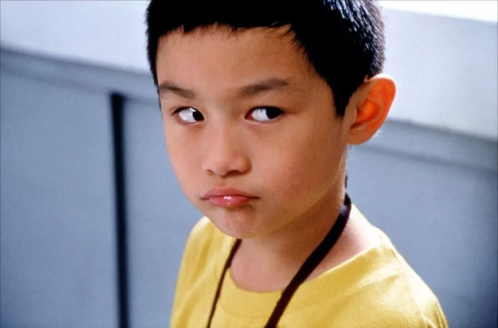
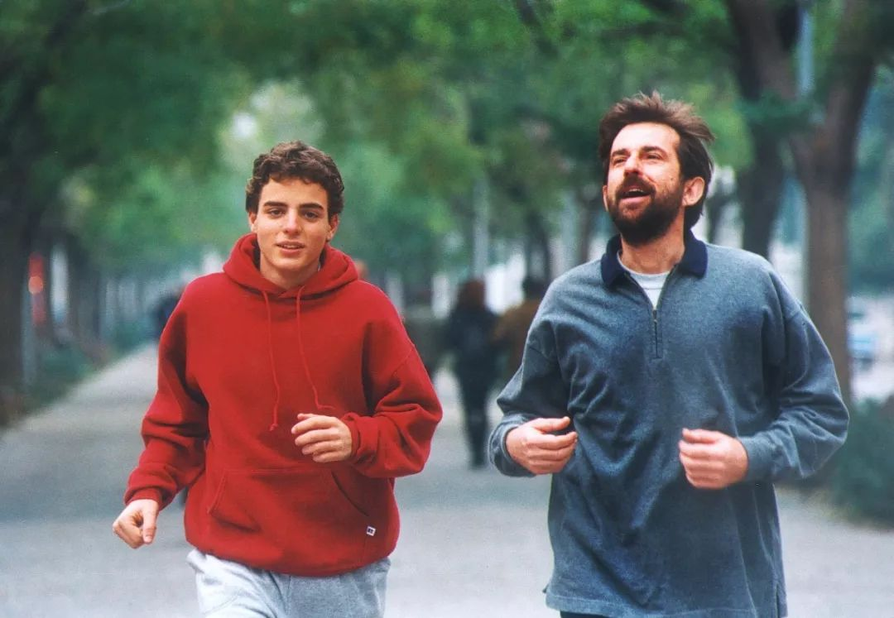

##  颠覆父母教育观的记录片：世界六大教育强国都是怎么教育孩子的？

一直关心教育的 [爱心家庭成长服务社]()**

最近有部话题度很高的纪录片《他乡的童年》在优酷热播，这部片深入到日本、芬兰、印度、以色列、英国和中国教育第一线，去探寻对孩子的教育之道，在纵横比较中，暴露出的教育细节发人深省。

建议家长都可以去看看这部纪录片，带着思考和困惑，走访**日本的集体主义教育，芬兰的平等自由教育，以色列创新教育，印度的辩证教育，英国精英教育**，最后回到中国，感受传统教育。

**- 01 -**

首先是芬兰。这个多次被联合国评为最幸福的国家，教育一直都处在全球领跑的地位。在镜头里，它简直就是**教育“理想国”。**

看孩子们在学校里轻松自在的状态：

上课想穿女巫服、吃东西，想坐着、趴着、躺着东倒西歪地看书、玩iPad都OK。

“平等”是这里被强调最多的一个词。出身不重要，成绩也不重要，因为学校评估的不是孩子在学科中学到多少知识，而是他们如何学习：自己怎么学习，怎么和别人搭档学习，怎么以小组为单位学习。

与我们相邻的日本，则是跟芬兰截然不同的画风。他们的教育更强调集体和秩序，重视培养孩子的独立性和自律能力。

在东京的藤幼儿园，每个教室门口都会有显眼的标记，引导孩子将鞋摆正，培养他们整理的习惯，让孩子从小就有强烈的秩序感。

至于印度，选择它，虽有些出乎意料，但也并不难理解。因为不管它的公共教育和社会环境到底怎么样，这里的确培养出了很多优秀的人才。在世界500强企业中，印度人担任CEO的比例高达30%。

体现在教育上，就是他们不接受正确答案或标准答案，有了想法会马上说出来，因为“我的声音应该被听到”，别人如果意见不同，可以辩论，通过这个过程，最后找到一个答案。

最新一集的以色列，这里的孩子们表现出的超出自身年龄的成熟。

一个13岁的孩子，头衔却是某创业公司CEO，讲起自己的产品来，头头是道。当采访者问他们，开了公司，还要做学校里的作业吗？小创业者们很肯定地说：要做的，并且还明确表示，不会让创业影响到上学。

另外，以色列人特别重视一个人对待“失败”的态度。在以色列文化中，失败并不是结局，就像路上绊了一跤，没什么大不了的。以色列的英雄，是那种就算失败了还依然敢再去尝试的人。

**- 02 -**

这些各具特色的教育，一下呈现在眼前，引发了很多羡慕的眼神：**为什么我们的教育不是这样？既然他乡的教育如此成功，我们为什么不干脆复制过来？**

耶鲁大学和美国西北大学的两位经济学教授合写了一本畅销书，叫《爱、金钱和孩子》，里面说：**父母的养育风格，和社会的经济状况有密切的联系。**

收入不平等、贫富差距大的国家，父母会更倾向于“鸡娃”；而收入相对均衡、贫富差距小、优质教育资源丰富的国家，父母就越可能推崇“自由快乐教育”。

芬兰是个高福利的国家，贫富差距非常小，人人平等是他们根深蒂固的认知。

当采访者问几个9岁的小学生：“在这里，什么是成功？”，他们的回答是：“有一份工作，有一个妻子，有点钱，那你就已经算是成功。”

而中国的国土面积是芬兰的30倍，人口近14亿，人均资源不足、收入不平等是无法回避的事实，我们不得不考虑的是，如果孩子接受的是像芬兰这种弱化了竞争意识的教育，那他将来能适应充满竞争的社会环境吗？

该片很有意思。

每记录完一个地方，观众都会留言：“这教育方式真是太好了。”

但到下一个地方，又会发现，上一个国家还推崇的教育，在下一个国家竟然是摒弃的？

看完六个国家最有特色的教育，才发现：

**世上从来没有完美教育。**

像日本的集体主义教育，在让孩子自律、独立的同时，也抹杀了孩子的个性，压抑了孩子的情感。

片中专门采访了日本的一个感泪治疗师，他的工作就是让人们学会哭，因为绝大多数的日本人从幼儿园起就被教育不能随便哭，尤其不能在外人面前哭。

还有英国的精英教育，它高昂的学费以及极高的入学门槛，注定只有极少的7%的人可以享受到。阶层固化导致教育分化，而教育分化又进一步加深了阶层固化。

而以色列，虽然创新能力很强大，但绝大多数的人却没办法把公司做大。

《创业的国度》的作者索尔·辛格分析说，这主要是因为以色列人普遍不相信权威，喜欢辩论、喜欢试验，也没有耐心，这样的特质对于创新来说有好处，但对于一个需要很多组织和纪律的大公司来说，就不行。

被盛赞的芬兰，很多人也有担忧。

纪录片中的一个校长说，芬兰的孩子生活的太容易了，高福利造就的“保姆国家”，使得大家都丧失了芬兰曾有过的坚韧不拔、不畏艰辛的西苏精神。他反而希望教育中能多一些竞争。

在《破解神话：还原真实的芬兰教育》这本书里也深度剖析了现在芬兰教育的问题与危机。比如学生不听讲、玩手机、放任自流的现象和教师缺勤、教学重点不明的情况屡见不鲜，只给少数人享受的“特权教育”也已经开始出现了。

**- 03 -**

揭开了“他乡的童年”不够完美的另一面，当然不是以“国情论”来掩盖自身存在的问题，也不是一种“比坏逻辑”——别人还不够完美，所以我们的不完美也是理所当然的。

本文希望传递这样一种观念：**看到他人所长时，反思自身的缺陷与不足，但也珍视自身的价值，不妄自菲薄，不盲目效仿；看到他人有不足时，不幸灾乐祸或沾沾自喜，而是检讨该如何避免重蹈覆辙，思考教育的多种可能性。**

很多家长看《他乡》，一开始，想为孩子寻找最好的教育智慧。

却发现，这个世界，没有千篇一律的人生，也没有适合每个人的完美教育。

最权威的专家也不敢保证，某种教育方式可以一通百通，适合所有的孩子。

归根结底，**世上没有完美教育，父母得思考对比，融会贯通，去找适合自家孩子的教育。**

《他乡》有一段独白，特别实在：

**“我们没有办法立即学到他国优秀的东西，有些东西甚至也不符合我们的传统，但是我们想至少会有一些从家庭，从个人面可以去了解，可以去改进的东西。**

最重要的，我们一定要有一个共识，**未来从来不只是有一个样子。**

日常结尾
**关于香港幼小中学校申请、国际学校申请、副学士研究生申请，港宝证件更换等事宜都可以咨询爱心家庭成长服务社欧阳老师哦！**
**电话或微信：18823407981**

长按并识别二维码添加微信咨询

**这里有你感兴趣的...**

- [【干货】如何申请逗留签移民香港？一文看懂香港签证的类型！](http://mp.weixin.qq.com/s?__biz=MjM5MjIyNjYxNA==&mid=2650113584&idx=1&sn=0082072cfe1becea286fc90d4b228e6b&chksm=bea8aa6989df237f2fe42447224d5d3758261e354fdc66709f5c963def10189ce2dc1eb14239&scene=21#wechat_redirect)
- [每个港宝家长的困惑：香港形势下，该不该让孩子去香港读书？](http://mp.weixin.qq.com/s?__biz=MjM5MjIyNjYxNA==&mid=2650113803&idx=1&sn=7978f9610e77fce24c37d7505491fcc6&chksm=bea8ab5289df2244d59f711b29e292e5530211fae13e2a6b672b6a5009f6dea0e4adbe2f4e5c&scene=21#wechat_redirect)
- [港籍孩子回流深圳上学难？手把手教你选对赛道！](http://mp.weixin.qq.com/s?__biz=MjM5MjIyNjYxNA==&mid=2650113777&idx=1&sn=181af4e66ce716f55ff875b9489393f2&chksm=bea8aaa889df23becc20f4f98e1de3231b35bec8810d5b0fb12959d15fd0633facb6af5b3ba2&scene=21#wechat_redirect)
- [港籍孩子内地上学，如何升读香港大学？一网打尽家长常问三大难题！](http://mp.weixin.qq.com/s?__biz=MjM5MjIyNjYxNA==&mid=2650113758&idx=1&sn=dad8939c1dbaf710043d769e5f629c26&chksm=bea8aa8789df239199bbcb14abeecdf4a71f6c587d3f54c70b833b352f64d7e058ecfd589dca&scene=21#wechat_redirect)
- [同时拥有香港护照和内地护照，出国旅行说走就走？！那是你想得太简单了……](http://mp.weixin.qq.com/s?__biz=MjM5MjIyNjYxNA==&mid=2650113753&idx=1&sn=5fc278e0c91821e4c91d55ed0353abc4&chksm=bea8aa8089df2396b97332899f895428ac18480500b7b9b4c2d8bdee08b448b86af2470364e0&scene=21#wechat_redirect)
- [每人2000！港府公布电费补贴发放日期，最快元旦到账！](http://mp.weixin.qq.com/s?__biz=MjM5MjIyNjYxNA==&mid=2650113753&idx=2&sn=d7f2caf3376e3dcf04f1c36e7947867d&chksm=bea8aa8089df2396d9dfbbf87175925b8c647c76255bccc33a0f2d0b2d6b801d9e3bf5ecc7e8&scene=21#wechat_redirect)
- [【施政报告2019】2500元学生津贴要发了！每年11月发放，直接存入家长户口！](http://mp.weixin.qq.com/s?__biz=MjM5MjIyNjYxNA==&mid=2650113732&idx=2&sn=95bcef0956974fc6bab84c5135036825&chksm=bea8aa9d89df238b1ee07db965c51fa71f646bb4492238b20ac67422b298bcdeca015b75a6cf&scene=21#wechat_redirect)

在看