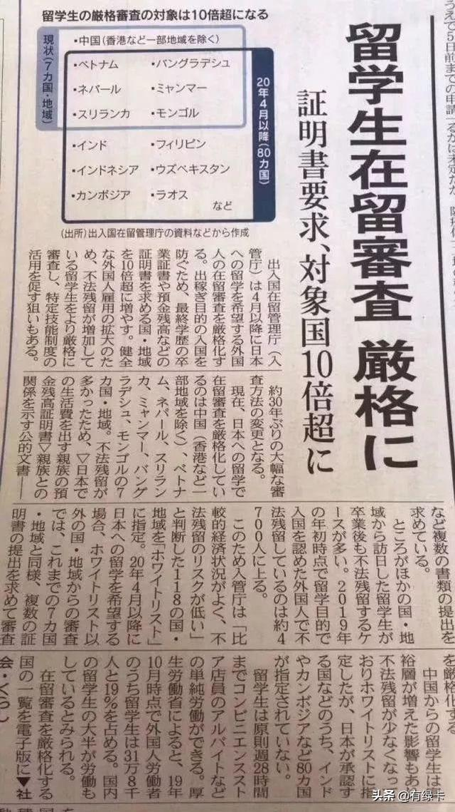
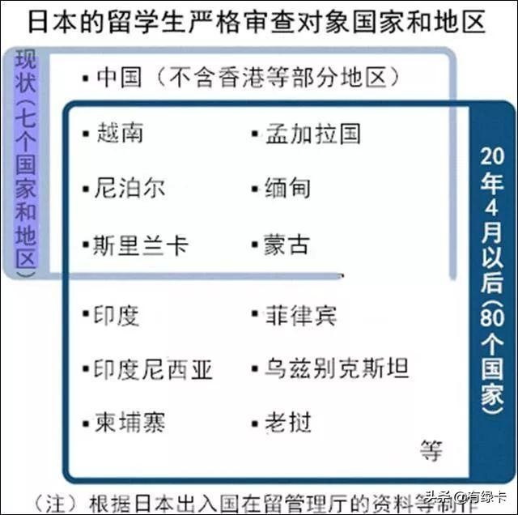
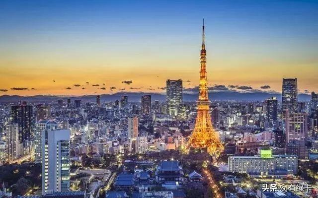
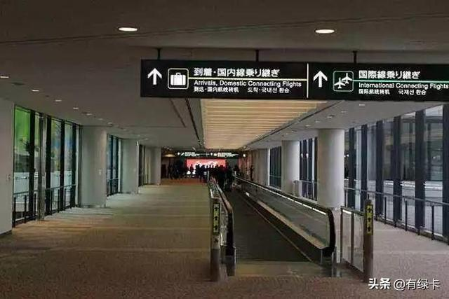
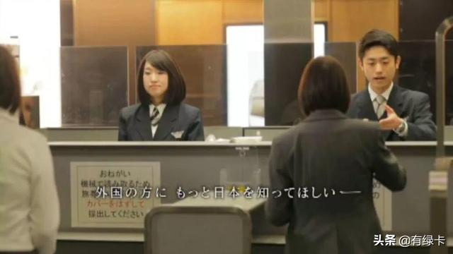
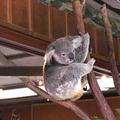
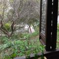

[首页](https://www.toutiao.com/) / [教育](https://www.toutiao.com/search/?keyword=%E6%95%99%E8%82%B2) / 正文

# 快讯：中国将被列入日本留学审查白名单

有绿卡 2020-02-13 15:20:34

**时隔30年，日本出入国在留管理厅再次修改留学生签证审查办法，拟增加对印度等80个国家的留学签证审查力度。中国此前也是被严格审查的国家之一，而此次修改则将中国重新列入“白名单”。**

如今，其他国家和地区赴日留学的人数也越来越多，而这些国家和地区留学生毕业后非法滞留日本的情况，也在增加。《日本经济新闻》称，截至2019年年初，以留学为目的、但赴日后非法滞留的外国人约为4700人，增至2015年（约2800人）的1.7倍。

据《日本经济新闻》报道，日本出入国在留管理厅将在今年4月份之后，加大对包括印度和柬埔寨在内的80个国家的留学签证审查力度。此举目的在于遏制非法劳务及假留学。

目前，受到日本严格留学签证审查的“黑名单”国家有7个，分别是中国（不含香港等部分地区）、越南、尼泊尔、斯里兰卡、缅甸、孟加拉国和蒙古。报道称，这是因为“这7个国家曾在日本的非法滞留人口非常多”。

对于中国，日本出入国在留管理厅认为，近年来，随着中国经济的腾飞，越来越多的中国留学生经济实力增强，“跟以往相比，非法劳务、超时打工的现象减少很多”。

**因此在今年4月份之后，会将中国从留学签证严格审查对象的“黑名单”中移除，重新列入“白名单”中。这意味着内陆人员赴日留学的手续将大幅简化。**

《日本经济新闻》指出，这项“白名单”适用于“经济情况相对稳定，非法滞留风险较低”的国家和地区。目前该白名单中包含118个国家和地区，以美国为首。

4月份，白名单以外的国家和地区的人员如果希望赴日留学，会像目前的7国一样，被日本要求提供多项证明，以达到强化审查的目的。

**日本对中开放留学审查白名单，意味着中国新一代赴日学生素质高，守法意识强，已经改变了日本社会对中国过去产生并延续至今的一些负面认识。今后中国人来日本留学会更加容易。**

*   [日本](https://www.toutiao.com/search/?keyword=日本)

_287 _条评论

评论

*   
    
    [爱随流水](https://www.toutiao.com/c/user/51022323498/) 11天前
    
    如今的中国一点不比发达国家差，只要肯学习肯吃苦，生活一定好。
    
    回复  ⋅ 59条回复 194 
    
*   
    
    [九晏之城](https://www.toutiao.com/c/user/58596178355/) 11天前
    
    中日友好世世代代，一衣带水，同文同种
    
    回复  ⋅ 32条回复 219 
    
*   
    
    [龍沢](https://www.toutiao.com/c/user/53454277339/) 11天前
    
    谁现在还去日本留学啊
    
    回复  ⋅ 33条回复 64 
    
*   
    
    [老再66654487](https://www.toutiao.com/c/user/5823847242/) 11天前
    
    并不惊讶！
    
    回复 87 
    
*   
    
    [人若初见再见依然](https://www.toutiao.com/c/user/13418363359/) 8天前
    
    这是我们国家强大，国内越来越好的原因。
    
    回复 21 
    
