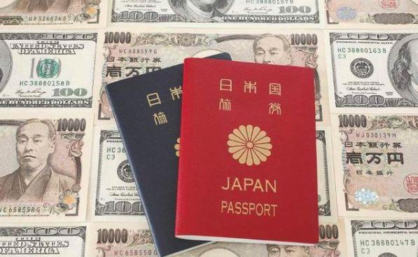
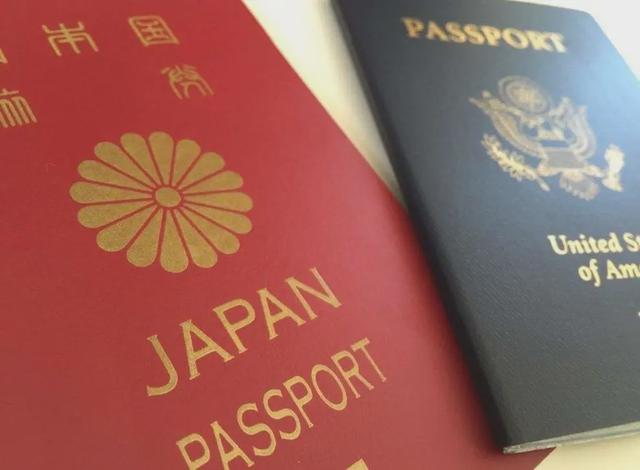
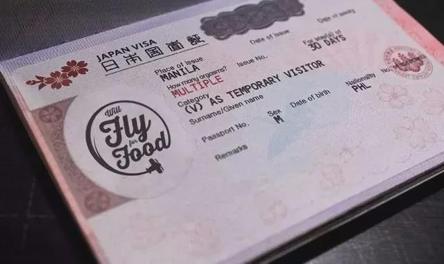

# 日本移居只要500万日元（约30多万RMB）？日本购房移民真相大揭秘

居外事务所 2020-03-02 18:09:27

大家好，我是高妹，最近有不少朋友咨询有关**日本购房移民**问题，今天高妹就来跟大家讨论一下。

> 首先，日本与其他欧美国家（例如希腊）不同，它不是移民国家，是不能以通过买房投资的方式拿到绿卡的。

那在日本没有办法实现购房移民，那**为什么很多投资方宣传买房就可以全家移民呢？还有说法是只需500万日元即可？**

是这样的，在日本如果需要移民，有一种方式叫**日本投资经营管理签证**，重点在经营管理四个字，意思就是说你必须要在日本真实经营一家公司/实体店/机构/事务所等，前提还必须要**持有500万日元投资注册资金**，证明你是真的有商业计划进行真实经营的诚意，这个注册资金你可以进行雇佣/购买设备/发放工资等，但是要知道，在日本用人成本还是很高的，所以**实际算下来，其实不用500万**。

# 有公司声称买房就可免费帮办理？

让我们来思考一下：您要投资500万日元开公司，在不能确定自己的经营项目的时候，如何证明我的真实经营管理？这时候你就可以**买房进行出租收租或做民宿**等，你不用担心语言不通持续性经营困难，这些公司他有**包租/托管经营服务**。

更有甚者还有这种完美售后！如果您担心觉得买贵了，**几年后还可原价回购你的房产**，打消你的一切顾虑，这样下来确实也体现了真实的经营管理，入国管理局也会批准在留资格，实现全家移居日本。

看到这里，是不是觉得很nice？**既收获了签证，又省了投资经营管理签证的办理费用**。除此上述开设公司经营之外，您还可以通过收购现有的日本公司然后自己经营管理来实现移民。

其实，只要我们清楚了移民局政府设立投资经营管理签证的目的，我们往回推敲，也不难理解为什么有的公司推出的买房免费送经营管理签证这种事了。

比如如果经营管理签证的目的是**为了解决外国人以公司的名义长期在日本真是经营管理**，那你就要清楚如果一年里六个月时间都不在日本或者一次性离开日本三个月是肯定不行的，缺乏合理的解释，但是如果一年**待满9个月以上**会比较好续签。

再比如，如果你要经营餐厅，知道一定要真实经营，就得有厨房及雇员。再同理，你是不动产公司就得有**不动产许可**、你是民宿就得有**民宿许可（不少民宿项目是持有的）**、你是旅游公司就得有**旅游许可**、你是软件公司，你办公室没有电脑，无法让人相信你在真实经营。

除此之外，真实经营，就**必须做账，必须每月发工资上缴税**，哪怕是给你一个人发工资。总之，一切都应该具有合理解释性。

那可能还有朋友会问了：投资经营管理签证，正常的办理模式和流程是怎样的？**正常的办理模式是要找一个行政书士的**。

# 温馨提示

找靠谱的行政书士是一项技术活，如果没找对，原本可以签下来的给办砸了，**耗时耗力不说，几十万日元也石沉大海**，那如何找一个靠谱的呢？如何防止被骗？下一期，高妹为你解答，我们不见不散！

