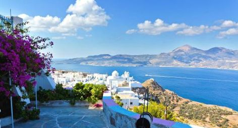
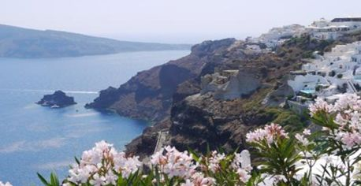
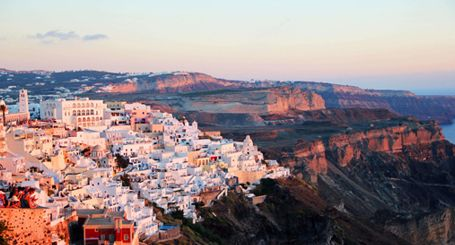

移民希腊到底好在哪里？
星期二, 八月 7, 2018
7:13 上午
小美  [美移移民]()

一、希腊移民真的是非常的便宜

移民本身就需要申请者有一定的资产能力。虽说现在移民不再是高净值、高知产人士的专属，但是也不是一般人都可以做得到的。毕竟移民到另一个国家生活，资产能力不够强的话还是不行的。

希腊移民只需要大概200万人民币左右，这个资金量对于有移民想法的申请者来说真的不是很大的资金，很多申请者手头的闲置资金远远超过这个数量。进一步来说，就算是没有这么多现金，对于卖一点基金、理财，或是多余的房产就可以轻松筹到这笔钱的申请者来说，也是非常合适的。不过，澳臻移民从来不建议投资者卖掉手头唯一的房产办理希腊移民，毕竟一点多余资金也没有的话，移民以后的生活还是比较难的。

再次，希腊移民需要的资金和其他买房移民国家比起来，要少得多。虽说澳洲技术移民、澳洲雇主担保移民之类的方式和美国的EB-3所需资金都更少一些，但是澳洲移民的条件非常的高，能够满足条件办理的申请者较少；而美国EB-3非技术移民的排期又比较长（需要七八年左右）。

更适合较为年轻的，且有美国梦的申请者。所以说，对于短期内想要移民的申请者来说，希腊移民无疑是最快速、所需资金最少的项目。当然了，如果申请者够财大气粗的话，也想用500万左右的资金办理移民的话，葡萄牙买房移民和西班牙买房移民也是非常值得考虑的。

二、希腊移民付款方式非常简单
众所周知，现在外汇管制非常的严格，钱从国内出去的话不是很方便。希腊移民最大的优势也在此，可以直接用人民币付款，就是说可以直接用人民币账户的银行卡付款。

就像国内购物一样，直接刷卡就行了。虽说可能会涉及到一点手续费，但是和需要开设境外账户，长时间的付款流程比起来，希腊移民真的方便太多了。因为，如果付款流程过长的话，中间会发生什么延迟，谁都说不清的。毕竟，对于移民的申请者来说，能减少麻烦就减少，谁都喜欢既省时，又省事的投资项目！

三、希腊移民没有任何移民监的要求
此外，很多移民申请者其实并不是真的想要去别的国家居住，他们想要的只不过是一个海外身份，出入自由的便利。

希腊移民没有任何移民监的要求，在房产过户之后就可以先申请一张希腊蓝纸，就是一个临时的一年期居留卡；正式的五年永居卡在前往希腊采集生物信息后（打指纹）一两个月内就可以拿得到。在整个五年期间，申请者一天都不需要在希腊居住，只要在五年的永居卡到期的时候，前往希腊更换新的卡片就行了。也就是说，五年时间内，申请者可以一直待在国内。

而另一方面，持有希腊永久居留卡，申请者可以随时前往希腊和其他26个申根国家，无需任何签证，要多方便就有多方便。在希腊购置房产之后，如果不选择过去居住的话，不论是房产本身的增值、亦或是出租收益都非常可观。希腊有很多房产就是包租的，买了之后什么都不用管，每年可以享受3-4%的净收益！

四、希腊移民对于孩子教育帮助很大

当然了，对于孩子有上学需求的申请者来说，希腊移民仍是非常合适的。希腊的教育体系非常发达，有很多的国际学校，基本上学费每年在10万人民币左右，这些都是正宗的英美国际学校，对于以后孩子去英国或者美国读大学有很大的帮助，而且学费和国内比起来也非常有优势。

妈妈可以带着孩子在希腊读书，父亲可以在希腊经商、做生意，也可以一直在国内经商，随时都可以飞到希腊看孩子，无需签证。而且2017年9月北京还开通了可以直飞雅典的直航，全程只需10.5小时左右，简直不要太方便。

希腊的环境、气候和生活也是很多申请者选择这个国家的原因之一。希腊的气候非常的适宜，移民希腊之后可以享受更加闲适，更加放松，更加舒服的生活。所以说，与其说希腊移民火热，不如说是市场需求大，移民机构之所有大力推广希腊移民，主要还是希腊移民真的是适合绝大多数的移民申请者。

往期热文：

[现代人真可怜，什么锅都得自己背](https://mp.weixin.qq.com/s?__biz=MzIxNTgwMTIxMw==&mid=2247490546&idx=1&sn=62e1c88e738273e04d58e949194fe4e1&scene=21#wechat_redirect)

[钢铁工人的27秒球星，恕我直言比起他你根本没有理想](https://mp.weixin.qq.com/s?__biz=MzIxNTgwMTIxMw==&mid=2247490530&idx=1&sn=b9deb358aa54164eaf879359971604a2&scene=21#wechat_redirect)

[为什么在中国带孩子那么费劲](https://mp.weixin.qq.com/s?__biz=MzIxNTgwMTIxMw==&mid=2247490522&idx=1&sn=5bd1a55303fc9b7c62043d282d4d9b79&scene=21#wechat_redirect)

[大麻合法，加拿大会变成恐怖的毒品国家吗？](https://mp.weixin.qq.com/s?__biz=MzIxNTgwMTIxMw==&mid=2247490521&idx=1&sn=25e94d70e3d552dab7e1f16e78afc6e3&scene=21#wechat_redirect)

[记在北京游荡的苏联游魂，一个个被高墙消磨的人性](https://mp.weixin.qq.com/s?__biz=MzIxNTgwMTIxMw==&mid=2247490507&idx=1&sn=32585ed1d439ae39c9ec08ec2e4e0caa&scene=21#wechat_redirect)

From <http://mp.weixin.qq.com/s?__biz=MzIxNTgwMTIxMw==&mid=2247491274&idx=2&sn=0c5eecd866e6f93bea9dfcbd13730e70&chksm=979392d8a0e41bce21c0a7df40a6e6d737dbb90d06328f11efe2c5e74c01dbd53b6770198598&mpshare=1&scene=1&srcid=0807h1tZkXPaJXBIZ8XGQDSi#rd>

