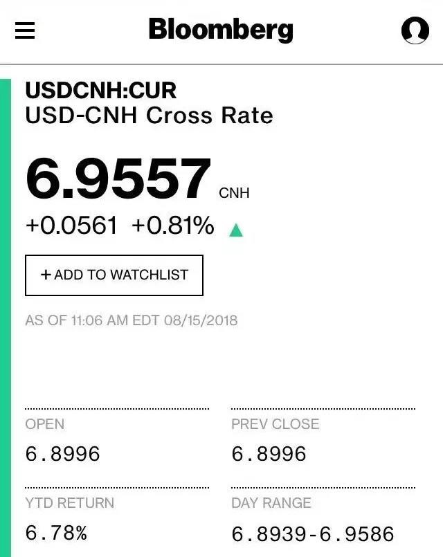
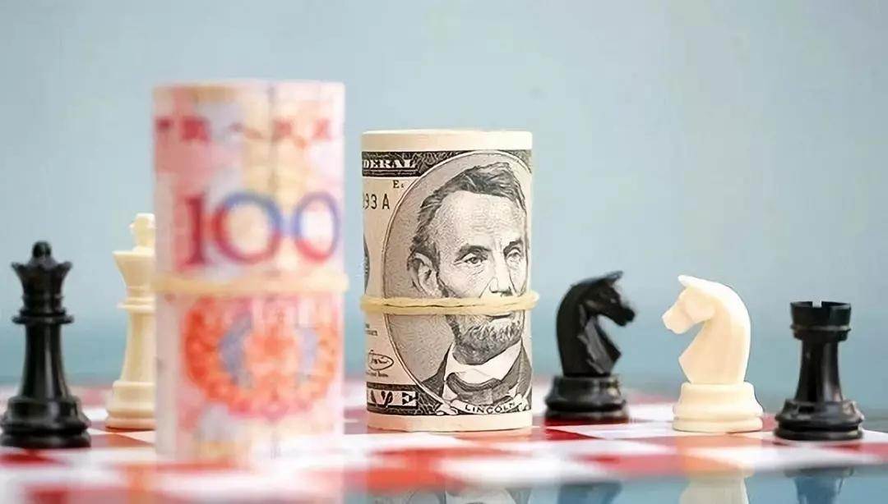
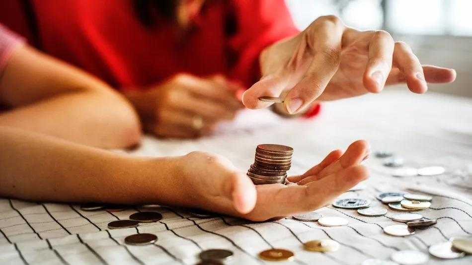
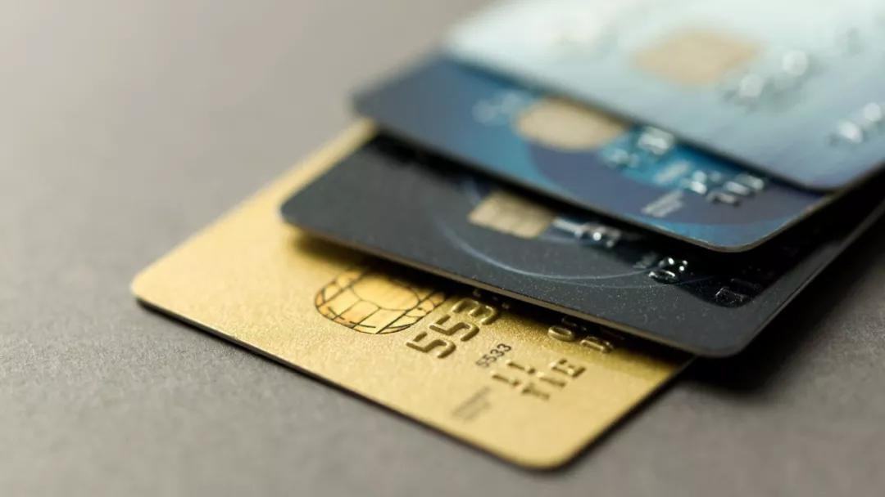
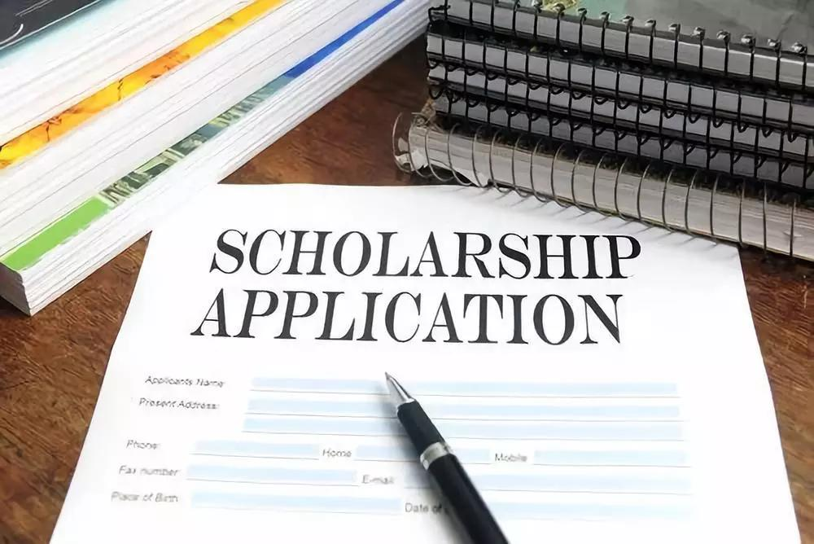
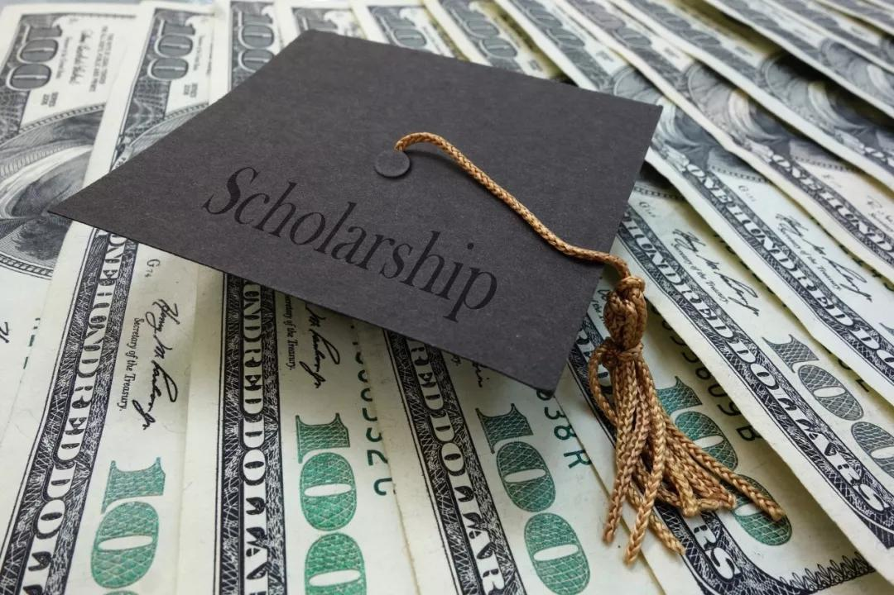
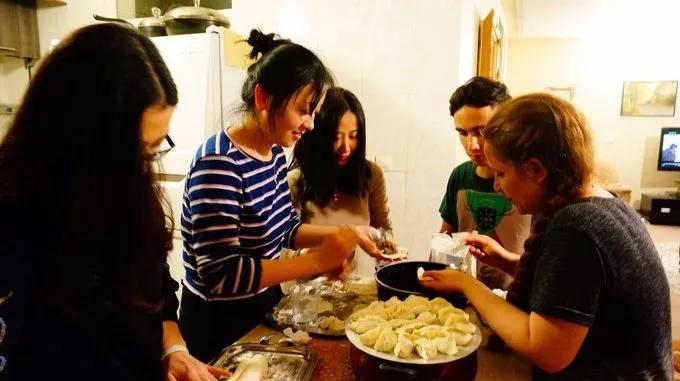
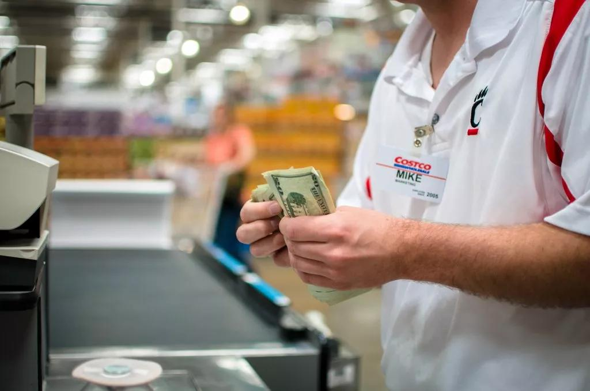
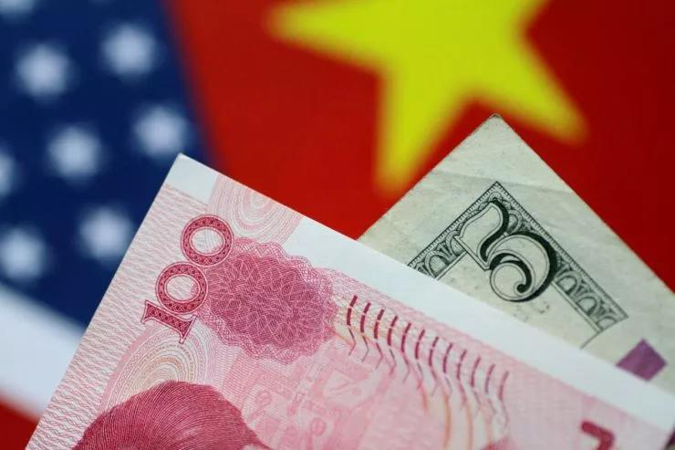

### 美元对人民币汇率要破7了！留学生两年要多交近5万元！
星期六, 八月 18, 2018
1:51 下午

2018-08-17 Tony J

### 热点

近日美元兑人民币汇率即将破7，中国留学生有苦说不出。
就在今天，日报君手贱偷瞄了一眼美元和人民币的汇率。
一看瞬间泪流满面。。
美元对人民币的汇率都已经涨到6.95了！！

图源：bloomberg
6.95啊！！眼看就要破7了！

现在正值留学生开学季，也正是所有留学生需要缴纳学费的时候。
人民币偏偏在这时候直逼7，真是使得留学生圈一片哀嚎。

举个例子，目前美国读研时间一般为两年，学费在5-6万美元左右，加上生活费等费用，读完全部课程费用大致需要10万美元左右。
10万美元按前几个月前的汇率计算就是65万元人民币，几个月就要多花费近5万元。
那要是在美国读本科读个四年下来，那10万元就妥妥的白交了。

请问我们留学生这又是动了谁的奶酪了...不搞别人来搞我们...
虽然中国外汇管理总局力挺人民币，希望让人民币汇率上演“V形”反转，但还是挡不住人民币的贬值势头。
而如今正赶上中美贸易战在即，国家正在有意通过人民币贬值，来减轻经济压力。

图源：journal.eyeprophet
那看来盼着人民币上涨还要盼很久一段时间。。。
让日报君先哭一会。。
对于那些面临开学前必须要缴纳学费的留学生们，简直是心在滴血啊！感觉分分钟损失几个亿！
这几年，本来国外高校的学费就在每年不断地上涨。
据USNEWS报道，大学学费平均上调3.6%。少数大学甚至将学费提高了4%以上。
学费涨幅最高的是里海大学、加州理工学院，达到了5%。
范德堡大学、杜克大学、维克森林大学、宾大、普林斯顿、布朗、哈佛、康奈尔等名校涨幅在3.5%-5%之间。

![2018 年 学 杂 费  2018 （ 美 元 /  校 名  普 林 斯 顿 大 学  眙 僥 大 字  耶 兽 大 字  哥 伦 毕 业 大 学  斯 坦 大 学  芝 加 哥 大 字  麻 省 工 大 字  杜 克 大 学  宾 夕 法 尼 亚 大 字  加 州 理 工 学 院  约 舌 全 大 学  达 茅 斯 字 院  西 北 大 字  在 朗 大 字  康 尔 大 学  厄 堡 大 字  圣 路 易 斯 华 盛 大 字  系 斯 大 学  圣 大 字  加 州 大 学 伯 兑 利 分 校  乔 氵 台 衩 大 学  卡 耐 基 俺 隆 大 字  加 州 大 学 氵 各 杉 矶 分 校  南 加 州 大 字  睥 吉 尼 亚 大 字  塔 夫 茨 大 学  遴 克 林 大 学  蕊 颢 根 大 学 安 娜 堡 分 校  2016 （ 美 元 /  43450  43280  47600  51008  46320  50193  46704  49341  49536  45390  48710  49506  49047  49346  49116  45838  48093  42253  47929  38140  46214  48611  50410  35631  50210  43822  50604  47682  43377  2017 （ 美 元 /  45320  47074  49480  55056  47940  S2491  48452  51265  51464  47577  50410  51438  S0855  51367  50g53  45610  49770  43918  40191  47g 54  50547  52040  39518  52217  45066  52430  49308  43476  47140  44990  51400  54656  50732  53744  53416  48111  52170  51468  50424  51366  5095g  46500  50650  44900  51505  41989  486g0  S1720  52732  41265  54230  46604  53152  51400  48598  合 计 〔 含 字 费  、 住 宿 费 等 ）  67100  69600 · 73600  66900  7197g  71000  72710  72584  68901  65460  71409  70421  68106  6761g  673g2  71976  63188  69395  59660  66g50  727g0  70094  62205  64220  63286  70600  68600  62972](../_resources/3daf3817ee34a610abe7a601dd45e4ef.jpg)

图源：journal.eyeprophet
藤校与名校都挤进了六，七万美元一年学杂费兵团，这意味着每年50万人民币的学费，是每个留学生家庭的必备。
哈佛官网上更是交待新生家庭准备好各项学杂费73600美元。一年下来， 超过50万元的花费已经是板上钉钉。。。

图源：搜狐
中国学生就读美国本科，每年的学费、生活费大概10万美元，读完需要40万美元，再加上三年研究生，一共算下来70万美元，大约需要500万人民币。
怎么样，震撼到了吗，别忙着捂胸口，如今的人民币大幅下跌，那500万人民币都供不起最基本的花销了！
看着不断上涨的学费，还要承担人民币贬值造成的亏损，我们留学生心里真是有苦说不出。。
不过，对于已经在国外有稳定收入、或者定居的学生来说则是个好事。毕竟，从另一个角度来说美元‘值钱’了。
而对于还在上学的苦逼小伙伴们，若要是想给家里省点钱，就要勒紧裤腰带过日子喽。
上有政策，下有对策，那日报君就教大家一些在国外留学省钱的窍门。

1. 随身携带学生证
在美国，学生这个身份可是可以享受到很多福利的！
在学校规定范围内乘坐公共交通不用钱，保险，电影院，健身房等都会有折扣。
有些折扣不买简直对不起自己，比如购买苹果air电脑出示学生证，可以减200美金。

图源：Mashable
2. 购买二手书
刚来美读书，比看到自己成绩更吃惊的一定是课本的价格...
随便一本书都要四五十美金，动辄上百。
如果不是对于书本有洁癖的学霸，其实可以购买二手书或者租书。
学校的买卖论坛或者在亚马逊都可以买书租书。
或者向学姐学长买二手书也可以～

图源：MakeSpace
3. 学会使用信用卡
来到美国，一卡在手，天下我有。
在美国，留学生也可以申请银行信用卡，但不同的信用卡类型有不同的折扣或者优惠。
例如，有些信用卡会有季度返现，有些信用卡会有汽车加油打折优惠，具体还是要多对比几家银行，看哪种更适合自己。

比如Chase Freedom和Discover, 两个都有cash reward的项目, 就是说你在特定的时间内特定的一些category消费, 会有5%的cash back，平日里在其他地方的消费则会有1%的cash back。

具体的节奏大家自己掌握就好了, 只要不错过payment就好。

图源：CO-OP Financial Services
4. 申请奖学金
学校的奖学金不再像国内大学那样固定几种，而是种类繁多，可以根据自己的情况进行申请。
主要有三种类型：TA，RA和Fellowship，也就是助教奖学金，助研奖学金，以及全奖奖学金。

图源：New York Amsterdam News
助教奖学金一般由系里出钱，职责是帮老师批作业、给学生答疑，其中生物、物理等专业的TA们还要带学生做实验。
RA由拿到funding的教授出钱，职责就是给教授做研究助手。
根据学校和教授的不同，每月可以拿到2000美元左右。
比如可以申请研究助理金（Research Assistantship），多针对研究生以上级别，拿到即是意味全奖。
根据学生学习成绩和研究能力颁发，获此奖的学生可免交学费，但必须在校内工作。

所以，学霸们，记得申请奖学金，申请下来了可是省了好大一笔钱。所以读书读得好，真的能省钱！
5. 学渣们要努力学习，不要挂科
如果不是学霸也没关系，起码不要当个会挂科的学渣或学沫。
美国采取学分制，学费也会按学分来算。
如果挂科了就需要重修，重修则需要再交学费，不仅要经受学习的压力而且还要经受钱财的二度损失。
所以努力学习，不重修就是省钱！

图源：易申网
6. 合理规划课程，提早毕业
美国按学期收费，如果能提前一个学期毕业，省下来的学费是很可观滴，特别是越好的大学学费越贵！
在美国读大学，只要合理规划选课，很多学生都会提前毕业，并不会经受太大的读书压力。
在入学的时候咨询学校的选课辅导师，让他们帮助规划接下来几年的课程，提高课程密度，提前毕业，也能省下不少钱。

7. 学会记录自己的消费和设置透支警告
当自己成为钱主之后，一定要管住自己花钱的手！现在的智能手机功能都很强大，下载个理财软件，每天记录下自己的消费情况，设置预算，提醒自己每个月的使用余额。
如果没有设置底线的话是很容易变成吃土少男少女的~

![〈 2015 年 流 水  收 3 ， 045 ． 46  1 1 ． 0 1 一 1 1 · 3 0 支 1 ， 977 ． 05  30  Mon  29  Su n  送 礼 请 客  Nemo's stuff  Furnitures  Vacuum + shelf  Teemo's Stu ff  私 家 车 费 用  Insurance  - 早 午 晚 餐  Ga s  Gas  Gas to So Cal  Gas  Gas to Nor Cal  Ga s  Chase Checking “ > Discover  [ 转 账 \]Monthly payment  早 午 晚 餐  结 东  1 ， 068 ． 41  16 ， 66 〉  59 ， 83 〉  112 ． 43 〉  15 、 35 〉  20 、 00 〉  36 、 39 〉  25 、 19  622 ． 45 〉  7 ． 39](../_resources/c2fa102040a5bba8b6f5a97048782f6e.jpg)

图源：知乎
8. 不会做饭的留学生不是合格的留学生
作为一个吃货，吃是人生第一头等大事。
再穷也不能穷胃。
有时候想吃外面的餐厅，其实自己也可以做。
去超市买一块上好牛排消费10美金不到，回家自己撒点盐和胡椒，配合黄油，把握好火候就能做出一道味道不输外面餐厅的牛排。
但如果你在美国想要找到一家味道好的牛排餐厅，吃后加小费等价格可能就会超过50美金。

图源：穷游网
上网搜些食谱学习，拒绝只吃馒头老干妈。
就算穷，我们也要当一个有骨气的吃货！
9. 校内兼职
与其辛苦省钱，不能努力赚点外快~
学校内的国际学生办公室，图书馆，咖啡店，餐厅等都会对学生进行开放招聘。
在父母这一辈看来，留学生打工无非就是去餐馆当服务生、刷盘子。
实际上，去校外中餐馆做这样的工作，在美国属于打黑工。
虽然也有一些学生在做，但这种工作无论从学生的打工体验与收获、还是合法程度上来讲，我们都是不建议的。

图源：寻图网
持F-1签证的国际学生如果想工作，只能在校内打工，比如在学校餐厅、宿舍或图书馆做一些服务工作。
如果时间允许的话，可以申请校内工作，这样每个月有一笔额外的收入，生活也会相对宽松，但最重要的还是要在保持好自己成绩的前提下。
10. 拥有一双发现折扣的眼
最后的事莫过于刚买了，却发现原来有折扣...
在美国安顿好后，记得去家里附近或者常去的超市办理会员卡以获取优惠。
这些会员卡大多是免费的，但也有例外。

图源：Popsugar

比如作为美国最大的连锁会员制仓储量贩店好市多（Costco）的会员卡就是需要收年费的，成为会员后能以最低价格得到高品质的品牌商品，也可以买到香喷喷的5美金的烤鸡~

美国商店时有打折，买东西之前可以先在网上查询看看有没有折扣，或者趁着折扣可以把生活必需品买了囤货。

图源：看中国
总之，人民币贬值让大家很痛心，但多学会几个省钱小窍门，还是可以省很多钱的～
日报君心里还是默默希望人民币早日涨上去...
不要再误伤我们无辜的留学生...
愿世界很和平....
peace...
ref：
[http://www.sohu.com/a/160398506_372457
http://www.eduglobal.com/usa/Article/115203/
https://www.zhihu.com/question/32729258
http://lx.huanqiu.com/2014/lxnews_0304/792.html

- [土耳其崩了！而中国代购们却如秃鹫般赶到现场抢奢侈品](http://www.collegedaily.cn/api/blog/flipboard/4884)
- [美元对人民币汇率要破7了！留学生两年要多交近5万元！](http://www.collegedaily.cn/api/blog/flipboard/4898)

From <http://www.collegedaily.cn/api/blog/flipboard/4898>

