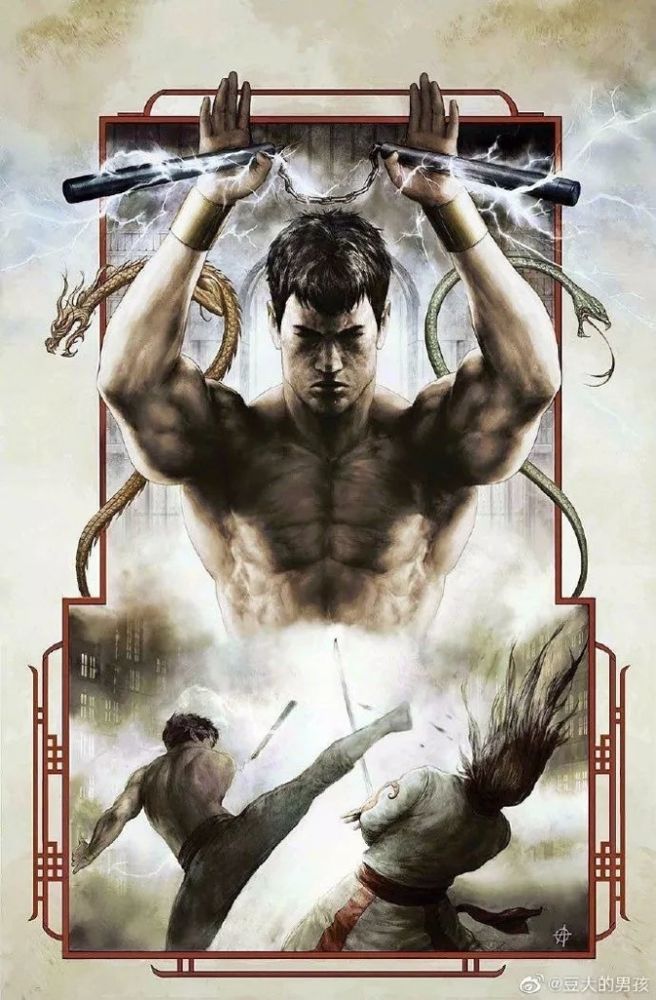

钛媒体：引领未来商业与生活新知

# [傅满洲之子、弑父，漫威为何选择他作为首位华人超级英雄？](https://www.tmtpost.com/4066948.html?rss=flipboard)

2019 年 7 月 16 日 10:19
来自：动漫经济学normal

> 文 | 动漫经济学
漫威正在玩火，这把火有可能一次性烧掉中国票房市场的入场券。

7月14日，Variety记者在推特上发文表示，漫威正在为新电影《上气》挑选男主角，其中男主角要求必须是华裔或中国人，会武术，年龄20—29岁。“首位华人超级英雄”选角的消息，很快在中国互联网上引发了热议，相继登上微博、知乎、豆瓣小组多个热搜榜单。各家粉丝团也力推自家idol简历，想要争取这个比肩花木兰的热门角色。

这本是一门双赢的生意：漫威影业吃到中国市场红利，中国文化借此机会走出去，被更多观众所知晓，然而事与愿违的是，现状却正在走向失控的边缘——据公开信息显示，《上气》设定中多处辱华已成事实：

1. “上气”的父亲为反派人物“傅满洲”，是上世纪黄祸论的代表人物，带有明显的种族歧视倾向。

2. 在剧情设定上，原作讲述了“上气”通过与奇异博士、蜘蛛侠们的接触，弃暗投明，最终大义灭亲（弑父）的故事，也带有明显的政治意味——要知道，“傅满洲”的英文单词mandarin的释义之一便是普通话，上述剧情可以进一步解读为一个中国人通过背叛母国文化来向美国身份示忠的故事。

3. 说是反派，“傅满洲”在剧情中到底做了哪些恶呢？原来是阻止了西方考古学家挖掘秦始皇陵。不过，这个事本身就站不住脚吧——我国的文物，为什么要等待西方考古学家挖掘，需要再送去大英博物馆保护起来吗？

正如豆瓣网友“江米团子”所质问的那样，要拍华人超级英雄，为什么不拍神矛局，不拍万众侠？种种迹象表明，在漫威的商业野心之下，似乎也夹杂着傲慢的私货。

（上气选角在知乎引发了热烈讨论）

#### 上气，傅满洲与黄祸论

1863年，美国太平洋铁路动工。根据工程规划，这条沟通美国东西的铁路大动脉需要14年时间完工，但在14000多名华工努力下，仅仅用了7年的时间便宣告竣工。在修筑铁路的过程中，吃苦耐劳的华工给美国资本家留下了深刻印象。之后，美国掀起了一股华工移民热。

这引发了美国普通劳动者的不满：

*（铁路施工进程中，华工们住在建筑工地旁的帐篷里，而老板和工程师们住在火车上。摄影师：Alfred A .Hart 资料来源：斯坦福大学图书馆）*

- 华人的薪水只到白人工人的2/3，且工作强度和工作量更大，当地白人劳动者认为华工挤占了本属于他们的工作岗位。和白人劳工每月35美元另包食宿相比，华工每月26美元不供食宿，且无人身保险，也不承担华工家属义务。——《足迹》一书华工薪资导语部分
- 华工领到薪水之后，很少在当地消费，而是侨汇回国，当地人无法从经济循环中获益，因此颇有微词。比如中国首个华侨文化的世界遗产项目——“开平碉楼与村落”，便是以侨汇资本建造的集防卫、居住和中西建筑艺术于一体的特殊建筑。

（靠侨汇建起来的开平碉楼，具有中西合璧的特征，图片来源@视觉中国）
来自民间的压力很快推动了1882年美国国会通过了种族歧视性质的《排华法案》，而没有选票的华人毫无还手之力。

法律上的合法化，很快使得妖魔化华人、甚至黄种人成为政治正确。19世纪末，黄祸论在民间开始形成，加之中国义和团运动屠杀传教士事件的发生，1913年傅满洲的诞生，标志着黄祸论在消费文学上终于拥有了第一个IP，并直接影响了数代西方人对东方反派的印象。

之后，傅满洲的形象广泛出现于好莱坞电影中，成为惊悚电影中的反派主角。

1949年，新中国成立，中国劳动者赴美打工的途径事实关闭；而随着日本经济的崛起，黄祸论的代表渐渐转移到日本人头上。直到1973年，中美领导人会晤两年后，一个社会主义中国成为美国对抗苏联的盟友，中美建交也被提上日程时，傅满洲再度以满大人的身份出现在漫威漫画中。

这一次，一同出现的还有他的儿子，华裔超级英雄上气。

上气的诞生是存在多种契机的：民间审美方面，随着70年代李小龙走红好莱坞，功夫热席卷全美，美国民众需要消费功夫型超级英雄。事实上，上气赤裸上身，惯用双节棍，乃至侧踢敌人脑袋的动作设定，随处可见李小龙电影元素。政治寓意上，上气的背景被设定为出生于河南的傅满洲之子，通过与奇异博士、蜘蛛侠们的接触，弃暗投明，最终大义灭亲（弑父）的故事。

由于“傅满洲”的英文单词mandarin的释义之一便是普通话，这个故事在当下被解读为一个中国人通过背叛母国文化来向美国身份示忠的故事。然而，在冷战背景下，上述剧情同样可以理解为”中国背弃邪恶的苏联，投入光明的美国怀抱”。不论哪种解读，中美关系都不是平等的（隐喻中国是儿子，美国是爸爸），存在着明显的父权象征意味。

因此，上气自诞生之初，便受到了海外华人的一致抗议。
事实上，不论是黄祸论的历史渊源，抑或是弑父的剧情走向，都决定了上气并非进一步扩大中国市场的最佳钥匙。那么，为什么漫威还要坚持这么做呢？

#### 政治正确的负面效应

不论是漫威还是迪士尼，都有着借助新一轮政治正确扩大票仓的野心。
《黑豹》票房的大获成功，使得漫威和迪士尼大受鼓舞，开始加速推进电影上色工程。于是，小美人鱼主演也变成了黑人，亚裔超级英雄也被纳入开发流程。
不过，这种政治正确却带着好莱坞天然的傲慢，以至于自认为的正确，却埋下了长远的风险。这点，从电影《绿皮书》获得第91届奥斯卡金像奖最佳影片一事中可见一斑。

《绿皮书》是一部被非洲裔美国人广泛抵制的电影，它讲述了名叫唐的黑人古典乐钢琴家因为要到美国南方演出，需要雇佣一位司机。意大利裔白人托尼接下了这个活。在这之前，托尼收到了一份“绿皮书”指南，上面列着当地黑人可以吃饭睡觉的地方，因为在在二十世纪六十年代种族隔离严重的南部地区很多地方只允许白人涉足。通过与唐的一路相处，托尼渐渐认识到了种族隔离制度的荒谬，两人之间也建立了一段跨越种族、阶级的友谊。

（黑皮白心，是绿皮书被非洲裔美国观众抛弃的重要原因）

这个故事表面上看非常政治正确，剧情背后却暗藏玄机。唐的设定是一位高阶级的古典钢琴家，他穿西装，喝威士忌，然而钢琴、西装、威士忌三样文化元素，哪点来源于黑人文化？唐所立足于传播的文明与教化，这套规则真的脱胎于黑人文化本身，又适合黑人社区吗？他所做的，不过是将黑人打扮为白人精英的样子，并告诉自己的同胞，这才是文明的标准。

唐与托尼的个体友谊自然需要被承认，但电影中所展示的“黑人唯有成为精英，才能得到白人中下层认可”的事实却未免过于双标。这无形中揭露了好莱坞政治正确的底色：演员肤色无所谓，但标准需要牢牢掌握在我的手中。第一，只有西方文明才能被称之为文明；第二，我只吸纳其他族裔的、被教化的精英，不管是黑人钢琴家，还是华裔超级英雄。

（“傅满洲”在西方语境下拥有广泛辨识度，以至于中国角色大都需要“傅满洲化”来增加辨识度。图为《加勒比海盗3》中周润发扮演的华人海盗船长，其造型大量借鉴了傅满洲元素。）

在《上气》电影立项的过程中，上述逻辑同样发挥着重要的导向作用。在北美，漫威需要“傅满洲”的形象，毕竟这是100年来西方观众脑袋中刻板的中国印象，能够最大程度地降低宣传成本；在川普号召“Make America Great Again”口号下，傅满洲的形象也暗合了中国崛起的新黄祸论想象，从而撬动底层观众的票房。

在中国，宣传上主打“首位华裔超级英雄”，暗示其对中国文化的仰慕和中国市场的重视，未来不排除使用小鲜肉进一步夯实流量基础，绝口不提黄祸论的历史渊源和影片中强烈的高低文明暗示，试图完成北美中国两大票房市场的双杀。

然而，漫威和迪士尼低估了互联网的传播价值，中国网民可不吃这一套——在知乎、微博和豆瓣，热闹过后，关于“上气”背后的设定揭秘帖以几何数增加，大量网民牺牲自己的时间义务科普漫威背后夹带的私货。

中国市场的确需要一位超级英雄，但绝对不是来源于高高在上的施舍，而是平等的文化交流。漫威这种既想赚钱，又想夹带私货的小聪明，正在把这个曾经成功的商业体推入一个危险境地。

更多精彩内容，关注钛媒体微信号（ID：taimeiti），或者下载钛媒体App
36091 人关注

本页面由 Flipboard 版面渲染引擎自动排版[查看原文](https://www.tmtpost.com/4066948.html?rss=flipboard)