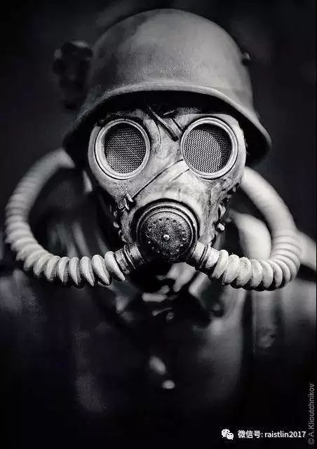
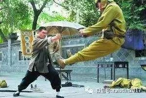
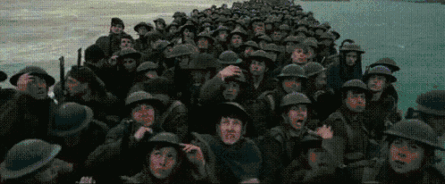
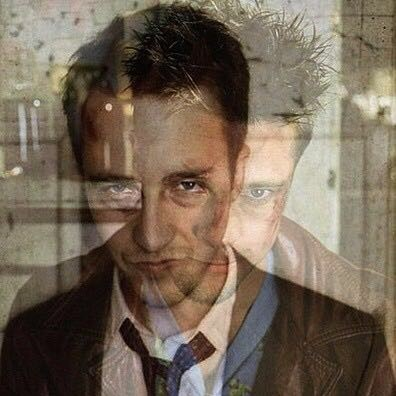

## 现在的战争片，好像都是在耀武扬威地宣传战争

雷斯林  虎嗅网

本文转自微信公众号：为你写一个故事（ID：raistlin2017），作者：雷斯林。虎嗅网获授权转载。

****

**有很多战争电影，其实是非常美化战争的。**

看多了那些战争片，每一个小男孩都会想提着枪走上战场。

曾经有很长一段时间，国内都流行那种特种兵大杀四方，扬我国威的战争片，以及带着“我是兵王”的形象去世界各地耀武扬威的战争小说。

反正里面无论怎样的战争，主角都能做到在枪林弹雨里散步，像武侠电影一样威风。

无论是国内之间的内战，还是抵御外侮的抗争，一例是以一种轻漫浅薄的态度对待胜利和失败者。一场战斗下来，无论将帅还是士兵，都幸福得像是参加了一场盛筵，衣装鲜亮，神采奕奕。

战场上，见不到炸得破碎的尸体，见不到伤者的哭喊惨叫，见不到一个正常人在血雨之后的惊恐，更见不到对同类相残之后的伤悲。

最残酷的大概就只有我方配角被敌人抓住后，无论经历怎样的拷打都不说的硬汉，而这也主要用来表现我方意志的顽强。

我有个远房弟弟，是这种电视剧的狂热粉丝，所以虽然他比较胖，也几乎不进行体育锻炼，但就是总幻想着自己哪天能带着枪走上战场，给敌人都来上那么一下。

耀眼，威风。

当然，小时候我也一样，那时候看多了各种各样的老派战争片，中国的外国的都有。

看到有主角光环的八路军，新四军一个能打一百个日本鬼子，或者是红军长征把国民党耍得团团转，看到开了挂一样的史泰龙施瓦辛格一个人能打一个团，在枪林弹雨里挺直了胸膛，生怕子弹打不中自己。

**一直看到热血沸腾，也想上战场。**

我爷爷是个解放战争老兵，我把我的想法说给他听。他笑着说小孩子去军队里历练两年是好事，但是真的打仗就算了，战场不是你想象的那回事。

我现在还记得，那时他顿了顿，沉默了一会儿，想说点什么又觉得和我这个小孩子没啥好说的，最后只是说，小孩子还是不要懂的好，反正真的打起仗来就没办法这样生活了。

后来我知道他有不少战友去了朝鲜战场，也不知道后来怎么样了。

****

**现实战争和大部分战争片的区别就在于战争片有一个主角**，我们都会把自己代入到那个主角中去，而主角一般不会迷茫，不会恐惧，不会害怕上战场，也不会刚出场毫，无意义就被炸死了。

就算死，也是完成了任务以后慷慨赴义，带着永远昂扬向上的大无畏精神。更别说现在抗日神剧里那些身怀绝世武功，偶尔表演一下手撕鬼子，飞镖射飞机，八百里外一枪蹦掉鬼子狙击手的神人了。

就在这场战斗中，他把一个鬼子活生生撕成两半

**然而现实的战场上你不是主角，现实的战场上根本就没有主角**，**那是一个杀人合法，被杀也合法的地方。**无时无刻不担心被流弹击中，无时无刻不害怕踩上地雷。

在克里斯托弗诺兰的新电影《敦刻尔克》中有上面这个镜头。

表现的是一群准备排队上船的英国士兵，在经历了数周的围困之后，听到德军轰炸机时的情形。

没有大无畏的舍生忘死，没有坚定勇敢的眼神，有的只有如同惊弓之鸟的士兵，恐惧地埋下头去，期待自己运气不要太差，成为被炸到的那一个。

要知道导演诺兰是个英国人，这部电影说的是“一次胜利的撤退”，法西斯德国是全世界人民厌恶的恶魔，很多人说“电影虽然说的是撤退、逃亡，但还是表现出了英国人坚定的勇气”——在这么多前提下，英国士兵还是充满了迷茫和恐惧。

为什么？

因为战争的本质就是如此。

轰炸机的轰鸣声，不知从哪会冒出来的冷枪和流弹，到处是硝烟味，中弹的部位漆黑，明明中弹了还在挣扎的肉体。

**打胜仗的时候还好，一旦溃败，就是从心理上的崩溃。**

用近乎完美的镜头，极度克制的笔调，近乎完美的还原了当时战场的情形，就是我之所以喜欢这部电影的原因。

****

更别说即使打完仗回来，还有数不尽的痛苦在等着。

在美国，有无数参加过二战，朝鲜战争，越南战争的老兵，一生都在PTSD（战争创伤后遗症）中度过。

表现为：

> 1. **> 再体验：即个体会产生闯入性的创伤情境再现，而且再现的内容非常清晰、具体。**> 尤其，生活中与创伤可能产生联系的任何事物，都可能引起个体对创伤情境的再体验。并且这种体验会给个体带来极大的痛苦，并有可能进一步恶化，产生一些PTSD相关的共病> （如，焦虑、恐惧、自责、失望、抱怨等）> ；

> 2. **> 回避反应**> ：出于对再体验的痛苦，个体会主动回避一些可能引发创伤体验的事、物。而且这种回避反应可能无意识化，**> 即表现为“遗忘”。**> 这种回避反应一方面对个体是一种保护机制；但另一方面它会延缓个体PTSD相关障碍的复原；

> 3.**>  高警觉：就是对许多小的细节事件都引起比较强烈的反应**> 。进一步还表现为失眠、注意力不集中等。

在李安的电影《比利林恩的中场战事》中，一个十九岁的男孩比利林恩，因为家庭的变故需要穿上军装，去一个陌生的国家，听着长官的指令，把枪指向那些陌生的阿拉伯面孔。

男人咆哮，女人哭喊，孩子吓得跑开，他不知道这一切是为了什么。**他因为一个偶然的镜头成了国家的英雄，在那同时，他曾经最信任的人正在他怀里慢慢死去**。他看到手上的鲜血，有战友的，有敌人的。

然后回来以后，国家突然说他是英雄，还给他们办了盛大的PARTY，在PARTY上又唱又跳。

在放烟火的时候，他一个哆嗦，出现幻觉，仿佛又到了那个危机重重的战场上。

**这就是PTSD，可能一生中无时无刻都能回想起战争时的恐惧与战栗。**

有一些小数据是：

> 美国17%的流浪人口是退役军人；

> 曾在伊拉克和阿富汗服役的160万退役军人中，有45%正在申请残疾补助。33%已确认具有和役期相关的残疾；

> 这些军人里，20%左右被确诊患有PTSD或抑郁症，剩下的80%里有许多人不愿意进医院，不愿意看心理医生，不愿意承认自己”有问题“。

可悲的是，即使恐惧，之后他们还是要回到战场上去，因为除了战场，他们现在还无处可去。

更可悲的是，还有更多人连活在PTSD的资格中都没有，他们永远留在那了。

而同样的痛苦，其实在中国的士兵身上也有，只不过我们社会普遍还没关注到相关题材。

比如：

> 一位20世纪70年代参加过越战的前辈对我说：猫耳洞里湿热难耐，蚊虫叮咬，很多战友浑身烂得连裤子都穿不上，平时不打仗时，大家甚至连裤子都没得穿。你能想象这样的不雅镜头吗？你从这种“不雅”中，看出的是士兵的伟大还是猥琐呢？许多人，从猫耳洞出来半年都不敢抬头走路，怕碰头；更不敢轻易抬脚往可疑的地面上走，怕遭地雷。有些人的噩梦，一做就是几十年。

还有：

> 抗美援朝战争结束后，全国各地有医院成立专门病房，有到环境好的僻静处修建医院，如山东戴庄精神病院于1952年接收第一批回国治疗的志愿军战士54人， 之后需要治疗的战士陆续住进这里。一些人闷闷不乐，孤独地躲在墙角；另一些人则爬上两层楼高的天主教建筑，隔着铁栏杆打打骂骂，喊着“冲锋”“消灭敌人”“卧倒”“射击”。附近的村民把这两种病人分别称为“文疯子”和“武疯子”。

去问问上一辈人，普遍会有印象。

****

现在的一些战争片有毒，动不动就让人感觉打仗是很爽、很酷、很威风的一件事，确实，里面的士兵很帅气，爆破以及战争场面很绚丽。

但如果大家对战争的印象真的像电影里那样，就会有一堆非常狂热的人民，每天叫嚷着要打仗。

因为觉得战争很热血、很青春、很帅气，于是更容易被政客利用，去发动一些本来可以避免的战争以增加政客的支持率。

**因为觉得士兵打仗很帅气、很爽，所以看不起那些在战争中受心理创伤的士兵，认为他们都是懦夫。**（艾森豪威尔就干过这样的事。）

但是那些在战场上拼杀的士兵也是人啊！

战争是非常非常残酷的一件事，只要打仗，一定是所有人都受苦，所有人都受伤的一件事。

所以我们为什么要反战，为什么要make love, no war, 为什么最好的战争电影一定是反战的。

并不是说别人侵略过来了，我们不反抗，而是要让每个人都明白，战争的代价是什么。

让试图发动侵略的国家的人民都对政府的侵略战争深恶痛绝，让抵抗侵略者国家的人民都善待他们勇敢的士兵。

比如越南战争爆发后，**开始美国人甚至以为自己是正义的，直到后来，勇敢的记者们从前线传回一张张战场真相的照片，加上美军伤亡惨烈。**

美国人民逐渐上街游行，最后演变成全国性的大事件，所有人都走上街头，高举牌子**“把我们的士兵，我们的孩子活着带回家！”**

**强烈的国内压力也成为美军当时退兵的一个重要原因**。仅在越南战争中就已造成了超过150万人死亡，其中绝大部分都是越南人。

****

之前诺兰曾经采访过一些经历过大战的老兵，咨询他们对现在的战争片有什么看法。

老兵的回复很简单：

> 现在的战争片中上至将军，下至士兵，似乎任何时候任何人都清楚他们的目的，他们现在应该做什么。

但是真实战争不是这样的，真实战争中更多的是被推着走，会恐惧，迷茫，疲惫却不得不不走的士兵。

而且战场上的他们，很多仍是孩子。

那么，狂热的人民们，你们又哪来的权利，让别人的孩子，让勇敢的士兵们为你们的狂热买单呢？

本文转自微信公众号：为你写一个故事（ID：raistlin2017），作者：雷斯林。

*文章为作者独立观点，不代表虎嗅网立场

[文章转载自公众号](https://mp.weixin.qq.com/s?__biz=MTQzMjE1NjQwMQ==&mid=2655548798&idx=3&sn=410a2351bc3744eeda2fc2dd91068f25&chksm=66dfdae051a853f6add227fd1c9c714c39457fbbfc1731b33db104f5b2213d232c3d65390c62&mpshare=1&scene=1&srcid=0807DKUhUed6pHEedbukLJ9o#)

  [为你写一个故事](https://mp.weixin.qq.com/s?__biz=MTQzMjE1NjQwMQ==&mid=2655548798&idx=3&sn=410a2351bc3744eeda2fc2dd91068f25&chksm=66dfdae051a853f6add227fd1c9c714c39457fbbfc1731b33db104f5b2213d232c3d65390c62&mpshare=1&scene=1&srcid=0807DKUhUed6pHEedbukLJ9o#)

[阅读原文](https://mp.weixin.qq.com/s?__biz=MTQzMjE1NjQwMQ==&mid=2655548798&idx=3&sn=410a2351bc3744eeda2fc2dd91068f25&chksm=66dfdae051a853f6add227fd1c9c714c39457fbbfc1731b33db104f5b2213d232c3d65390c62&mpshare=1&scene=1&srcid=0807DKUhUed6pHEedbukLJ9o#)