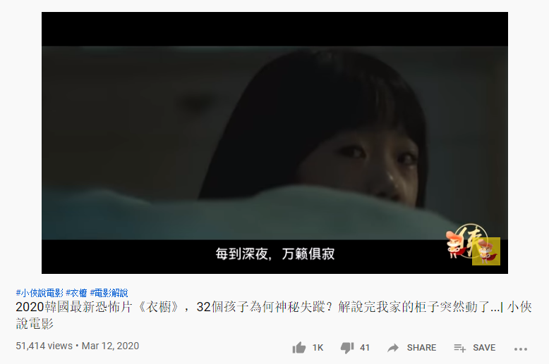
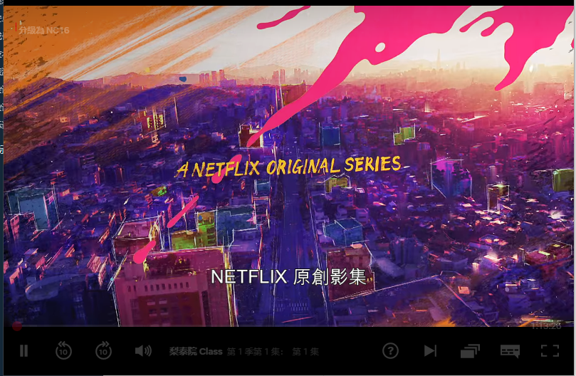
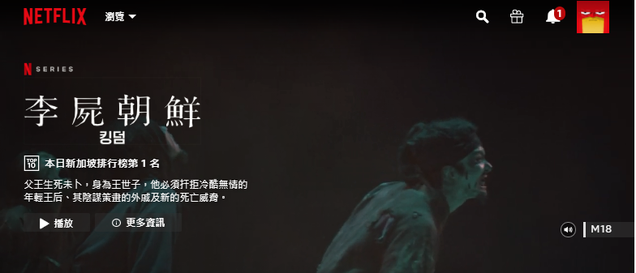
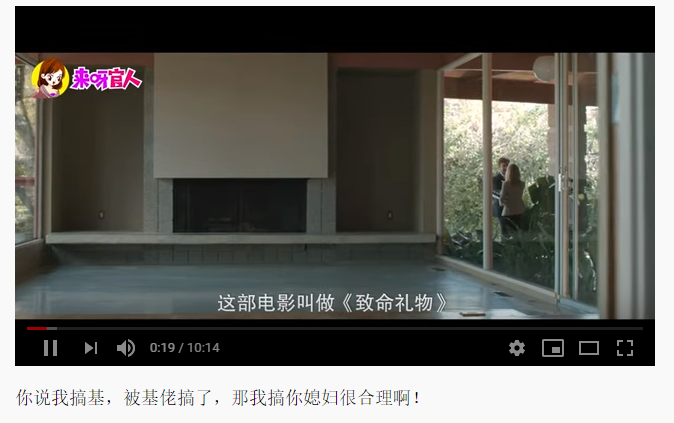
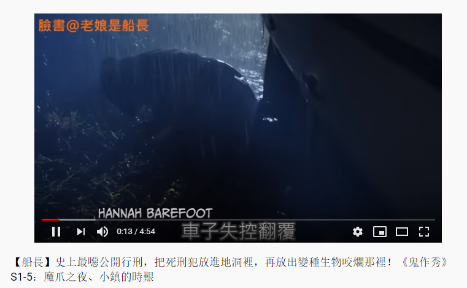
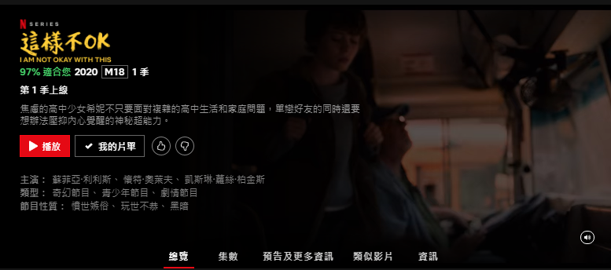
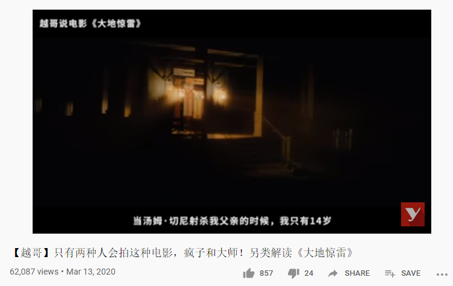
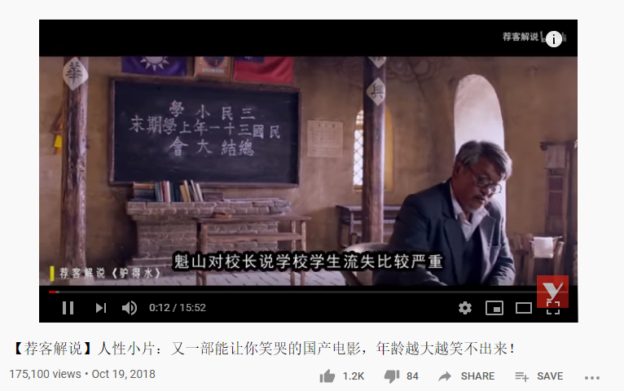
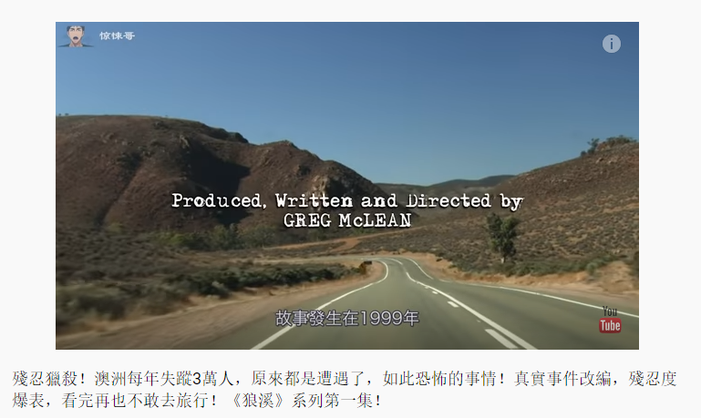

### 17.衣橱

《衣櫥》評分不高，原因是後半段有些垮掉，但前半段氛圍還行，河正宇演技沒發揮出來（也不知道以後有沒有機會了）。故事講述自從妻子過世後，男主和女兒搬到鄉下。某天，女兒竟突然在衣櫥前消失得無影無蹤……
***
### 16.爱的迫降

网飞剧

***
### 15.梨泰院

网飞剧
***
### 14.李尸朝鲜/(中国大陆名：王国)

网飞剧，《王国》（韩语：킹덤，英语：Kingdom），是一部2019年由《隧道》导演金成勋与《Signal》编剧金银姬联手打造的韩国电视剧[2][3]。为Netflix的第一部韩国原创影集[4]，在2019年1月25日首播[5][6][7][8]。本剧改编自作家金银姬与梁庆一的网络漫画《神的国度》，为僵尸题材的架空古装剧[1][9]。
本剧获得许多正面的评价，第2季于2020年3月13日播出。
在新加坡，港台等地，翻译名为：**李尸朝鲜**
***
### 13.下女

***
### 12.来看我把

### 11.第八日的蝉

***
### 10.每天回家都会看到老婆在装死

这个日本女孩绝了！！女星荣仓奈奈与演员安田显在2018年春季上映的电影《每天回家都看到妻子在装死》中首度搭档演夫妇，上演异色喜剧。

### 9.致命礼物

***
### 8.诊所惊魂

***
### 7.鬼作秀

***
### 6.汉尼拔

***

### 5.沙漠之花

《沙漠之花》是雪瑞·霍尔曼执导的剧情片，制片于英国，由莉亚·科贝德、莎莉·霍金斯等主演。《沙漠之花》根据索马里黑人模特华莉丝·迪里的自传畅销书改编。讲述了华莉丝从索马里沙漠中走出到成为世界顶级名模的故事，于2009年在英国上映。

***
### 4.这样不OK

网飞剧

## 3.大地惊雷

《大地惊雷》是由派拉蒙影业公司出品，由伊桑·科恩、乔尔·科恩联合执导，杰夫·布里吉斯、海莉·
***
## 2.驴得水

***
## 1.狼溪

