速读摘要

他同当年一起打工的方小薇，合开了一家餐厅。就连何乐儿在家中发的自拍照，他都能看出桌上有一个手机充电器，型号不是她自己的。所有的事情加在一起，让何乐儿心烦意乱。因为放不下，也因为希望父亲有生之年能看到她结婚，当胡启源来取玩具时，她选择了示弱，然后就有了胡启源求婚的事。剧集并没有采取常规的线性叙事，它的每一集都有一个关键词，以主题曲为界限，曲前为过去，曲后为现在。

原文约 2467  字  | 图片 49 张 | 建议阅读 5 分钟 | [评价反馈](https://static.app.yinxiang.com/embedded-web/clipper/#/Evaluating?d=2020-04-05&nu=9622ac58-d6d9-4736-815c-0f4db96c4adf&fr=myyxbj&ud=58b471&v=2&sig=EEF18C448DD8754BD42C5C1B924B9432)

##  豆瓣8.8，港剧里程碑，必看

原创 有部电影 [有部电影]()**
前段时间，咱们聊过一部被称为“港版《想见你》”的《二月二十九》，其清新唯美的画风和独特的叙事结构，让很多人看到了港剧不一样的打开方式。

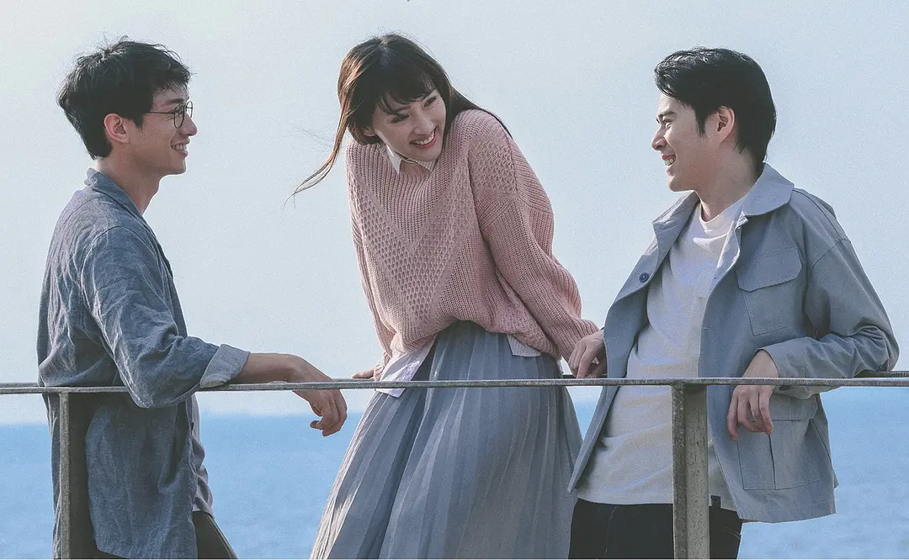

最近，又有一部豆瓣开分9.0的新剧，刷新了人们对港剧的认知——**《叹息桥》。**

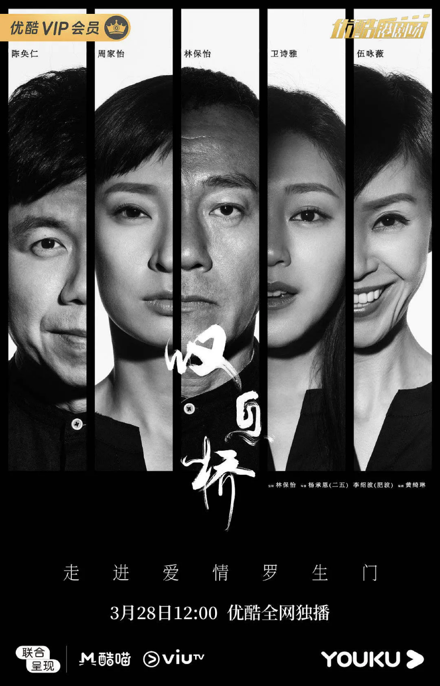

这部剧的主创团队，在2016年时就曾打造过一部港式文艺短剧《玛嘉烈与大卫 绿豆》。

该剧性冷淡风的色调、强迫症般的构图和温和细腻的情感，让人留下很深的印象。

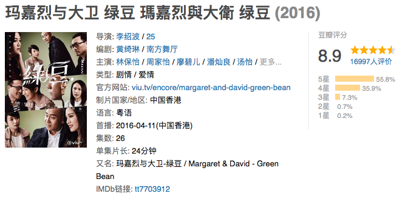

而今天这部《叹息桥》，则在拍摄手法、剧本打磨以及叙事结构上，实现了港剧的又一次突破。

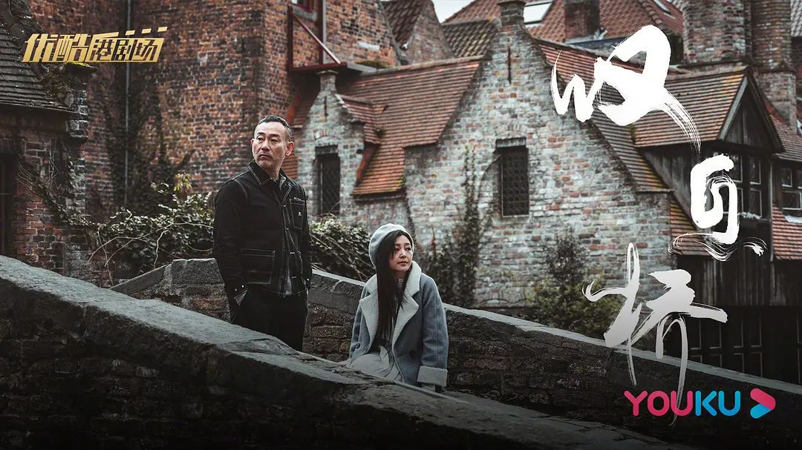

与《玛嘉烈与大卫 绿豆》类似，本剧探讨的仍然是爱情主题。

但它的故事让人细思极恐，成人世界的复杂性，在这里表现出不动声色的可怕。

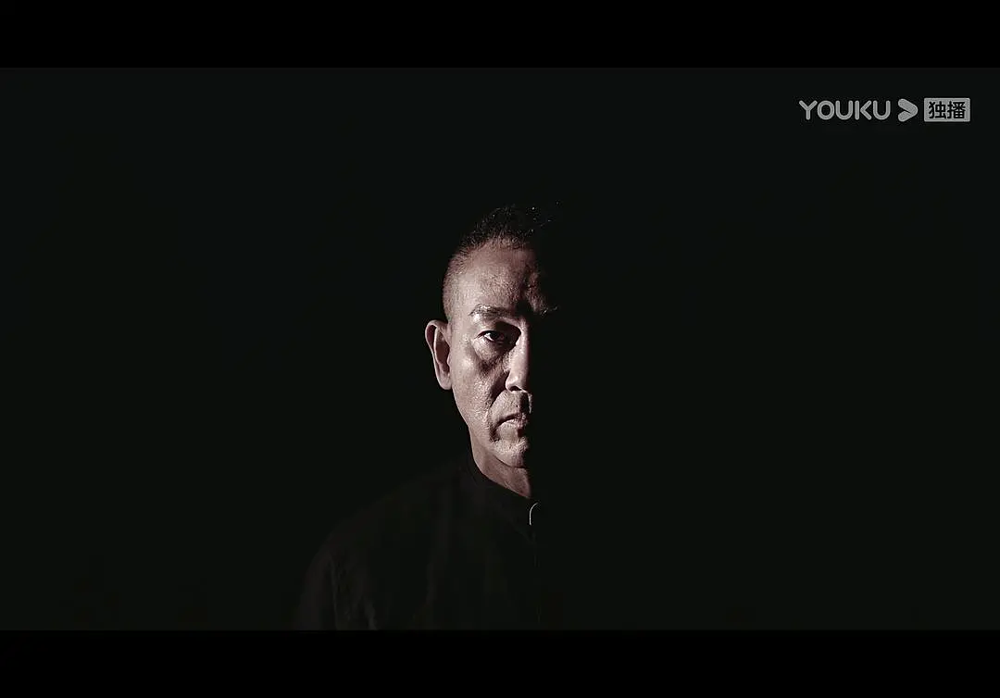

剧中男主是林保怡饰演的李子勇，他出身贫穷，年轻时拼命打工，也曾经以作画行骗。

如今，他同当年一起打工的方小薇，合开了一家餐厅。

他的女朋友，还是当年打工的茶餐厅老板的女儿，何乐儿。

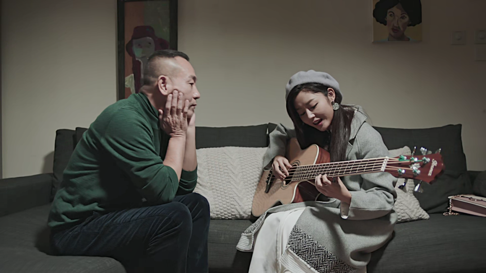

心思细腻的他，拥有非常敏锐的观察力。

但他从未发现，其实方小薇喜欢自己，两人还一直以“知己”的身份相处。

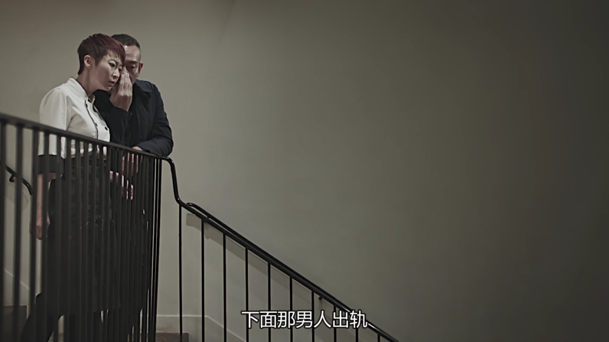

最近，通过一些蛛丝马迹，他发觉何乐儿有事情在瞒着自己。

比如两人有次一起看电影，明明何乐儿中途睡着，却能够将剧情讲得明明白白，这说明她已经看过了一次。

比如何乐儿有次打电话，声称电话那头是朋友，但语气却十分像家人。

此外，就连何乐儿在家中发的自拍照，他都能看出桌上有一个手机充电器，型号不是她自己的。

而且一直以来，男主从没有去过何乐儿的家。

所以他决定登门探望，以打消自己的猜忌。结果万万没有想到，为他开门的是一个名叫胡启源的男人。

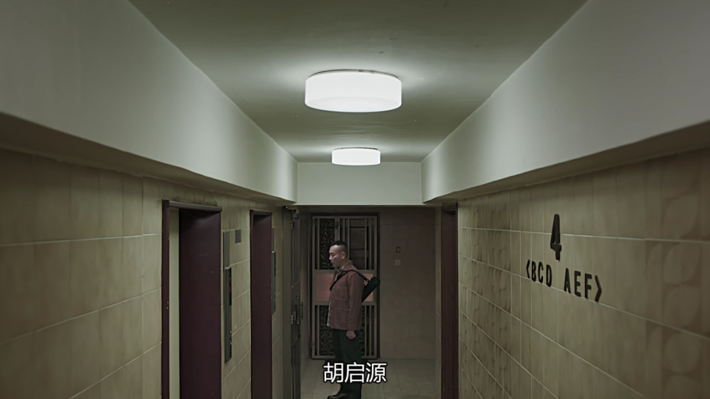

按照一般的逻辑，男主这是被绿了，可事实却并非如此。

在第二集中，剧集的叙事视角，从男主转移到了胡启源的身上。

原来，胡启源从小就被强势母亲管得死死的，工作要查收，恋爱要干涉，就连与同学聚会晚回家几分钟这种小事，都会遭到母亲咆哮般的怒斥。

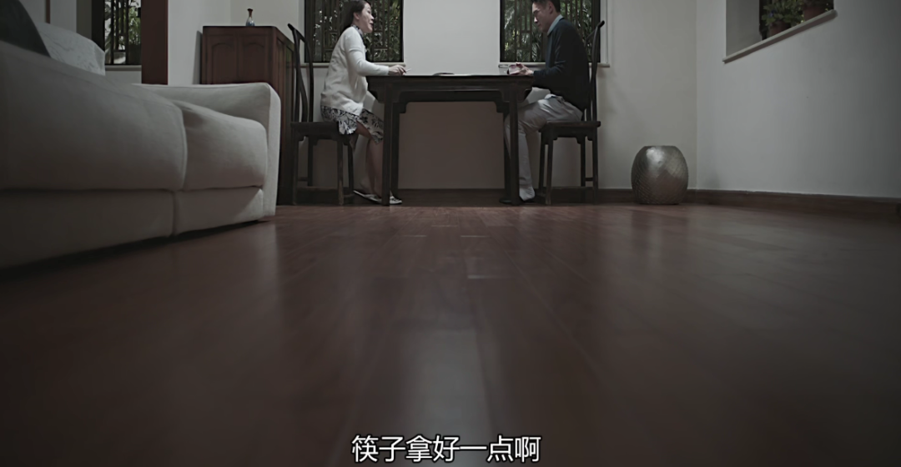

在这种情况下，他成为了什么事都要向母亲汇报的妈宝男，性格也变得唯唯诺诺，本来可能拥有的爱情也都被扼杀在摇篮之中。

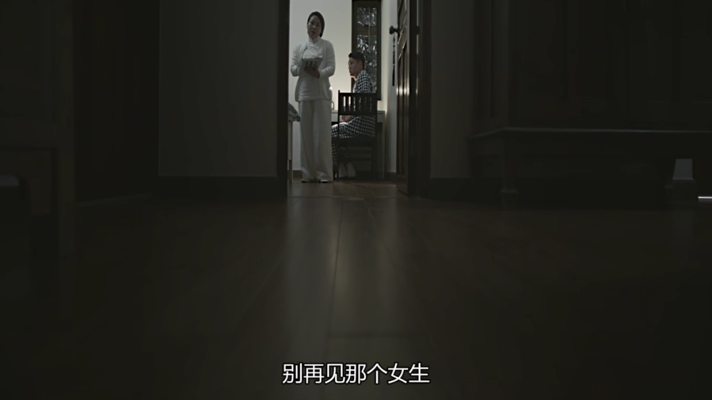

直到年纪渐大，在一场聚会上遇到了何乐儿，他才正式展开了一段恋情。

在母亲同意之后，他还搬去与何乐儿同居，并买好了求婚戒指。

.jpg)

知道何乐儿喜欢吃辣，他就亲手做咖喱；眼瞅着情人节到了，不懂情趣的他，也想到带着何乐儿去看电影。

.jpg)

但悲剧的是，他发现何乐儿偷偷和男主好上了，还发现她总是莫名其妙地和他爆发争吵。

于是，在火上心头之际，他决定从何乐儿家中搬走。

.jpg)

但他上门拿走玩具的时候，看到了何乐儿难过无助的样子，一下子心又软了下来，不仅当场决定留下，还找出了戒指当即求婚。

也就在这时，男主找上了门。

.jpg)

所以，在胡启源的视角里，男主才是第三者。

但有趣的是，就当你以为这就是真相时，在第三集中，剧集的视角又换到了何乐儿身上。

这样一来，整个故事又变得不一样了。

.jpg)

原来，她最初决定和胡启源一起，是因为朋友们都说，胡启源这样的老实人会很安全、很稳定。

.jpg)
.jpg)

谁曾想，胡启源不仅是个妈宝男，而且你不推他就不动。

两人交往了八年后，他始终没有求婚，使得何乐儿非常焦虑。

.jpg)
.jpg)

有天一大早，胡启源把她叫醒，说是要给她个惊喜。

她原以为他这是要求婚，结果却是一顿咖喱饭，而且这个咖喱饭她已经连续被要求吃了一星期了。

起因也并非是她喜欢吃辣，而是胡启源听朋友说咖喱安全，港女喜欢……

.jpg)

就这样，所有的事情加在一起，让何乐儿心烦意乱。

当男主出现后，她顺理成章地动起了重新选择的念头。

.jpg)
.jpg)

后来，父亲因病住院的当晚，无助的她打了一圈电话，结果只有胡启源接了。

于是，因为放不下，也因为希望父亲有生之年能看到她结婚，当胡启源来取玩具时，她选择了示弱，然后就有了胡启源求婚的事。

.jpg)

可以看出，同样一件事，在不同人的视角里面，整个面貌是完全不同的。

不过不管怎样，如果三人相见后，事情可以就此了断，一切似乎也就恢复平静了。

.jpg)

但让人意外的是，在后续的剧情里，一个自称是“胡启源儿子”的人出现了。

就这样，胡启源早年和女上司发生关系的事，也随之浮出水面。

.jpg)

那么，胡启源与何乐儿、女上司之间还将上演什么故事？男主和何乐儿、方小薇的情感又将走向何方？

关于这些，我就不剧透了，小伙伴们可以到剧集中寻找答案。

.jpg)

总的来说，这是一部有着革新意义的港剧，完全能够颠覆你对港剧的认知。

首先，本剧的摄影、构图、转场、色调都经过精心设计，随便一张截图都可以拿来当壁纸。

.jpg)

在剧中，对称构图、三分之一构图、低机位摄影、对称俯拍、快速摇镜等等比比皆是，给人一种电影级别的精致感。

.jpg)

而且，这些设计并非是装腔作势的炫技，它们本身构成了叙事的一部分，对人物的情绪和处境实现了精准呈现。

.jpg)

比如，为表现母亲对胡启源的强烈控制，在他因与同学聚会被叫回家的那场戏中，两人明明坐在桌子对面，但镜头却用窗子间的墙壁将他们隔开，给人以极强的距离感和禁锢感。

.jpg)

再比如，当胡启源与何乐儿吵架之后，剧集并没有呈现他多么郁闷和愤愤不平，而是将摄影机置于上方，让顶棚占据整个画面的二分之一，愁云密布的压抑与逼仄不言自明。

.jpg)

同时，本剧的叙事编排也别具一格，颇为大胆。

剧集并没有采取常规的线性叙事，它的每一集都有一个关键词，以主题曲为界限，曲前为过去，曲后为现在。

曲前的部分，主要以一种上帝视角来呈现人物过去的状态和经历，乍一看会因为片段化的内容和不同于现在的演员面孔，让人一头雾水。

.jpg)

而现在的部分，剧集则通过不同人物的视角对事情进行还原，同时利用黑白影像的方式，来实现对人物回忆与当下的区分。

.jpg)

这就使得观众只有通过连续的观看，对剧集中的信息进行识别和重组，才能得以窥见事物的全貌，领略到剧集的精妙所在。

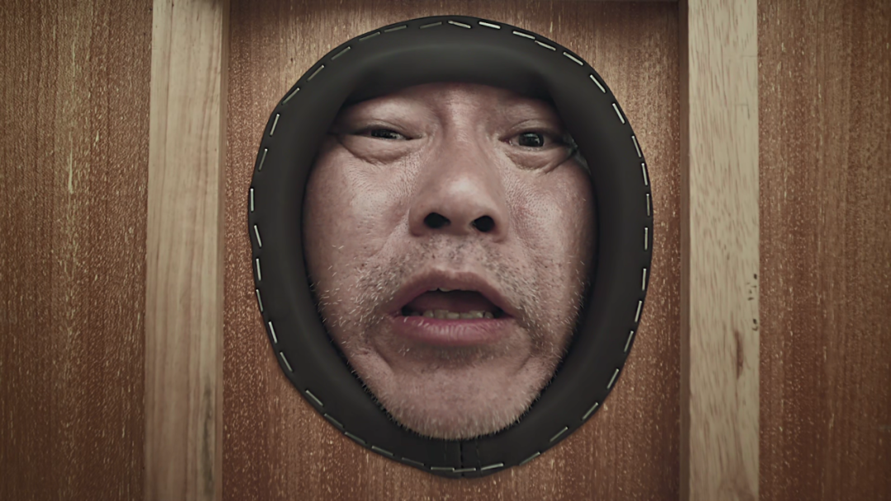

举个例子，何乐儿对男主的最初好感，是源于她记忆中，自己年轻时在比利时钱包丢失，受到了为他画画的男主的帮助。

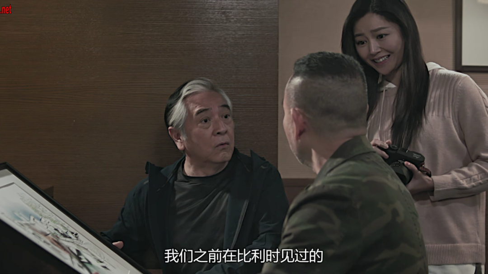

但是，结合第一集主题曲前的部分，我们才得知，实际上，男主正是利用画画这个手段，趁着何乐儿端坐时，让同伙去偷了她的钱。

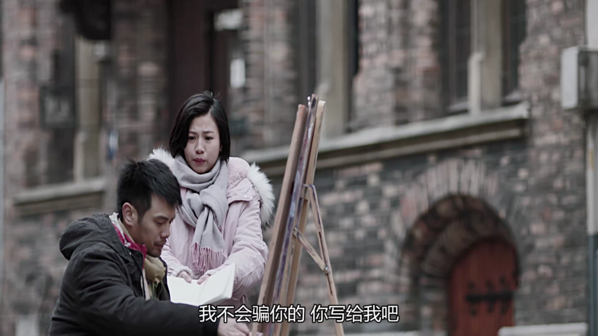

剧集用这种叙事方式，传递出一种“罗生门”的意味，既揭示了记忆的模糊与重构，同时也表达出**“人们往往只相信自己愿意相信的”。**

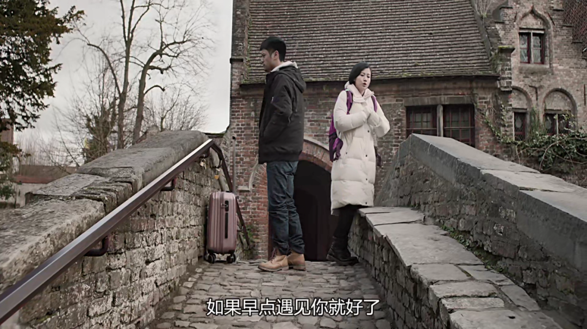

值得一提的是，剧集还频频打破第四面墙，让演员对着镜头说话，不仅表现出人物行为与内心之间的迥异，还形成了官方吐槽、同观众互动的效果，进一步增强了趣味性。

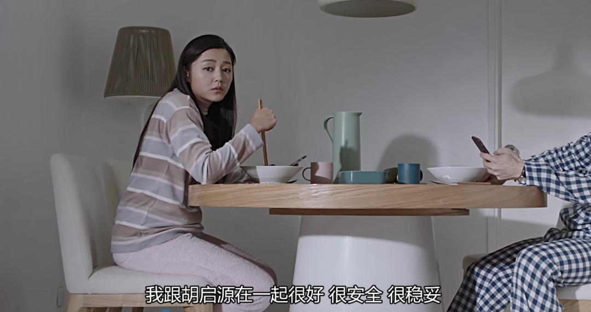

其实，回过头来看，尽管这些创新尝试让人颇为惊喜，但这部《叹息桥》最打动人心的，还是它对都市人情感问题的探讨。

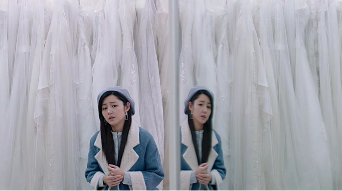

**何为“叹息桥”？**

这个典故出自何乐儿的父亲给她讲过无数次的一个故事，说的是一个公主为爱人建了一座幸福桥，结果爱人打仗回来变了心，于是一怒之下杀了爱人，改名叹息桥。

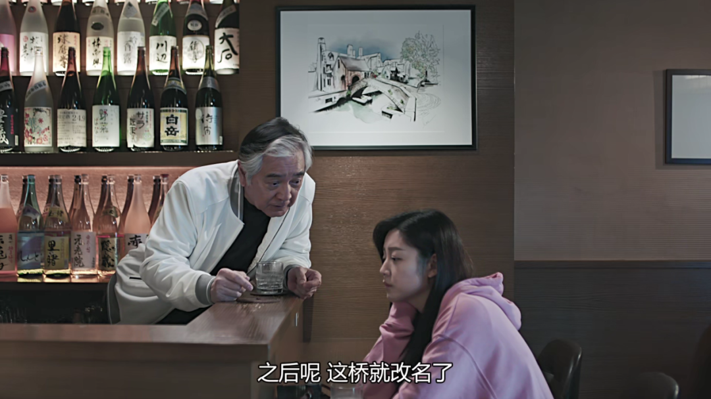

诚然，在情感的世界里，很难有十全十美。

**责任和承诺，会令人感觉失去自由，渴望逃避；谎言和隐瞒，又会带来相互的猜忌与裂痕；冷漠和失常，甚至会酿成彼此伤害的大祸。**

**但与此同时，幸福与叹息，又往往只在一念之间。如何去学会爱与被爱，不让自己走向极端，或许才是这部剧真正带给我们的思考。**

也许是国内最认真的电影自媒体
长按扫描二维码关注

**请点个在看**

在看