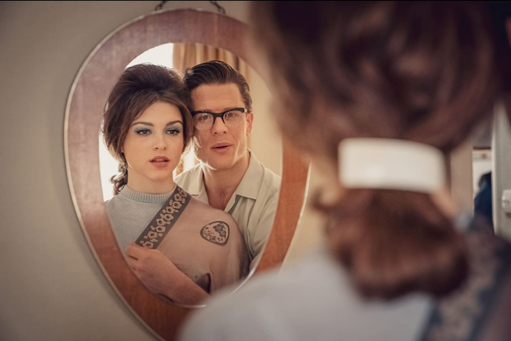
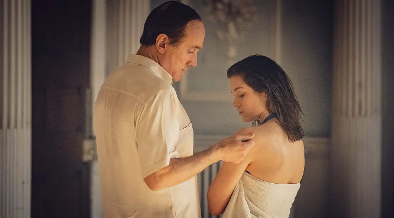
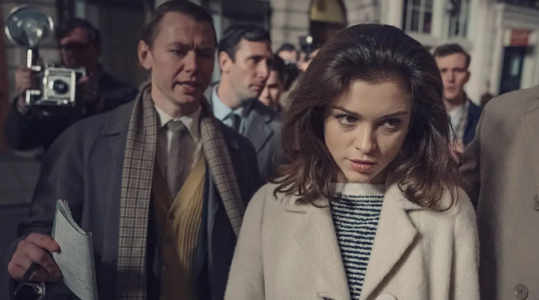
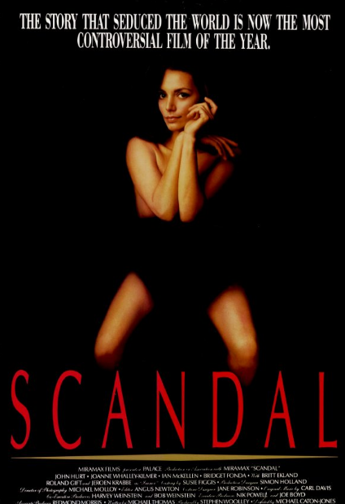
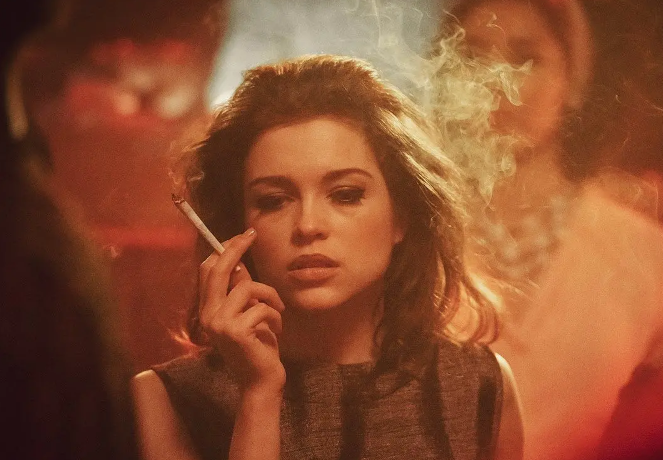
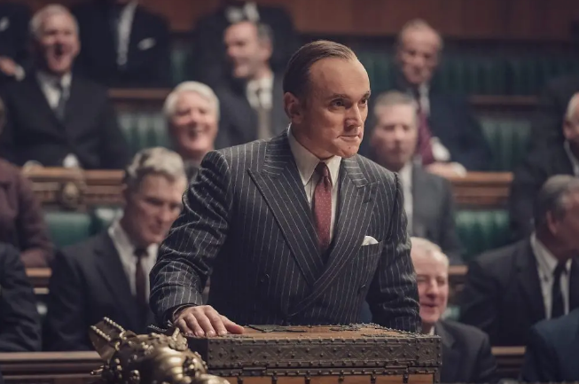

速读摘要

照片中的模特名叫克莉丝汀·基勒，曾一度登上英国的报纸头条，但她出名的原因并非是惊艳的颜值和身材，而是因她而起的桃色事件直接搅动了英国政局，导致陆军大臣和首相相继辞职。在克莉丝汀交往的对象中，有一个重量级人物——保守党内阁成员、陆军大臣约翰·普罗富莫。陷入绝境的沃德，开始不断给相熟的权贵写信，表示会把自己知道的一切丑闻全盘托出，但没想到保守党随后选择了断臂求生，让普罗富莫公开婚外情并主动辞职，彻底坐实了沃德拉皮条的罪名。

原文约 2431  字  | 图片 33 张 | 建议阅读 5 分钟 | [评价反馈](https://static.app.yinxiang.com/embedded-web/clipper/#/Evaluating?d=2020-04-02&nu=1254c5b7-7c53-4b96-91b0-c922bfe99dbb&fr=myyxbj&ud=58b471&v=2&sig=1832DC96A472B025DBFC15BF6CFCB235)

##  英国史上最大性丑闻，21岁美艳嫩模竟成罪魁祸首？

原创 有部电影 [有部电影]()
今天开篇先给大家看一张照片——

.jpg)

这张照片拍摄于1960年代，因为模特大胆的造型轰动一时，甚至带火了那把椅子的销量，之后的几十年里，这个拍照姿势还在被各界效仿。

照片中的模特名叫克莉丝汀·基勒，曾一度登上英国的报纸头条，但她出名的原因并非是惊艳的颜值和身材，而是因她而起的桃色事件直接搅动了英国政局，导致陆军大臣和首相相继辞职。

.jpg)

今天要聊的这部英剧，就围绕这个英国史上最大的性丑闻“普罗富莫事件”改编而来——**《克莉丝汀·基勒的审判》。**

.jpg)

克莉丝汀·基勒出身贫寒，因为父母离异、继父家暴，她十几岁就来到伦敦闯荡，私生活任性随意，同时与几个男性交往，经常引得前任和现任为其大打出手。

17岁时，她成为夜总会的脱衣舞娘，在那里认识了一个彻底改变她人生的人——斯蒂芬·沃德。

沃德是一名才华横溢的医生，医治的病人非富即贵，与英国政界往来密切。

在他的引荐下，克莉丝汀进入上流阶层社交圈，成为一名交际花，开始光鲜亮丽地出入各种趴体。

天真的克莉丝汀立刻被上流社会的奢华吸引，对沃德言听计从，成为了他拉拢权贵的工具。

.jpg)

在克莉丝汀交往的对象中，有一个重量级人物——保守党内阁成员、陆军大臣约翰·普罗富莫。两人于1961年相识，维持了几个月的婚外情。

本以为能神不知鬼不觉，但没想到，这段丑闻在1962年随着一起枪击案被爆了出来。

当时，克莉丝汀陷于一段混乱的感情关系中，一个被她甩掉的前男友气急败坏地找上门，激动地朝她开枪射击，直接惊动了警察。

.jpg)

有报社嗅到了花边新闻的气息，给克莉丝汀开出高价，让她透露更多的内幕，想夸大“白人女孩和黑人交往”的狗血戏码。

但克莉丝汀不想让小报这么写自己，在此之前，她已经因为接连交了几任黑人男友，遭到妈妈的辱骂。

为此，她想出了一个转移记者注意力的法子：爆料自己曾跟英国陆军大臣普罗富莫、苏联间谍伊万诺夫同时交往。

她称伊万诺夫曾试图从普罗富莫那里套取情报，想知道北约的导弹部署计划。

.jpg)

当时正值冷战的高峰，这个爆料毫无疑问将引发极大的震动。

由于克莉丝汀能拿出普罗富莫给她的亲笔情书，记者就全盘相信了她的话，有关间谍猜测的报道也相继见报。

.jpg)

克莉丝汀瞬间成为媒体追逐的“名人”，她请了一个经纪人，利用这个桃色新闻大做文章，开头提到的那张椅子照，就是在这期间拍摄的。

.jpg)

在经纪人的指点下，她甚至无故玩起失踪，任由报纸肆意猜测桃色事件的内幕。

乍看之下，克莉丝汀就是一个借丑闻炒作的“心机婊”，从一开始就是冲钱财而来。但与其说她别有用心，不如说她是年少无知，遭人利用。

她时刻肆意彰显自己的青春资本，但却不知道，自己的资本早就成为别人利用的工具。

沃德医生利用她向政界拉皮条，从中牟取金钱地位；经纪人声称为她铺好了成名之路，但实际上是为了五五开的高额报酬，甚至擅自替她签下拍裸照的合同；

.jpg)

朋友声称关心她，但转头就站到记者镜头前，伺机寻找让自己爆红的机会；就连克莉丝汀的妈妈也是如此，一边羞辱她不知检点，一边拼命向她要钱。

.jpg)

可以说，即便已经成年，克莉丝汀依旧不懂人心险恶，虚荣、天真到愚蠢的地步。

她更是没有想到，自己的行为最终引发了英国政局的大震动。

在报纸铺天盖地的猜测过后，普罗富莫选择向议会撒谎，发表个人声明称与克莉丝汀只是见过几次面的普通朋友，两人之间没有任何不当交往关系。

.jpg)

但与他敌对的工党并不死心，打算从“拉皮条”的沃德医生入手，继续挖掘扳倒普罗富莫及其保守党的黑料。

为了让沃德医生闭嘴，保守党打算把所有的锅都甩给沃德。这个消息传出后，原先跟沃德交往密切的权贵也纷纷与他断绝往来，沃德顿时没了靠山。

.jpg)

之后，警察抓准了克莉丝汀想要尽快摆脱前男友纠缠的心理，一边帮她将男友们以各种罪名打入大牢，一边逼迫她在假证词上签字，承认自己在沃德的挟持下卖淫。

.jpg)

陷入绝境的沃德，开始不断给相熟的权贵写信，表示会把自己知道的一切丑闻全盘托出，但没想到保守党随后选择了断臂求生，让普罗富莫公开婚外情并主动辞职，彻底坐实了沃德拉皮条的罪名。

.jpg)

整个“普罗富莫事件”，最终以首相被迫辞职而告终。因为这个桃色绯闻，保守党在次年的大选中一败涂地。

而这场风波过去后，克莉丝汀再次回到了一无所有的状态，唯一甩不掉的就是“红颜祸水”的标签。

.jpg)

她做不了模特或演员，也没有别的本事，最终沦落到靠救济金生活。尽管之后有过两次短暂的婚姻，生下两个儿子，但晚年依旧孤独终老，于2017年去世。

在这部剧之前，“普罗富莫事件”已经有过影视化改编。

1989年的电影《丑闻》，就大致按照时间顺序，复刻了整个事件的始末。

高分英剧《王冠》，也是以这个事件来承接第二、三季的剧情。

但与以上作品不同的是，这部《克莉丝汀·基勒的审判》并没有采用纪实的拍摄手法还原历史，而是打乱了时间线，重点围绕主角克莉丝汀，以一种主观的视角去重新展现。

如果你之前不了解英国的这段政界丑闻，很可能会因为前两集的剧情，认定女主就是红颜祸水、蛇蝎美人。

她迷恋黑皮肤的异性，经常在街上公开与男友秀恩爱；她在感情里任性妄为，会当着前男友的面与现任调情；她甚至会为了解决与前任的官司纠纷，去勾引知名律师……

在给报社爆料期间，克莉丝汀贪婪的金钱欲望，更是暴露无疑。

.jpg)

但实际上，本剧在刻画克莉丝汀混乱生活的同时，也给出了另一个角度的反思。

在剧中，当身为婚外情受害者的普罗富莫妻子看到媒体对克莉丝汀的报道时，忍不住反问——**我们是不是永远都要把男人的软弱和邪恶归罪于女人？**

.jpg)

比如克莉丝汀的经纪人曾经向她发问——你不觉得自己是那种性感而危险的女人吗？

.jpg)

再比如普罗富莫辞职后，一直强调“我做的事，我的朋友都在做，只不过恰巧被抓住罢了”……

.jpg)

所以从这个角度看，这部剧其实与METOO运动形成了微妙的呼应。尽管这个英国史上最大的桃色丑闻已经过去半个多世纪，但“美丽”和“性感”在这个时代，依旧被随意冠以危险的标签。

值得注意的是，**“普罗富莫事件”至今被人们讨论最多的，并不是克莉丝汀这个“红颜祸水”，而是随着桃色风波暴露出来的阶层分化，和上流阶层的腐朽与无能。**

因为公众不会相信，一个21岁的年轻女孩，真的能够凭借一己之力，撼动英国的政局。

实际上，普罗富莫辞职后，英国官方曾发布有关丑闻的调查报告。但报告里认定普罗富莫不存在泄露国家机密的行为，把所有责任都推给了品行不端的沃德。

.jpg)

至于那些在趴体上玩弄年轻女孩的政界官员，自然也没有一个得到应有的惩罚，而有关沃德的调查卷宗，要到2046年才能被解禁。

**可以说，在权力运作的背后，有人成为了唯一的替罪羊。正如克莉丝汀的一生也被定格在了不堪的一页，尽管事实与真相并非一致。**
**
**
**就像剧集最后所说的——“克莉丝汀·基勒这个名字，一边是故事，一边是我本人。但两边并不一样”。**

也许是国内最认真的电影自媒体
长按扫描二维码关注

**请点个在看**

在看