## 一夫多妻、邪教洗脑、富豪失踪，你敢跟我说是真人真事？

原创 有部电影 有部电影 *前天*

最近有部高能纪录片，不仅在一夜之间引爆社交平台，还让居家隔离的美国人民追到入戏太深、欲罢不能。

  

截至目前，这部片子的网络讨论量已超过180万人次，包括金·卡戴珊、奥兰多·布鲁姆、卡迪比等明星大咖也纷纷为其打call。

  

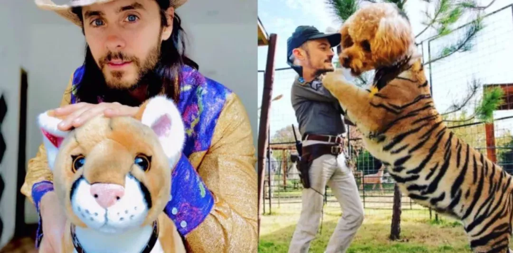

  

所以咱们今天就一块来看看这部奇片——**《养虎为患》**（又名《养虎为患：谋杀，混乱和疯狂》。

  

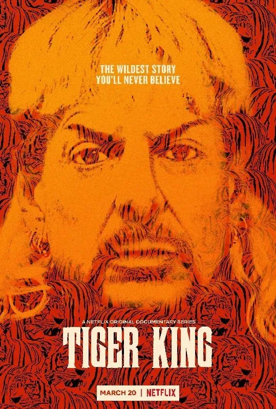

  

光看海报和片名，就知道它并非动物保护题材这么简单。

  

就像彪悍的战斗民族把熊当宠物养，不作死就不会死的美国人，也会把豢养大型猫科动物视为权势和地位的象征。

  

这部纪录片就是围绕几个私人动物园主、野生大猫爱好者和动保人士展开的爱恨情仇。

  

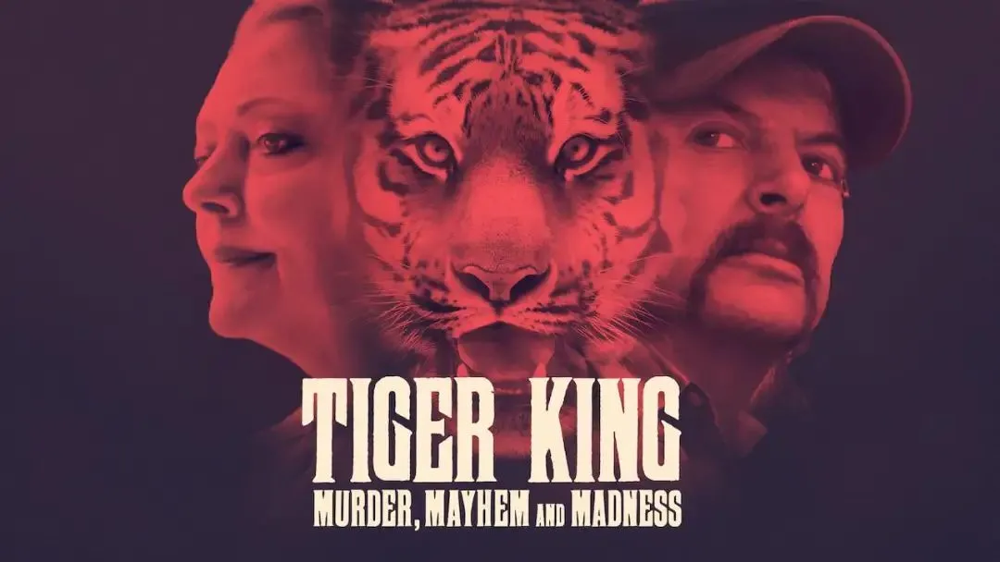

  

片中的男主乔野生，人如其名，野在骨子里。

  

他在俄克拉荷马州经营一家私人动物园，这里光是老虎就超过187只，号称全球最大的野生大猫基地。

  

  

他手底下聚集了一帮劳改犯、瘾君子、无业游民，个个都是逞凶斗狠、不合群的异类，但却作为驯兽师、饲养员和管理者，相亲相爱地生活在一起。

  

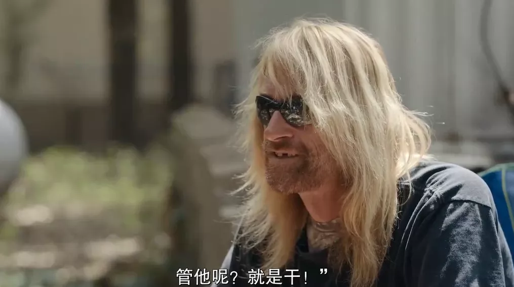

  

除了管理动物园，乔野生还会时不时带着大猫幼崽，去学校、商场或室外广场巡回演出。

  

在当地积累了一定知名度后，他又开始向娱乐圈进军。

  

乔野生不仅发表过原创音乐专辑，拍过真人秀，还拥有一档自制视频节目，每晚六点向全球网友直播。

  

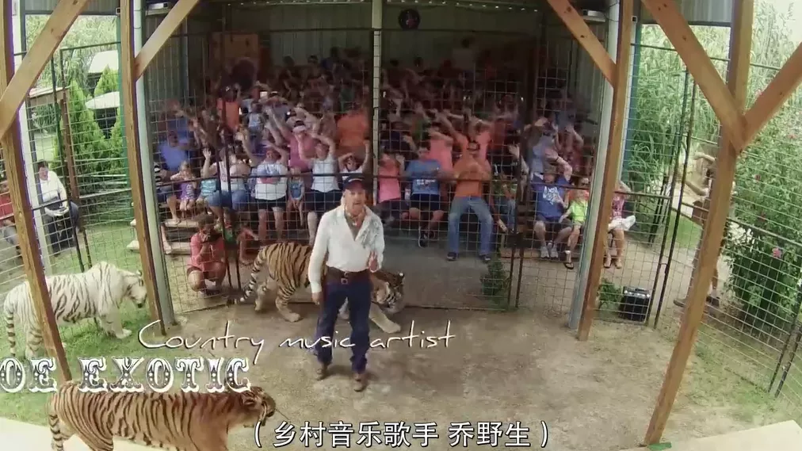

  

事业上搞得风生水起之余，他的感情史同样刷新三观。

  

乔野生13岁出柜，在求爱路上无所畏惧，不仅一口气掰弯了两个铁骨铮铮的直男，还打包娶进门坐享齐人之福。

  

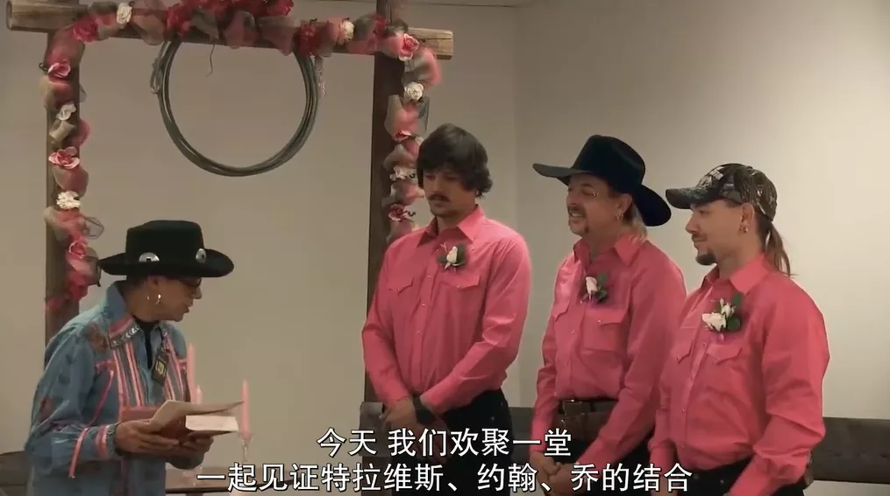

  

更惊人的是，两个老公约翰和特拉维斯都爱他（的钱）爱得要死，一个在腹部纹上“乔野生个人所有”，一个才19岁就托付终身。

  

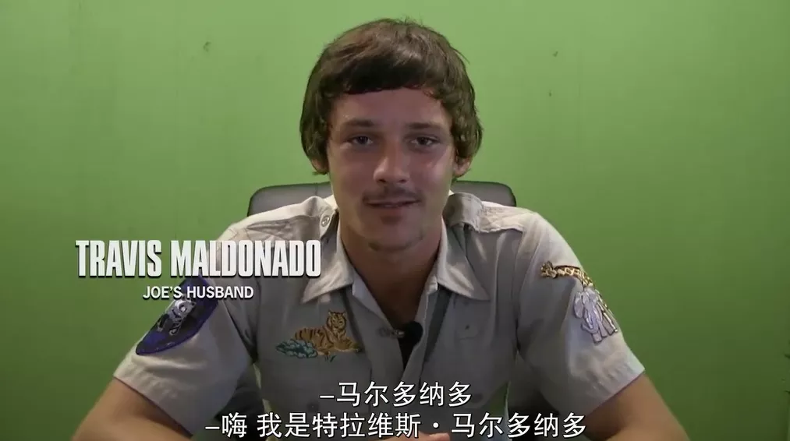

  

不过，这段惊世骇俗的三人婚姻，在多年后迎来了反转——

  

约翰和女秘书安珀搞在了一起，决定奉子成婚，离开了乔野生；

  

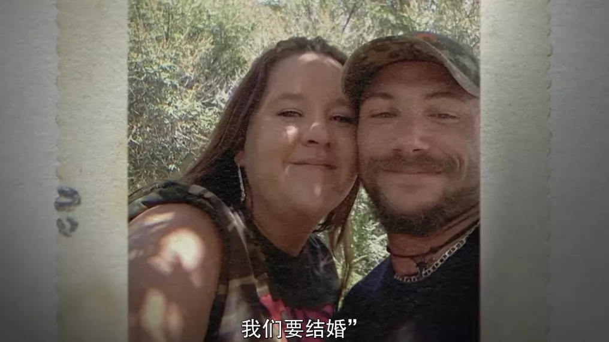

  

特拉维斯则沉迷嗑药，每天不是招猫逗狗就是醉生梦死，终于在某次嗑嗨后，一不小心爆头自尽……

  

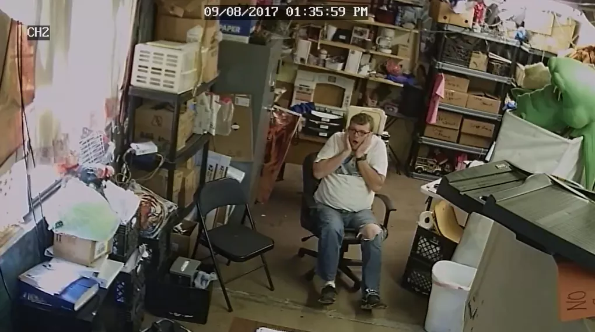

  

可想而知，乔野生痛不欲生地低迷了一阵子。

  

但两个月后，他不仅成功续弦，还出其不意地向政坛发起冲击，先后参与了美国总统、俄克拉荷马州长的竞选。

  

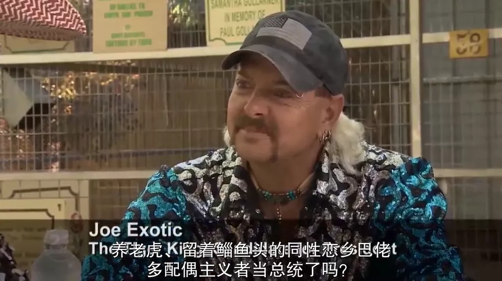

  

不过，开动物园娱乐大众的乔野生，毕竟不是当政治家的料。

  

他成功搞出了一堆不忍直视的话题，但竞选以失败告终。

  

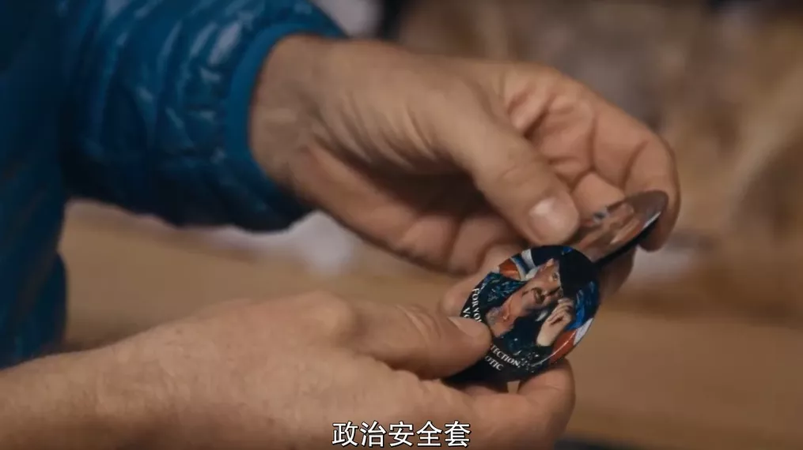

在亲民活动上分发印有他头像的安全套

  

看到这里，估计不少人以为他的狗血故事差不多到头了——**毕竟总统都给他竞选过了，还能闹出什么大动静？**

  

事实上，真正让人WTF的情节还在后面。

  

说完乔野生的经历，咱们再来看看本片女主，美国动保界的圣母白莲花——卡罗·巴斯金。

  

  

这位姐爱大猫爱到走哪都是一身豹纹，号称自己活着的每一天，都是为了将豢养大猫解救出来。

  

而且，她赶上了社交自媒体的红利期，依靠大猫视频和兜售动保观点，一举成为了千万粉丝级的大V。

  

  

但既然营销的是动保先锋人设，卡罗势必要树立靶子当对手——比如，像乔野生这样的野生动物园主。

  

还比如，一个名叫马里奥的大毒枭。

  

这人号称是《疤面煞星》主角的原型，如今用贩毒赚来的赃款，开设了一家私人野生动物园。

  

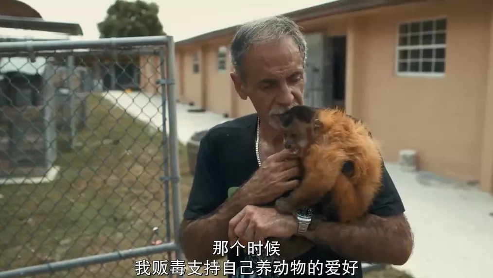

  

但说实在的，满口仁义道德、保护动物的卡罗，跟以上这些人也没有本质区别。

  

她号称拥有“全球最大的认证收容所”，致力于照顾大型猫科动物，但这地方同样靠售票参观来盈利，跟乔野生的动物园毫无二致。

  

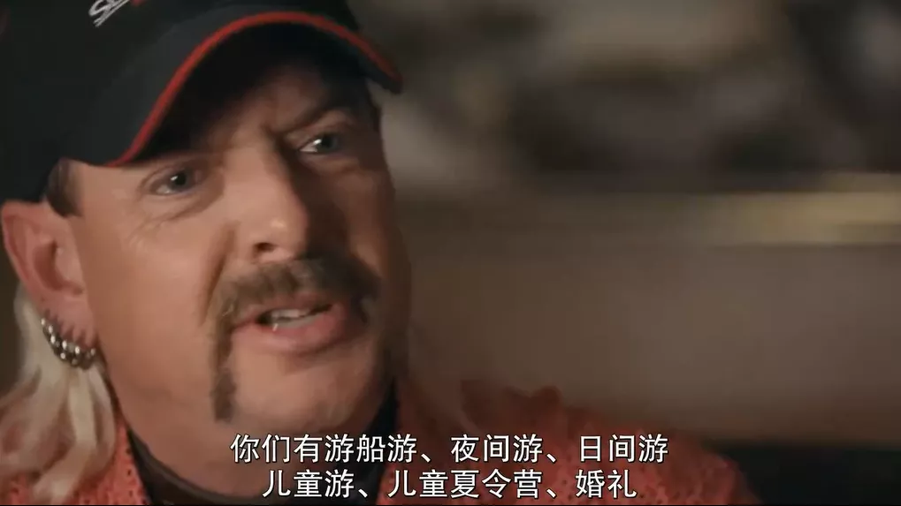

  

唯一的区别是，卡罗靠着网络话语权到处洗脑，牢牢占据了道德制高点。

  

她一边号召粉丝来收容所当志愿者，美其名曰“接受动保主义改造”；一边又将炮火对准乔野生，动不动就爆料说他虐待动物。

  

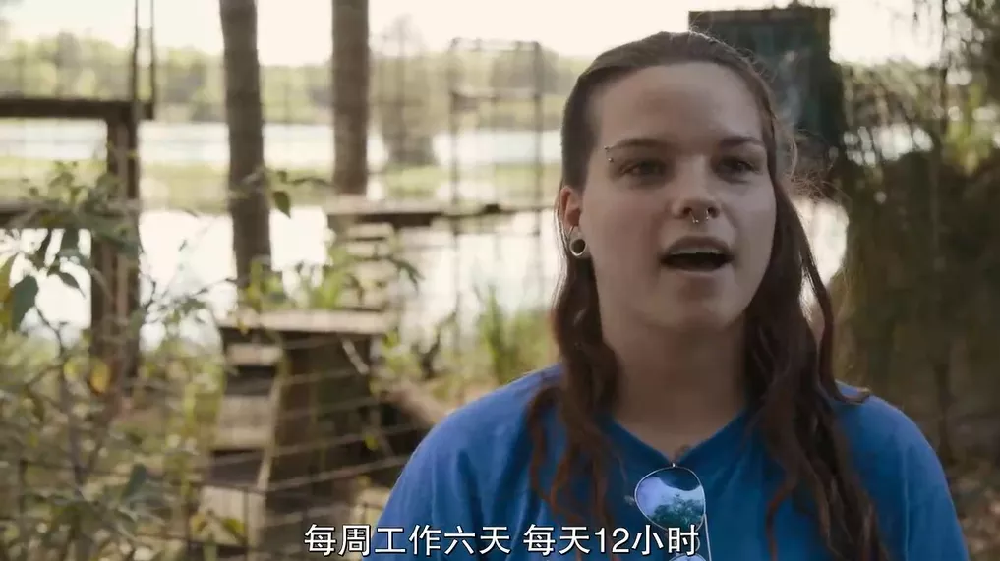

  

另外，相比乔野生惊世骇俗的情感经历，卡罗的情史也同样非常人所能想象。

  

她自称从小在拖车房里长大，14岁时被三个男人持刀强奸，17岁嫁给家暴狂，一度过着担惊受怕的生活。

  

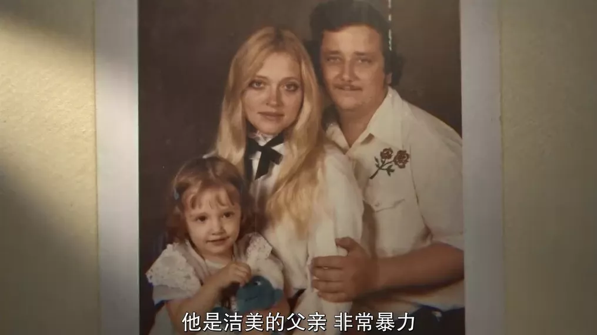

  

直到某次被家暴后露宿街头，遇见了42岁的富商唐，成功上位取代了人家的原配。

  

但没过几年，这段婚姻也走到了尽头。

  

就在俩人着手离婚之际，唐忽然人间蒸发，没有留下任何蛛丝马迹。

  

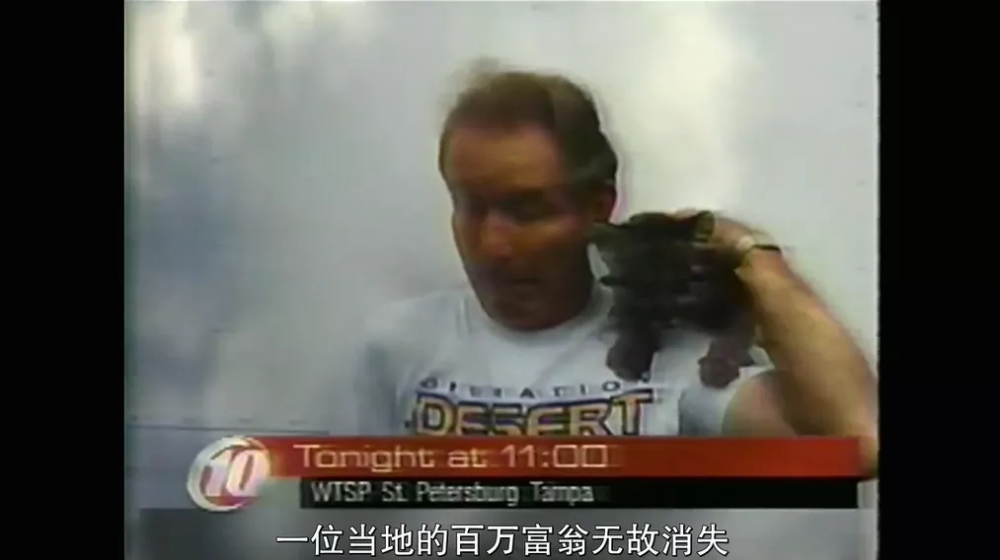

  

尽管卡罗坚称丈夫要去哥斯达黎加，很可能在旅程中意外坠海，坊间却盛传她谋害亲夫侵吞遗产，还有人说她把尸体喂了老虎……

  

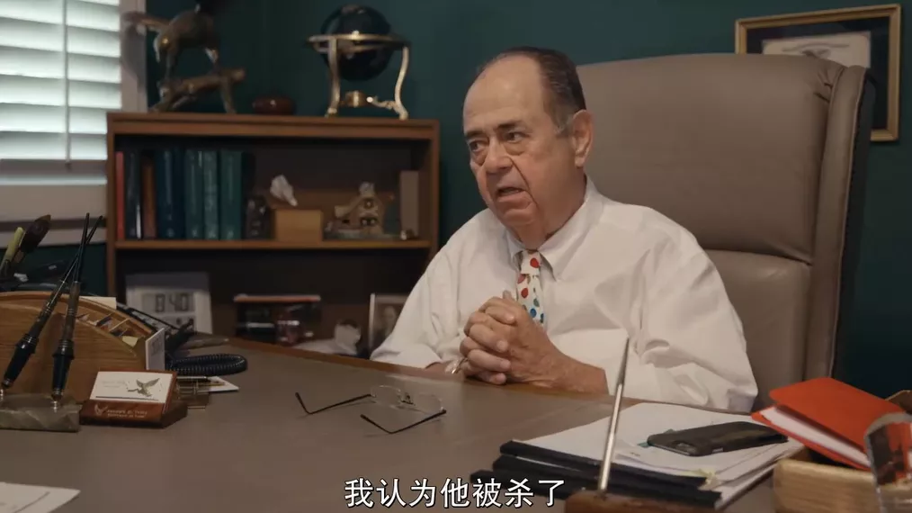

  

不过传闻归传闻，由于警方找不到定罪证据，这起轰动一时的富商失踪案，最终不了了之。

  

而唯一的大赢家卡罗，则在继承大笔遗产后，很快又找到了新丈夫。

  

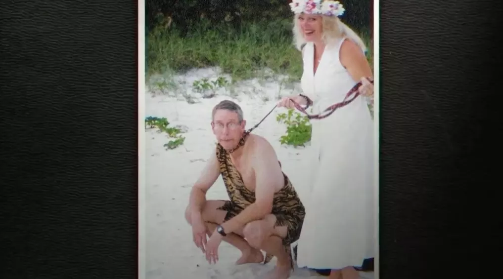

  

除了卡罗之外，乔野生的职业生涯里，还有位名叫安特尔的人生导师。

  

虽然同样是开动物园养大猫，但他走的却是“高端灵修路线”，自封“博伽梵博士”，意思是“上帝的朋友”。

  

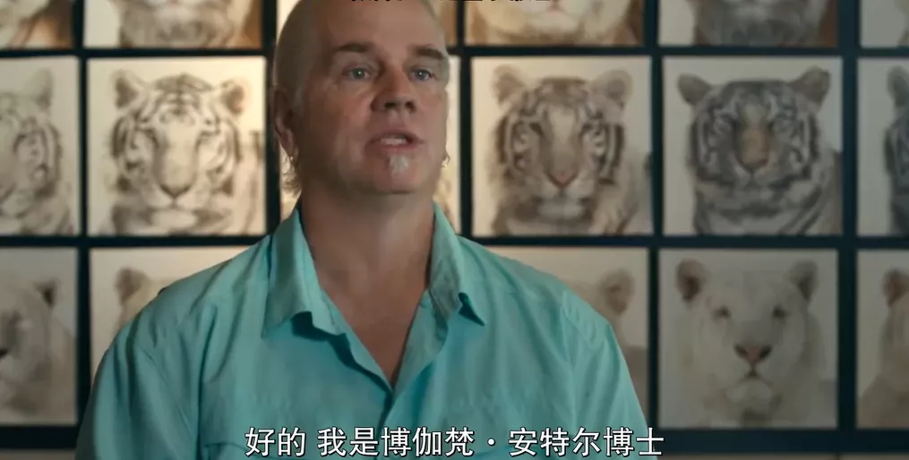

  

由于早年间经常带着动物上节目，还参与过好莱坞大片的拍摄，安特尔的人脉资源遍布上流社会，让其他动物园主难以望其项背。

  

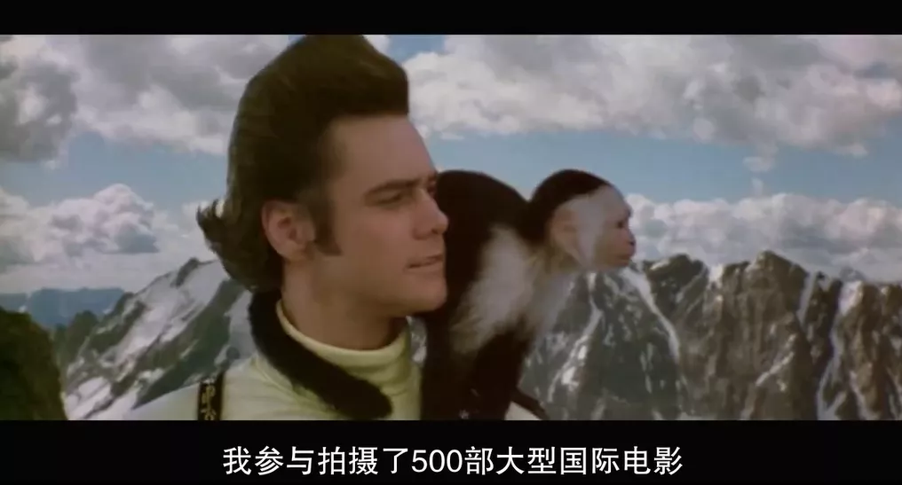

  

在这种名气+灵修噱头的吸引下，安特尔招揽来一大波无知少女，并用邪教洗脑的方式搞个人崇拜。

  

这些少女不仅要穿上性感豹纹装，充当驯兽师，还会为了获得“灵性能量”向安特尔投怀送抱，成为他的三妻四妾。

  

  

换句话说，相比乔野生的爱情买卖，安特尔就是大搞邪教，直接把动物园当后宫……

  

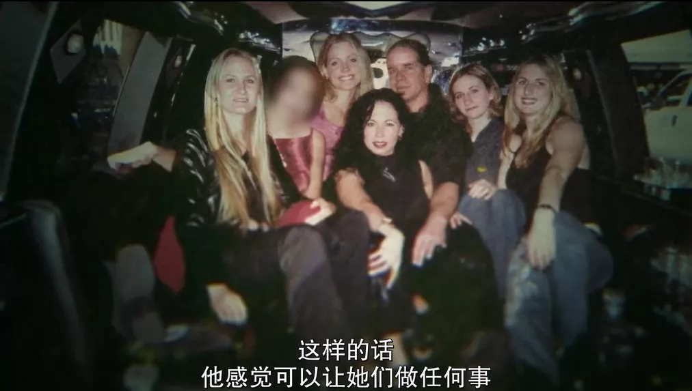

  

整体看下来，这部《养虎为患》虽然篇幅不长，剧情却一集比一集高能，汇集了邪教、一夫多妻、毒品买卖、富豪失踪案、野生动物走私、买凶杀人、总统选举等多种元素。

  

套用网友的话讲，**连三流编剧都不敢这么编，谁能想到这些事居然都真实发生过……**

  

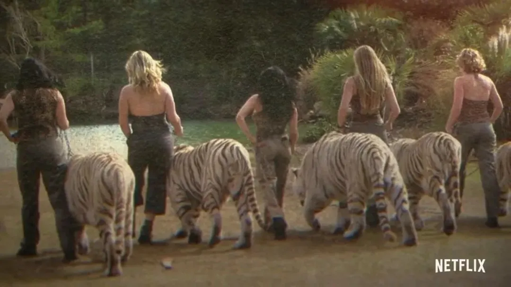

  

但就像荒诞片总藏着对社会的讽刺，这部纪录片的故事越是狗血离奇，越能勾起观众对现实的反思。

  

片中的主角们看似在各自的圈子里称王称霸，但其实他们不是疯子就是骗子，甚至可能是杀人犯。搁现实里，很容易让人想到那些信口雌黄的政客、唯利是图的奸商、假公济私的慈善家……

  

甚至还有网友直接将男女主比作特朗普和希拉里，称他们是“真小人VS伪君子”，给俩人换了脸。

  

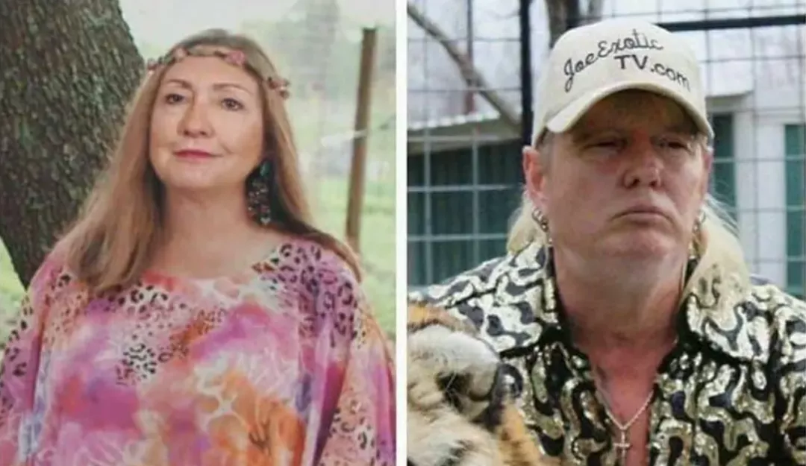

  

而乔野生与卡罗多年以来的撕X套路，在咱们国内观众看来，也会觉得分外眼熟。

  

卡罗这边为了铲除异己，又是到处举报施压，斩断乔野生的财路；又是煽动舆论，批斗他虐待动物、压榨劳动力，甚至发律师函告他侵权。

  

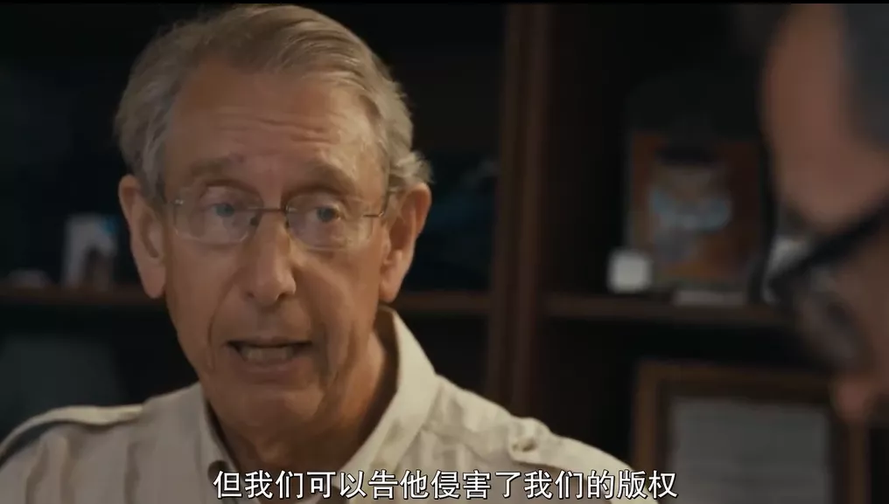

  

而乔野生的报复手段，也是花招百出，对卡罗极尽羞辱。

  

除了用充气娃娃和P图丑化嘲讽对方，乔野生还在节目里大爆卡罗的黑料，甚至将她杀夫喂老虎的杜撰故事，写成歌曲循环播放。

  

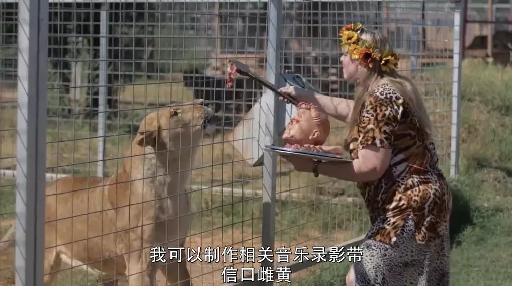

  

其实说白了，两人无非都是为了各自利益，靠无下限抹黑对手博出位。

  

但没想到，这场同行之间的口水战不断升级，不仅将更多相关人拖下水，还将乔野生推上了审判台——在故事的最后，他因“买凶杀人”等罪名，被判刑22年。

  

至于这其间又发生了什么神转折，我就不多作剧透了，好奇的小伙伴可以去剧中找答案。

  

  

在纪录片的结尾，有两行极具讽刺性的字幕——

  

**“在美国，有五千到一万头老虎被蓄养，而全球野生老虎只剩下不到四千只。”**

  

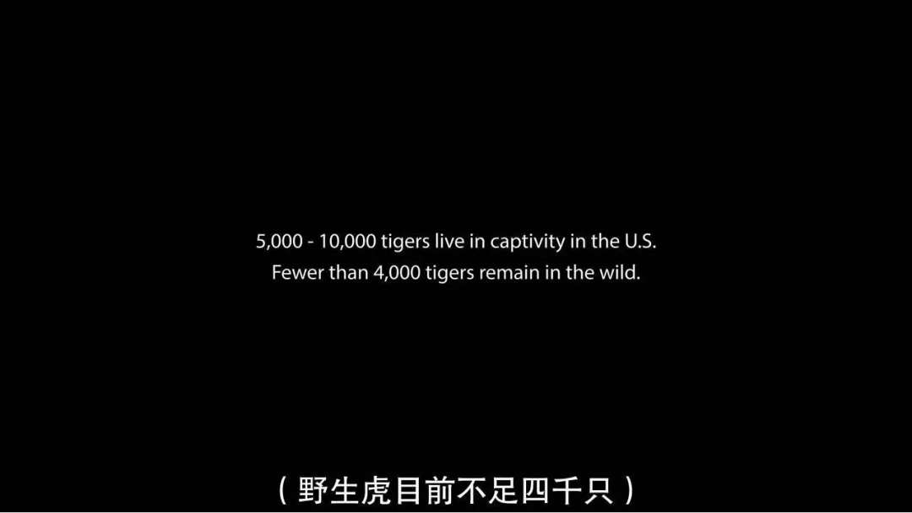

  

可见，无论是片中的私人动物园主、养虎家庭，还是所谓的动保人士，都是打着热爱、保护的名义谋求私利罢了。

  

**有谁真正在乎动物呢？**

  

在乔的动物园中，动物是赤裸裸的商品，年幼时被训练表演节目，长大了就被转手卖出，榨干最后的价值；

  

**有钱人以饲养大猫来彰显地位，满足自己的虚荣和攀比心；至于像卡罗那样的网红，表面上占领道德高点，私底下却把动物保护当成一门生意来做。**

  

**相比片中那些咬伤路人的老虎，这些不为人知的“行业竞争”背后暴露出的人性阴谋，才是真正令人细思极恐之处。**

  

也许是国内最认真的电影自媒体

长按扫描二维码关注 

微信扫一扫  
关注该公众号