速读摘要

剧中的女主池善宇，是一位白手起家的医学专家。女主通过她才发现，原来丈夫每天都是五点准时离开公司，而不是像他说的七点下班、七点半到家。就连女主最信任的闺蜜，也在时不时向男主通风报信。这就是为什么一开始女主跟踪丈夫，后者却仿佛总能提前得到风声的原因。但让人欣慰的是，它没有停留在戏剧化的撕X情节，而是通过女性角色的相互扶持，对韩国当下的社会现实留有关照和反思。

原文约 2403  字  | 图片 40 张 | 建议阅读 5 分钟 | [评价反馈](https://static.app.yinxiang.com/embedded-web/clipper/#/Evaluating?d=2020-04-04&nu=540e40b1-e64d-49c5-bd9c-55457a6dcd14&fr=myyxbj&ud=58b471&v=2&sig=2CA1AB7C0E81E03A75BF571A710377B2)

##  出轨捉奸+飙车19禁，中年熟女可不是好惹的

原创 有部电影 [有部电影]()**
不知道大家发现没有，最近的韩剧开始越来越多地关注中年女性。

比如之前我们聊过的《鬣狗式生存》《请输入搜索词：WWW》，还有火爆一时的《迷雾》等剧，都展现了身处不同行业的中年职场女性的魅力。

而今天要来聊的这部新剧，则围绕中年女性的婚姻战场展开。

凭借一波三折的剧情，它一开播就在豆瓣拿到了8.7的高分——**《夫妻的世界》。**

.jpg)

剧中的女主池善宇，是一位白手起家的医学专家。

凭借出色的专业技能和强大的心理素质，她刚过四十岁就被提拔为副院长，成为当地小有名望的人物。

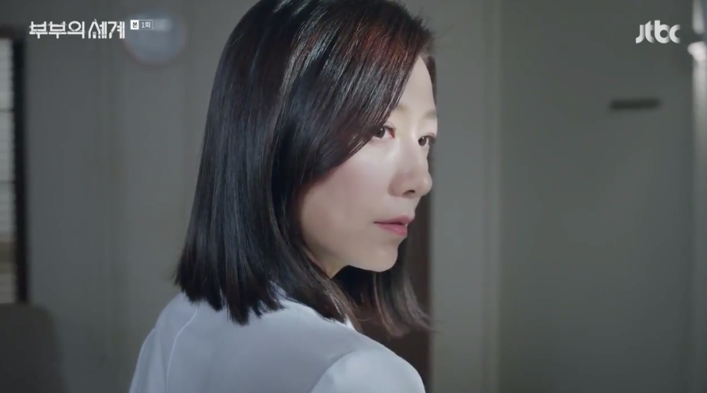

除了事业有成，女主的婚姻家庭也很让人艳羡。

丈夫李泰吾是一家电影娱乐公司的社长，不仅人长得英俊帅气，还对妻子如胶似漆，两人动不动就狂撒狗粮上演19禁。

.jpg)

儿子李俊英天资聪颖、活泼好动，是学校的棒球队主力。

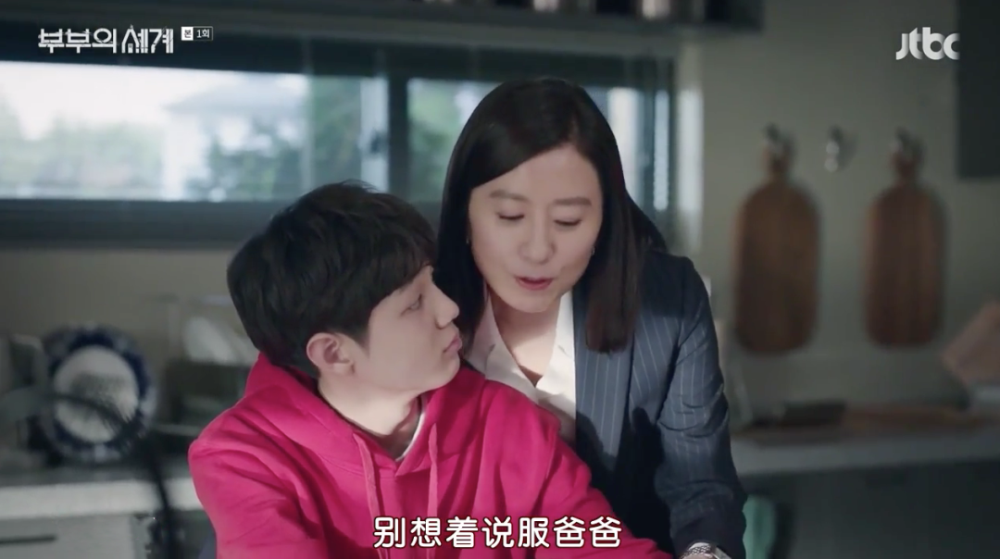

总之在外人看来，拥有完美生活的池善宇，就是妥妥的人生赢家。

但这种精雕细琢的完美，却只是一种假象。

一天，丈夫出差归来，女主从他的外套兜里，翻出了一根樱桃味唇膏。

对方辩称飞机上太干燥，自己想买润唇膏却语言不通，这才错把女式的买回来。

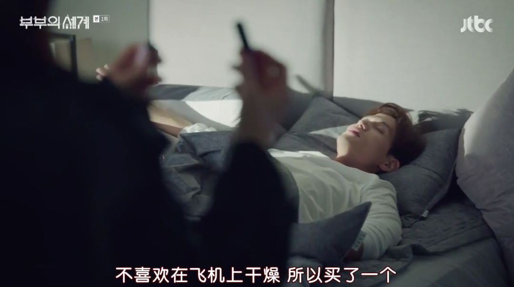

但随后女主又在他的围巾上，发现了一根红棕色波浪长发。

她顿时以女人的第六感，猜到丈夫很可能出轨了。

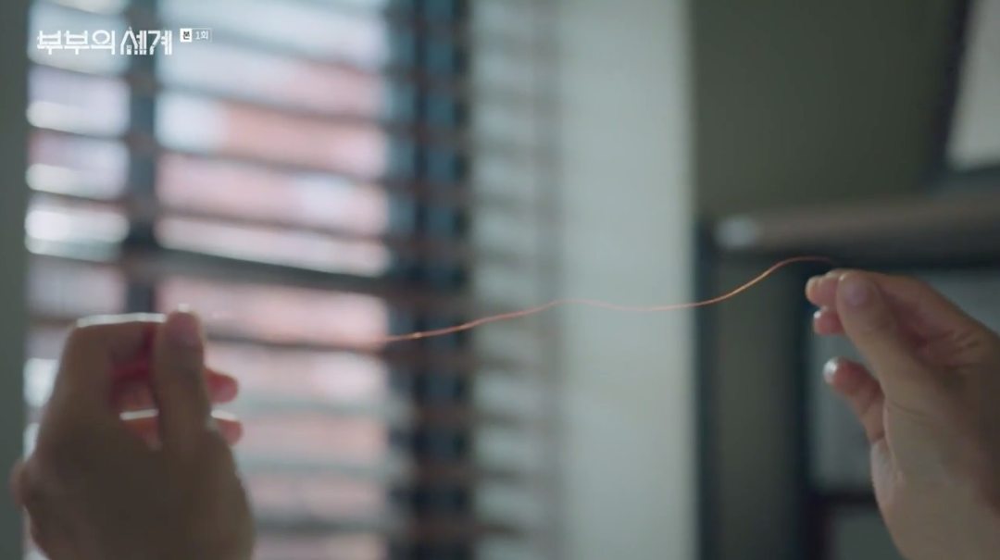

这件事就如同晴天霹雳一般，让女主措手不及地遭受重击。

她一度变得无法正常工作思考，走哪都感觉草木皆兵，一看到红棕色卷发的女人，都会怀疑是丈夫的小三。

比如电影公司新来的女秘书，离异单身、工作能力出众，还经常陪李泰吾出国出差。

女主通过她才发现，原来丈夫每天都是五点准时离开公司，而不是像他说的七点下班、七点半到家。

比如公司CFO的妻子艺琳，既是女主儿子的钢琴家教，也是她们家的朋友和邻居。

但她不仅用同款樱桃味唇膏，还常在女主面前称赞李泰吾温柔，让人想不怀疑都难。

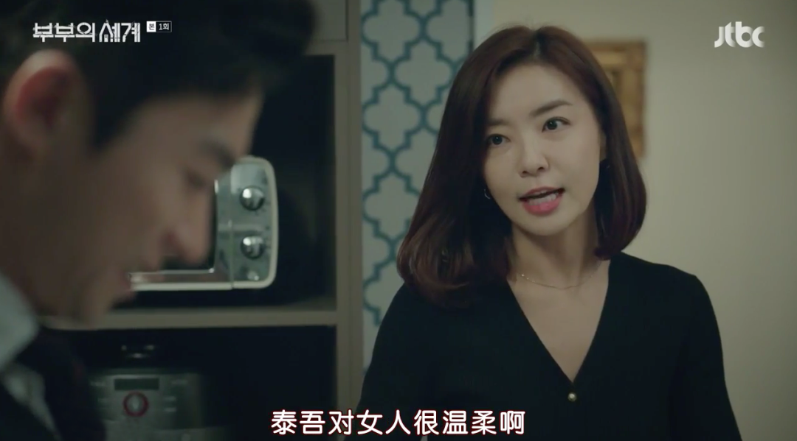

为了不再继续疑神疑鬼下去，女主决定认真调查一番。

她先是趁丈夫在浴室洗澡，拿来他的手机查看，结果手机干干净净——通讯记录里只有业务往来，相册里只有一家三口照片，连开屏密码都没设置。

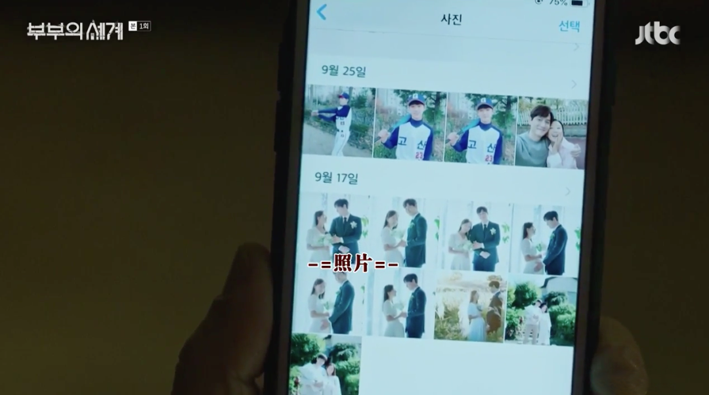

她忍不住将自己的怀疑与发现说给闺蜜听，结果对方不以为然，反倒调侃她神经敏感想太多。

但问题是，如果丈夫没有猫腻，为什么要撒谎说七点下班呢？这每天空出的俩小时，他都在干嘛？

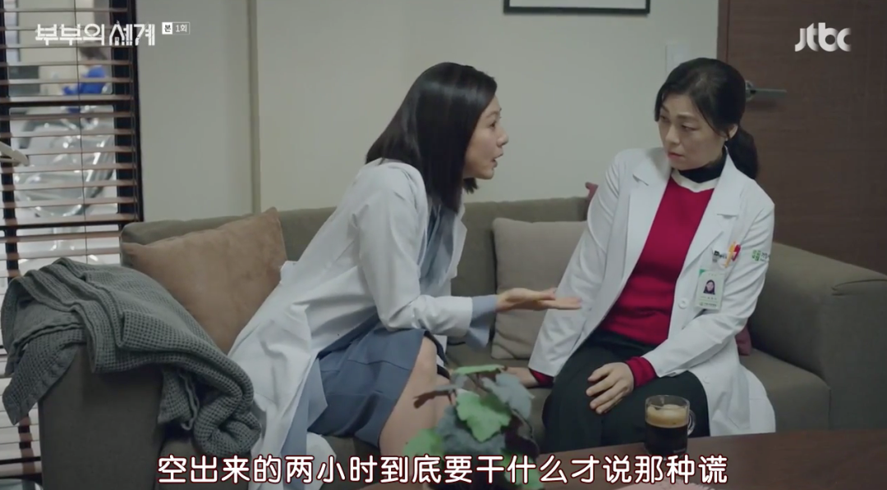

随后，百思不得其解的女主干脆提前下班，去公司门口蹲守丈夫。

但对方却仿佛早有预知一般，直接驾车去了婆婆所在的疗养院，让女主白跑一趟。

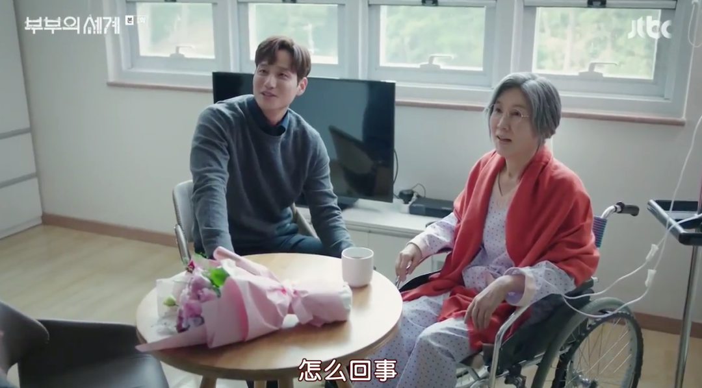

考虑到亲自跟踪容易暴露，女主又雇佣了一位女线人帮忙。

而这回终于坐实了丈夫的出轨——虽然没拍到小三的正面，但至少确认了，他每天下班后都会去找对方偷情。

.jpg)

说到现在，估计不少爱看英剧的小伙伴会觉得剧情眼熟。

没错，这部《夫妻的生活》其实是翻拍自BBC剧《福斯特医生》，第一集的剧情也基本是照搬了后者。

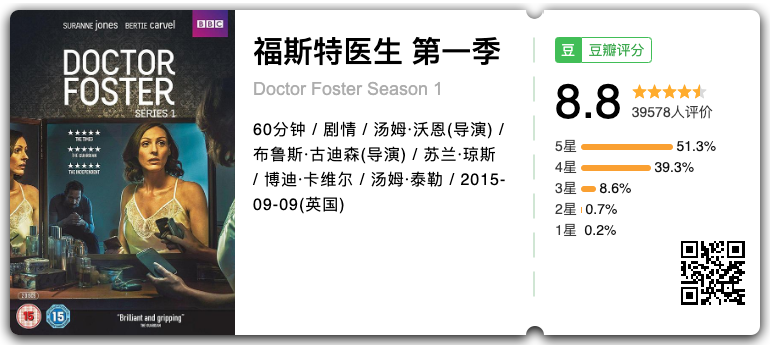

但相比原版英剧暗流涌动的氛围，这部韩剧通过紧凑的节奏、耸动的配乐，将夫妻捉奸那点事儿拍得一波三折、惊心动魄，甚至有点谍战大片的味道。

这种风格，一方面得益于导演毛完日的发挥。如果看过他执导的《迷雾》，一定会对第一集有种似曾相识的亲切感。

另一方面，饰演女主的国民级女神金喜爱也很加分。

她兼有成熟女性的优雅和知性，演技也是层次分明，女主前期的精神崩溃和后期的黑化复仇，都被她演得极具说服力。

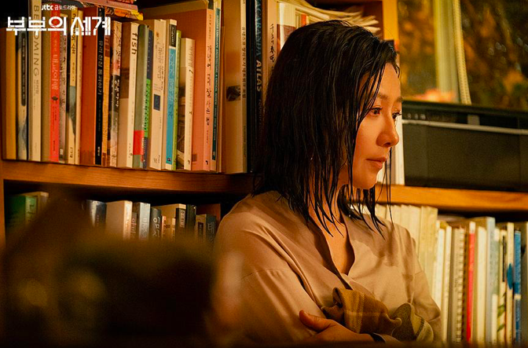

此外，虽然故事照搬了英版，但剧中围绕主角夫妻，对婚姻中的欺瞒背叛、性别地位、门第观念等问题的探讨，都拍出了韩国人自己内味儿。

比如男主李泰吾虽然是电影公司社长，但由于出身贫寒是个“凤凰男”，无论起步资金还是关系人脉，都要仰仗妻子的支持。

.jpg)

某次活动上，他想巴结当地的财阀会长，好为自己的电影项目拉赞助，但对方却根本不把他放在眼里。

好在女主是会长妻子最信赖的医生，经过她的亲自引荐，才让丈夫得到了潜在合作机会。

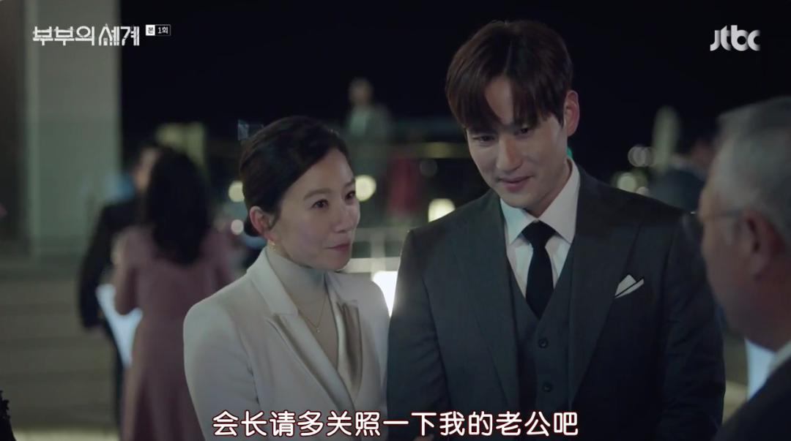

还比如男女主表面上珠联璧合，私下里其实存在很多分歧。

尤其是男主丝毫不管家务，生活习惯又不拘小节，每天乱丢袜子或把家里弄脏，经常让妻子不满。

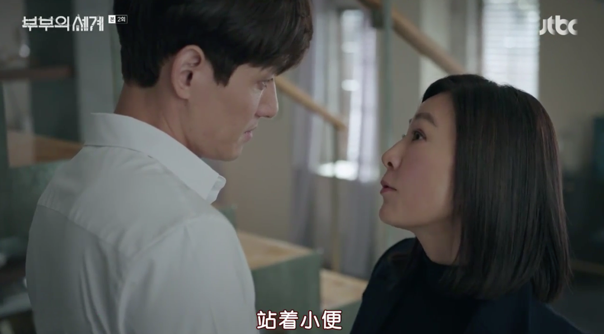

值得一提的是，由于《福斯特医生》珠玉在前，如果韩版只是原封不动地翻拍，那么看过原版的观众就等于被剧透。

所以《夫妻的生活》也没卖关子，直接在第一集结尾就揭开了小三的身份。

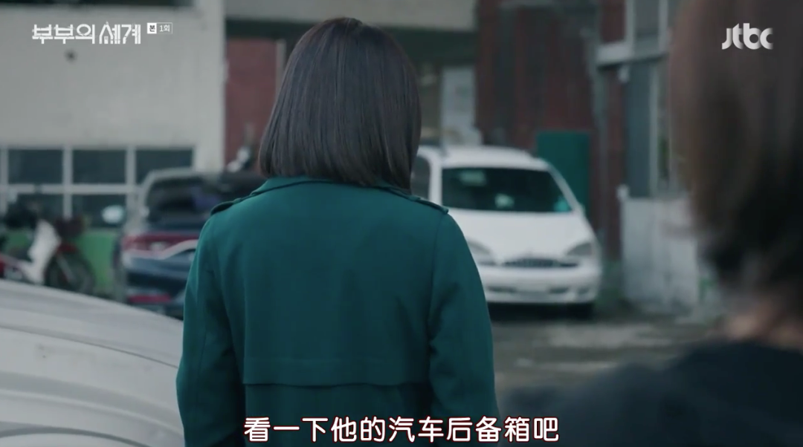

在男主的生日趴体上，女主趁丈夫忙于跟宾客周旋，跑去翻遍了他的汽车后备箱，终于在夹层找到偷情时用的背包，里面有换洗内裤、香氛喷雾、安全套，还有一支从未见他使用过的手机。

当女主挣扎着打开手机时，顿时被真相所击垮——原来那位小三不是女秘书或艺琳，而是会长夫人的女儿吕多景。

.jpg)

更令人窒息的是，女主身边几乎所有人都知道男主出轨，却选择为他打掩护，包括公司同事和艺琳夫妇。

就连女主最信任的闺蜜，也在时不时向男主通风报信。这就是为什么一开始女主跟踪丈夫，后者却仿佛总能提前得到风声的原因。

.jpg)

这种被全世界背叛的感觉，让女主再也无法冷静下来，直视眼前的趴体。

所有这些知情不报的朋友、同事、邻居，越是若无其事地谈笑风生，越让女主怒从中来，仿佛只有一刀捅死丈夫才能出掉这口恶气。

但她并没有选择玉石俱焚，而是决定将这份痛苦毫无保留地还回去。

剧集接下来将要上演的，就是女主如何设局手撕渣男、惩治一众帮凶的高能剧情。

总的来说，作为一部婚姻题材的高分剧，以“出轨捉奸”作为矛盾起点固然有些狗血。

但让人欣慰的是，它没有停留在戏剧化的撕X情节，而是通过女性角色的相互扶持，对韩国当下的社会现实留有关照和反思。

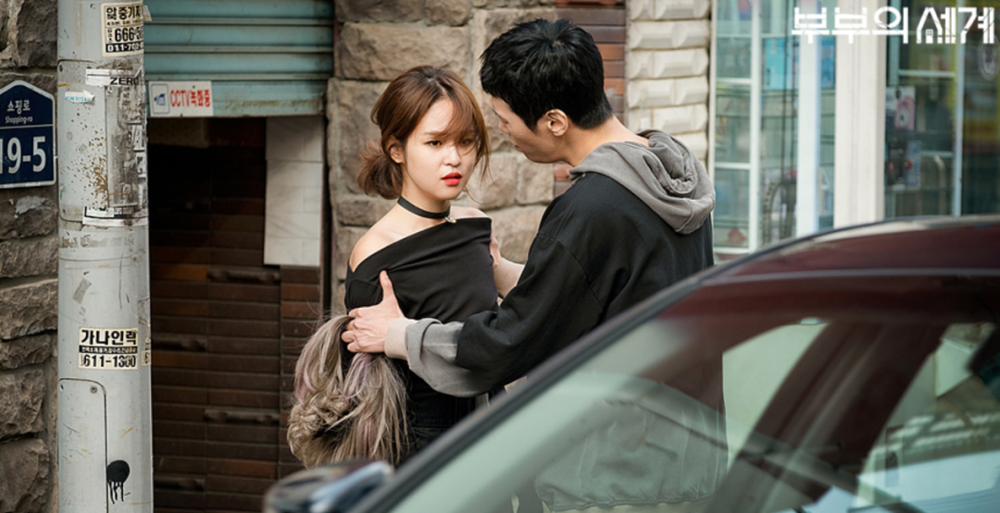

剧中有位名叫闵贤瑞的女病患，因为经常遭到男友家暴，一度患上严重的失眠症，不得不找女主开安眠药。

结果在因缘巧合之下，这两个身处不同阶层的女性，得知了彼此的痛苦隐情，并成为对方最有力的臂膀——

.jpg)

在身边亲友都背叛女主的情况下，闵贤瑞充当她的秘密线人，帮她跟踪李泰吾，揭露出轨奸情；

而在闵贤瑞被打得遍体鳞伤时，也是女主及时出现，帮她惩治了家暴男，给她治疗伤势。

.jpg)

.jpg)

这样又燃又热血的女性互助场景，很容易让人联想到现实中，韩国女性为了对抗男尊女卑的社会所发起的各种自救行动。

比如梨花女大的“姐姐来了”、各种反歧视反偷拍游行，还有最近的“N号房”案件曝光后， 韩国女律师协会宣布为受害者提供法律援助等等。

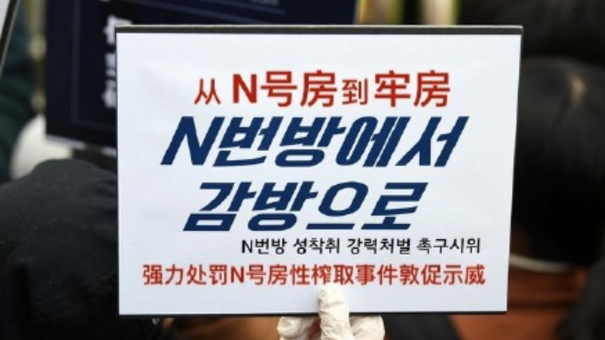

因为只要性别歧视的文化存在，即使是身处富裕阶层的女性，也很难独善其身。就像在“N号房”事件中，即便你不是视频里的受害者，但身为社会中的一员，同样会从方方面面受到物化女性的思想的戕害。

.jpg)
.jpg)

所以，无论是女性也好，其他受到不公待遇的弱势群体也好，与其不切实际地期待既得利益者让渡权利，不如相互扶持，共同为自己争取应得的平等权益。

**而作为普通人，只要始终保持独立思考的能力，不被陈旧观念所裹挟，对他人保持起码的尊重，就是为实现社会公正所做出的最好努力。**

也许是国内最认真的电影自媒体
长按扫描二维码关注

**请点个在看**

在看