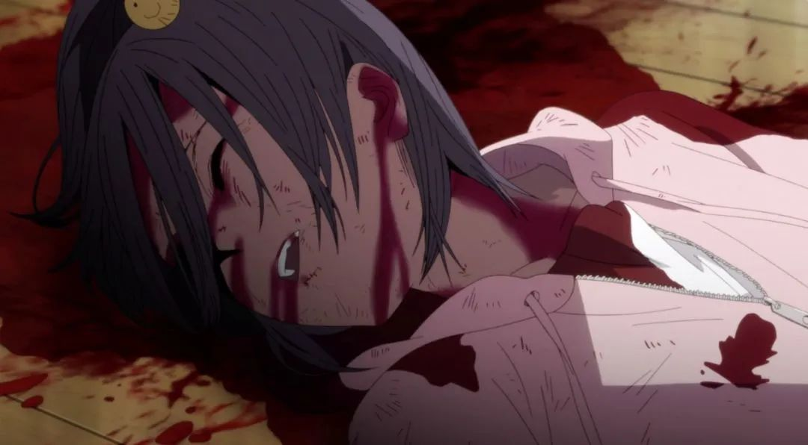

速读摘要

作为科幻类型，这部番剧的最大卖点就是高能烧脑的世界观设定。此后再派出一位侦探进入井内，在罪犯的潜意识世界里，搜集破案的线索。在第9集中，男主角在井中世界找到了另一个入口，他进入了井中之井，结果却意外发现这个"井中井"世界与现实世界无异，只不过时间回到了几年之前。男主不是名侦探酒井户，他没有失忆，也还没有失去妻子和女儿。所以他就像对自己所做的那样，会给每位受害者的额头都钻开一个洞，甚至认为只有这样，人类世界才会变得更干净美好。

原文约 2522  字  | 图片 41 张 | 建议阅读 6 分钟 | [评价反馈](https://static.app.yinxiang.com/embedded-web/clipper/#/Evaluating?d=2020-03-20&nu=24a744ee-616e-4cb6-8958-27953276695d&fr=myyxbj&ud=58b471&v=2&sig=32FB8734888963BB12274A5A346B320E)

##  高能烧脑、硬核推理，9.9分超神番，不看就OUT了啊！

原创 有部电影 [有部电影]()**
最近有一部脑洞大开的科幻番剧，一上线就引爆了国内社交网络。

它不仅在豆瓣评分9.4，B站评分更是达到丧心病狂的9.9，就连平日不追二次元的小伙伴也纷纷入坑、大喊上头。

咱们今天就一块来看看，它到底高能在哪里——**《异度侵入》。**

作为科幻类型，这部番剧的最大卖点就是高能烧脑的世界观设定。

很多人在打开第一集时，都会被未经铺陈的剧情整得一脸懵逼——

男主从卧室床上一觉醒来，发现不光自己断手断脚、四分五裂，连整个世界也变得支离破碎，杂乱无章地漂浮在空气中。

更可怕的是，他想不起来自己是谁、经历过什么，也不知道眼前的场景是死前走马灯还是死后异世界，当场崩溃到想锤墙。

但就在这时，男主意识到，他的身体虽然四分五裂，但仍然受到大脑神经的操控，整个人就仿佛是一台无线蓝牙连接的智能机器——

于是，他先是分分钟把残肢断臂召唤回来，恢复成人体形态；

然后又如同玩乐高积木般，将眼前的建筑碎片，逐个拼接成完整的世界。

拼着拼着，男主发现某房内的地板上，躺着一位中刀倒地、流血身亡的少女。

就在这一瞬间，他被触发了记忆——

他不仅脱口而出少女的名字“佳爱琉”，还想起来自己是个叫酒井户的神探，此次前来正是为了揭开佳爱琉的死亡之谜。

至此，画面中的镜头逐渐拉远，本剧终于揭开了设定的神秘面纱——

原来，剧中的故事发生在未来的东京，日本政府为了打击犯罪，研发出一套捕捉杀意粒子、侵入罪犯潜意识的黑科技。

其中，能够捕捉杀意粒子的仪器叫稚产灵，由外务官松冈和新人小春操作。

在捕捉到杀意粒子后，警方就能利用“罔象女”系统，模拟出凶手的潜意识世界，也就是剧中提到的“井”。

此后再派出一位侦探进入井内，在罪犯的潜意识世界里，搜集破案的线索。

而其他调查官，则同时在井外监测，根据侦探的推理寻找罪犯的信息。

没错，男主酒井户，就是那位下井的侦探。

他在故事开场时所处的分裂世界，是一个绰号“开洞手”的连环杀人犯的潜意识世界。

接下来，男主将在井内破案，找到杀害少女佳爱琉的凶手；

而外面的调查官，则通过监测井内的信息，分析“开洞手”的真实身份和作案动机、寻找现实中的犯罪证据。

这种里应外合的破案模式，说起来炫酷，做起来烧脑。

因为潜意识世界变化莫测、危险异常，还没有存档功能，所以侦探每次玩脱都只能从头再来。

而且杀人犯们的潜意识世界，还真是各有各的变态，完全都不重样。

有的是分崩离析的碎片式城市，有的是被烈焰火海围绕的死亡建筑，有的是漂浮在高空的孤岛密室，有的是形如莫乌比斯环的杀人列车……

这迫使侦探既要心思敏捷地推理真相，又要手拿菜刀砍电线、一路火花带闪电地迅速通关，否则在井里没完没了地死去活来，也很让人崩溃……

整体看下来，这部番剧的设定里能看到不少经典作品的影子。

比如说到入侵潜意识或梦境，它很容易让人想起《盗梦空间》《红辣椒》《入侵脑细胞》；

关于监测犯罪意图，又会让人想起《少数派报告》《心理测量者》；

而提起利用虚拟现实破解案件，则能让人想到《异次元骇客》，甚至是《名侦探柯南：贝克街的亡灵》。

不过，光有集百家大成的高能设定，《异度侵入》还不足以成为四舍五入就是满分的“霸权番”。

一方面，剧中几乎每集都会展现一个光怪陆离的潜意识世界，其天马行空的想象力让人叹服不已，毫不拖泥带水的推理过程也格外带劲。

另一方面，剧中的角色并没有被塑造成“工具人”，他们的个性鲜活丰满，背后隐藏的故事线，也具有强大的情感张力。

拿男主酒井户来说，他就是一个典型的亦正亦邪的人物。

由于井世界由杀人犯的潜在杀意构成，所以作为井内侦探，不仅要头脑机敏、手脚灵活，还得在现实中拥有杀人经历。

男主在现实世界里，名叫鸣瓢秋人，曾是一名嫉恶如仇的神勇警探。

没想到有一天，他的女儿惨遭连环杀手虐杀，妻子随之自尽。

男主在目睹家人的悲惨死状后，在痛苦与愤怒的驱使下手刃了仇人。

沦为阶下囚的同时，他也成为了井内侦探的不二人选。

但由于在罪恶世界浸淫太久，男主被无穷的杀意所控制。

每次在协助警方破案抓人后，他都会忍不住利用犯人精神上的弱点，引导对方自杀。

再比如主导井外调查的百贵室长，他曾是男主的同事，也多次劝对方不要再杀人。

但不久后，他自己却因涉嫌教唆杀人罪被逮捕。

这又是怎么回事呢？

原来，此前在多个连环杀人犯的井内，都出现了一位化名约翰·沃克（JW）的神秘男子，警方怀疑此人是操纵这些凶犯杀人的幕后主使。

而经过进一步调查，警方发现每个犯人家中都装有监视用的摄像头、麦克风，这些设备的访问数据都指向百贵室长的电脑……

更可怕的是，警方还在百贵家后院里挖出一具尸体，经过DNA鉴定，确认对方正是“罔象女”系统的开发者。

如此一来，要么百贵室长就是利用罔象女，入侵犯人潜意识教唆杀人的JW；要么是真凶发现行迹败露，通过栽赃百贵来甩锅。

除此之外，剧中像这样值得玩味的角色还有很多，我就不给大家做详细剧透了。

值得一提的是，通过追击 JW的这条长线剧情，剧集更进一步，将主角带入了多重嵌套的井中井世界。

在第9集中，男主角在井中世界找到了另一个入口，他进入了井中之井，结果却意外发现这个“井中井”世界与现实世界无异，只不过时间回到了几年之前。

在这里，男主不是名侦探酒井户，他没有失忆，也还没有失去妻子和女儿。

为了避免悲剧发生，他提前解决了那个将会在未来虐杀女儿的凶手，然后便在这里停留了下来，过着普通人的生活，久而久之，反而觉得现实世界像一场梦一样……

这种庄生梦蝶般的设定，给剧集附上了一层哲思。

**值得一提的是，编剧舞城王太郎本身就是一位擅长写超现实本格推理的作家，《异度侵入》在高能的科幻脑洞下，本质上揭露的也是人们的心理问题。**

剧中那些由杀意构建的井内世界，其奇谲诡变的画风，反映的正是杀人凶手内心的疯狂、扭曲、偏执和绝望。

比如第一集中的杀人犯“开洞手”，由于前额叶大面积缺损，导致记忆力与自我纠错机制丧失，才一度拥有“人类本该是支离破碎”的世界观。

所以他就像对自己所做的那样，会给每位受害者的额头都钻开一个洞，甚至认为只有这样，人类世界才会变得更干净美好。

第三集中，制造了连环爆炸案的“焰火师”， 一边标榜自己的杀人手法是艺术，一边批判现代人类空洞又缺乏同理心，是生是死都没什么意义。

但实际上，“焰火师”曾是一位战地记者，因为见证了残酷的恐袭爆炸才心灵扭曲，迷恋上人间炼狱般的死亡现场。

他不仅制造爆炸，还会在现场拍下照片，为这些“杰作”沉迷不已。

更讽刺的是，等警方抓获他后才发现，他拍的并不是爆炸，而是灾难现场围观者们冷漠的嘴脸。

正如尼采的那句名言所说，**“当你凝望深渊越久时，深渊也会回看着你。”**

有些人的阴暗源自生理缺陷、精神缺陷，有些人则是在成长中遭遇的不幸，在生活中撞到的暗礁……当他们任由内心的邪恶释放，便只会在泥沼中越陷越深。

那么凝视着深渊的男主，究竟能否走出自己内心的阴影呢？神秘莫测的JW又究竟是谁？

目前这部动画更新到11集，还剩2集本季完结。

已经刷到上头的我必须得说：**只要不烂尾，这就是妥妥的本月甚至本年度最佳神番！**

也许是国内最认真的电影自媒体
长按扫描二维码关注

在看