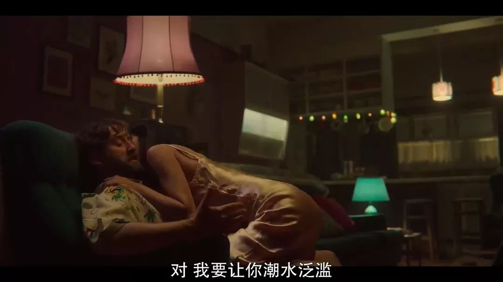
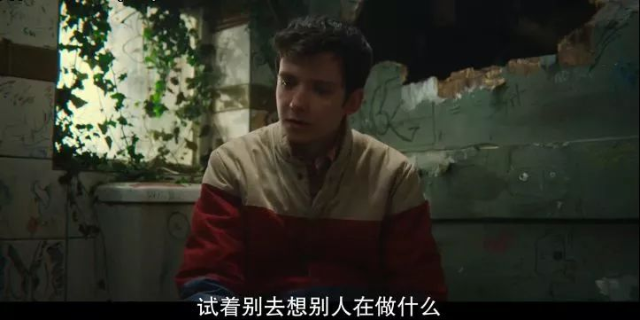
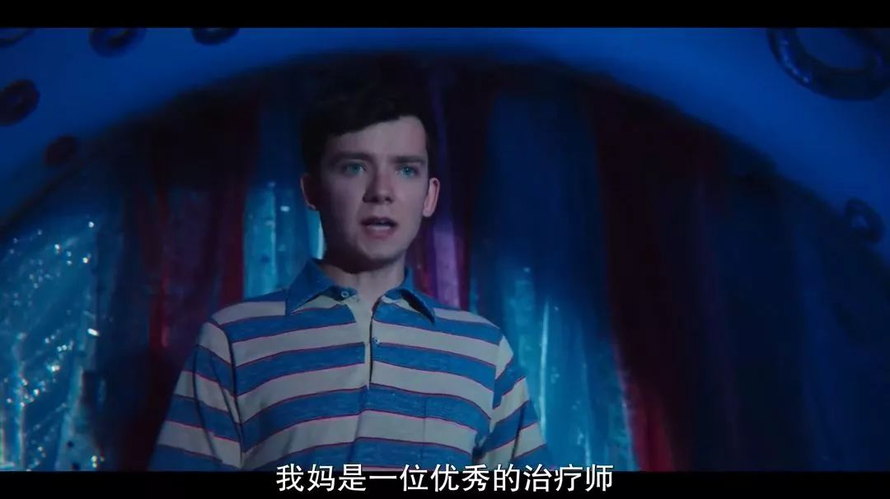

速读摘要

剧中的男主奥帝斯，虽然才16岁，但在性治疗师妈妈的影响下，年纪轻轻就掌握了丰富的性知识。她得知男主曾帮着别人追自己时，还一怒之下与男主结束了合作。而母子两人的诊断方式，明显风格迥异——妈妈擅长学术理论性的分析，而男主在开解"顾客"时，通常都会从情感维度寻找突破。在这样的心情中，他决定在家里办一个趴体放松放松，虽然他并没有邀请女主和欧拉，但两人却阴差阳错地来到了现场。但渐渐地她也学会了接纳，在妹妹和妈妈身上体会到了那种亲人之间、发自内心的呵护与爱。

原文约 2380  字  | 图片 51 张 | 建议阅读 5 分钟 | [评价反馈](https://static.app.yinxiang.com/embedded-web/clipper/#/Evaluating?d=2020-03-20&nu=369cd352-9b3e-4566-b771-7a7585153b6d&fr=myyxbj&ud=58b471&v=2&sig=B59C8DC9E5A824DA40CBD5AB14357219)

##  豆瓣9.1，这部高能飙车剧，教你什么叫做爱

原创 有部电影 [有部电影]()**
最近，有一部广受期待的英（飚）美（车）剧终于回归了，它就是《性爱自修室》第二季。

这部剧第一季播出时，我就给大家安利过。

剧集不仅收获好评无数，而且看过的网友们也纷纷感叹，在青少年性教育这方面，我们实在是落后了太多。

但在我看来，这部剧最吸引人的地方，不是比比皆是的大尺度情节，而是它处处流露出善良而纯真的人物情感。

剧中的男主奥帝斯，虽然才16岁，但在性治疗师妈妈的影响下，年纪轻轻就掌握了丰富的性知识。

他和女主梅芙一块在校园中开办“诊所”，帮同学们解答性方面的各种疑惑。

在这个过程中，奥蒂斯对女主产生了好感。

只可惜医者不自医，他自己有些社交障碍，还因为不会自慰而备感困惑和自卑，迟迟不肯正视对女主的喜欢，甚至还助攻别人追女主。

而女主呢，其实也对男主有好感，但并不认为男主同样喜欢她。

后来，她得知男主曾帮着别人追自己时，还一怒之下与男主结束了合作。

在第一季故事的结尾，女主因为哥哥卖毒品的事，被校长开除。

正当她打算原谅男主时，却发现男主已经正式交往了一个女朋友。

这个女孩名叫欧拉，她的爸爸是名水管工，他们父女俩分别解开了男主和妈妈的心锁。

爸爸在修水管时爱上了男主的妈妈，并让妈妈封闭了多年的心，再一次投入到爱情之中。

而欧拉则通过和男主的接吻，让男主焕然新生，终于完成生平第一次打飞机的壮举，就此打开了新世界的大门。

今天要聊的这部第二季，就接着这个高能的结尾展开。

想也知道，既然拍了第二季，那么男主解决同学们性疑惑的事业肯定要继续搞起来，而合作搭档也必然是女主。

这时的女主，正好风风火火地回到了学校，还阴差阳错加入了天资班计划。

于是，男主很快就找到女主，两人不计前嫌、一拍即合，火速开张做起了生意。

有趣的是，此时的他们多了个同行，那就是男主的妈妈。

因为最近学校爆发了衣原体感染，男主妈妈被聘来做性教育工作。

由此，母子俩一明一暗地给同学们做着性咨询工作，发生了一系列让人啼笑皆非的事。

比如男主这边，学校里自称“性爱大师”的老师慕名前来请教，问他女友总是在进行爱的鼓掌时让自己说下流话该怎么办：

而妈妈那边，校长夫人上门诉说自己与校长之间的苦闷，吓得校长忍不住躲在外面偷窥：

而母子两人的诊断方式，明显风格迥异——妈妈擅长学术理论性的分析，而男主在开解“顾客”时，通常都会从情感维度寻找突破。

比如，有男生表示受不了女友在床上时，一直用枕头捂着自己的脸，妈妈听完怀疑对方女友是“恋鬼癖”，男生吓得以为女友疯了：

而当女方找到男主后，我们才得知，原来真实情况是女方觉得自己高潮时的样子难看，怕被对方看到而已。

当然，这并不能证明男主就比妈妈的业务水平高，毕竟妈妈的专业和经验摆在那。

有一次，一个女孩因为渴望恋爱却不想和任何人发生关系，觉得自己是怪胎，问男主怎么办，男主当时给的建议就很鸡肋：

相反，倒是妈妈的分析正中要害，使女孩豁然开朗，明白了自己的状况并非“不正常”：

事实上，男主无法搞定的事情还有很多，和第一季一样，他最无法处理明白的，仍然是自身的问题。

自从get到了打飞机这个技能之后，男主的生理反应变得无法抑制，无论是看电影、骑自行车，还是跑步、聊天时，他都忍不住要怡情一翻，好几次场面都十分尴尬。

但悲剧的是，每当他面对欧拉时，却又无法正常反应了……这成为了他的一个心病。

为了解决这个问题，男主跑去网上学习了所谓的“时钟技巧”，用手指来抚慰欧拉，他以为自己做得很棒，结果却非常糟糕。

而在他上下求索的过程中，欧拉却意识到，也许男主的心还在女主那里。

于是，她向男主发出了“有她无我”的分手警告。可男主这边好不容易忍痛和女主断绝了来往，欧拉却又忽然出柜了……

一夜之间，男主莫名其妙同时失去了两个人。

在这样的心情中，他决定在家里办一个趴体放松放松，虽然他并没有邀请女主和欧拉，但两人却阴差阳错地来到了现场。

没想到当天晚上，喝得烂醉的男主，意外地完成了第一次……

那么，趴体上到底发生了什么事？男主又是如何克服障碍的呢？想知道答案的小伙伴可以趁着假期入坑开刷，我在这里就不剧透了。

总的来说，《性爱自修室》第二季延续了这部剧的主体风格。在剧中所营造的世界里，各式各样的性议题都可以被平常视之，没有遮掩，也没有任何歧视。

通过中二搞笑的情节，剧集一边科普性知识，一边向观众讲述那些情感关系中最核心的问题：比如如何学会沟通、尊重、坦诚、自爱等等。

而相比第一季，本季重点呈现的是人物的成长。

这种成长，首先表现在两性情感领域的更多经历和感悟。

以男主为例，他与女主之间的错过、与欧拉恋情的结束，都是他从未体验过的成长阵痛，如何接受和放手，便是他所要学习的人生新一课。

而与男主独自琢磨着成长相反的是，剧里其他很多角色，都处于敞开心扉的状态。

对于眼前的人、对于可能发生的各种偶然与意外，他们大多都抱有一种开放的心态，选择尝试、选择感受，即便到头来发现只是走了段弯路，也完全视为一种自我的探索来对待。

比如欧拉在与男主分手时，就直白而坦荡地对他说了这样一句话：我认为我们搞错了。

在我看来，这句看似普通无故的台词，其实具有点题的效用——

**对于年少的人来说，感情的世界是未知的，人们很容易对一个人拥有好感、与之相恋，但却并不见得真的了解自己需要的是什么，也并不清楚对方是否适合自己。**

然而事实上，没有人能够一直不出错。尤其是在感情问题上，真正重要的不是避免犯错，而是学会反思，这样才能更懂自己、更懂人性、更懂爱情。

除了爱情这个主题以外，本季同样也将成长的重点，放在了与父母家人的和解上。

男主从一开始纠结于妈妈对自己隐私的关注，到无法适应妈妈和水管工走到一起，最后终于体谅到了妈妈的良苦用心。

在女主这边，当曾经吸毒的妈妈带着小女儿出现在她的生活中时，她一开始非常抵触。但渐渐地她也学会了接纳，在妹妹和妈妈身上体会到了那种亲人之间、发自内心的呵护与爱。

还有在第一季里很多人喜欢的校长儿子亚当，从军校回来后，他起初与家人相处得并不融洽，感觉自己像是被抛弃、被看不起的“校霸”，后来多少对爸爸敞开了自己的心。

目前，这部剧第二季在豆瓣收获了9.1的高分，与第一季的口碑不相上下。

说到底，它受到认可并不是因为那些黄暴污的情节，而是因为它在一个个充满阵痛却又最终治愈的故事中，与观众一同探讨着何为爱的真谛。

就像预告片中的台词所说的那样：**Life is hard, love is messy, messy is normal.**

**无论是青春期的少年也好、年龄不小的成年人也罢，爱都是我们一生中所要孜孜不倦学习的东西。而那些真正学会了爱自己的人，也会懂得如何去包容和尊重别人。**

也许是国内最认真的电影自媒体
长按扫描二维码关注

在看