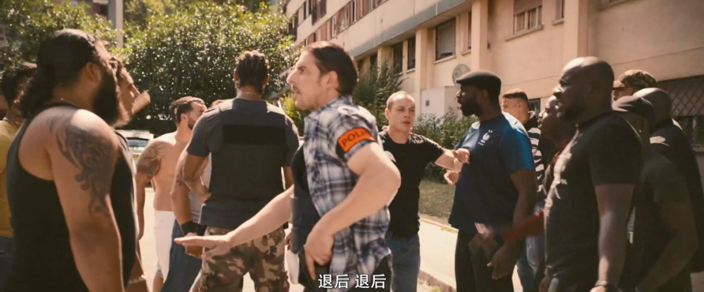

速读摘要

影片的故事发生在巴黎北郊的塞纳-圣德尼省，也被称为93省，那里是导演拉吉·利自小长大的地方，也正是雨果写出《悲惨世界》的地方。三人见状，立马下车调停，而寻找幼狮的任务也就落在了他们头上。与之类似，在结尾处，当局面翻转过来，男主三人被孩子们所困，最终来到伊萨与男主决定生死的那一刻，影片所传递给观众的情绪，同样是从紧张变为茫然。结合法国这些年此起彼伏、愈演愈烈的社会运动来看，影片的故事虽然发生在93省，但实际上却是整个法国社会的一个缩影。

原文约 2516  字  | 图片 48 张 | 建议阅读 6 分钟 | [评价反馈](https://static.app.yinxiang.com/embedded-web/clipper/#/Evaluating?d=2020-03-30&nu=276005c8-f674-492c-b758-1908ec45657d&fr=myyxbj&ud=58b471&v=2&sig=A72E5F401E4997A76AAD0D970C5A6A04)

##  贩毒、卖淫、抢劫，这片拍出了这个世界最糟糕的一面

原创 有部电影 [有部电影]()**
提到维克多·雨果的经典小说《悲惨世界》，相信无人不知，无人不晓，由它改编而来的影视作品，每隔几年就会出现一部，而且部部都在水准之上。

就在去年，又一部以“悲惨世界”命名的电影出现了，它同样来自法国，豆瓣评分高达8.4，咱们今天就来聊一聊。

虽然片名叫做《**悲惨世界**》，但就文本而言，本片与雨果的小说并没有直接关系。

它是由导演拉吉·利根据自己在2016年拍摄的同名短片扩充改编而来。

影片的故事发生在巴黎北郊的塞纳-圣德尼省，也被称为93省，那里是导演拉吉·利自小长大的地方，也正是雨果写出《悲惨世界》的地方。

因为其本身具有工人社区的属性，再加之大量非法移民的涌入，93省逐渐成为“治安灰色地带”，贩毒、卖淫、抢劫、盗窃等违法犯罪行为的发生率极高。

整个故事，就从初来乍到的男主斯蒂芬，成为当地反犯罪特种部队的一名警察开始讲起。

.jpg)

男主有两个搭档巡逻的队友，克里斯和瓦达。

这三人的性格差异很大，对待事物的态度各不相同。

.jpg)

举个例子，面对一个移民女学生，克里斯以查毒品的名义对其挑衅，不仅态度强硬，还各种言语侮辱。

.jpg)

对此，男主的表现是看不下去，主动上前劝阻；而瓦达则熟视无睹，坐在车里看笑话。

在一次巡逻中，他们撞上了一件棘手的事。

马戏团的一只幼狮丢了，团里的白人怀疑是黑人所偷，和一群黑人在街道上争吵起来，眼瞅着就要发生一番恶斗。

三人见状，立马下车调停，而寻找幼狮的任务也就落在了他们头上。

.jpg)

很快，他们将目标锁定在了小男孩伊萨身上，于是开车来到伊萨所在的足球场，想对他进行抓捕。

.jpg)

但没想到，这里的孩子一见到他们要抓伊萨，就一窝蜂地冲上来，朝他们丢掷砖头、塑料瓶。

.jpg)

情急之下，克里斯拿出武器，瓦达也举起了信号枪，眼看对峙就要升级。

而就在伊萨试图逃跑时，瓦达情急之下，向他开了一枪……

.jpg)

虽然伊萨受的伤不足以致命，但悲剧的是，开枪的画面不仅被无数人看到，还被一个无人机拍摄了下来。

可想而知，如果视频发到网上，后果将不堪设想。

男主三人只能尽快找到无人机的持有者。

没过多久，整件事传到了黑人大哥萨拉的耳中。

而持有无人机的孩子，为了躲避男主三人，也跑来向他求助。

当男主三人赶到这里后，面对萨拉，克里斯再次摆起了警察的官威。

萨拉对此不屑一顾，表现出一副“有本事你就抓我”的样子。

最后，还是男主诚恳地讲清了来龙去脉，并承诺会保证伊萨平安无事，萨拉才放下对立的态度，把视频给了他们。

事实上，在抓到伊萨后，男主确实对他表现得很关心，又是建议赶紧送医院，又是给他擦拭脸上的伤。

所以，如果不出什么意外，男主绝对可以妥善地安置伊萨，履行自己的承诺。

但万万没想到，当他们把伊萨和幼师一起带回马戏团后，负责人为了报复，将伊萨推到了大狮子面前，吓得他当场尿了裤子。

.jpg)

虽然男主及时阻止了事情进一步恶化，但伊萨心里受到的创伤，却从此难以消磨。

后来，克里斯逼他认错，又进一步加剧了他对男主三人的仇恨。

所以在这之后，表面上看事情已经翻篇，实际上却酝酿着更大的灾难。

有一天，三人像往常一样出警时，遇到了一群蜂拥而至的孩子，又是做鬼脸，又是用水枪喷他们；

接着伊萨突然出现，像孩子们的领袖一般，朝三人的警车投掷了一个点燃的大爆竹；

三人随即下车追着伊萨上了楼，而一群黑衣蒙面的孩子一块将他们困在了楼道里。

他们不停地设置障碍、丢掷爆竹、还砸烂引燃了车辆，引发了一场暴乱。

.jpg)

在影片的最后一幕，伊萨拿着一个汽油弹来到了男主面前，而男主也举起了手中的枪。

至于两人究竟是会走向和解，还是共同毁灭，答案不得而知。

总的来说，这是一部在当下十分具有现实意义的影片，全方位地呈现了法国社会所面临的多重问题和严重撕裂。

在影片开头，导演特意呈现了一个盛世狂欢的美好景象——

2018年，法国夺得世界杯之后，无数人聚集在凯旋门前欢呼雀跃。他们不分肤色、不分阶级，脸上全都绽放出发自内心的喜悦，仿佛世界大同一般的团结。

然而，在充满紧张感与压迫感的手持镜头下，人群的躁动与不安呼之欲出，暗示着这种美好不过是虚假的幻象，稍有风吹草动，危机就会轰然爆发。

在影片的前半段，一切都还在酝酿之中。

这时影片重点展示的，是93省混乱的日常秩序。

这里的居民以工人阶级和非法移民为主，种族、移民冲突不断，宗教势力庞大，警察滥权无能，是治安最差的地方。

而通过男主三人的遭遇，影片对这些社会问题进行了客观写实的展现。

比如，遇到街区孩子的破坏行为，这里的居民不会去找警察，而是跑到宗教团里抱怨，并由神职人员出来教导；

比如，政府部门的管理人员什么事情都搞不定，但搜刮百姓油水就很有一套，小贩们被逼得怨声载道；

再比如，幼狮失踪之初，马戏团的白人与黑人在争吵时，双方都不就事论事，而是直接上升为种族间的仇视和谩骂。

这种种情景，在导演不带情绪的镜头语言下，呈现出一种高度临场的观影感受，极大地加强了观众内心的焦虑与不安。

而这种焦虑不安，在男主三人与孩子们第一次追逐、对峙的戏码中，到达了一次顶峰，又在伊萨中枪倒地的一瞬间，迅速消散。

与之类似，在结尾处，当局面翻转过来，男主三人被孩子们所困，最终来到伊萨与男主决定生死的那一刻，影片所传递给观众的情绪，同样是从紧张变为茫然。

所以，结合法国这些年此起彼伏、愈演愈烈的社会运动来看，影片的故事虽然发生在93省，但实际上却是整个法国社会的一个缩影。

它的开放式结尾，也是导演对每一个法国人发出的叩问：**到底要怎样才能解决问题？是任由仇恨和暴力发展到极端，还是深刻反省、共同寻找和解的办法？**

回过头来看，片中这整个事件的发生，并不是一个偶然。因为在那种复杂混乱的社会状态下，警察和孩子们的良性互动，已经不再可能。

按照一般的逻辑，在男主三人找到伊萨后，他只要配合警察，交出幼狮，这事就结束了。

可意外的是，孩子们选择了一致对抗。这意味着，他们早就失去了对警察的信任。

后来伊萨的遭遇，也证明了警察的问题，即便有男主这样的正面角色存在，也仍然无法阻止他受到凌辱和伤害，产生难以消解的仇恨。

在片中，男主和黑人大哥萨拉曾有过这样一段对话——

当时男主举例，2005年，两名非裔男孩被警察电死，引发全国性骚乱，人们愤怒地烧车、烧公交站，结果损失惨重，对所有人都毫无益处。

而萨拉则告诉他：即便如此你们也避免不了怒火，因为只有发泄怒火，才能换来倾听。

这段对话，最终也在孩子们的所作所为上得到了验证。

它所指向的，正是法国社会的困局所在——**不公、歧视、仇恨、偏见笼罩着每一个人，整个社会就如同火药桶一般，很容易就被引爆。结果就是，暴力和骚乱频发，撕裂更加难以弥合，陷入恶性循环。**

在影片的结尾字幕里，导演引用了雨果《悲惨世界》里的一段话：**世上本来没有坏庄稼，也没有坏人，只有坏的庄稼人。**

**如果将一个国家比作庄稼，庄稼人所代表的，便是这块土地上生活的每一个人。**

**想要收获好的庄稼，只有每一个人共同努力才行。倘若眼见不公而不顾，任由社会问题滋长蔓延，催生出暴力与仇恨的果实，那么，受害的终将会是所有人。**

也许是国内最认真的电影自媒体
长按扫描二维码关注

**帮我点个在看呗？**

在看