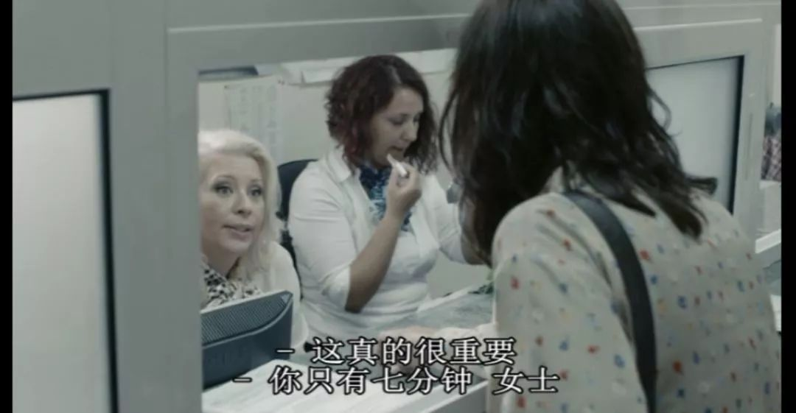
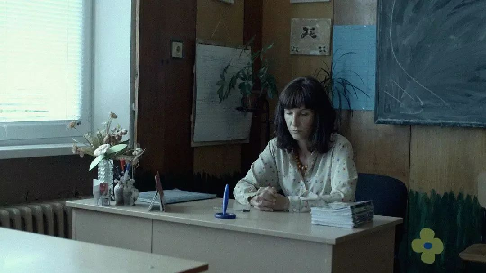

速读摘要

往好的方面看，至少通过网络，老师们还有书可教，学生们也有课可上。为解决这个问题，女主先是去催稿费，结果被告知下周二才能拿到钱。在加害者方面，银行收债的、翻译公司老板、放贷人，这三个构成女主和家庭危机的关键人物，无一不是手中握有权力的男性。当女主带着家人向他寻求帮助时，只会得到一番无意义的争吵。在被放贷人威胁肉偿后，女主曾跑到警察局报案。

原文约 2245  字  | 图片 42 张 | 建议阅读 5 分钟 | [评价反馈](https://static.app.yinxiang.com/embedded-web/clipper/#/Evaluating?d=2020-03-20&nu=436b86b2-2ca2-4a16-ae0c-05b91f6ec02d&fr=myyxbj&ud=58b471&v=2&sig=471F762C8E60685CAA61783E1180E8EA)

##  是什么让这位女教师做出如此羞耻之事？

原创 有部电影 [有部电影]()**
这段时间，由于疫情的原因，不少学校开展了网络教学。

一时之间，老师们被逼得摇身一变成了“主播”，学生们也被钉钉等软件折磨到崩溃，纷纷给软件进行了“分期付款式”五星好评。

不过往好的方面看，至少通过网络，老师们还有书可教，学生们也有课可上。

今天咱们要聊的这部电影就不一样了，片中的女主也是一名老师，相比而言，她才是被生活逼上了绝路——**《教训》。**

女主名叫娜蒂亚，在保加利亚的一个小镇教英语。

她原本念法律专业出身，是一个思想独立的人，一直希望能通过教育改变人心。

电影一开头，就是这样一个情节——

一个学生的钱被同学偷了，为了激发偷钱学生的愧疚，她让所有同学每人捐出10斯托丁基（保加利亚货币）给被偷学生。

随后，她又弄了个信封放在教室里，希望偷钱的学生在第二天之前，默默把钱给还回去。

只可惜，这个方法并没有奏效，第二天信封里依然空空如也。

对此，女主自然是失望的。

但说到底，这只是她生活中的一个小插曲。真正让她糟心的，是一连串接踵而至的经济问题。

先是她为了补贴家用，兼职做了翻译，可没想到翻译公司迟迟不给她稿费；

接着不靠谱的老公没有及时还信用卡，银行上来追债，要将他们的房子收走拍卖。

为解决这个问题，女主先是去催稿费，结果被告知下周二才能拿到钱。

无奈之下，她只好去找关系不太好的爸爸。

然而，看到爸爸不肯给死去的妈妈立碑，还整天和新相好鬼混，女主瞬间一肚子火，不仅没借钱，还偷偷涂污了新相好的照片。

走投无路之后，她只能跑去向私人借贷，先把银行的债还上，等稿费到手后再去还贷款。

女主本以为，这下一切总该恢复正常了。但殊不知，更大的困境还在等着她。

不久后，就在她用包里的钱做诱饵，继续调查偷钱学生时，突然接到了银行的电话。

对方声称此前的计算有误，需要补交，否则仍会收回房子。

这让女主倍感焦急，匆忙地赶到了银行。

但由于做诱饵的钱在接电话时被偷，她身上凑不出补款，银行还等着在七分钟后下班关门……所以，女主必须在七分钟之内凑够钱。

可是这谈何容易，女主最后直接被逼得到附近的许愿池里去捡硬币。

折腾了一顿，这事总算是搞定了。

但谁曾想，第二天又一个暴击找上门来——翻译公司的老板跑路了。

这意味着放贷人的钱还不上了。

女主只好又赶去放贷人那里求情，希望对方能够宽限几天。

对方虽然答应了，但提出的要求很离谱。

他让女主给他侄子在作业本上打高分，三分就宽限三天，四分就宽限四天，六分则额外送一天……

面对这种情况，女主一方面真的拿不出钱，另一方面又不愿违背自己作为教师的原则，于是想了个折衷的办法——全班学生都给了六分。

只是，这也只能算是杯水车薪，七天时间终究还是太短，根本解决不了问题。

眼瞅着限期将至，女主干脆带着自己的全部首饰去找放贷人，还表示可以帮他们全家补习英语。

但这一次，放贷人完全不给她商量的余地，威胁女主要么赶紧还钱，要么就明天过来钱债肉偿。

可以说，事情发展到这，女主的道德困境被彻底推向了顶点，想要解决问题，似乎只能放弃原则与底线，别无它路。

但有趣的是，导演并没有安排女主去肉偿，而是利用镜头对观众进行了巧妙的欺骗。

当我们看到女主化好妆、穿了丝袜，以为她逼不得已要去出卖身体时，女主却突然在路边脱掉丝袜、套在头上，走进了一家银行……

在这个故事的结尾，女主凭借从银行抢来的钱还清了贷款，但她也因此做出了自己一直教育孩子们不要去做的事。

总的来说，这是一部极具批判性的现实主义作品。

影片的镜头语言简洁平实，全片有着大量的手持跟拍镜头，采用全自然光拍摄，没有任何的配乐，呈现出朴实无华却又引人深思的气质，颇具达内兄弟的味道。

首先，作为一部以女性为主角的作品，在女主突破原则的背后，影片多方面展示了男性角色推波助澜的力量。

在加害者方面，银行收债的、翻译公司老板、放贷人，这三个构成女主和家庭危机的关键人物，无一不是手中握有权力的男性。

而在女主与至亲的家人方面，男性也同样发挥着不光彩的消极意义。

比如女主的丈夫，他没有担当，只会颓废抱怨。

事件的起因在于他，但回顾全程，他没有做出任何思考和行动，使得女主不得不一人撑起一切。

再比如女主的爸爸，也不是一个合格的父亲。在妈妈死后，他到处鬼混，毫不关心女儿的生活和感受。

当女主带着家人向他寻求帮助时，只会得到一番无意义的争吵。

这种处理，或多或少是由于导演兼编剧之一的克里斯蒂娜·戈洛佐娃的女性身份，使得本片立足于女性的视角，兼具了女性主义色彩。

尽管稍显刻意，却也呈现出了导演对女性困境的切实关怀。

当然，影片并非全然指向对男性的控诉。它想要深入反映的，其实是糟糕的社会环境对道德的破坏。

造出女主道德越界的根本原因，就是明规则与潜规则同样腐败污浊的保加利亚社会。

在片中，放贷人代表的是潜规则的一面。

他可以随意提高利息，任意改变还款方案，而女主却只能任其宰割，束手无策。

这是因为，作为公权力的警察部门不仅不作为，还与放贷者狼狈为奸。

在被放贷人威胁肉偿后，女主曾跑到警察局报案。可当她见到了警察后才发现，对方根本就是放贷人的朋友。

同样作恶的，还有所谓正规的银行。

女主的丈夫未能还清信用卡，所以银行要拍卖他们的房子，这看似合法合规，实际上却并非如此。

因为银行在宣传手册上写着固定利率，具体操作中却偷偷提高利率，而且并不通知用户，这才使得女主家欠下的钱越滚越多，直至无力偿还。

女主在最初也曾找过银行理论，对方接受起诉，可一个已经穷途末路的老百姓，要怎么与银行这样的庞然大物抗衡呢?

正是如此多的社会问题叠加在一起，才逼得女主违背了自己一直坚信的道德和底线，作出了抢银行这样的行为。

更进一步来看，女主的教师身份也并非偶然，它代表的是一个社会的知识与道德。

影片借女主的“堕落”，所映射的正是在黑暗社会现实下，知识与道德的无效。

在影片最后，还有这样一个值得玩味的情节：

女主听到自己抢银行的新闻后回到教室，刚好看到了偷钱的孩子。她突然愣住了神，直到上课铃声响起后，才说了这样一句话——

仔细想来，这话又何尝不是她对自己的谴责和叩问呢？

只是，如果按照片中的环境进行推演，如果社会还是如此不堪，那么女主终将会再次被逼上自我背叛的绝路，让人唯余唏嘘。

也许是国内最认真的电影自媒体
长按扫描二维码关注

在看