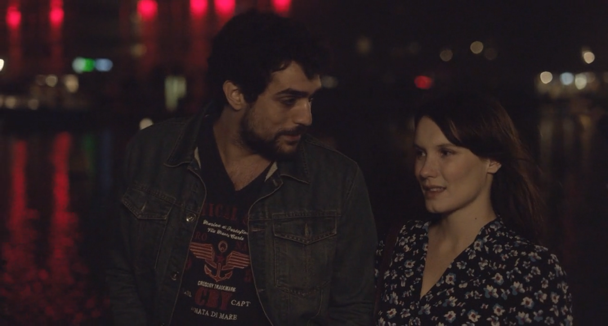

速读摘要

他本来就深受失眠困扰，失业没了事儿干，更加睡不着了。与雷米不同的是，梅拉妮近来非常嗜睡，总是感觉睡不醒。她似乎对雷米颇有好感，动不动就主动找雷米说话。而相比雷米的含蓄，梅拉妮则选择去社交软件上约会。就像置身于人群中，人会显得更加孤独一样，一时的快乐一旦过去，人就会面临更加空虚的处境。

原文约 2220  字  | 图片 36 张 | 建议阅读 5 分钟 | [评价反馈](https://static.app.yinxiang.com/embedded-web/clipper/#/Evaluating?d=2020-04-13&nu=dbee89c2-2f81-4a7a-b461-96903280c9f9&fr=myyxbj&ud=58b471&v=2&sig=6415950AD325C030EFA31B433D780AE8)

##  大城市中的孤独男女，真实到心塞

原创 有部电影 [有部电影]()**
每个人可能都或多或少面临过一个问题——孤独。

尤其是生活在大城市的人，光是要应付日益加快的生活节奏就要用尽全力，根本没时间操心自己的个人生活。

但总有那么一瞬间，我们会感到孤独。

今天要说的这部法国新片，就道尽了现代都市生活中，人们的孤独内心——**《某处，某人》。**

.jpg)

海报上的男女就是影片的主角，雷米和梅拉妮。

但正如两人在海报上的姿态，他们站得虽近却面朝不同的方向，影片也一直采用双线叙事，两人的故事几乎没有交集。

男主雷米是一家工厂的员工，今年三十岁，几年前离开家乡，独自来到巴黎工作。

.jpg)

在他十岁时，七岁的妹妹就得癌症去世了。这事儿带给他的打击很大，很长一段时间他心里都怀着负罪感。

从那以后，雷米只要一遇到什么不好的事情，就会把原因归结为自己运气不好。

在影片开场，他所在的公司打算用机器人取代部分人力，雷米被裁了员。

这让他感到很迷茫，不知道接下来该去做什么工作。

而且他本来就深受失眠困扰，失业没了事儿干，更加睡不着了。

雷米白天便总是去攀岩。

但想也知道，晚上睡不好的他，白天攀岩也没多大精神，无法全身心投入其中。

如果要用一个词来描述自己现在的状态，雷米觉得是“泡泡”——看上去五彩斑斓，实际上一戳就破。

终于有一天，雷米直接在地铁上晕了过去。

医生告诉他，这是他心理压力太大导致的，需要看心理医生。

结果，心理医生说他有抑郁症。

而当他把这事儿告诉家人时，家人却丝毫不能理解，因为“你看起来和我们没什么不同啊”。

对于这样的疑问，雷米也只能苦笑。

另外一边，女主梅拉妮今年也是三十岁，是个生物科学家。

与雷米不同的是，梅拉妮近来非常嗜睡，总是感觉睡不醒。

她认为这是自己心理压力过大造成的，因此每天都在吃药，还定期去看心理医生。

在梅拉妮很小的时候，她的父亲就离开了她和母亲，所以梅拉妮一直对父亲怀有怨气。

而母亲也在后来不顾她的反对改嫁他人，所以现在，梅妮拉与父母都不亲近，只和年龄相近的妹妹来往。

或许正是因为缺乏父母的关爱，梅拉妮十分渴望恋爱结婚，早日过上自己的小日子。

但她一年前才跟相恋三年的男友分手，直到现在还感觉元气大伤，更别说找人结婚了。

看到她消沉的状态，闺蜜对她说，与其看心理医生，还不如去撩汉，你只是太寂寞了！

于是，梅拉妮便尝试着下载了一些社交软件，跟一些“速配成功”的男性见面。

但好不容易找到一个看着顺眼的，两人见了面却又没什么话题可聊，只好一直喝酒。

这让好不容易恢复一些信心的梅拉妮，一下就泄了气。

在郁闷的时候，梅拉妮会在晚上去阳台抽一支烟。望着万家灯火，她觉得自己的孤独好像被放得更大了。

她不知道的是，在她的隔壁就住着和她同样孤独的雷米。

.jpg)

是的，两人的住处近在咫尺，生活状态也差不多，但他们却素昧平生。

哪怕两人在药店相遇，咨询着本质相同的睡眠问题，也依然没有注意到彼此。

**对于一部电影的男女主角来说，这种情况相当反常。**

**毕竟在偶像剧里，男女主不小心撞到彼此都是能接吻的。**

但片中的这种情况，其实更贴近我们的现实生活——**大家都默契地遵守着都市生活法则，谁也不去打扰谁。**

就像在地铁上，两个人明明挨得那么近，却都把注意力放在眼前的手机上，对身旁的世界不闻不问一样。

在今天这个科技飞速发展的世界，我们都曾以为“交友”会变成一件容易的事。

想念一个人，可以发短信、打电话，也可以直接坐飞机过去找对方。但殊不知，科技越是发达，人与人之间的距离反而变得越遥远了。

.jpg)

比如，为了结交朋友，让自己显得不那么孤独，雷米注册了脸书。

在脸书上，他倒是真的认识了一个男性朋友，但却并不了解对方。

面基后更是发现，对方只顾吹嘘自己，作为听众的雷米觉得既尴尬又无聊。

久而久之，雷米还是没有结交到朋友，身边只多了一只邻居搬走前留下来的猫。

一开始，雷米也不想养猫。

但慢慢地，他习惯了做一名铲屎官，觉得至少这样的生活还能有一些色彩。

他给猫咪取名“鸡块”，每天都要跟它玩耍一阵。

然而有天早上醒来，鸡块不见了，雷米死活找不着它，以为它跑出去被车轧死了。

这让病情总算缓解的雷米又变得抑郁了。

他自然也不会想到，鸡块其实是被住在隔壁的梅拉妮捡到了。

后来，雷米找到了一份接线员的工作，在新公司认识了同事杰娜。

她似乎对雷米颇有好感，动不动就主动找雷米说话。

但当雷米把她约到家里，想着下一步可能就要不可描述时，杰娜却一脸诧异地看着他问道：“你干嘛？”

显然，雷米的脱单计划还没开始，就以失败告终了。

而相比雷米的含蓄，梅拉妮则选择去社交软件上约会。

她约见了不少人，但感觉自己好像失去了欲望，做什么事情都提不起来兴致。

因为对她来说，社交软件上的交友，虽然能带来一时的快乐，但无法真正进入她内心，弄懂她的喜怒哀乐。

就像置身于人群中，人会显得更加孤独一样，一时的快乐一旦过去，人就会面临更加空虚的处境。

也许正因为这些情节真实而细致地描绘了都市年轻人的生活状态，影片在网上收获了不少好评。

**看过的人都表示这部电影又扎心又暖心，简直就是专门拍给孤独患者看的。**

是的，影片的前半段看起来很扎心，一直在描绘当代独居青年的颓丧日常，虽然故事背景在法国，却真实得像是偷窥了我们的生活。

值得一提的是，影片的结局也没有因为男女主的相遇而脱离现实，变成一部俗套的爱情片，反而让我们了解到一个真理——

**谁都不会是他人的救世主，唯有自己才是治愈自己的良药。**

在影片结尾，梅拉妮终于消除心中的芥蒂，主动给母亲打了电话。

而雷米也放下了心结，逐渐变得开朗自信，准备去换个工作。

最终，两人在一场舞会上相识。这场相遇虽然晚了点，但好在他们终于等到了。

至于之后的故事如何，就靠观众们自己想象了。

**总的来说，影片对白寥寥、节奏舒缓，捕捉的是现代人孤独的生活状态，非常适合在周末的夜晚，一个人静静地欣赏。**

**它虽然不能化解你的孤独，但至少能让你明白，在这个世上有许多和你一样的人在努力生活，你的烦恼很可能也是大家都在烦恼的。**

**所以，不要认为自己很奇怪，也别为自己的孤独感到沮丧懊恼。**

**就像片中说的那样，每个人都有坠入爱河、获得幸福的权力，要对生活有信心，要多爱自己一些。因为你只有在解决了自己的问题之后，才有能力去遇到某人。**

也许是国内最认真的电影自媒体
长按扫描二维码关注

在看