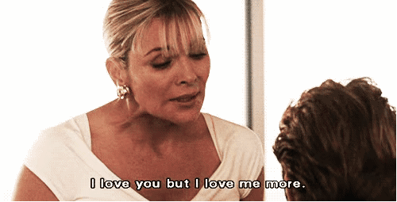
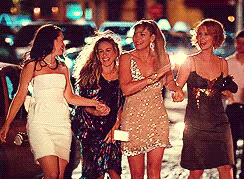
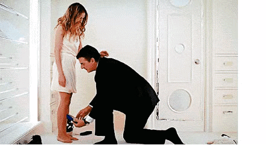
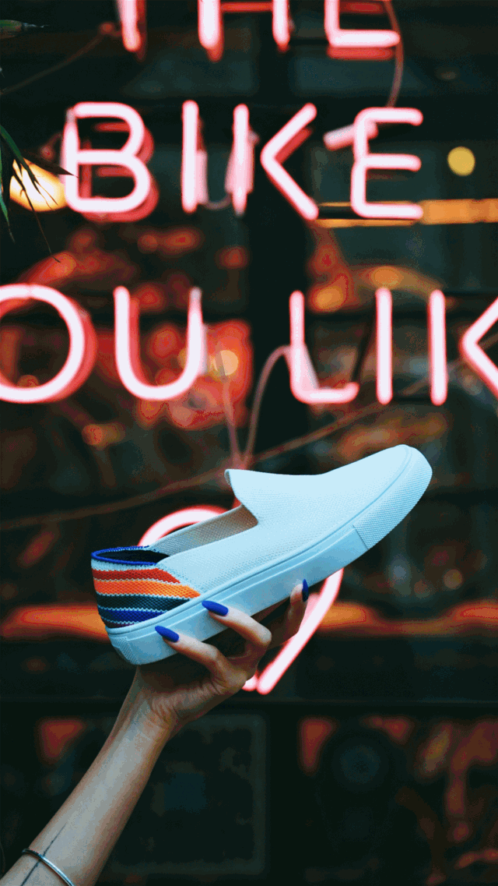
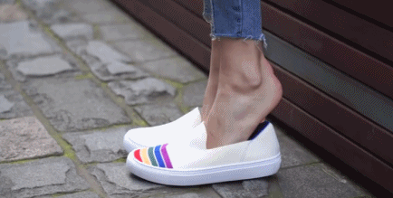
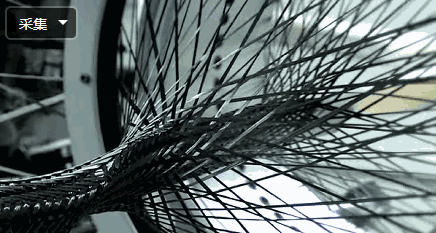
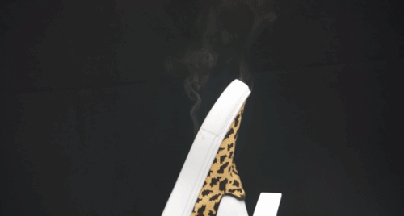
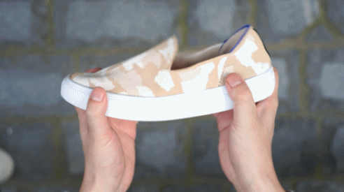
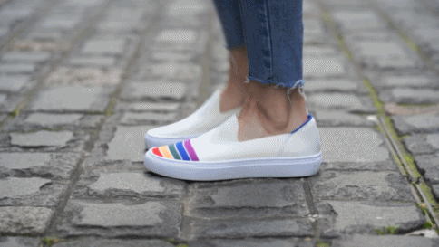
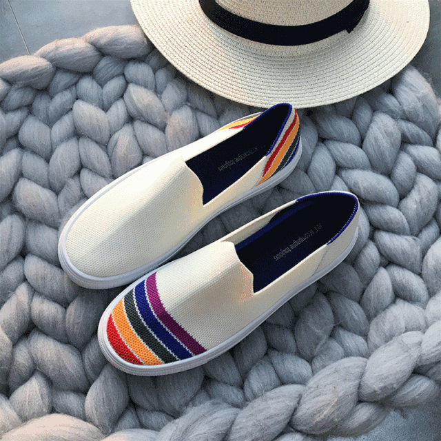

速读摘要

她会为了鞋柜里不下100双400刀的高跟鞋和漂亮的时装而租住在离百货商店不远处的小公寓里，也会为了一个男人而纠结得死去活来。不止单身女子，一双美而实用的好鞋对于所有的女生里说都是重要的。一双穿上就像没穿的鞋子，走起路来一点不累脚，穿上就不想脱下来。一支鞋子只用一根线编织而成，一体成型没有拼接，没有接头，所以穿起来亲肤细腻一点也不会磨脚。与市面一般的针织鞋的原料不同，这款乐福鞋的针织面料原料，完全来自可循环利用的塑料瓶。

原文约 2401  字  | 图片 48 张 | 建议阅读 5 分钟 | [评价反馈](https://static.app.yinxiang.com/embedded-web/clipper/#/Evaluating?d=2020-03-26&nu=0782008a-b3ed-4133-b85b-cb2990a1486a&fr=myyxbj&ud=58b471&v=2&sig=F42617347E2D3E63A890B65253EED5C7)

##  这部20多年前的女子群像，至今依然无人超越

原创 有部电影 [有部电影]()**
提到都市女子群像剧，有一部不能不提起的神作——《欲望都市》。

.jpg)

这部电视剧围绕着生活在纽约曼哈顿的四个女子展开，她们性格各异，是无话不谈的朋友。在纽约这座充满了欲望、野心和诱惑的大都市，她们在爱情、欲望、视野中不断挣扎，又在彼此的支持与慰藉中寻找方向。

剧中的主角，Carrie，是为报纸写情感专栏的畅销作家。

她会为了鞋柜里不下100双400刀的高跟鞋和漂亮的时装而租住在离百货商店不远处的小公寓里，也会为了一个男人而纠结得死去活来。

.jpg)

她浪漫又自由，信奉时尚和爱情——罗曼蒂克式的爱情。

Samantha，拥有最成功的事业。她强大，甚至有些强悍，从不在乎别人怎么看她。

.jpg)

她风情万种，对待感情热情奔放，不愿意交男朋友却一直享受男人，过得潇洒肆意。当她陷入爱河，发现自己变得敏感而怀疑自己时，她会选择转身离开。

Mirranda，一名毕业于哈佛法学院的律师。她高知、理性、独立，她像她的西装套装一样严丝合缝，却不够美甚至还有些古板。

.jpg)

她还是个标准的女权主义者，认为爱情不该是生活的重心，和男人调情撒娇很愚蠢，她会问：“为什么我们这些女人这么聪明能干，却没有其他可以讨论，只能围着男人转？”

.jpg)

Charlotte，一个出生在美国中上阶级家庭的淑女。

.jpg)

她拥有优雅气质，良好教育背景以及体面工作，她的梦想就是嫁给一个足够体面的男人，成为贤妻良母，生一个可爱的孩子。

.jpg)

欲望都市之所以能够称为划时代的女子群像剧，不单单因为它故事中四位女主身边来来往往的男士和情情爱爱，它最美的地方，在于它传达了“女生可以成为任何自己想要的样子”，和比爱情更牢固的美好友情。

.jpg)

不过，很多人爱这部电视剧，是因为它足够时髦。

这部剧也是作为时装剧的里程碑作品，剧中Carrie留下的这句台词，想必很多人也听说过了：

**“单身女子的路并不好走，因此，我们偶尔也需要一双好鞋。**

不止单身女子，我想，一双美而实用的好鞋对于所有的女生里说都是重要的。

但，比起剧中主角鞋柜中那些华丽但鞋跟高耸入云的高跟鞋，我想，大部分女性需要的是一双好穿又好看的鞋子。

对于爱美又犯懒的人来说，一脚蹬乐福鞋才是那双能带你轻松去往更好的地方的最好选择。百搭好穿，再美的高跟鞋都不是它对手。

.jpg)

乐福鞋一向是时尚界长久不衰的经典鞋型，既能出入时尚秀场，也是名模、演员平时逛街、遛狗的最爱。

.jpg)

街拍中，无论是搭配仙气十足的连衣裙还是个性十足的裤装，乐福鞋都能搭出一身经典又不失亮点的look。这样一款能提升穿搭时髦度又看起来毫不费力的单品，绝对是一款女生一定要拥有的鞋子。

.jpg)

今天，就给大家推荐一款**ins博主们都在穿的超美“编织乐福鞋”，号称“走一万步都不累脚的百搭单鞋！”**

浅口、低帮的设计，能展示出女生纤细的脚踝。增加一点露肤度，是春日穿搭里装作不经意的小心机。

一脚蹬的设计又让穿脱超级方便。不用系鞋带，蹬上就能走。无论是开车穿，逛街穿，还是上班穿都非常合适。

鞋子也是超美超时髦，复古轻奢的风格，搭配绝美的配色花纹，像是把春天穿在了脚上。穿上它既有成熟女人的大气，也有小巧女生的精致感！

.jpg)

它的3cm厚底，不仅显腿长还柔软不磨脚，而且比纯贴地平底鞋更加跟脚、好穿。针织面料透气清爽，特别适合春夏穿~

.jpg)

而且价格同样美丽，百元价格就能买到颜值炸裂的鞋子，完全没有挑剔的理由。这种人见人爱的百搭单品，必须安排上啊，姑娘们刷街就靠它了！

.jpg)

喜欢关注时尚的姑娘们一定早就在街拍中见过这种乐福鞋。

.jpg)

欧美街拍中也经常能见到这种款式的鞋子，时尚、百搭又舒适，时髦精们都在穿。

.jpg)

这种乐福鞋的圆头能完美兼容每一种不同的脚型，比运动鞋球鞋更正式，也是日常通勤的绝佳选择，容易穿出时髦感！

.jpg)

复古花色款，无论是俏皮的彩虹款还是女人味十足的豹纹款，每一款都美到犯规，很特别。穿上青春减龄，不用费脑子就能轻松穿出时髦感。

.jpg)

可以性感小女人感十足，也可以街头气息满满，简单的LOOK都很出彩！

.jpg)

纯色“一脚蹬”是比较经典的简约款，自带休闲属性，出街度假怎么穿都不会出错。

.jpg)

无论是搭配性感的蕾丝衣服，还是搭配正式一点的通勤装都很很OK，比高跟鞋多了一份舒适，又能轻松彰显出个人的时尚品味。

.jpg)

3cm的跟高穿上无形中增长身高，可以很好的修饰腿型，显腿长。春天可以光脚穿也可以搭配船袜穿，露出性感纤细的脚踝，别提多好看了！

.jpg)

这双乐福鞋不仅仅时髦又百搭，还特别的舒适。一双穿上就像没穿的鞋子，走起路来一点不累脚，穿上就不想脱下来。

.jpg)

创新采用先进的了3D纤维编织工艺编织而成，根据1000个亚洲女性的脚部数据，最终设计成一个超级适合亚洲女性的脚部模型，再根据模型进行编制。

**一支鞋子只用一根线编织而成，一体成型没有拼接，没有接头，所以穿起来亲肤细腻一点也不会磨脚。**

.jpg)

鞋头采用圆形设计，不挑脚型胖瘦脚都能穿。鞋头稍稍隆起为前脚掌提供了更多的活动空间，减少了鞋子本身对脚部的限制，穿着更自在。

.jpg)

鞋面整体都是3D飞线编织而成，穿起来细腻柔软又非常的透气，夏天穿也不用担心会臭脚。

而且它完全是根据人体力学设计，鞋底采用超轻便的橡胶鞋底，上脚像踩在棉花里。

脚感轻盈软弹，所以穿上脚特别舒适不累脚，比我之前买的任何一款平底鞋都要舒服。

更贴心的是，对于脚踝窝极浅的“单鞋困难户”也依然能跟脚，跑跳自如。

随时随地蹬上就能走，简直不要太方便。鞋柜有它坐镇，逛街、旅行说走就走，走路脚下都带风~

.jpg)

**点击图片进入购买链接**

[.jpg)](https://mp.weixin.qq.com/s?__biz=MzI3ODM3MDAzMQ==&mid=2247499766&idx=2&sn=ec6c8aaeb17b8953450517c68b96b3fd&chksm=eb5abc76dc2d3560dfc038ef7ce98cb69a46217a9e5574ec342f3ffcf7d20eac97cdede7140e&mpshare=1&scene=1&srcid=&sharer_sharetime=1585264694880&sharer_shareid=badd687b22e02cbea2bccedfd5f757de#rd)

时尚界一直关注于环保和新材料的开发。现如今，很多一线大牌都已经放弃了直采原料进行生产，提倡采用可循环、可降解的环保材料来开发新品。

.jpg)

比如PUMA、NIKE就推出可降解、可循环利用的产品，作为新一季的鞋品推出。

.jpg)

与市面一般的针织鞋的原料不同，这款乐福鞋的针织面料原料，**完全来自可循环利用的塑料瓶。**

.jpg)

回收的塑料瓶经过清洗消毒后，碾碎成微小的塑料颗粒，热熔后再拉成丝线。这些塑料拉丝在经过染色后，编织成鞋子。

.jpg)

用这种面料生产的鞋子被称为“对地球环境最友好的鞋子”。这样生产出来的鞋子不仅让原本可能会造成污染的材料变得可持续，而且还极大的减少了生产过程中的能耗。

.jpg)

而且因为是橡胶底加上针织面料设计，所以柔软耐磨，久穿不起皱、不变形，鞋子还自带速干特性。

.jpg)

**点击图片进入购买链接**

[.jpg)](https://mp.weixin.qq.com/s?__biz=MzI3ODM3MDAzMQ==&mid=2247499766&idx=2&sn=ec6c8aaeb17b8953450517c68b96b3fd&chksm=eb5abc76dc2d3560dfc038ef7ce98cb69a46217a9e5574ec342f3ffcf7d20eac97cdede7140e&mpshare=1&scene=1&srcid=&sharer_sharetime=1585264694880&sharer_shareid=badd687b22e02cbea2bccedfd5f757de#rd)

16个别具一格的清爽款式，几乎每一样都适合春夏的穿搭。时髦精们的必备款。无论是上班还是出游，轻松完成不同的场合需求！

明星超模到时尚达人人手一双的乐福鞋，低调而独具奢华感的设计复古又吸睛。优雅中带着俏皮的气息，随便一拍都是国际大片的既视感！

.jpg)

搭配裤子显得简约帅气，一搭裙子立马温柔，充满春天的气息。完全不挑脚型不挑人，任何人都能驾驭，谁穿谁美！

.jpg)

**优雅气质又个性十足的乐福鞋，春日里的百搭单品，一双仅仅百元价格~~OMG，买它！早穿早美，早买早享受！**

**点击图片进入购买链接**

[(L)](https://mp.weixin.qq.com/s?__biz=MzI3ODM3MDAzMQ==&mid=2247499766&idx=2&sn=ec6c8aaeb17b8953450517c68b96b3fd&chksm=eb5abc76dc2d3560dfc038ef7ce98cb69a46217a9e5574ec342f3ffcf7d20eac97cdede7140e&mpshare=1&scene=1&srcid=&sharer_sharetime=1585264694880&sharer_shareid=badd687b22e02cbea2bccedfd5f757de#rd)

在看