速读摘要

据说这个住宅区位于城市近郊，不仅远离噪音污染、购买性价比高、配套设施完善，而且邻居们友善包容，引来不少人的抢购。在这一次次的失败之后，汤姆陷入了无能狂怒情绪，直接点燃窗帘，把房子烧了。直到汤姆因为男孩与杰玛产生裂缝，并开始沉迷"自掘坟墓"后，那种双人镜头便逐渐消失。取而代之的，是大量空旷简洁的单人画面，甚至让杰玛与变种人成排出现，隐喻着男女主关系的疏离割裂。当男女主将变种人抚养长大后，却被他推至门外、霸占房屋的剧情，则很像社会中被子女啃老到死的父母们。

原文约 2359  字  | 图片 36 张 | 建议阅读 5 分钟 | [评价反馈](https://static.app.yinxiang.com/embedded-web/clipper/#/Evaluating?d=2020-04-03&nu=09b8775c-de15-4861-9474-d4a7fcc4d661&fr=myyxbj&ud=58b471&v=2&sig=7E03143279E9EB0B1DB354CDF660492A)

##  这部惊悚科幻脑洞片，简直是大型反婚反育宣传片

原创 有部电影 [有部电影]()**
开门见山，今天给大家分享一部科幻悬疑片。

它由“卷西”杰西·艾森伯格主演，凭借脑洞大开的设定、生猛猎奇的画风，之前在戛纳上映时就收割了不少关注——**《生态箱》。**

.jpg)

片中的主角杰玛和汤姆，是一对甜蜜恩爱的小情侣。

他们在一家幼儿园担任教师和园丁，虽然薪水不高，但仍然想买套自己的房子安定下来。

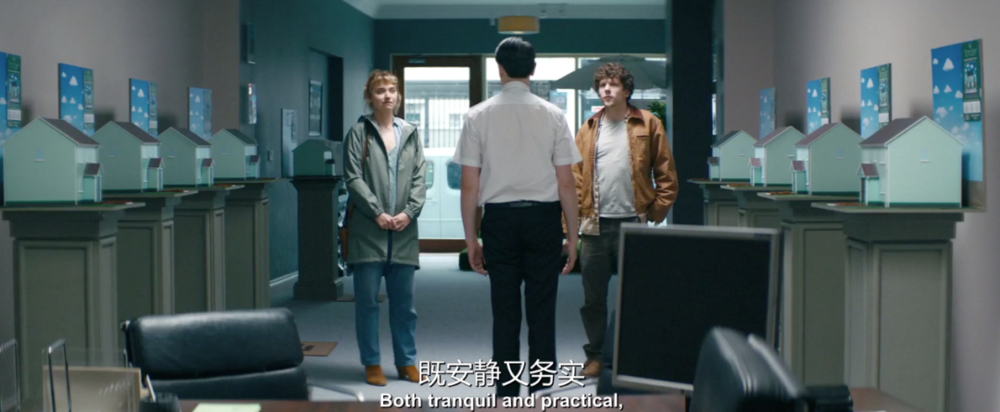

这天下班后，俩人在售楼员马丁的安利下，去一个名叫“远方”的新开发住宅区看房。

据说这个住宅区位于城市近郊，不仅远离噪音污染、购买性价比高、配套设施完善，而且邻居们友善包容，引来不少人的抢购。

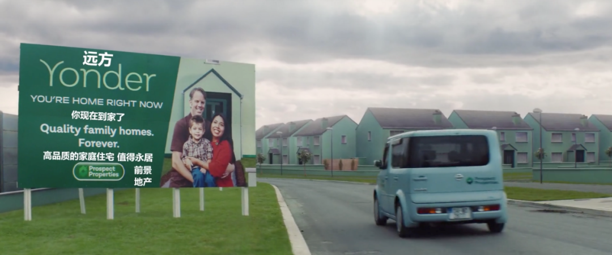

但两人一路驾车抵达目的地后，才发现眼前处处透着诡异——

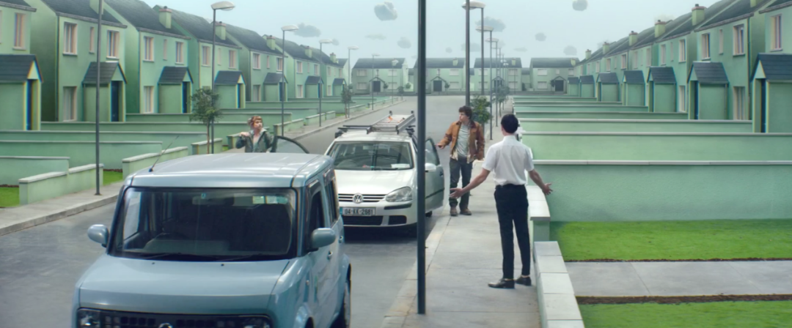

比如这里的每栋房、每条街都长得一模一样，整齐得不正常，像迷宫一样望不到头；

还比如房子里装修精美、家具齐全，堪比拎包入住的样板间，但什么样的开发商，会体贴到连睡衣都给房主备好呢？

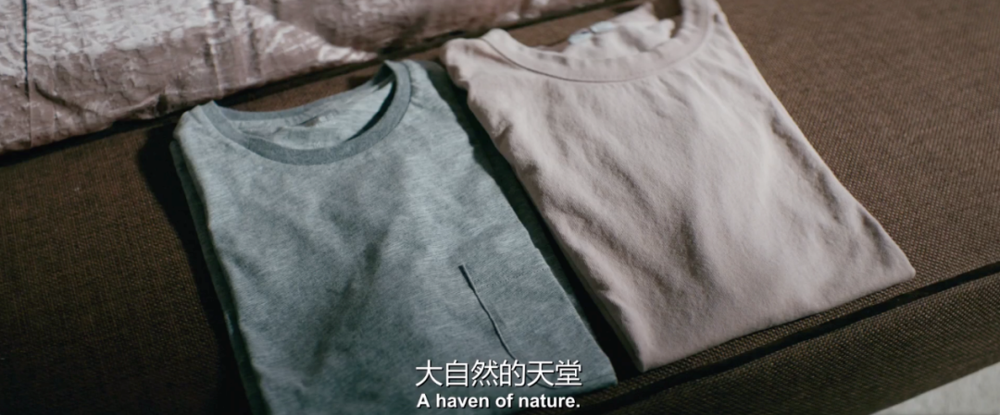

不仅如此，售楼员马丁还突然不告而别。

两人越想越邪门，根本不敢在房子里多待，直接出门上车、准备离开这里。

但诡异的是，无论他们怎样兜兜转转，结果都像鬼打墙一般，绕回到9号房门前。

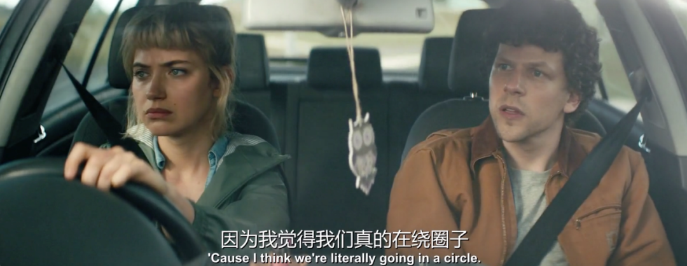

而且这地方没手机信号，一个活人也见不着。两人从天亮开到天黑，最后不得不停靠在老地方，准备借宿一晚再想法离开。

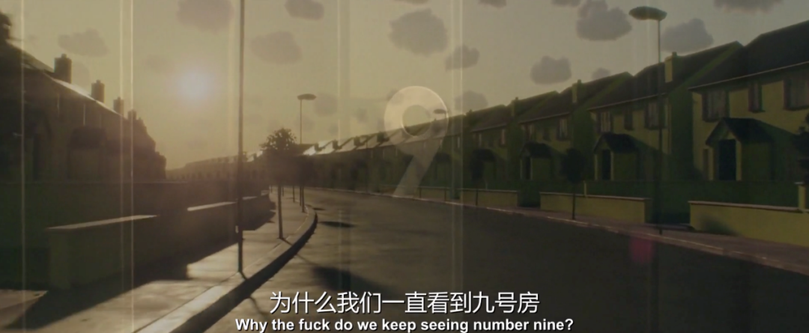

到了第二天，他们又是搬梯子爬房顶，寻找正确的离开路线；又是向着太阳徒步，穿花园、翻栅栏、抄近路，却同样未能如愿。

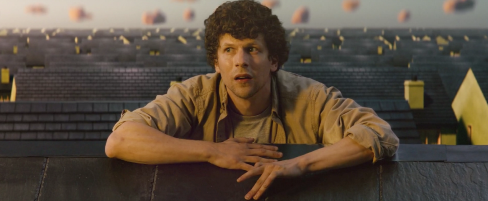

直到俩人走得精疲力竭之际，突然看到有栋房子亮着灯，迫不及待跑上前求救。

结果没想到，这栋房子就是9号房。

在这一次次的失败之后，汤姆陷入了无能狂怒情绪，直接点燃窗帘，把房子烧了。

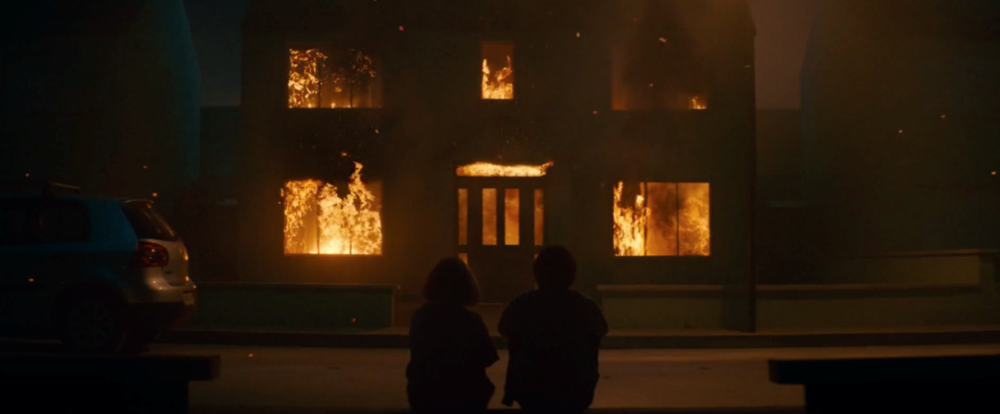

于是这一晚，两人只能露宿街头。等他们重新醒来时却惊恐地发现，面前的9号房居然又恢复了崭新的模样……

不仅如此，房门前还不知被谁放了个纸箱，箱内装着刚出生的男婴和生活补给，旁边写有“把孩子养大”一行字。

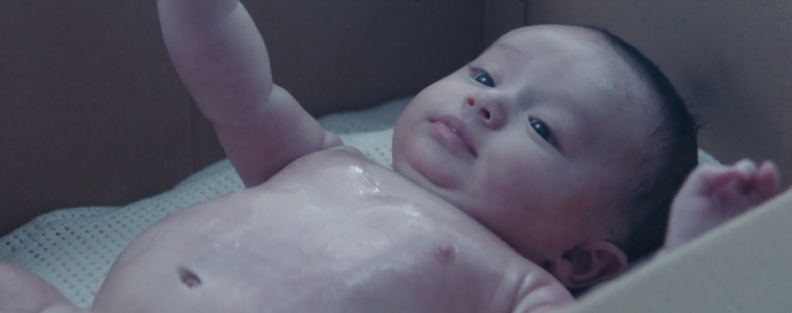

至此两人才意识到，这个社区背后隐藏着神秘力量，而自己是被困在这里当爹妈了。

随后的日子里，他们一边靠着定期送上门的补给生存下去；一边又盼望着得到救援，不断寻找与外界联系的方式。

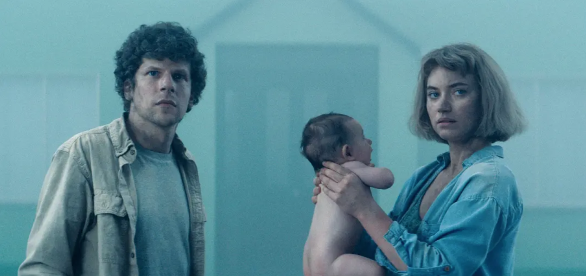

转眼98天过去，两人渐渐发现，这孩子根本不是个正常人。

他不仅发育速度极其迅猛，三个月看起来像三岁大；还能随时随地观察“父母”，学习两人的言行举止。

但每当感到饥饿或有其他需求时，他却只会发出刺耳尖叫。

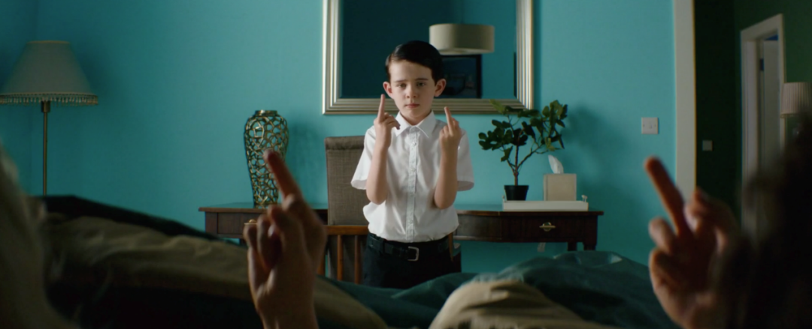

更诡异的是，男孩每晚都要津津有味地收看电视。

但电视里只有奇异的符号与音效，仿佛在以神秘语言，向他传递着什么讯息。

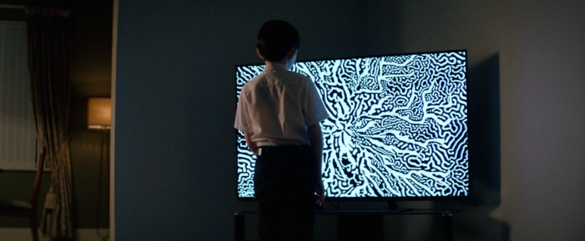

可想而知，这种日复一日的诡异生活，很快就要把男女主逼疯。

汤姆先是想弄死男孩、逼出幕后黑手，却被心软的杰玛阻止；随后他又开始在院子里挖洞，幻想能挖穿社区向外界求助，甚至干脆睡在了土坑里。

而独守空房的杰玛，只能独自担负起照顾男孩的责任。

她由一开始的不情愿到习以为常，甚至从对方身上获得了陪伴的温暖，两人变得形影不离情同母子。

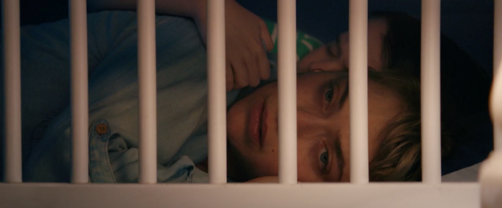

为了找出社区背后的秘密，杰玛不断通过模仿游戏来套话。

结果有一天，男孩的淋巴上鼓起双鳃，终于露出了变种人的真面目，当场把杰玛吓个半死。

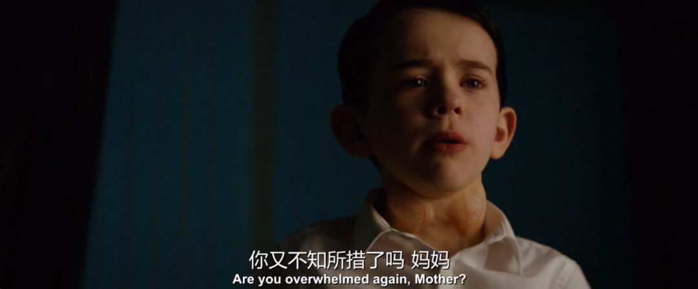

一年后，男孩已经长成了男人。

而日夜挖坑的汤姆却落得一身伤病，最后死在了杰玛的怀中。

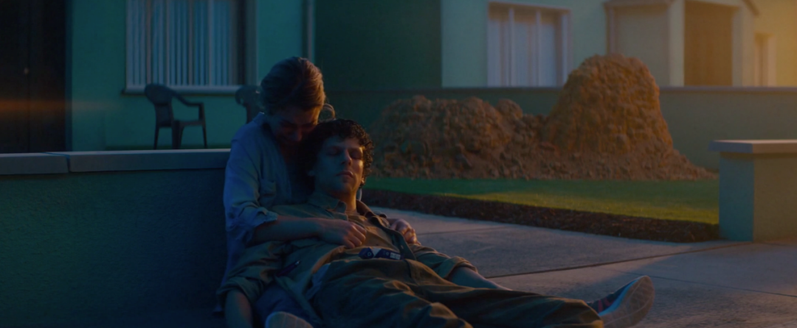

尽管杰玛苦苦哀求，变种人也没有施救，还冷漠地拿出尸袋，将汤姆扔进了他自己挖下的坑里。

这个行为彻底激怒了杰玛，她在万念俱灰下举起铲子，要跟对方拼个你死我活。

但万万没想到，变种人竟然掀开路基，像虫子一样钻了进去……

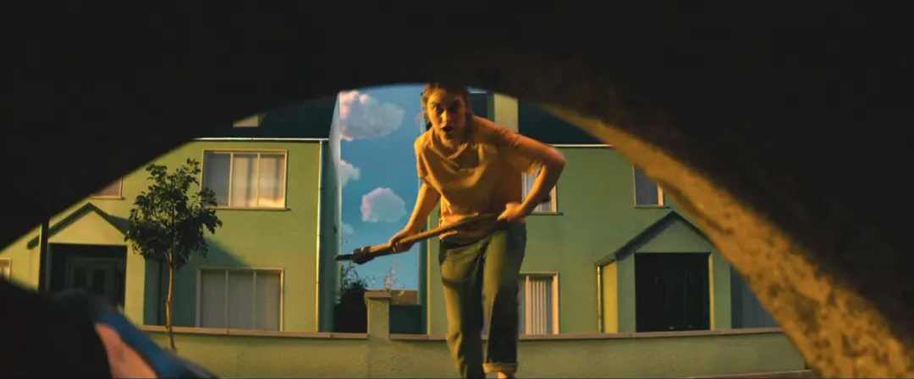

估计看到这里，不少人的反应都是WTF。

没错，这是一部通过高能的设定、怪诞的视听语言来展现当代人心理症候的惊悚片。

影片在戛纳首映时曾被观众诟病像“《黑镜》的剧场版”，事实上导演罗根·费纳根，也确实曾做过《黑镜》的剪辑师。

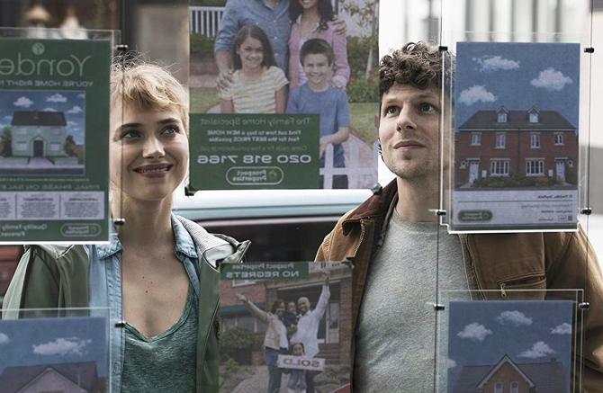

总的来说，《生态箱》在叙事节奏、深度挖掘上有所欠缺，但对于喜欢怪诞惊悚片的小伙伴而言，影片仍有不少值得一看的地方。

首先从视觉层面来看，影片的光影色调似乎参考了比利时画家雷尼·马格利特的风格，用色彩单一的住宅区、油画式的云朵，包括加入对称式构图，营造出一种呆板压抑又充满梦幻的超现实主义气质。

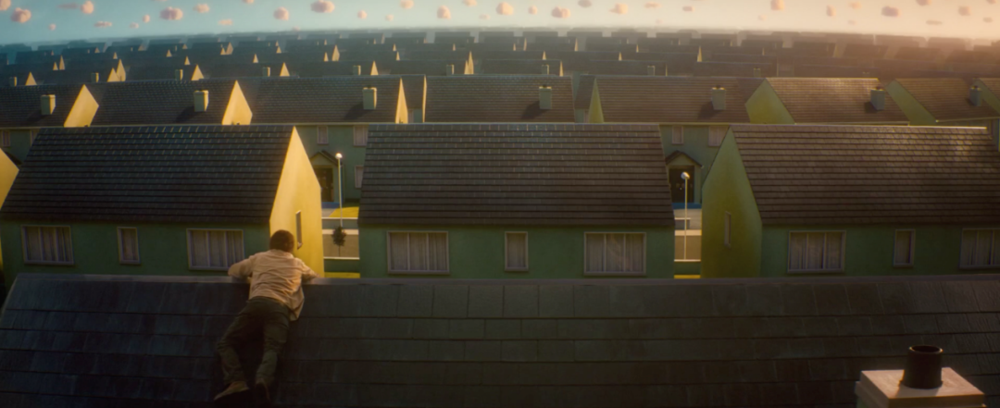

尤其是当杰玛跟随变种人钻进地下后，一路在不同维度的9号房内穿越、看到不同情侣被困在这里的场景，堪称波谲云诡、震撼视听。

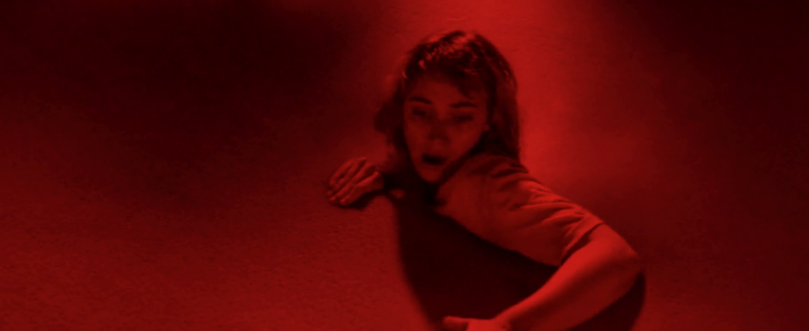

而通过巧妙的构图和镜头语言，导演将男女主角的关系转变，不动声色地呈现出来。

比如刚住进来时，俩人无论吃喝拉撒还是睡觉，都是成对出现在画面里；

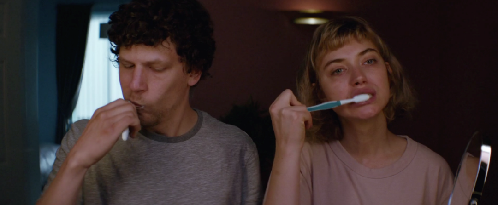

直到汤姆因为男孩与杰玛产生裂缝，并开始沉迷“自掘坟墓”后，那种双人镜头便逐渐消失。

取而代之的，是大量空旷简洁的单人画面，甚至让杰玛与变种人成排出现，隐喻着男女主关系的疏离割裂。

.jpg)
.jpg)

其次，从文本表达来看，它同样有着多重解读空间。

影片开场就以布谷鸟“鸠占鹊巢”，将其他幼鸟推出鸟巢、等待鸟妈喂养的场景，预示了变种人霸占人类家庭、男女主角惨当接盘侠的剧情。

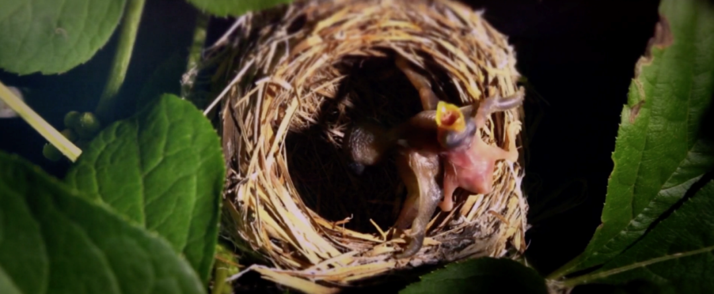

而通过这段“鸠占鹊巢”的寓言故事，影片引申出了对年轻人的房贷压力、父性与母性的教育差异、适者生存的自然法测、现代社会人际关系疏离等诸多问题的思考。

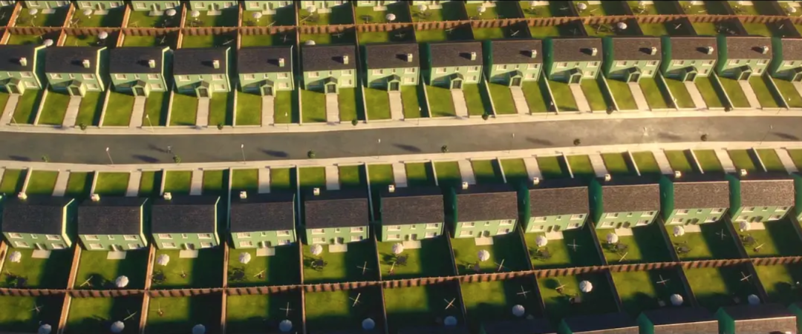

据说影片中的画面灵感，就源自爱尔兰新开发的一个住宅区。那里有着崭新的绿色房屋、压抑呆板的街道，并且始终没有人入住。

而男女主的受困遭遇，则像极了被房价裹挟的中低收入年轻人，即使购买了不合心意的房子，也只能为了还贷过着乏味的生活，像坐监一样无法逃离。

当男女主将变种人抚养长大后，却被他推至门外、霸占房屋的剧情，则很像社会中被子女啃老到死的父母们。

所以有不少网友在看完《生态箱》后，戏称它又是一部**“大型反婚反育宣传片”。**

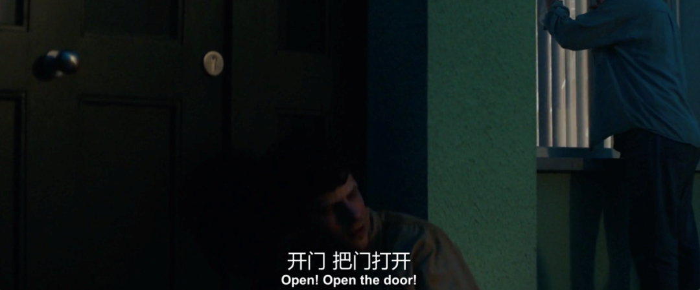

此外，片中汤姆和杰玛对待男孩的方式，也映射了家庭教育中“慈母严父”的差异——

汤姆每天在外埋头于工作（挖坑）、寡言少语，与男孩甚少交流，当男孩尖叫大闹时，他也只会用暴力手段施以惩戒。

而杰玛虽然嘴上说着“我不是你妈”，却不由自主地承担起了育儿责任，煮饭、哄睡觉、玩游戏、讲道理，还从汤姆手中救下了孩子。

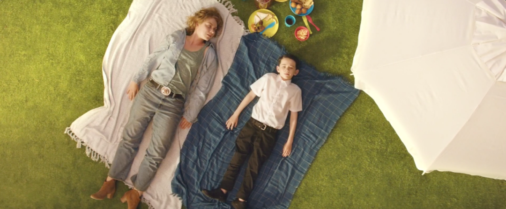

还有影片开场时，汤姆曾为摔下树的幼鸟挖坑埋藏，后来他又被更强壮的变种人埋入坑里，体现出一种弱肉强食、适者生存的自然法则。

所以在影片最后，当杰玛也变得愈发虚弱时，她便步入了汤姆的后尘。

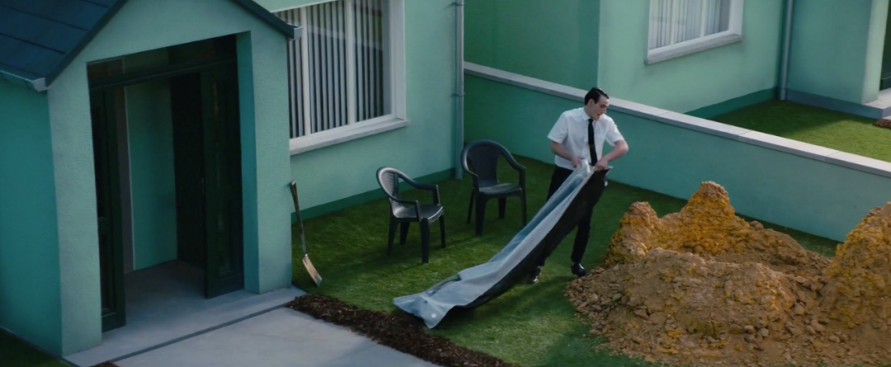

而终于迎来鼎盛之年的变种人，则回到市中心的房产中介所，用同样方式取代售楼员、成为新一任的“马丁”。

换句话说，影片故事又将开启新一轮的循环。

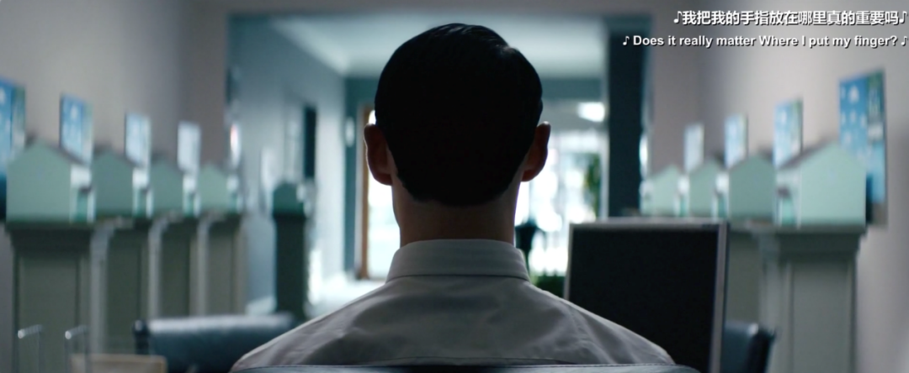

这样的结尾令人细思极恐，它隐喻了以上种种社会问题，还将在更多代人身上继续发生。**正如黑格尔说“人类从历史中学到的唯一教训，就是没有从历史中吸取到任何教训”。**

**那么在我们这一代人身上，可以从自我改变做起，不要让历史上发生过的社会悲剧重新上演吗？**

也许是国内最认真的电影自媒体
长按扫描二维码关注

**请点个在看**

在看