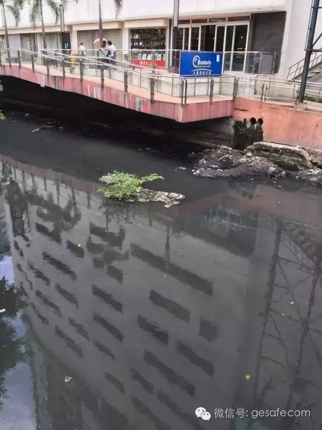

**<文章来自网络选摘，如果有侵权，请告知>**

# 刚从菲律宾回来，谈谈我对这个国家的观感吧

2016-07-17南宫浩 格上理财 格上理财
作者：南宫浩
来源：故事长沙（ID：changshastory）

几天前，菲律宾关于南海问题诉中国仲裁案，使得国内一片喊打喊杀的声音，很多人也是不明就里，胡乱起吆喝。我正好刚从菲律宾首都马尼拉回来，就谈谈自己对这个国家的观感吧。

这次出行我没跟旅游团，而是住在长沙老乡姜总的家里（富人区）。据我亲眼所见，富人区大部分住的是华人和白人。我也特意探访了一桥之隔的贫民窟，基本没有华人的身影。

这个国家80%财富掌握在仅占人口总数2%的华人手里，菲律宾的地产业、电信业、快餐业、博彩业几乎被华人垄断。在《福布斯》杂志2015年选出的11名菲律宾亿万富翁中，有9个是华人。但菲律宾人基本没有针对华人族群的报复行为，这一点跟印尼截然不同。

菲律宾是华人与当地社会融合得很好的国家，不仅在商界，政界也有不少华人的身影。以我个人的观感和几个长沙老乡（在马尼拉呆了15年）的说法，这个国家的人民真的是非常友善和老实的（不包括政客）。试想，如果长沙最赚钱的产业被外国人垄断，长沙的高档住宅被外国人占据，长沙伢子不造反才怪呢！

## 一、保姆的轻功很好
菲佣的名气很大。这次我算是见识到了。

长沙的保姆把家务做完了，会看看电视玩玩电游什么的。菲律宾这边没有这一说。基本上，主人或客人在的时候，你看不到佣人在客厅里晃来晃去。她们躲在某个角落里随时待命。她们会在饭点前一个小时来问一句：在家用餐吗？得到答复后立刻消失了。

在老姜家的洋房吃第一顿饭，菲佣把饭菜准备好，人就不见了。我还在那里现灵泛，到处寻佣人来一起上桌。

朋友老姜说，这边的保姆不跟主人一起用餐的。我说，你这鳖太没人性了吧？老姜笑着解释道：刚来的时候，我也觉得不太好，后来才晓得，这是她们的习惯，或者叫规矩吧，你请她她也不会上桌。

菲佣和装修工一起用餐，非常简单的食物，吃得很开心。华人只占菲律宾人口2%，却占有80%的财富。所以菲律宾人民算是很乐天知命了。
吃完饭，我又现勤快准备收拾餐桌。老姜阻止：你不要动！回头朝屋里喊了一声，两个菲佣和一个司机拿着碗筷上来，把我们吃剩的菜坦然干掉，然后收拾餐桌到厨房里清洗。
菲佣的轻功很好。一是脚步极轻，绝对不会造成打扰；二是做家务声响很小，绝不发出多余的噪音；三是佣人之间不会当着主人或客人的面大声说话。
住了两天我才发现，连大门都有两张：一张正门是供主人进出，一张侧门是供佣人和司机进出----不是老姜故意装逼，洋房都是这么设计的。
卫生间奇多。每一间卧室都配有单独的卫生间。即便佣人和司机的卧室非常逼仄，仅容放下一张床，但也单独配有一个卫生间。公寓、洋房、别墅无不如此。

老乡的豪宅在搞装修，比较奇怪的是，这么大的房子没装中央空调，而是好多台挂机。
一个佣人的月工资，折合人民币一千多元。

菲律宾人从来不认为做佣人是低贱的工作，她们很明白自己的社会地位，清楚自己的工作性质，主仆关系比我们自己还理得明白。面对与主人财富上的差异，从不会产生心理不平衡。

但是，老姜告诉我，主人若不讲道理，太过分，他们会毫不犹豫的辞职走人。别看菲佣做事低声下气，内心其实是有很强的民族自尊心的。

但凡民族自尊心很强的国家，一般历史上都被殖民甚至奴役过很长时间。菲律宾人也是多灾多难，前后几百年，分别被西班牙、美国和日本殖民过，二战后又好长时间跟美国纠缠不清，至今菲律宾人民对美国是又爱又恨。

马尼拉的美军纪念公墓，里面是几千座二战中跟日军作战时死亡的将士墓碑。你拉大看，那密密麻麻的白色点点就是十字架。这个陵园的草地非常整齐、漂亮。

## 二、走错路都是游泳池

菲律宾很多设施都比中国落后，唯一超越的是游泳池。
这次去菲律宾，我没有住酒店。分别住了五个地方：老姜公司的员工公寓、洋房、别墅、以及他司机的乡下平房。使我惊奇的是，这几个地方无一例外，全部都有游泳池。

乡村的游泳池，我左手指的方向是一棵芒果树，果子摘下来就能吃。

菲律宾的游泳池跟长沙的颇有些区别，一是平时无人看管。长沙的泳池开放时间必设救生员至少一名，还有其他管理人员等，但菲律宾的泳池，只有清洗员每隔一天来清洁池壁和换水。无人看管，也就意味着完全免费。

二是游泳的人很少。大部分时间空无一人，裸泳都没人看见。人最多的时候也就十来个人。
三是泳池都不大。最大的也就比篮球场大一点。因为池小，所以换水很勤。特别是乡里的那个泳池，几乎每天换一次水。当地的井水。

那晚到达马尼拉的乡里，已是凌晨两点。我们此行的目的是搞农家烧烤。一下车，大家借着昏暗的灯光和手电筒架炉子生火，忙活开了。我由于这几天游泳上了瘾，看到旁边有个泳池就直接跳下了水。昏黄的灯光下，泳池的水显得光怪陆离，感觉好特别......突然想起他们路上谈过鳄鱼什么的......赶紧爬上来问：“这个不是鳄鱼池吧？”黑暗中传来老姜的回答：“你游两圈就知道了！”

农家烧烤旁的游泳池。我这鳖小农意识强烈，看到不要钱的泳池就往里面跳。几乎每天游三场泳。我又爱早起，早上6点一起床就往泳池里一躺，真怕自己一个回笼觉睡着去。
菲律宾游泳池多，博物馆也多，哪怕是很偏远的小城市，也谈不上多久的历史，也会有个博物馆。这就是民族自尊心和自豪感的体现。
不过菲律宾人可能不爱看书，书店很少。

## 三、搭讪菲妹

七月的菲律宾正逢雨季。从长沙出发之前，我特意查了一下马尼拉的天气预报，尼玛，天天有雨！一路担心着自己悲催的命运。到了马尼拉才知道，这边的高温和湿热跟长沙的三伏天没什么二样，但所谓的天天有雨跟长沙的连绵阴雨截然不同，每天最多下一个小时，就云开天朗。

马尼拉美军基地海滩，这里是十年前废弃的一处美国军事基地。

我从SM购物中心出来，正逢着暴雨倾盆。朋友的车子离我五六十米的距离，我正准备冒雨冲过去，被身后的人叫住。回头一看，一个身材瘦长的少妇递给我一把伞。她撑着伞送我到车旁，又自己走回来，裙子的下摆都被打湿了。我开始以为她是商场的导购什么的，后来发现她只是路人。我简直感动坏了！

长沙妹子算是大方的，不怯场。但菲律宾的妹子的落落大方和友善则更胜一筹。

有一回，我乘坐的士车遇到红灯，旁边一辆车的后座有两个学生妹。我有心搭讪，但英文有限，只好挤眉弄眼抛个眼神什么的，两个女孩看见了立马嘻嘻哈哈笑开了花，最后居然摇下车窗主动向我招手。吓得我花容失色不知如何回应，幸亏车子启动，很快就彼此相忘于江湖。

### 长得还不错的收银员小妹。

路遇菲妹（无论是学生妹还是大龄女青年），我只要竖起拇指讲一句“beautiful ”，对方就会有礼貌地回应甚或主动攀谈，满面春风，绝对不会给你一点难堪。感受到的是友善，而非淫荡，更不用担心被“杀猪”。

我只深悔读书的时候没能深研英语，导致仅限于眼神和肢体语言，无法进行更深层次的情感交流。

### 马尼拉街头漂亮的小巴士。

我也没办法问她们对南海问题的看法。不过通过一些媒体报道，我还是大概有些了解。菲律宾普通人人其实并不太关心政治，又由于不怎么看书，对于南海问题有多么复杂并不清楚。

他们只是看地图，觉得尼玛这地方就在我家门口，离你中国大陆那么远，凭什么就是你的啊？再加上当地媒体的煽风点火，当然就会对中国有意见，顺带对中国人也产生负面情绪。
但大多数菲律宾人都不想与中国发生冲突。从历史上看，除了进行了反殖民斗争以外，菲律宾人从没有与外敌进行过战争。

### 马尼拉的唐人街。

何况，菲律宾人都知道，他们的经济发展已经离不开中国。当年因为菲律宾反华，中国政府只暂停了中国游客赴菲旅游和部分对华的香蕉出口，菲律宾就受不了了，旅游收入下滑很明显，且对当地农业造成了巨大的打击。

## 四、探秘贫民窟
如今，亚洲很多国家都面临人口老龄化问题，但在菲律宾不存在。
50年前，菲律宾的人口总数和泰国持平。2010年泰国人口是6426万，而菲律宾是9409万人口，已经成为世界上人口第12多的国家（2015年突破1亿）。
菲律宾人口年增长率超过2%，是东南亚人口增长最快的国家，一对夫妇平均有3到4名子女，但大部分人丁众多的家庭来自贫穷阶层。
所以曾有菲律宾总统提倡国民自由使用安全套，来降低人口增长。他说已经做好被逐出天主教会的准备（菲律宾80%的人信天主教）。

马尼拉这座城市人口密度还是蛮大的，排名全世界第15位。
因为贫穷，所以做佣人的多，贫民窟当然也就规模比较大。

对于国外的贫民窟，我一直充满了好奇，想去看看。老姜的家人警告我，贫民窟的犯罪率很高，你一个人最好别去，但我给自己算了算八字，应该不会这么早就挂，所以还是偷偷跑去了。

马尼拉的贫民窟离富人区仅一桥之隔，却完全是两个世界。

刚开始进入时，感觉跟长沙的老街巷很类似。小卖部、菜店、张扬的内衣内裤，透过窗户能看到屋里摇头晃脑的电风扇.......再往里面走，空气变得污浊，地面上污水横流。

毗邻贫民窟的一条臭水河。据说贫民窟的小孩经常在里面洗澡游泳，我没有亲见，不敢确定。这河水太臭了，简直不能想象。

这里的房屋是一层层搭建上去的，如积木般不牢固。顶层往往是薄铁皮的屋顶，在正午阳光的暴晒下恰似一块铁板烧，看着心里都热得慌，真不晓得怎么住人？堂客们面带微笑在脚盆里洗着衣，刚学会走路的婴孩光着脚在污水里走来走去，三四个儿童认认真真地做着游戏，蛮开心的样子。男人们一律赤膊，站着墙角里无所事事。我望见每一个窗台上都摆着着几盆盆栽，红的紫的黄的，跟富家花园里的一般鲜艳。他们也一样热爱生活。

越往里面走，道路越狭窄。最后，路径到了胖子过不了身的地步，让人喘不过气来。突然感觉有点不太对，好多闲汉用诧异的眼神看着我。我不敢拍摄他们，就退出来了。

### 马尼拉的贫民窟。
后来当地的朋友说：你他妈一个人敢进去了？我们呆了十几年了都没进去过！把你做了炖汤都不会有人知道。一个月后才会在电视里看到你的新闻。
我呵呵一笑，心里认为这是歧见，事实上并不至于。

## 五、还不错的湘菜馆

出发之前，我做了一些功课。一个住荷花池的朋友老雷告诉我，他当年在马尼拉读书时，经常去一家叫“游姐小炒”的中餐馆，常德菜做得非常地道，而且大厨王哥能够把湘菜的做法融合到菲律宾海鲜之中，非常入味。他们一帮湖南同学每逢生日都会去聚餐，留下了无数值得回忆的美好片断，甚至他现在的堂客都是在这个餐馆认得的。

可惜的是，去年他携堂客故地重游，这一家“游姐小炒”已经搬走了，到处打听都没能找到。

### 好大一只的虾蛄。

马尼拉的大型商场很多，规模数倍于长沙的最大型商场。商场里很多餐饮店，一看名字就知道是中国人开的，什么“超群”、“永和大王、”“快乐蜂”，各式米饭套餐，感觉是江浙口味，偏甜，价格还都不便宜，但人气很旺。麦当劳、肯德基倒是生意清淡不少。

老姜带我来到当地最大的海鲜市场——SEASIDE吃海鲜和湘菜。这家餐馆的干净程度超乎想象后来我才了解到老板娘有洁癖）。地面和桌面一律白色，异常的明亮整洁。一般餐厅的装潢敢用白色的不多。每张桌子上配有一个蒸汽锅，即方便又能最大程度的保留海鲜的原味。另有两个特色招牌菜令人印象深刻：炒卤牛肉和香叶鸭。在国内也难吃到这么地道的了。

调好汁后清蒸的生蚝，也很好吃。

老板是四川人，老板娘是常德人。聊着天，我向他们打听“游姐小炒”。万万没想到，老板娘居然回答：“我就是游姐。”我目瞪口呆，再一问，果然是从原址搬迁过来的。改名叫“游姐厨房”，难怪老雷在网上搜不到这家店。我速速跟老雷发微信，告知我巧遇游姐的消息。老板二话没说，装了一盒子亲手做的卤牛肉，非要我带回长沙给老雷。

巧遇常德妹子“游姐”的新店，口味很不错。

菲律宾之行很开心。彼时，南海仲裁事件还没发生，我不知道几天后网上会有这么多愤青对这个小国家（相对于我们而言）磨刀霍霍（当然是嘴巴上的），我想告诉你们，菲律宾人其实一点都不好战，不崇尚暴力，他们的文化比较温柔，当地有很多相关谚语，其中一句叫“天天拿刀的人，终将死于刀下。”

抛开别有用心的政客不讲，我觉得菲律宾老百姓的心态是非常平和的，安贫乐道，大约就是这个民族的主要性格特征。
所以，咱们也平和点吧，要不然显得太没大国风范，而且不厚道。

**作者介绍：**
南宫浩:70后长沙人，四方坪第二才子。著有长篇小说《鸡零狗碎的青春》、网文《致国足挑战书》及美食专栏文章若干。

