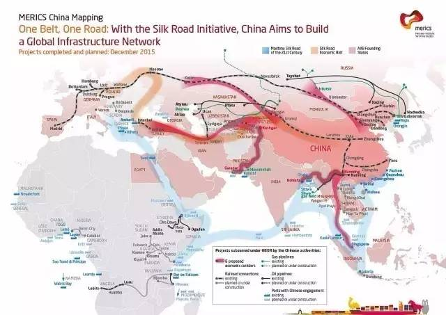
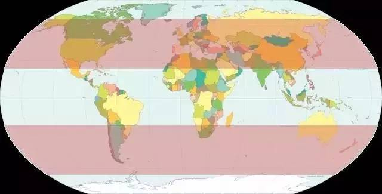
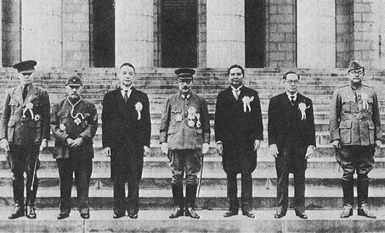
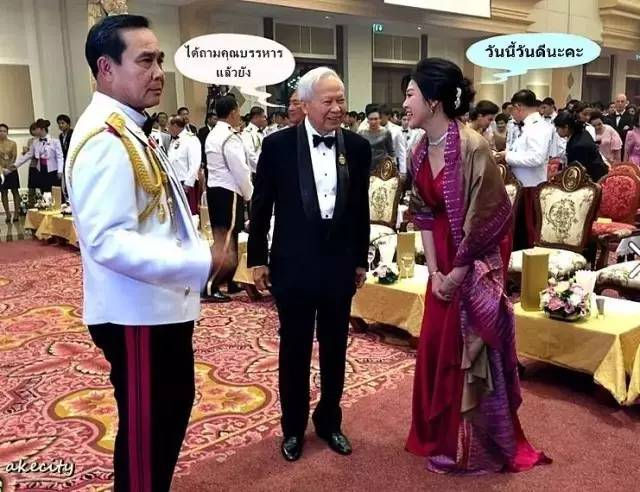
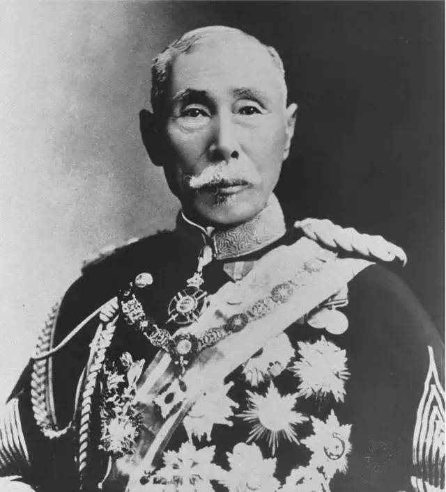

**<文章来自网络选摘，如果有侵权，请告知>**

### 奇葩的泰国对中国究竟有多重要？
2017-06-17 筹码君  [格上财富](http:///) 格上财富

作者：筹码君
来源：筹码（ID：Chouma2016）
在东南亚，泰国一直是一个非常神奇的存在，这里是：

- 最正经的国家，是小乘佛教（上座部佛教） 在现实世界的唯一净土；
- 最开放的国家，亚洲性都+人妖国度，老司机、LGBT和变性人士云集于此；
- 最有前途的国家，物产丰饶不愁吃穿，商界大佬笑傲全球；
- 最没前途的国家，迄今为止还是世袭罔替的君主国家，军阀幕后专政。

所有的奇葩背后，都是有深刻的原因的。

泰国有着得天独厚的地理条件：论面积，51.3万平方公里，相当于12个海南省，人口6700万，算是大国了，中部的湄南河平原土壤肥沃，雨水充沛，农业极其发达，依山傍海，位居东南亚大陆的中心位置，狭长的触角伸入印度洋，享受海陆双重文明的优势。

但是，正是这样优渥的位置，让泰国处于一个尴尬境地：泰国身处中南半岛地缘核心，能决定谁将成为中南半岛的主宰。因此，泰国就成了野心家的门票，历史上先后被缅甸、法国、英国、日本盯上，不断陷入战争状态。 尤其是近100年，无论是日本的大东亚共荣圈，还是战后日本的海外重建，泰国都是日本的第一大『飞地』。日本因为经济滑坡慢慢收缩后，泰国又成为中国『一带一路』战略的重中之重。

### 一带一路

泰国的身居中心的位置，但本身实力不足以整合东南亚，又缺乏North Korea的政治头脑和历史机遇，这使得泰国只能被动中勉强维持均势，因自身的结构性问题，不可避免成为强国竞争中的天选之韭菜，未来可能进一步成为中国的新属国。

### 1、道路与命运

温柔的自然气候和孱弱的产业结构

到泰国游玩的小伙伴通常都会惊叹于风光美景，也会惊叹于当年亚洲四小虎的发展速度和遍地日本车。可是，1997年亚洲金融危机到现在20年了，当年的发展中国家的龙头，如今似乎并没有显著的进步。

寒温带使国家富裕，热带使国家贫穷
这里有地理决定论的原因，在上图中的地球上，沿着赤道几百公里的环状带，所经过国家，没有一个是发达国家。而只有红色块覆盖的区域（寒温带）才有机会出现发达国家。
热带地区的绝大多数，都非常贫穷。 原因有以下几个方面：

- 1、人类对抗寒冷的技术（造房屋，取火，穿衣服）的产生远远早于对抗炎热的技术（空调）。而对抗炎热的技术（空调，电扇）难度要显著高。同时，空调也不是真正抵御了炎热，而是把热『重新分配』了，分配给更穷的地区和人。 因此，相对寒冷地区的人，早就解放出来，干各种各样其他的创造性活动。而炎热地区的人，一年有超过一大半的时间在对抗炎热。
- 2、因为炎热，很多炎热地区的文化策略就是『呆着不动』，导致炎热地区的『懒文化』。比如英国殖民印度的时候，印度当地人会讲一句谚语：『只有疯狗和英国人才在中午活动』。
- 3、炎热地区有很多很多细菌寄生虫。冬天的寒冷，是针对细菌寄生虫『最大的消毒剂』。撒哈拉以南非洲，绝大多数人身上都有数十种寄生虫。身体常常很弱，而细菌又让人和牲畜无法更好存活，食物没法好好保存。
- 4、以上这些，使得寒冷地区的先富国家，对炎热地区的落后国家进行殖民和奴役，奴隶贩卖，更加重了这个贫富极端化的过程。

#### 泰国的碧水青山

当然，慵懒地泡在碧水清山中避暑，也是愉快，但是经济发展就不要多想了。

历史上，泰国作为亚洲四小虎，主要依赖的是日本的产业转移：换句话说，就是依靠7000万人口的大国来承接劳动密集型产业，给日本韩国干粗活。气候和产业一定程度上阻止了产业升级：

- 1、首先是气候造就的国民性格。泰国夏季湿热漫长，从事体力劳动时则疲惫感较强，劳动效率和劳动积极性就有很大折扣，不仅仅泰国人懒，印度人也懒，这是热带地区的通病。
- 2、农业牛逼：诸神保佑的湄南河平原水土丰饶，随便种植，收获的粮食也比黄河边辛苦整年的中国农民要多。躺着挣钱，谁愿意去工厂卖命？

因此，在1995年人民币兑美元大规模贬值之前，泰国的成本优势还是突出的。虽然人懒，但是单位劳动时间相当便宜，劳动密集型产业依然会陆续迁往东南亚。

朱镕基总理推动了人民币的汇率并轨

随着朱镕基总理让人民币官方汇率并轨，一夜之间跳贬50%+，从1:5.5 贬到1:8.8，同时加大改革开放力度，一个十亿人口级别的大国加入了对制造业的争夺当中。人多、穷、吃苦耐劳、学习能力强、国内产业门类齐全，迅速让泰国没有了产业升级的机会。

1997年，亚洲金融危机，索罗斯从攻击泰铢开始，也是察觉了泰国的内伤深重，只是顺势而为的补刀而已。

### 2、历史成因

分化的社会与混合的政治

在农耕时代，唯一有能力改变东南亚政治格局的是中国，可惜，当时中国的政治重心在北方，对南方属国并不关注，明清两代虽然都与泰国有所往来，仅仅限于Say Hi这个初级层面。

到了工业时代，十九世纪英法两国大举入侵东南亚，英国占领缅甸，法国则占据越南、老挝、柬埔寨，对泰国形成东西包夹之势。泰国只能艰难地玩平衡，两头卖乖，躲过一劫。

1943年11月的大东亚会议合影
从左至右：巴莫、张景惠、汪精卫、东条英机、旺·威泰耶康、何塞·劳威尔、鲍斯

随着太平洋战争爆发，日军从中国大举南下，一统东南亚，英法殖民统治土崩瓦解。好在日本野心更大，中南半岛并非重点，泰国继续抱大腿，加入轴心国，并深受影响近100年。 好在此时日本的领土野心主要针对东亚大陆，中南半岛尚不在其重点经营范围。二战结束，日本帝国瓦解，泰国的独立主权得以恢复。

泰国是一个『中原之国』，穆斯林文明、中华文明、湄南河平原的本土文明、西方文明、日本灌输的文明多种文化交织，几乎摧毁了本地人的文化自信，泰族孱弱的文化根本无法凝聚大家，遑论共识。

当局也意识到，只有统一的文化体系，才是国家稳定和认同感的基础。不得已，泰国退而求其次，求助于佛教：

- 1、借鉴小乘佛教，代替民族文化，这强化了泰国平和与包容性的国民文化；
- 2、学习日本，强化王室道统，在世俗层面建立统一的国家认同体系。

我们今天提起明治维新到昭和战败之间的日本帝国，当然是法西斯、军国主义、反人类之类的标签，但是在20世纪初的时候，当时的日本帝国是亚洲（至少是东亚）的明灯，是黄种人的希望，是击败西方文明的唯一亚洲国家，不光是中国人赴东瀛求学，一大群泰国人纷纷效仿，从政治、经济和文化方面，全盘吸收。

略有日本风情的泰国乡村一角
本来呢，学习日本帝国的长处是对的，可惜，学习日本的天皇制度，叠加了军阀专政，为之后的政治波动注入了源源不断的动力。

泰国国王去世，铺天盖地的纪念牌
以泰国前总理在他信政府为例，泰国基本上是三方均势：国王、军队、民选政府（当时主要是他信的势力）。

国王虽然是一个人，但围绕着他的是一个庞大的利益集团，百亿美元的资产，国王周围的有传统的贵族（比如阿披实）、军队、官僚系统。国王更像是人形的佛像，世俗的裁判和权力的代表，代表王室传达旨意。

国王与军方有长期千丝万缕的联系，所以军队在一定程度上还是听命于国王的，每次政变最后国王的态度都决定了最终走向。但是，已故国王的哥哥是被军方刺杀的，所以，听命于国王不过是彼此照顾面子和大局。

泰国的军队有几十年军事独裁的基础，有枪杆子有钱，实力也很雄厚。泰国军队有自己的银行，叫TMB，还有很多土地跟产业，军房选择跟国王结盟是有道理的，军队有枪但没有威望，国王有威望没有法律上的实权，两者合作是最佳的选择。

泰国的民选政府是泰国的第三大势力，他们有钱、有民意基础，而且现在民主化的浪潮下，民选政府有天然的合法性，这是国王跟军队不具有的。所以现在泰国基本上是三足鼎立，相互制约，政府上台，群众上街，军队政变，然后国王给予默许或反对。泰国政治什么时候能改变，得看什么时候打破这种均势，但到时候是稳定还是更乱就难说了。

现任泰国枢密院院长，96岁高龄的前摄政王炳·廷素拉暖将军（泰语：เปรม ติณสูลานนท์，英语：Prem Tinsulanonda，1920年8月26日－）曾任第16任泰国总理，被认为是已故泰国国王拉玛八世普密蓬·阿杜德的重要亲信。

炳·廷素拉暖将军就任枢密院院长

炳·廷素拉暖1941年从朱拉隆功皇家军事学校毕业，毕业后一直在军队服役，因为与泰王结盟，后加入泰国枢密院。据传，炳·廷素拉暖授意军方在2006年发动政变推翻了民选的他信·西那瓦政府。

国王、民选政府、军阀，三股势力不断在『维护国王』的大义名分而展开，以至于正常的政治活动已经变得不再可能，结果导致今天正是枢密院掌握着真正的实权，九十六岁的枢密院院长——炳·廷素拉暖才是真正的权倾朝野。

左为现任泰国总理，中间为摄政王炳·廷素拉暖将军，右侧为前任总理英拉

泰国的一切，像极了日本二战前的政治格局。日本天皇身边的枢密院议长，后来的首相——山县有朋主导了长州藩军阀崛起，推动了日本陆军的壮大，甚至连裕仁天皇的婚姻也是一手操办。

日本首相，长州藩军阀崛起的重要推手——山县有朋

只是幸好泰国人懒，而且是佛教国家，工业实力也弱，新任的泰王更是一个非常不成器的纨绔子弟，佛教国家的民众包容着孱弱多病的政治体制向前运行，泰国并没有走向军事强国的道路。

### 3、中泰合流

中日墙头草与属国的命运
泰国未来会怎样？ 不好说，但是最坏的时候已经过去了，未来，最大的可能性是重新成为中国的『属国』。
1985年至1995年间，泰国的经济发展是世界上最快的。那时，日本的制造业生产力已经趋于饱和，走出去才是出路，泰国承接了大量的日本产业转移，赚的盆满钵满。

同时，日元升值，有利于日本企业去海外并购、迅速扩张。再加上美国也愿意拉自己一把——主动扶持半导体、汽车等高科技产业，于是日本也就从了大哥，搞起了『一带一路』，努力对外投资。

日本当时主要投资对象是『四小龙』（中国香港、新加坡、韩国和中国台湾）、『四小虎』（泰国、马来西亚、菲律宾和印度尼西亚）和中国大陆。

日本对外投资的记录

随着1992年日本地产熄火，日本工商业开始从泰国撤回资金，1994年中国补刀，1997年泰国的货币危机引发了亚洲经济危机，泰铢对美元的比值从26：1降到56：1，暴贬50%以上，1998年国民经济下降了10%，直到 1999年开始泰国经济开始得到恢复，其主要动力是出口及旅游业，至于工业并没有得到很好的恢复。

泰国在现代工业建设中的受挫，失去了与中国竞争的基础，这导致大量泰国平民无法通过从事工业生产而获得财富，只能继续从事传统农业，收入相当微薄。 这也就是为什么泰国大部分物价都极为便宜，度假成本极低。

但是矛盾的是，一方面泰国相对贫穷，另一方面，泰国极为开放，是全球最重要的旅游国家，通过商业和旅游业，成就了一批富裕阶级。

少数统治者、部分中产阶级、占人口绝大多数的平民和农民，构成了民选政府的主要票仓构成。这就导致了农民阶级有自身的诉求，希望内部重分利益，而统治阶级又没有办法让农民们做大蛋糕，（因为工业孱弱无法与中国竞争），赢得民心。

无奈之下，统治阶级只能采用军事政变的方式，将民意选举出来的政府更换掉。短期内，泰国可以实行军管。但军管本身就是一种强权政治，如果军管长期持续，政府与农民，甚至政府内部各派系之间的冲突将愈演愈烈，在缺乏民主政体作为缓冲的情况下，这种冲突必然会将国家引入内战。

只是，一旦回复到民选，受农民支持的政治势力又会通过选举上台，迫使有产阶级再以军事政变镇压。这一波又一波的选举与政变绵绵不休，最终导致了泰国政局的恶性循环。

电影扫毒剧照，两位男主角 人妖Poy （泰国）与张家辉合影

无法做大的经济蛋糕，严重的贫富不均，无法推动的政治死结，让经济结构持续不健康。于此同时，矛盾的收入结构，宽容的佛教文化，印度教的性崇拜和笑贫不笑娼的价值观，混合在泰国文化中，从而形成了亚洲性都——芭提雅和独特的人妖文化。

但时至今日，如果做大蛋糕变的可行，那一切矛盾都引刃而解：以前绝无可能，因为需要与中国在工业层面竞争，但展望将来，却又一丝希望，而这个希望的赋予者不是别人，正是中国的一带一路。

泰国这些年的混乱，美国日本都是罪魁祸首，都割了泰国的韭菜，但中国也是难辞其咎，外汇市场也是捅了泰国一刀，而且，2001年中国加入世贸，其高速发展的工业体系又将泰国的制造业吸入怀中，致使其丧失了赖以复兴的工业基础。可以说，泰国混到今天，多拜中美两国所赐。

如今，随着中国发展，也到了需要产业转移的时点上，人民币需要国际化，低端产业需要转移，一带一路需要外部盟友，泰国有了重建制造业的机会，中国的民间资本也在纷纷投向泰国。

#### 佛国余晖

除了产业转移，更重要的还有中国资本的输出，来自中国的贷款，以及高铁等重大工程项目，能极大改善其国家的基础设施条件，创造经济价值、提振其国家的竞争能力；而中国每年数以百万计的观光客，不仅带来了巨额的外汇，也提供了大量相对高收入的就业岗位，有利于其民生的改善。

总而言之，对泰国而言，在当今世界的主要经济体中，中国与其地缘关系最为紧密，经济上的带动作用相应也是最为明显；而在中国的地缘战略布局中，泰国的地位至关重要，故中国也具备扶持泰国的动机。

在中国经济实力不断增强的情况下，泰国要想发展经济，增强国力，与中国合作无疑是最佳道路，而且，只能与中国经济深度融合，几乎别无选择。

一带一路为泰国带来光明的未来

