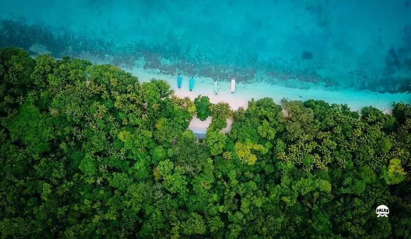
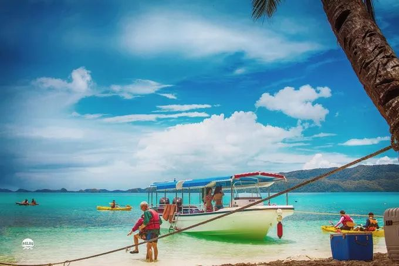

# 免签还人少！帕劳-国家地理评它为人间天堂榜首

星期五, 八月 17, 2018
6:00 上午

## 免签还人少！它美过马代，直飞3.5h，国家地理评它为人间天堂榜首

气温直逼40℃，去海岛自然成了夏天的主旋律。

但巴厘岛商业化浓厚，普吉岛又人挤人，哪里人少又景美呢？

图源：@gaddafirusli
热到融化的小租租给安利大家一个岛屿：
它位于神秘的北纬7°，港澳直飞3.5小时，相比于千篇一律的海岛，简直好玩到爆！

晶莹剔透的海浪翻滚着打湿裤脚，斑斓的五色海水流动眼底，潜水才是正经事！

潜入水中与珊瑚礁和鱼群嬉戏，近身与大型鱼类共舞；

海底亲睹百年大干贝，近距离观看超大鹰鳐，珍稀黄金水母美得挪不开眼；

乘直升飞机俯瞰惊艳绝伦的七十岛，简直帅气得无可匹敌；

最后一天开辆明艳的野马，感受速度与激情的快感，将惊艳海景风光尽收眼底！

关于它的美誉，简直数都数不完！

国家地理杂志形容它是“太平洋最纯净的海洋生态之一”是《美国国家地理》排在第一的“人间天堂”世界七大海底，奇观之首就在这里，难怪世界潜水爱好者都称它是，世界潜水度假圣地，也难怪好莱坞大片——，《地心历险记2》把取景放在这里。

## 帕 劳
这里的海水简直把人宠坏！难怪每一个归来的人，都会魔怔般的感慨「帕劳归来不看海」。

不想去商业化浓厚的海岛浪费时光，不如去这个「上帝水族馆」寻觅北纬7°独特浪漫。

忍不住把这个4日行程安利给你
2天浮潜+1天深潜+1天环岛自驾

浮潜，上帝把所有的蓝都留在了这里

## 牛 奶 湖

牛奶湖不是湖，是被群岛环绕的一片海域，置身其中满眼翠绿，夏天的焦躁瞬间消失不见。

不过最诱人的还是那黏稠奶白的火山泥，火山喷发后火山灰沉积湖底，成了大自然最美馈赠。

听说在这里泡一泡皮肤会变得白皙嫩滑，而且质地温和，敏感肌也不怕，简直是「大自然的SPA基地」！

 ## 玫瑰珊瑚

状如玫瑰，层层叠叠繁复的美丽，玫瑰珊瑚仿佛大自然信手所种，幽幽地绽放在海底。

这里是《蓝色大海的传说》取景地，全智贤从水里探出头那刻，简直惊艳了岁月。

## 蓝 洞
世界上拥有蓝洞不少，却未曾像帕劳的蓝洞般令人心醉神迷。

幽幽一片海域，俯瞰便是蓝到极致的海水，多个洞口石头裸露，光线折射出如梦似幻的光影。

洞内软珊瑚和管珊瑚装点着洞壁，梭鱼和鲷鱼在洞中巡游，让人流连忘返。

一个猛子扎进水里，周遭安静得能清晰听到自己强劲心跳声，仿佛幽幽天地间只有自己存在。

## 水母湖
世上水母99%皆有毒，帕劳的水母珍贵之处在于无毒素，这群小可爱又Q又弹，仿若透明果冻。

到了中午时分，阳光耀眼，水母一张一翕都发出金灿灿的光，光影交织的梦幻感，被赋予了满满的灵气。

不过这两年因为厄尔尼诺现象，水母数量骤然减少，所以还在关闭哦，期待有一天这些灵动小生命能够惊喜重现。

## 长沙滩
一天中出现时间不超过3小时，退潮时才会露出庐山真面目，长沙滩的美值得静静等待。

乳白色的沙滩交映着蓝绿渐层的海洋中，简直就像游走在画里。

岸边海堆积着海浪冲刷的巨大枯枝或树根，简直是绝佳的凹造型神器！

## 德国水道
想要去海底大断层，德国水道是必经之路，tiffany蓝海水超治愈。

Manta Rock是著名潜水点，能看到蠢萌的魔鬼鱼悠哉游弋。

因为实在是太美了，所以有时候还能撞到广告公司来此拍广告大片。

最后玩累了可以可以去无人岛上自助BBQ，品尝原汁原味的海鲜，惬意得心都散了架。

## 膏多肉厚的红树林蟹

## 鲜嫩肥美的砗磲肉

## 海底大断层
一侧是深不见底幽邃的蓝，一侧是长满珊瑚的礁石，海底大断层可谓是勇敢者的天堂。

从离水面0.5米深度的浅滩，突然急促降落差至600多米的深海大峭壁，于惊险处有惊而无险，反有万般风情。

海底别有洞天，二战时沉船静静伫立，神秘幽深，仿佛能随时带你吸进时空的隧道。

图源：@prelevicm

## 环岛自驾
信马由缰放肆驰骋，都说水下囊括了帕劳一半的美景，其实帕劳岛上的景观也值得一赏。

帕劳没有公交系统，出租车每次的起步价高达10美元，而且景点比较分散。

租车自驾绝对是性价比最高的选择。开着野马狂奔，你就是帕劳的绝对主角！

沿着蜿蜒壮阔的海岸线，吹着太平洋的风，这个夏天酷到底！

### 自驾路线
**安德茂瀑布——红树林水道——呢洼海滩——总统府——KB大桥**

驱车第一站当然要去安德茂瀑布，超多绿色植被，满满的电影感，在这里尽情地大口呼吸吧！

继而驶入背面霸气十足的海景公路，路上车辆极少，承包一大片天地。

折而向南，就抵达呢哇海滩，除了看天空之镜海天一色，野趣的树屋拍照也是一绝。

还有闻名遐迩的总统府，气势如虹，戒备并不森严，连保安的踪迹都难寻。

整条环岛路线最亮眼莫过于kb大桥，宛如蛟龙横跨大岛和科罗尔。

暮色四合，整座桥梁温柔了几许，不少情侣专门驱车来此看日落。

一半狂野，一半羞涩
帕劳从不宣扬却自带魅力
你准备去赴这场浪漫之约了吗？

 最后小租租温馨提醒：
帕劳虽然免签，却需要收取环保税
前往帕劳也有多种方式！

想知道怎样最快最省钱抵达？
点击下面图片：帕劳详细攻略免费领，手快有，手慢无~
 👇

