直飞3h，往返800+！米其林美食10元吃饱，这个国家太好吃
星期五, 八月 3, 2018
5:37 上午

[租租车]()

[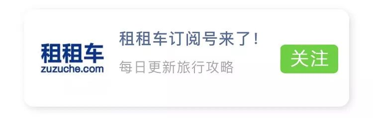](https://m.zuzuche.com/tool/from.php?key=71e519d5948086)

提起全家暑期出行，很多人都毫无头绪。要么机票太贵，要么人挤人，要么带孩子出行怕安全卫生没保障。

其实，距离我们3.5h航程就有一个特别适合亲子游的地方。

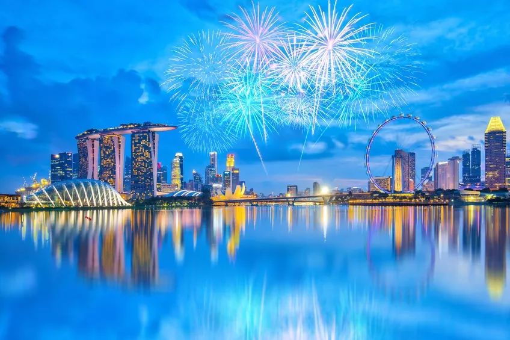

它电子签秒出，直飞3.5小时，市井烟火与摩登动感并存，听说每个去到的人都情不自禁爱上了它。

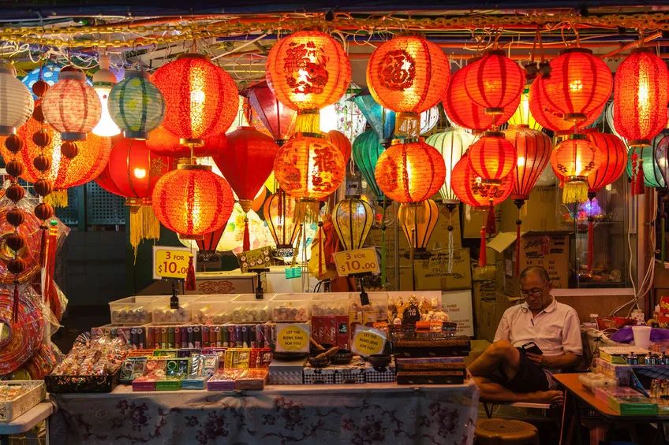

于男人而言，它是速度与激情的代名词。一千多块就能开上法拉利在F1城市赛道上驰骋，感觉嗨翻天。

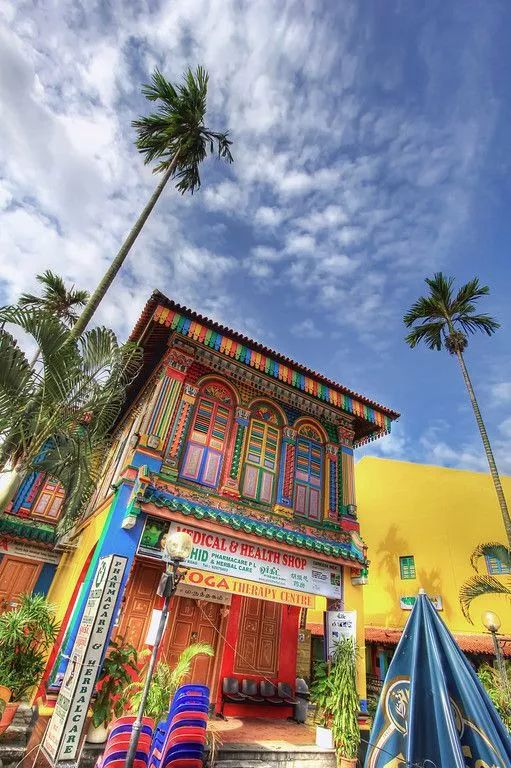

于女人而言，它是买买买绝佳去处。全年无休的优惠，低到怀疑人生的折扣，诱惑实在太大了。

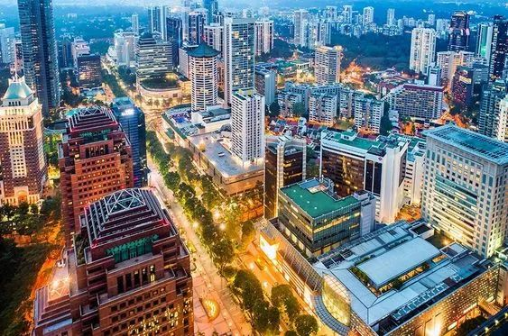

于小孩而言，它更是最妙的玩乐天堂。环球影城、过山车、海洋馆……一天一个都不过瘾！

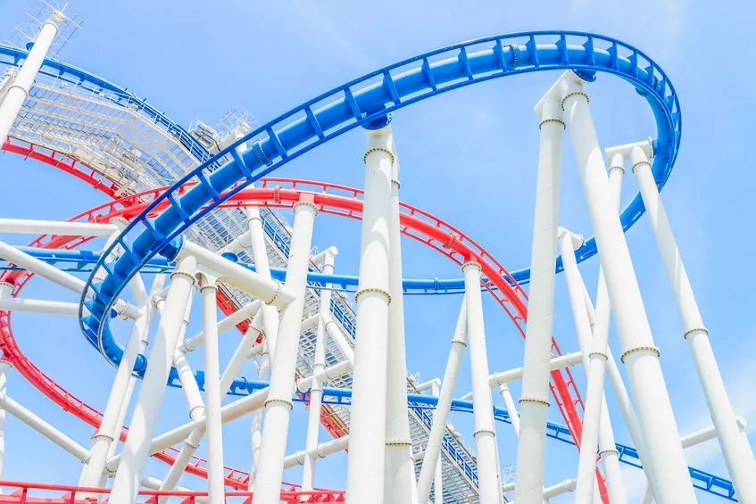

新加坡，好像很多人都只知道它的狮身尾像，和花园城市美称，其实这个国家超好玩！

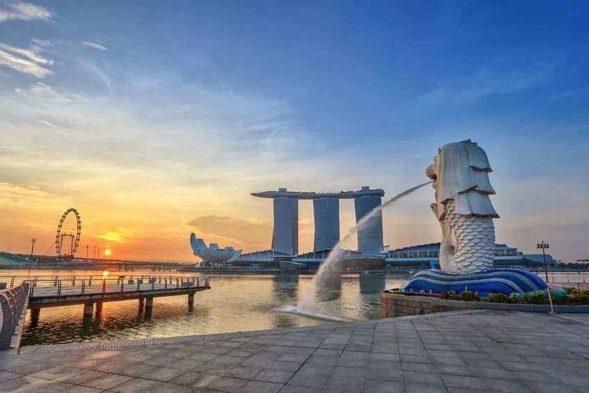

### 而且小租租查了一下机票价，最低不到1k！新加坡旅游的正确打开方式，赶紧get起来！

![Q)4h  TRI 囗 1  空 客 32 豇 中 ）  组 台 特 1 飠  特 惠 推 荐  10 ： 40  白 云 国 际 机 炀 T  经 舱  经 舱  14 ： 40  棹 官 机 炀 T2  退 改 行 李 额 及 须 知  仅 提 憤 外 电 子 凭  退 改 行 李 额 及 须 知  仅 提 憤 外 电 子 凭  ¥ 890  ¥ 933 匪 退 \]](../_resources/2f3e95e769ad39c68633f2cab5a2bb50.png)

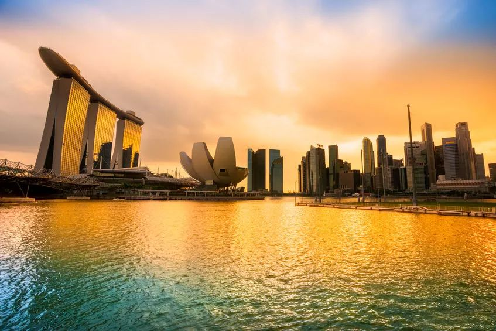

大人小孩都童心爆棚的亲子游

新加坡大概是东南亚最棒的亲子游国家，能让几岁孩子玩得乐不思蜀，也能让三四十岁的老青年都瞬间童心爆棚。

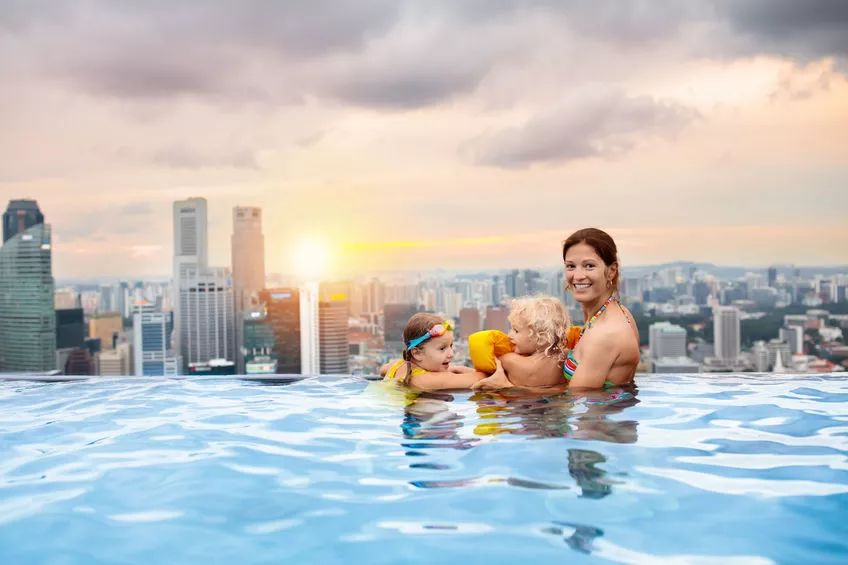

来新加坡，从不担心枯燥无聊，因为……

环球影城的各种游戏嗨翻天！变形金刚、双轨过山车、木乃伊的复仇、史瑞克城堡4-D影院，一天根本就不够玩！

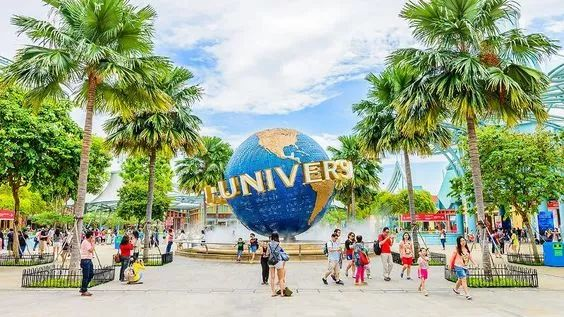

游戏太刺激？那可以去S.E.A海洋馆。馆内玻璃可以近距离欣赏鲨鱼、海豚、五彩斑斓的水母煞是可爱。

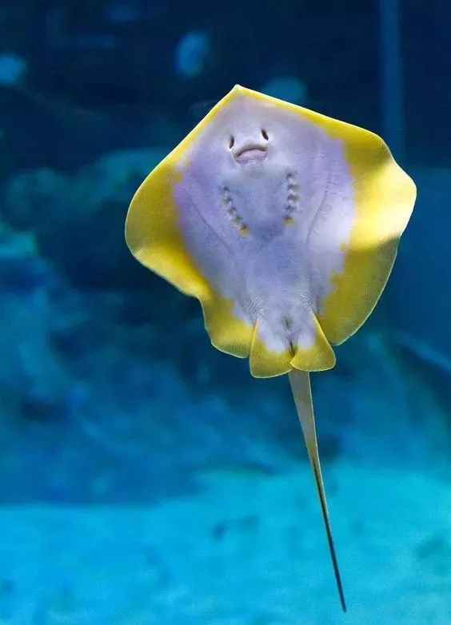

占地球72%的海底世界又神秘又让人向往，大千海底生物让人不禁感叹人类的渺小，全家去海洋馆还很有教育意义呢。

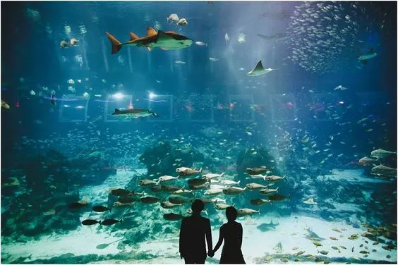

夜晚的新加坡也绚丽多姿。都知道动物园是白天开放，那么夜间野生动物园肯定能满足你的好奇心。

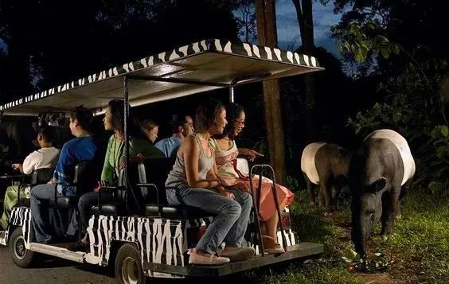

白犀牛、科莫多巨蜥、孟加拉白虎、人猿……有的安静而卧，有的伺机猎杀，生存法则每时每刻都在上演。

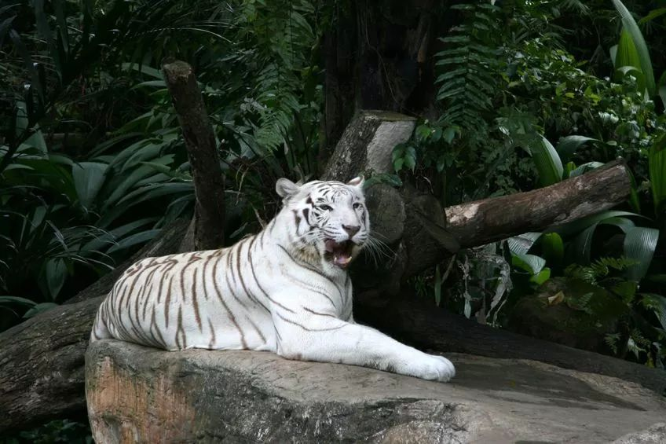

身临其间感受大自然的物竞天择，坐车绕一圈需要40分钟就已心生震撼。

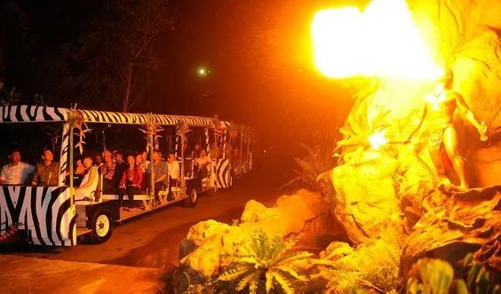
△固定时间还有喷火表演

最后就去滨海湾花园结束兴奋的一天吧，晚上7:45至8:45可以享受迷幻美妙的擎天树丛灯光秀，超惊艳！

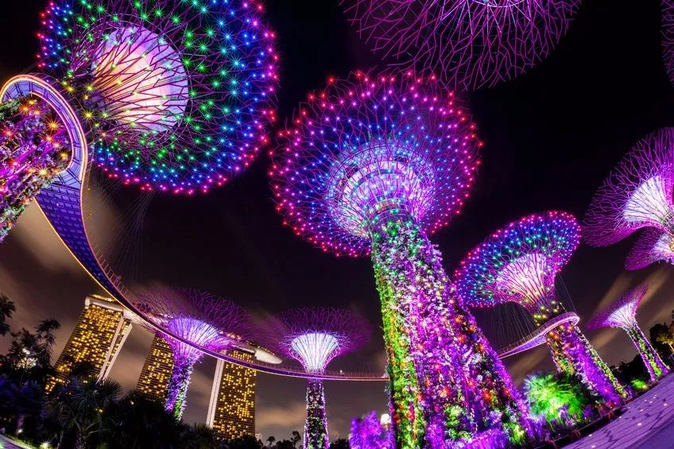
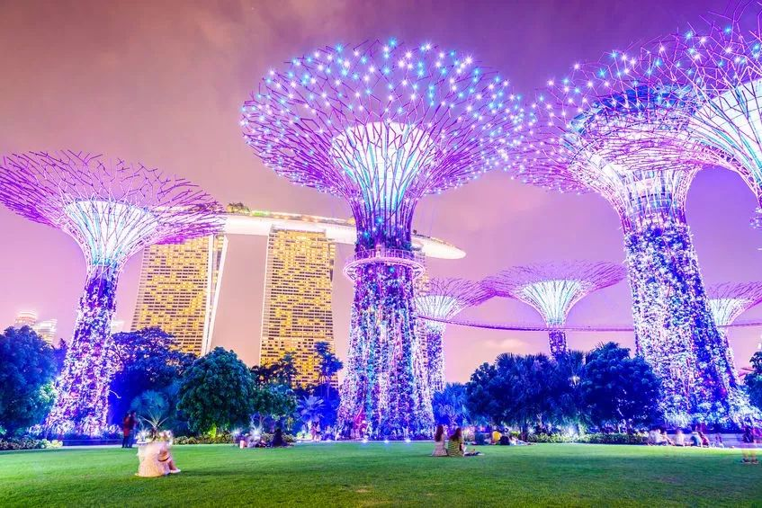

20元吃到饱的米其林美食

20元就能吃到米其林美食，大概只有新加坡了。

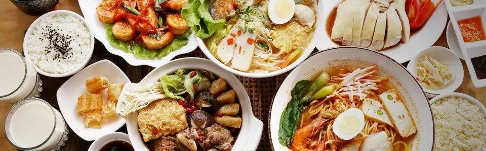

这个无数吃货朝圣的美食天堂，美食简直三天三夜都说不完……

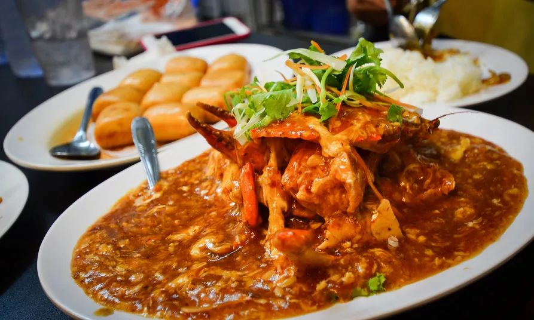

海南鸡饭、鸭饭、炒粿条、鱼丸面、叻沙、肉挫面、椰浆饭、簿饼、萝卜糕、肉骨茶……

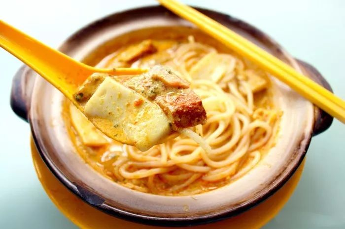

就问你心动了没？来新加坡，不打卡这些美食，那就相当于白来了！

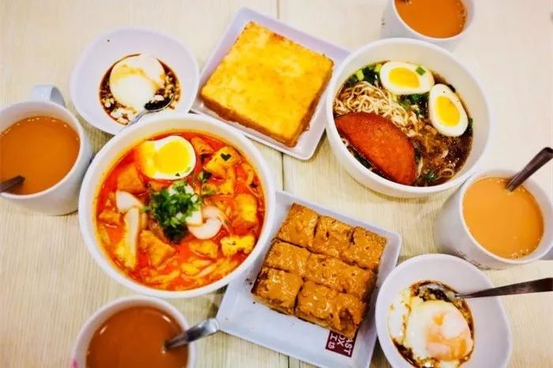

 『联合本记煲饭』

米饭粒粒分明，一揭盖满屋飘香，每个砂煲都有锅巴的香味，嘎嘣嘎嘣脆，超过瘾！

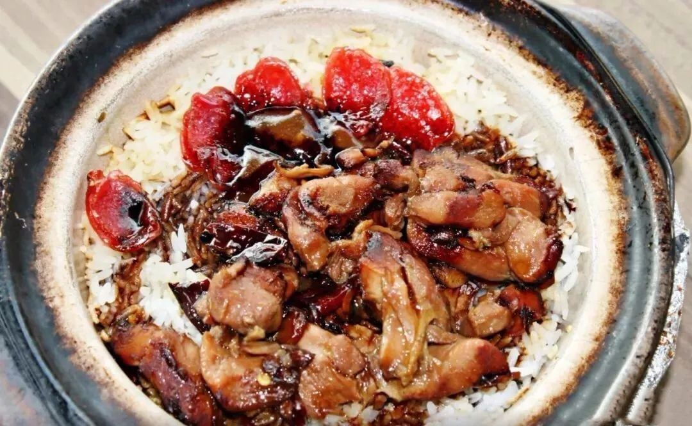
 335 Smith Street 02-197/198/199S050335

 『松发肉骨茶』

黑胡椒的香与辣，完美的祛除了湿气，肉骨很大块，啃起来超满足，而且这里还可以免费续汤哦~

图源：@城市慷慨亮整夜光
 #01-01 11 New Bridge Rd, S059383

『和记肉粽』

凭一个肉粽征服米其林，和记肉粽不得不尝。见过三个蛋黄额肉粽没？每次9点一开门就被一抢而空，卖完即止，如果晚点去可能会吃闭门羹哦~

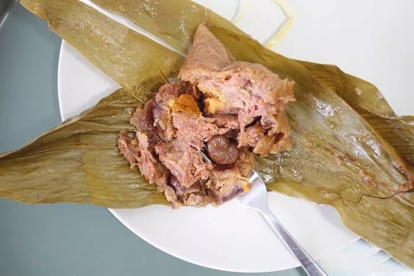
 161 Bukit Merah Central #01-3735S150161

『天天海南鸡饭』

别看鸡肉饭看似简单，味道不容小觑。入口即化，鸡肉的滑嫩和酱料的完美融合在口腔迸发，回味无穷。

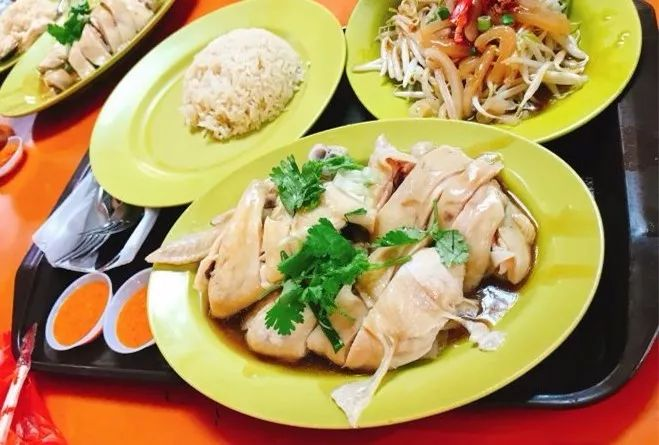
 #01-10/11Maxwell Food Centre, 1 Kadayanallur Street, S069184

『ZaffronKitchen』

橘红色的旧式砖墙、状似没修葺的天花、曝露在空气中的水管……这是一家印度菜馆，出品一绝。去要做好排到天荒地老的准备。

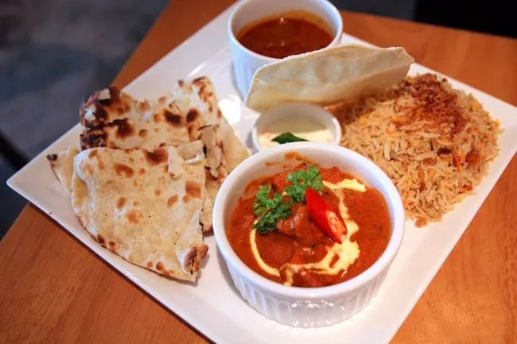
 135/137East Coast Road, S428822

到购物天堂尽情血拼

到购物天堂，很多人第一反应就是香港，其实新加坡也不遑多让。

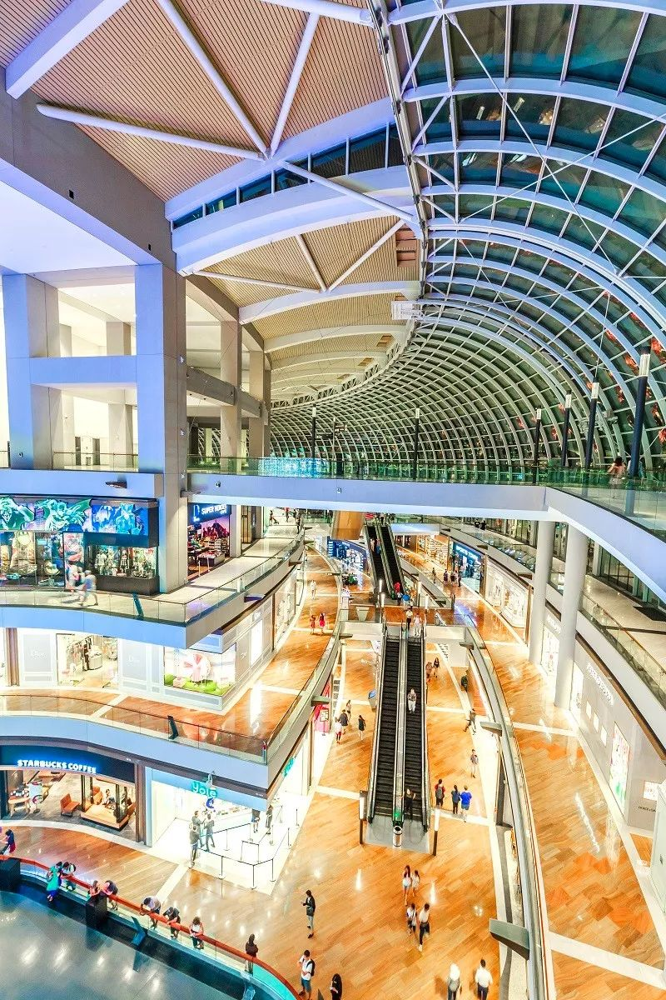

重点是这里打折力度还超大！尤其是六月的打折季和圣诞节，折扣更是低到你怀疑人生！

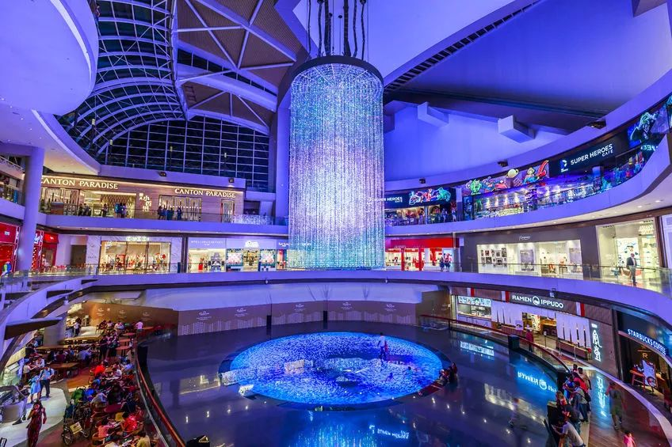

乌节路

乌节路可谓是无人不知了，它与纽约的第五大道、巴黎的香榭丽舍、和东京的银座齐名。

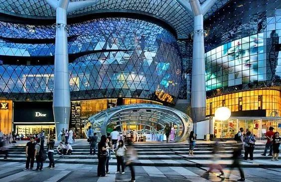

每天成千上万的人来这里剁手，商品包罗万象，基本你能想象到了品牌它都有。什么叫乐不思蜀，在这里真实体验了一把。

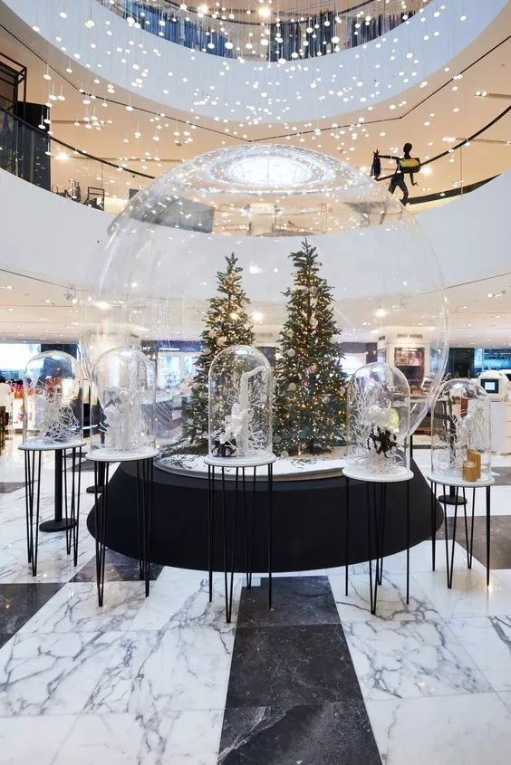

温馨提示一下，在同一家店购物满100新币可退7%的购物税，如果忘记了，分分钟感觉自己错过了几个亿。

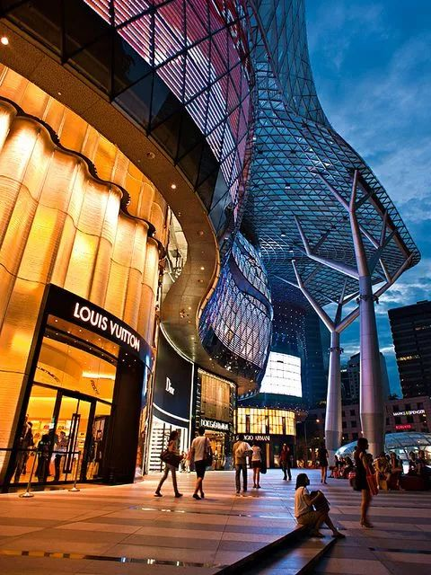

新加坡樟宜机场

樟宜机场连续四年被 SKYTRAX评为世界上最好的机场。但对购物狂来说，这不是重点，重点是汇集了140多种国际知名品牌的香水和化妆品！

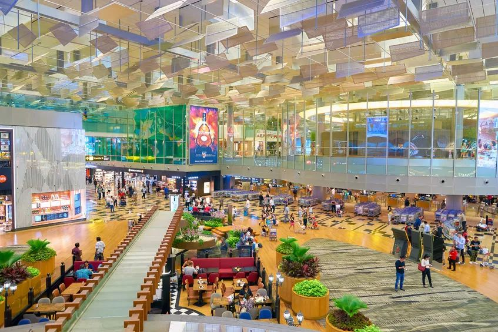

在樟宜机场根本没时间喊无聊，庞大的免税店，柔软的地毯都能激发心中的购买欲，到处能看到血拼狂魔。

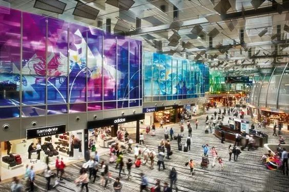

新加坡什么值得买？

关于新加坡，你可能还想知道……

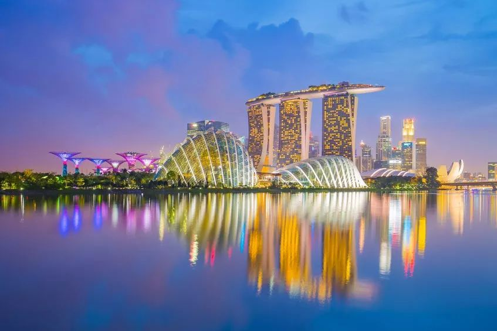

◐签证：新加坡是电子签证，签证均由新加坡驻华使领馆指定的单位/旅行社递交签证申请，不接受个人申请。签证费用统一固定为人民币300元。

◐交通：目前国内很多省会开通了前往新加坡的直飞航班，直飞3h，往返最低不到1k。新加坡地铁交通发达，10公里路程折合人民币约6.5元。

◐门票：建议买一张「狮城全景通」，包含17个热门景点门票，还有美食优惠券和无限次搭乘新航随意行巴士，性价比很高。

◐货币：1人民币 = 0.2003新加坡元。

◐最佳旅行季节：新加坡地处赤道附近，四季温差小，年平均气温在23-31℃之间。喜欢美食可以4-7月前往，会有美食节；想要购物就选择6月或圣诞节前后，有商场打折季。

◐语言：新加坡政府承认四种官方语言，即英语、马来语、华语以及泰米尔语。只要会简单的英语，基本就能畅通无阻。

