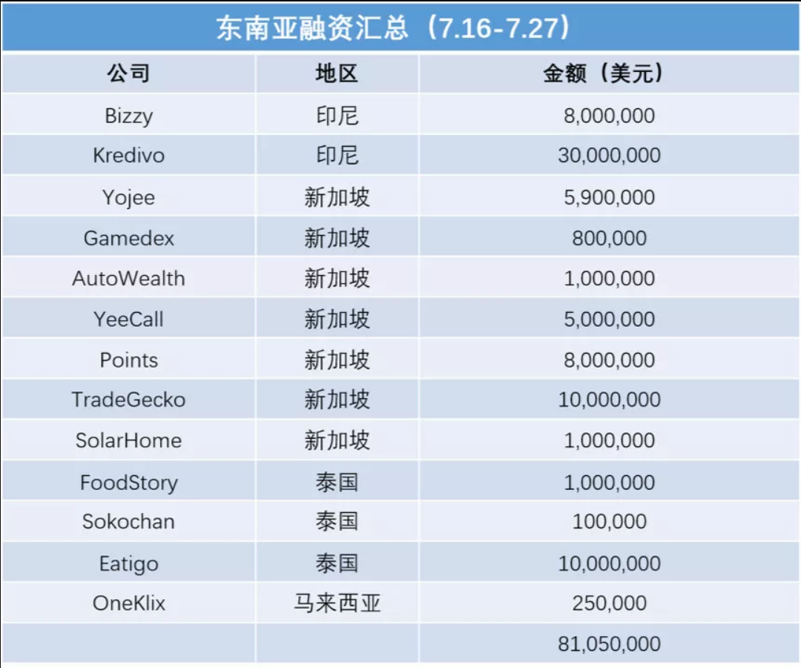
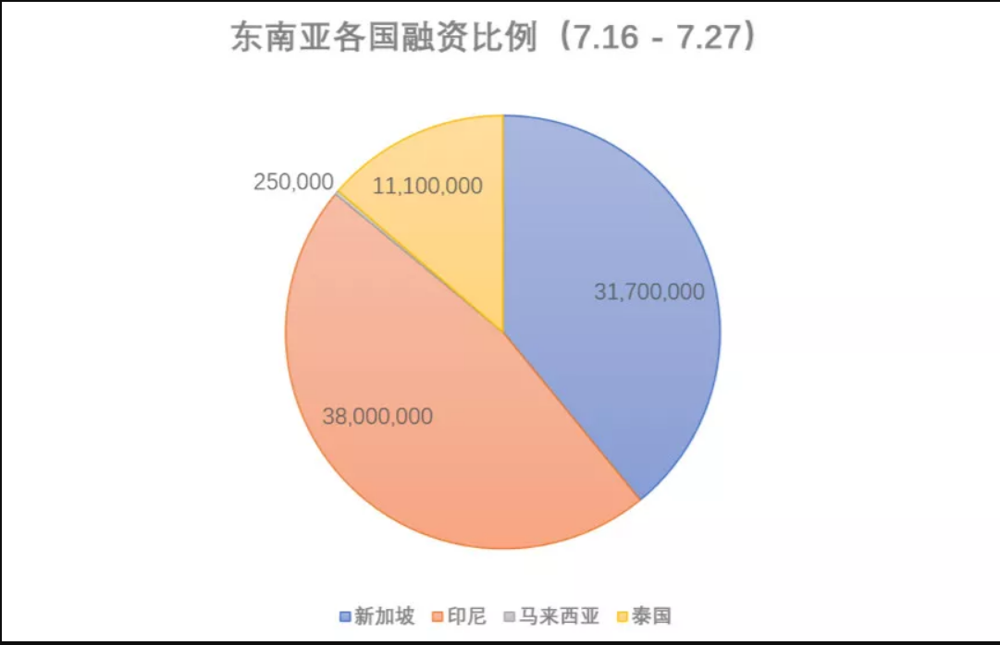

# 谷歌泰国推出免费公共WiFi；微信支付与新加坡樟宜机场达成三年战略合作 

2018年7月30日
8:12
Jason浩仔 [36氪]() 昨天

Go-Jek在胡志明市测试Go-Bike和Go-Send服务；新加坡金融管理局指示金融机构加强客户验证流程。

进入正文之前，先看这里 ☞ ☞

Go-Jek在胡志明市测试Go-Bike和Go-Send服务

印尼出行服务巨头Go-Jek在胡志明市的一些地区对其两项服务Go-Bike和Go-Send（即时快递服务）进行为期五天的试验。今年6月，Go-Jek在越南（Go-Viet）和泰国（GET）建立了两家本地公司。

Go-Viet将于9月初在胡志明市正式启动。经过测试，Go-Viet将在胡志明市广泛部署，并迅速扩展到河内以及越南其他省份。为了成为越南最大的多服务平台，Go-Viet将首先提供运输服务，然后是食品交付，电子支付等。

Grab推迟新奖励机制的施行
Grab将积分奖励大幅度缩减，提高了用户兑换奖励的难度。Grab垄断新加坡乘车市场以来，陆续的提高了车费和佣金率。最近，Grab又对其奖励系统进行了更改。

此后几天，由于很多用户表达了对新奖励机制的不满，Grab决定推迟其施行，从7月24日8点起暂恢复成原来的奖励机制，一直持续到9月30日。在此期间，所有用户可以按照原先的积分制进行奖励兑换，已经在新制度施行期间消费的用户将获得积分返还。

## 谷歌泰国推出免费公共WiFi

谷歌泰国开始提供免费公共WiFi，以便消费者和商家更好地体验数字经济带来的便捷。谷歌泰国总监指出，泰国的数字经济正在飞速增长，估值37亿美元，而整个东南亚数字经济的估值约为200亿美元。此外，泰国在东盟的互联网覆盖率最高，达到90%（3G/4G）。

目前，谷歌泰国在曼谷提供免费Wi-Fi的地点包括Hualamphong火车站和Megabangna购物中心。消费者可以在@FreeGoogleStation-CAT WiFi系统输入他们的手机号码和名称进行注册。

新加坡SingHealth遭到黑客袭击
SingHealth在一份声明中表示，他们已经向超过70万名发送信息，告知他们的信息是否被盗。

7月20日，相关部门宣布，黑客已经入侵到新加坡最大医疗机构SingHealth的计算机中，造成一场前所未有的个人数据泄露事件。在150万受影响的患者中，包括李显龙总理和一些部长在内的16万人的门诊处方也被盗取。

## 新加坡金融管理局指示金融机构加强客户验证流程

新加坡金融管理局（MAS）向所有金融机构发出通函，指示他们加强客户验证流程。此举主要针对近日发生的SingHealth网络攻击事件，其中有150万人的个人信息被盗取。各大银行及金融机构都已经采取相应措施，用户在交易前会进行二次验证，如一次性密码，生物识别，最近交易日期或金额等。

## 微信支付可以在新加坡樟宜机场使用

微信支付已与樟宜机场达成三年的战略合作。游客在机场内的商家使用微信支付，可以得到汇率和购物优惠，从而提升中国游客境外的购物体验。微信支付跨境业务运营负责人表示，新加坡樟宜机场是重要的国际航空枢纽，国内游客到该机场换乘、转机的频率很高。微信支付将为到访樟宜机场的中国游客提供更便捷的支付体验。

## Line旗下加密货币交易所BitBox开始运营

BitBox是一个位于新加坡的加密货币交易所，目前支持30多个加密货币，其中包括比特币、以太币等。该平台仅允许令牌到令牌的交易，并不接受法定货币和加密货币之间的交换。美国和日本也无法进行交易，可能是由于监管的不确定性。

## Razer Pay即将登陆新加坡，UOB计划与其合作

Razer Pay将在未来几个月在新加坡上线，UOB计划与其合作。该合作将专属于UOB，允许用户通过UOB账户给电子钱包充值或处理付款。Razer Pay于本月4日在马来西亚首发，已有50万人开始使用该系统。

## 新加坡航空公司推出区块链电子钱包：KrisPay

继亚航推出BigPay之后，新加坡航空公司也在iTunes上推出了基于区块链技术的电子钱包KrisPay。该钱包是为了将KrisFlyer（新航常旅客会员App）用户的累计里程数字化，以便用户在合作商家使用。目前潜在合作商包括Esso加油站、新加坡香格里拉大酒店和Challenger.

## 印尼M Cash子公司推出新的共享单车服务

印尼IT公司M Cash Integrasi的子公司PT Surya Teknologi Perkasa推出新的、与ofo和oBike类似的共享单车服务GOWES，在雅加达试运营。雅加达的Monas地区有多达100量GOWES自行车。据称，GOWES共享单车平台使用的最新跟踪技术允许用户将自行车停在GOWES限定范围内的任何地方，而不需要放回特定的地点。

## 新加坡私召车平台TADA推出

韩国通勤公司easi6在新加坡设立的MVL基金，推出私召车平台TADA，宣称公司不抽取任何佣金，司机和乘客也可在使用服务的同时赚取分数换取虚拟货币，再兑换成其他奖励。

MVL总裁禹景植在记者会上透露，目前已吸引超过2000名司机加入，公司的目标是在下个月吸引3000至4000名司机，为公众提供接载服务。

除了提供私召车平台，MVL的最终目的是收集司机和乘客的行车记录等，将这些数据记录在区块链（blockchain）内。在获取数据提供方同意的前提下，将这些数据售卖给第三方。

## 订餐平台创业公司MealPal开始在新加坡服务

美国创业公司MealPal在新加坡推出了订餐服务，这将是其在东南亚的首个市场。该公司国际市场总经理Paul Clifford在发布会上说，公司已于250多家商户达成合作，其中包括TukTukCha，Soup Spoon等。用户每月支付95.88新币可获得12餐，平均每餐花费7.99。这个价格通常比在餐厅用餐的价格低70%。该应用并不提供送餐服务，用户可以在线订餐并预设取餐时间。

**相似订餐平台：Foodpanda，Deliveroo，GrabFood。**

## 新加坡创业公司GoBear计划进入印尼市场

新加坡金融产品比较平台GoBear正计划进入印尼市场。到目前为止，GoBear表示已经为2900万用户提供了2000多种个人理财产品。可比较的金融产品包括汽车保险，旅游保险，个人贷款等。

## 越南电信Viettel在缅甸推出一个月后拥有200万注册用户

越南电子电信公司Viettel在缅甸的的移动公司Mytel，自从正式开始运营以来，在一个月内就拥有超过200万的用户。包括越南在内的Viettel的全球11个市场中，缅甸市场是最快速达到200万的市场，而且考虑到全球经济放缓的原因，放眼全球范围几乎也没有哪家电信公司能与其相提并论。

Mytel的全国分销系统拥有超过50家门店和5万个销售代理，其中70%在农村和偏远地区。除了庞大的基础设施和分销系统以及诱人的产品，对当地人的心态和习惯进行细致的市场调查也是Mytel迅速发展的原因之一。

## 马来西亚创业公司50Gram获得种子基金

马来西亚在线花卉礼品订购平台50Gram获得种子基金，由TBV Capital领投，金额未公开。据悉，新的资金将用于扩展该电子商务创业公司现有业务，并向马来西亚和新加坡的新市场扩张。该公司声称其年营业额到达50万美元。

## 印尼借贷初创公司FinAccel获得3000万美元B轮融资
印尼金融科技初创公司FinAccel宣布获得3000万美元B轮融资，由Square Peg Capital领投。

FinAccel旗下产品Kredivo是一个移动客户端，可以看做是东南亚的“趣店”，客户先消费，再还款。该应用成为2017年谷歌应用商店的最佳App之一，与Lazada、Shopee、京东、Tokopedia等超过200家电商均有合作。

## 泰国创业公司Eatigo再获TripAdvisor投资

总部位于曼谷的餐厅预定创业公司Eatigo再次获得TripAdvisor的前C轮融资，数额为1000万美元。此次融资来自TripAdvisor的餐厅业务部门及其子公司The Fork，旨在帮助Eatigo扩展在亚太地区的业务。

Eatigo成立于2013年，已经将业务从泰国拓展到马来西亚，香港，菲律宾和印度。对印度的扩张是通过收购当地创业公司Ressy完成的，收购金额未公开。Eatigo同时也在新加坡开展业务。

## 印尼初创企业Bizzy获800万美元融资

据知情人士称，印尼初创B2B企业Bizzy获得B轮前期投资800万美元，由本地风投公司Sinar Mas Digital Ventures领投（SMDV）。Bizzy成立于2015年，为企业客户提供办公物品的在线采购，战术和交易流程方面的指导。从成立到现在已经融资1050万美元。

## 泰国“大众点评”Wongnai向餐厅POS系统供应商FoodStory投资100万美元

泰国餐厅点评平台Wongnai宣布向初创企业FoodStory投资100万美元。Wongnai还将与FoodStory合作推出全新的餐厅管理系统Wongnai POS，于8月在iOS平台的App Store上线。

Wongnai成立于2010年，让用户通过其网站和移动应用程序搜索泰国的餐馆，水疗中心，酒店和景点。 该平台每月拥有超过800万的用户，并与泰国25万多家餐厅建立了联系。

此外，其平台的竞争对手、总部位于曼谷的餐厅预定创业公司Eatigo最近刚刚完成Pre-C轮融资。
SGInnovate投资新加坡创业公司MediLOT
基于区块链的医疗保健行业创业公司MediLOT获得SGInnovate投资，金额未公开。
MediLOT利用区块链技术、人工智能和数据库管理系统实现个性化的医疗保健服务。它允许医疗人员安全地访问患者的健康记录，并使用这些数据进行预测等。
SGInnovate是归新加坡政府所有的一家公司，致力于投资和培养新加坡的科技创业公司。

## 视讯通话软件YeeCall筹集500万美元

总部位于新加坡的视讯通话应用程序YeeCall宣布，获得500万美元战略融资，由Shoghia Leo Group旗下的子公司Leo Digital Network领投。该公司将利用此资金开发各种区块链解决方案。

YeeCall成立于2015年，在北京和深圳有两个研发中心，是一款提供视讯通话和即时通讯功能的应用。目前，YeeCall称已拥有4000万注册用户，覆盖东南亚、欧洲、美国、印度和中东。此外，公司最近还推出了加密货币钱包Yeewallet。

新加坡智能投顾创业公司AutoWealth获得战略投资
8I Holdings宣布对AutoWealth进行战略融资，金额为100万美元。新融资将用于加强其品牌营销和资产管理。

AutoWealth是一家由新加坡金融管理局、新加坡国立大学的投资公司联合创办的持牌电子财务顾问公司，它用专有算法提供在线财务建议和投资管理，通过自动化流程，减少处理时间及中间人的成本，同时为客户提供资产投资的最优方案，投资的初始金额和分期定投计划的制定建议等。

## 越南在线房地产门户网站Homedy获得投资

越南的房地产门户网站Homedy.com获得包括Genesis Ventures、Access Ventures和Mynavi在内的三家公司的投资，金额未披露。借助新一轮获得的投资，Homedy将专注于两大领域的发展：数据分析和移动应用。数据分析将帮助消费者做出更明智的决策，而应用程序将为用户提供更便捷的使用体验。

## SaaS库存管理平台TradeGecko获得1000万美元B轮融资

新加坡SaaS库存和订单管理平台TradeGecko宣布关闭B轮融资，共筹1000万美元，由TNB Aura Fund 1和Aura Venture Fund领投。这使得该公司获投总资金达到2000万美元。

马来西亚基于区块链的联盟营销平台OneKlix筹集25万美金
基于区块链的马来西亚自助联盟营销平台OneKlix获得25万美金种子融资，由挪威风投公司TRM AS Fund领投。这笔资金将用于在东南亚乃至全球拓展业务。

附：7.16-7.27融资汇总

伴随着 2015 年下半年中国基金出海逐渐形成趋势，到 2016 年至今，出海已经在创投领域形成热议话题，中国的一些大公司已经开始围绕全球市场做出战略布局。我们已经与美国、印度、新加坡等国家的多家创投平台达成独家合作，通过专业的筛选、编辑、整合、调研，提供我们认为最新、最值得关注的全球创投信息。

我们已经推出了《出海日报》、《东南亚创投周报》、《印度创投周报》、《硅谷创投周报》。由此，36氪伴随着中国第一批出海的创业者、投资机构一起，成为中国第一家出海的创投和商业媒体。

