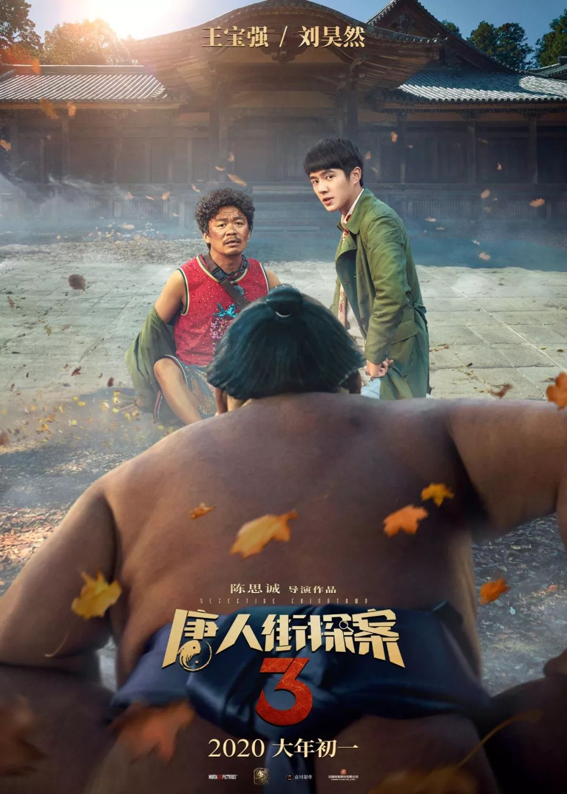
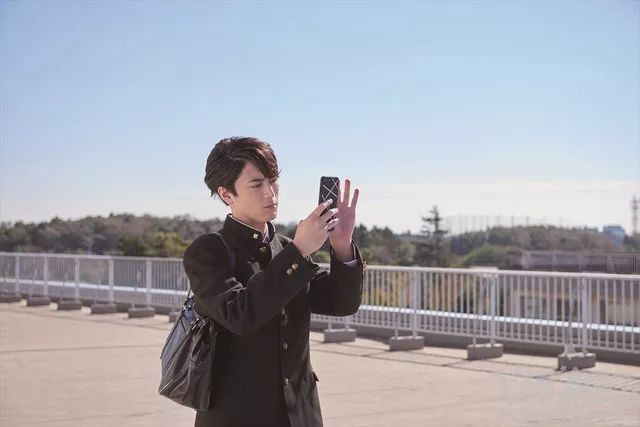
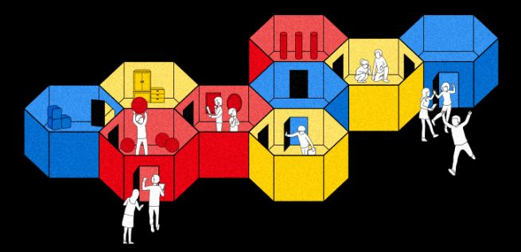
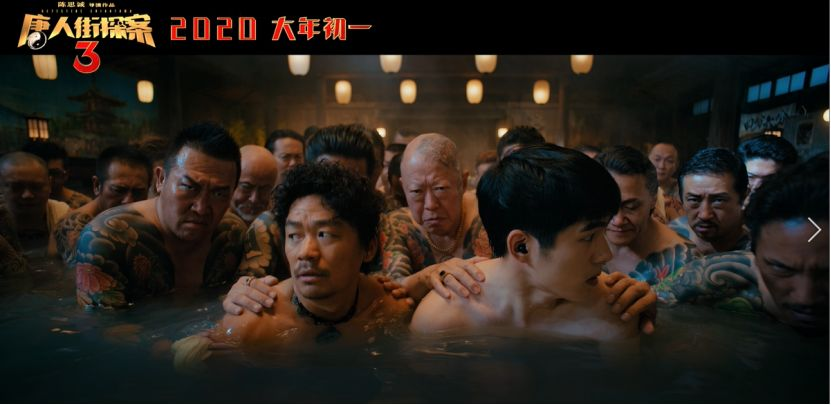
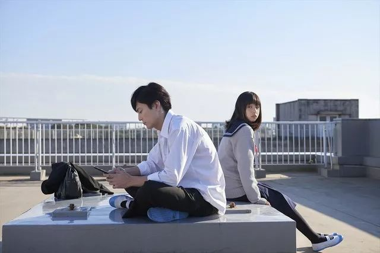
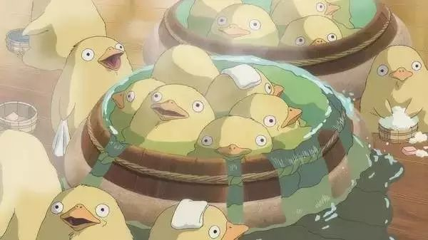

##  去香港享受慢生活 | 这6个人少景美的离岛，本地人都爱去！最适合亲子度假休闲游

[香港拔萃教育hkoe]()**

去香港享受慢生活
光顾人少景美，香港本地人也爱去的离岛！

图片来源于网络，侵权请联系删除

南丫岛

南丫岛是香港第三大岛屿，就在香港岛南面，岛内平地少，是一个被浓绿的亚热带树木覆盖着的美丽岛屿，岛上的原住民或者从事渔业，或者耕种土地，是一派难得一见的悠闲气息。

图片来源于网络，侵权请联系删除

洪圣爷湾停泊的各色渔船令到南丫岛更添原始渔村的生活气息。

****
图片来源于网络，侵权请联系删除

而如今的南丫岛，已经是香港年轻人和外籍人士最喜欢停留的乐土——生活不羁、渴望自由的人爱去那里，对于生活紧张的都市人来说，它是一个喘息的地方。

图片来源于网络，侵权请联系删除

洪圣爷湾泳滩是南丫岛上最清澈漂亮的海滩。在这里看到本地人在这里游玩。

图片来源于网络，侵权请联系删除

据说来南丫岛不吃这些建兴亚婆豆腐花、南丫岛鸡蛋仔、菜记小食、金卷食品、林记凉茶等于没来南丫岛。

****
图片来源于网络，侵权请联系删除
**
**
**> 线 路******
> 港铁中环站A出口，右转上天桥
> 一直往前走就可到达中环码头
> 从中环4号码头搭乘渡轮前往
> 船程约30-60分钟

长洲岛

相比起南丫岛的文艺气息，长洲岛更像一个原始的小渔村，村民们各自过着悠然自在的生活。

图片来源于网络，侵权请联系删除

因为长洲岛很少有机动车行驶，推荐大家在海傍街上，租自行车，价格也就几十港币。吹着海风一路骑行。

图片来源于网络，侵权请联系删除

长洲居民和渔民都相信，抢到包子能保佑全家平安，因此著名的“抢包山”比赛由此诞生。

图片来源于网络，侵权请联系删除

**> 线 路**
> 中环出发，> 5号码头，船程约40分钟。> 开往长洲岛的渡轮有两种，分别是快船和慢船。普通船大概50分钟左右到达，价格相对便宜一点。

石澳

一部电影成就一个景点，成为无数影迷，周星驰粉丝朝圣的地方。带上自己的男朋友来cos当年景点的pose。

****
图片来源于网络，侵权请联系删除
**
**
无论看多少遍，依然觉得尹天仇在说出那句“我养你啊！”还一如既往的感动。

********
图片来源于网络，侵权请联系删除

在石澳这里不需要担心沙滩人挤人、人比沙多，像下饺子一样。

图片来源于网络，侵权请联系删除

与市区的繁华喧嚣很不一样，这里几乎没什么游客，可以慢慢享受。

****
图片来源于网络，侵权请联系删除

踏入石澳村就像踏入了一个色彩斑斓的世界，每一个地方都有独特的颜色。

****
图片来源于网络，侵权请联系删除

> 图片来源于网络，侵权请联> 系删除
**
**
**> 线 路**
> 箕湾站A3出口外巴士总站
> 乘9线巴士往石澳巴士总站

塔门岛

塔门岛大概也是香港游客最少,最原生态的海岛。四面环海的塔门岛，渔光山色，一年四季都很适合露营，十分安全。

图片来源于网络，侵权请联系删除

这里的美景也被摄影爱好者所偏爱！是香港游玩离岛类必去的好地方。这里什么都不多就是牛多，小心有时候会偷你东西吃哦~

图片来源于网络，侵权请联系删除

坐在草地上，吹着海风，听着海浪声，聊聊天，远离尘嚣，就这样度过安静的假期。

****
图片来源于网络，侵权请联系删除

**> 线 路******
**> 线路1：**
> 从西贡黄石码头搭乘渡轮前往

**> 路线2：**
> 港铁东铁线到大学站B出口
> 左转沿着指示到达马料水码头
> 搭乘渡轮前往，船程约80分钟

大澳

被称为香港威尼斯的大澳。是香港少有交通的相对不方便的地方，因为这是不允许自驾车进去，但是依然阻挡不了游客的到来和每逢周末巴士站总会排起长龙。

图片来源于网络，侵权请联系删除

来大澳千万不能错过乘坐舢板小艇在水道之中穿梭的精力，看看大澳疍家人的渔村文化和生活习惯，穿梭在密密麻麻的棚屋，桥梁之中。

图片来源于网络，侵权请联系删除

对了~在大澳还能有机会看到中华白海豚，不知道你是不是下一个幸运儿呢？

**> 线 路******
> 港铁东涌站B出口的巴士站
> 乘坐11号巴士到大澳巴士总站
> 车程约50分钟

蒲台岛

蒲台岛，位于香港最南端，又叫香港南极。这里有各种各样稀奇古怪的岩石，还有全港最美丽的星空。

图片来源于网络，侵权请联系删除

晚上的时候在这里露营与与星空作伴，在洁净的海滩上肆意玩耍！还能像TVB电视里一样看日出。

图片来源于网络，侵权请联系删除

还有不得不去的蒲台岛地标126灯塔扎营，无论早晚都是取景的好地方，到了晚上这里还能拍到银河和星流迹。吸引众多摄影爱好者来这里打卡。

图片来源于网络，侵权请联系删除

**> 线 路******
**> 线路1：******
> 除周一、三，香港仔乘搭街渡前往
> （周一、周三除外）
**> 路线2：******
> 赤柱（圣士提反湾）搭乘渡轮
> （仅限星期日及公众假期）

攻略都已经做好了，你还在等什么？
趁着暑假，带娃出游吧！

****｜文章内容部分图片来源网络，如果侵权请联系删除****

关于香港幼小中学校、国际学校、香港研究生申请，港宝证件更换、香港移民办理等事宜，欢迎随时来咨询小拔。

**电话或微信：18823407981**

长按并识别二维码添加微信

**您也许还想看……**

- [男拔2020年招生开始！17人争一学位太激烈？那是你没get到正确插班姿势](http://mp.weixin.qq.com/s?__biz=MzA4NDI2Mzg1Mw==&mid=2651378912&idx=1&sn=a5dac3dc21c9f0c79ee785dd70ed3f40&chksm=8415a222b3622b34c062d53ce6ef8eed08716ed4d6a05afeaaf0c4d3c68d3e22e6ff468bc97c&scene=21#wechat_redirect)
- [香港80后夫妇弃7万月薪，双双回家做全职父母，你怎么看？](http://mp.weixin.qq.com/s?__biz=MzA4NDI2Mzg1Mw==&mid=2651378890&idx=1&sn=e4c9b7c69968a2c5fe5199bd4410a923&chksm=8415a208b3622b1e1d826c750d695db5b1846dbfe35edef6c6bdc38d8e489f2fa76e4d0f8f92&scene=21#wechat_redirect)
- [不用英语成绩也能去香港读研？这种移民方式，起码省下1000万！](http://mp.weixin.qq.com/s?__biz=MzA4NDI2Mzg1Mw==&mid=2651378880&idx=1&sn=5666c70cacd7cc07ac3d03a6a45a8bd2&chksm=8415a202b3622b14755713b10ab2aa4cd7af3ec2a9e91dfd661d39a7741c21d432048fc9ee86&scene=21#wechat_redirect)
- [港籍孩子内地上学，如何升读香港大学？一网打尽家长常问三大难题！](http://mp.weixin.qq.com/s?__biz=MzA4NDI2Mzg1Mw==&mid=2651378863&idx=1&sn=5cb5b686be1a585f1cf8e5b3435603b7&chksm=8415a26db3622b7b0eb831f4c8a2fabfe9df2e9eab13079709ff6091d8f68e7a2734f9ccf829&scene=21#wechat_redirect)
- [香港这个专业太牛了！10个状元9个选，毕业就是精英阶层，月收入最高20万！](http://mp.weixin.qq.com/s?__biz=MzA4NDI2Mzg1Mw==&mid=2651378839&idx=1&sn=70435d5204ee321a21fe76cc39f64a3c&chksm=8415a255b3622b438567590a741447936f4a33b8cf379da124d69544c2de0b37aa86aaa92ada&scene=21#wechat_redirect)

**香港天赋基因检测**
如何为孩子选择合适的兴趣班？
孩子最佳的学习方式是哪种？
正在为跟孩子亲子沟通问题而烦恼？
孩子个性特质、行为模式背后有何秘密？
还不明确孩子未来职业规划方向？
扫描二维码了解详情

**香港9价HPV5月限时特惠**
正厂正品保证
无附加费用或额外手续
费用绝对透明
确保三针按时接种
长按二维码预约   约满即止

**香港癌症基因检测**
“遗传+易感”基因筛查
让肿瘤变得可预防！
扫描二维码了解详情

 点击阅读原文，查看香港拔萃教育官网

如果文章还不错，能给点个在看吗

[阅读原文](https://mp.weixin.qq.com/s?__biz=MzA4NDI2Mzg1Mw==&mid=2651378920&idx=1&sn=60862f69fb8778b51b7b5d5facff6316&chksm=8415a22ab3622b3c847cbd7e7a9377122a3f4108d6e6851e62cdf3e979d5d49e5d8e5576b643&mpshare=1&scene=1&srcid=&sharer_sharetime=1564821388179&sharer_shareid=badd687b22e02cbea2bccedfd5f757de##)

在看