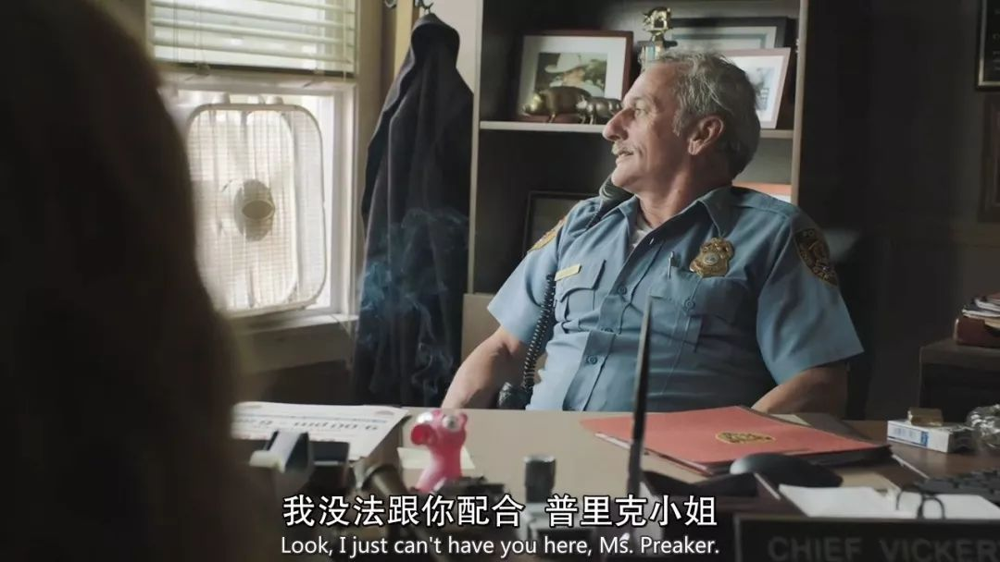

夏季美剧最强黑马！她配得上一个艾美奖最佳女主
星期日, 八月 12, 2018
11:37 上午

## 夏季美剧最强黑马！她配得上一个艾美奖最佳女主

原创： 新月  [环球银幕]()

说起电影旺季，大家都会想到属于大片们的暑期档；然而对于美剧来说，秋季档或许才是黄金季节，暑期则是“弃疗”季。在夏天，电视台往往让位于电影和体育比赛，推出的新剧寥寥无几。

不过，在每年夏天，总会有一两部剧抓住时机突围而出，大放光彩。今年，HBO的重头戏新剧显然就是这匹黑马——

《利器》

在海报上，母女三人精致的面庞都出现了道道裂痕，如同开裂的瓷器。《利器》又名《利器之痕》，讲的就是一个利器与伤痕的故事，关于尖锐的疼痛，关于创伤，关于疗愈。

女主角卡米尔是个事业没什么起色的小记者，活得比较颓丧。主编听说她的家乡出了少女谋杀案后，劝她好好抓住这个机会，去负责报道这个事件。然而面对苦口婆心的好老板与如此良机，卡米尔仍是一脸不情愿。

但是即使心中抵触，卡米尔还是尽责地回到了家乡。

至此，剧中两大相辅相成的悬念已被引出：小镇凶案真相，和卡米尔神秘的过去。

“小镇凶案”，凶案是悬念，小镇生态才是核心。在小地方，往往死者与凶手都会是大家天天见的熟人。一旦出现谋杀案，就人人自危，产生信任危机；而警察调查熟人也会束手束脚，每一步都走得艰难。

剧中的风口镇也是这样。卡米尔一回到家乡，就遇到重重阻力。

妈妈奥多拉对谋杀案避而不谈，对女儿的工作和生活完全不理解、也不尝试去理解，一边阻挠她的调查工作，一边指责她为什么“天天关注这些可怕的事情”。

警长讨厌记者掺和，怕卡米尔败坏风口镇的名声，对她的许多问题只有“无可奉告”。

同母异父的妹妹艾玛性格乖张古怪，迟迟不愿告诉卡米尔自己与受害者关系很好。她对待卡米尔的态度时冷时热，一会热情地拥抱卡米尔，一会又挑衅地把棒棒糖塞进姐姐头发里、激卡米尔打她。

小时候曾经伤害过卡米尔的男孩女孩们，也都长大成人，满脸假笑地对多年不见的卡米尔嘘寒问暖，同时又毫不犹豫地对凶案嫌疑犯做出最恶毒的猜测。

人们在同一个小镇生活，却各怀鬼胎。两场谋杀案，就像导火索一般，点燃了这个死气沉沉的小镇。褪掉了风平浪静的外衣后，风口镇露出了早已腐烂到底的皮肉。

十几岁的小女孩在贴满色情图片的废弃小屋里玩耍，中学橄榄球运动员以强上啦啦队员为每周娱乐，曾经见死不救的啦啦队员们长大成为一群嘴碎八卦的毒妇，镇上无聊的已婚男人们在酒吧下流地骚扰别人……

也难怪卡妹妹艾玛会直白地说：“这个小镇已经死透了。”

卡米尔分别去采访了两个受害者的家属，其中一个受害女孩的哥哥约翰也是案子的嫌疑人，但卡米尔很快对他放下了怀疑。约翰在大城市生活过，他说，自己很想念那种出了门没人认识你的感觉。

卡米尔对此当然很有共鸣，小镇上每天无处不在的八卦会对人产生极深的影响，直到自己也被同化。她在和警探聊天时也说过类似的话：财富和美貌会让你在这个小镇拥有很高地位，但头脑则会帮助你离开这里。

身处闭塞之地，人会渐渐沉沦和窒息。在小镇调查时，卡米尔几次都忍受不住，一个人躲在车里、屋里疯狂尖叫，宣泄内心的崩溃。

在卡米尔小时候，她的亲妹妹意外去世了。卡米尔一家都从未真正从那场死亡的阴影中走出来。而这次回来报道相似的事件，也让卡米尔的心理状态受到了极大刺激。

一开始，卡米尔选择酗酒来逃避。她喝起酒来可以说是很“硬核”了，简单干脆，酒精怎么多怎么来。

她的最爱是伏特加，酒鬼标配：无色无味，正好当水喝。

旅行时，带上“旅行装”小瓶伏特加；倒在矿泉水瓶里，伏特加兑水喝；等到了家，大瓶屯起来；存货喝完，再去酒吧点威士忌换换口味。

卡米尔整个人的状态都是低迷的，从气色，到神情，再到衣装打扮都是。

卡米尔总是穿着一身黑，哪怕天气炎热也都把自己包裹得严严实实。一开始，还显得很酷；但很快，揭晓了原因。

她从头到脚都是自残的伤痕，全是用针之类的利器划出的负面词语：“错误”、“滚”、“消失”、“刀片”……

卡米尔用利器自残，用锐利的疼痛提醒自己还活着，把自己从迟钝与麻木中拉出来。她曾多次进医院治疗心理问题，但自残的习惯仍然留了下来。

卡米尔早已被影响得和风口镇一样，表面上仍是“风口镇最漂亮的女孩”，但衣服之下却伤痕累累，不敢在外人面前露出肢体。

所有埋下的问题，都渐渐开始交汇到了一起。经过慢节奏的耐心铺垫，所有线索一定会在之后有一个爆发。

《利器》能发挥得这么好当然是有原因的，它显然是HBO今年的一个重点项目。

《利器》改编自吉莉安·弗琳的同命小说，她正是《消失的爱人》的原著作者。

《利器》的导演是让-马克·瓦雷，他执导的电影《达拉斯买家俱乐部》曾拿过奥斯卡，执导的美剧《大小谎言》拿过艾美奖，实力很强也很稳。

而且，他的音乐品味极佳。《大小谎言》中小女孩克洛伊的歌单存在感就极强，把剧迷疯狂圈粉。在《利器》中，他选的插曲同样很抓耳，并且非常符合整部剧阴郁压抑的氛围。

印象最深的，就是电音压迫感很强的Tumbling Lights，和第五集片尾绝望中包裹希望的那首Pa’lante。

主演阵容更是熟面孔齐聚，美剧和电影的大咖都有。

饰演妈妈的是老戏骨派翠西娅·克拉克森，既能演讽刺小品《酒会》，也能演《移动迷宫3》中的大反派。饰演警探的克里斯·梅西纳曾演过美剧《新闻编辑室》《六尺之下》，这次在《利器》中与艾米搭戏完全不落下风。

艾米·亚当斯担纲主演，她在剧中的角色与本人性格反差极大，却浑然天成，非常自然。最近传出消息，艾米不愿再演第二季，因为沉浸在这个黑暗的角色中给她带来了很大影响。也难怪，能演成这样，一定完完全全地入戏了。

如今《利器》的烂番茄仍有92%的新鲜度，艾米·亚当斯获艾美最佳女主的呼声也持续高涨。

![SHARP OBJECTS: MINISERIES  （ 2018 ）  TOMATOMETER 囗  92 ％  Average Rating: 8 ． 0 / 10  All Critics 》 Top Critics  Critics Consensus: A nearly  unbearable 引 OW burn. Sharp  Objects maintains its grip with  AUDIENCE SCORE 二  71 ％  liked it  Average Rating: 3 ． 9 ／ 5  User Ratings: 546  Average Episode Score: 95 ％  an unshakably grim  Season Reviews: 92  atmosphere and an  Fresh: 84  outstanding cast led by a  Rotten: 8  superb Amy Adams.  ADD YOUR RATING  亠 NOT INTERESTED  Add a Review (Optional)  + WANT TO SEE  9296](../_resources/6ae13677e72dda423e73ac11b868291d.jpg)

现在的网络能快速形成高口碑，却也很容易“捧杀”一部剧。在我看来，《利器》也许到不了神剧的程度，但足够被称为一部值得追的好剧。如果刚好喜欢这种风格，一集就会沉迷。

夏天剧荒，就看《利器》吧。

 From <http://mp.weixin.qq.com/s?__biz=MjM5NDY2OTI2Mw==&mid=2654632101&idx=1&sn=bb600aacd291f31d2e25e23e87a59979&chksm=bd4aef058a3d66134cc40c6043d54c97f06cc6664aed7bde46d65f1bdf56f2e5eb215d0089d4&mpshare=1&scene=1&srcid=0812BaCFV3MP4wEKl97eUFzk#rd>

