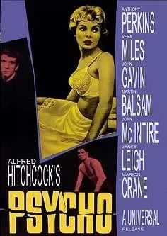
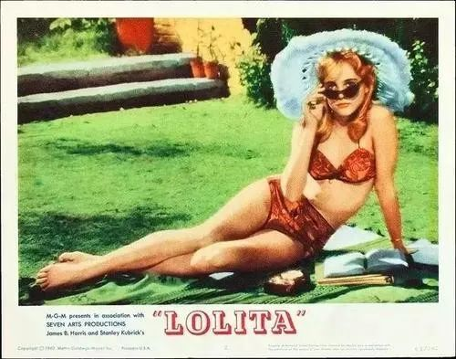
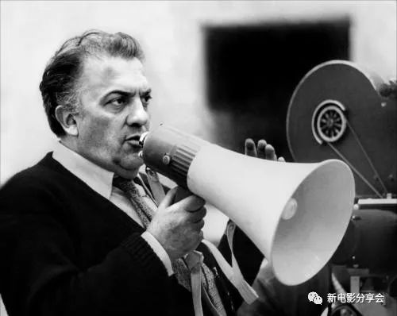
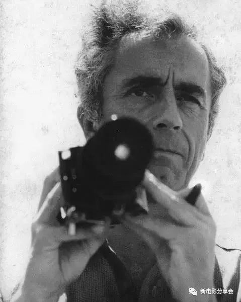
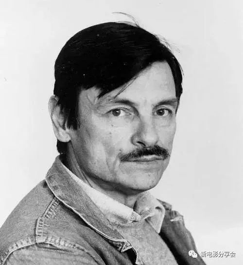

##  珍藏：20部不朽的影史经典

原创XDYFXH[新电影分享会]()**
**影史逾百年，经典数不胜数，
**电影分享会特推出“****珍藏****”系列。**
**选取那些不容错过的好电影。**
**20部电影，20位影坛巨匠，**
**值得珍藏与推荐！
**

## 1《精神病患者》
豆瓣8.9
*
*
*导演：阿尔弗雷德·希区柯克*
*主演：安东尼·博金斯、珍妮特·利*
上映时间：1960年
**—  看点  —**

**本片又名《惊魂记》，改编自劳勃·柏洛区的小说，源自真实事件：一个女人偷了钱来到一家汽车旅店，之后在旅店的浴缸里被谋杀。希区柯克以9000美元的价格买下了该小说的版权，由约瑟夫·史蒂法诺改编成剧本。****希区柯克在拍摄该片时，要求全体制作人员宣誓对剧情和结局严格保密。此外，他还对外宣布了母亲扮演者的候选名单，而实际上剧本中根本没有母亲一角。浴室杀人戏的高潮部分只有45秒，却花了7天的时间来拍摄，摄影机的移位达60次，最终用70个镜头快速剪辑而成。**

**点击下方图片，观看完整影片↓↓**

## 2《一个国家的诞生》
豆瓣8.2
**
*导演：D·W·格里菲斯*
*主演：丽莲·吉许、亨利·B·沃斯奥*
上映时间：1915年
**—  看点  —**

**这部作品让电影从技术发明上升到了艺术层面，它是影史第一部长篇叙事巨制，采用了多种电影制作的技巧。可谓是电影初期艺术手法的集大成者，夜景拍摄、全景长镜头拍摄、蒙太奇剪辑和平行剪辑技术，使得故事充满节奏感和史诗氛围。其中最后一分钟营救镜头，从此成为好莱坞的惯常套路。该片时长三个多小时，正式演员与群众演员用了1800位，马匹3000只。**

**点击下方图片，观看完整影片↓↓**

## 3《西线无战事》
豆瓣8.7
*
*
*导演：刘易斯·迈尔斯通*
*主演：刘·艾尔斯、路易斯·沃海姆*
上映时间：1930年
**—  看点  —**

堪称电影史上“最伟大的反战电影”之一，一举荣获1930年第3届奥斯卡金像奖最佳影片、最佳导演。简明精练的镜头再现了惨绝人寰的战争实况，也以细腻流畅的手法写活了保罗爱国迷梦的幻灭。影片结尾处保罗捉蝴蝶被子弹击中的镜头，已成为电影史上的经典瞬间。

**点击下方图片，观看完整影片↓↓**

## 4《公民凯恩》
豆瓣8.7
*
*
*导演：奥逊·威尔斯*
*主演：奥逊·威尔斯、约瑟夫·科顿、阿格妮丝·摩尔海德*
上映时间：1941年
**—  看点  —
**

该片在电影史上的地位是不可动摇的。自80年代以来，几乎稳居影史第一的位置。影片开创性的叙事方式、拍摄技法、剪辑技巧以及景深镜头的使用都是革命性的。尽管上映之初并没有引起足够重视，但自20世纪50年代中期起，它成了现代电影的教科书，影响了此后的每一位导演。它成了衡量电影艺术成就的至高无上的坐标。

**点击下方图片，观看完整影片↓↓**

## 5《偷自行车的人》
豆瓣9.0
*
*
*导演：维托里奥·德·西卡*
*主演：朗培尔托·马齐奥拉尼、恩佐·斯泰奥拉*
上映时间：1948年
**—  看点  —
**

意大利新现实主义经典之作，是世界电影史上十大不朽的影片之一。导演德·西卡将自己的摄影机对准了国内人们真实的生存状况，摒弃了之前电影粉饰现实的作风，对新的现实状况不再回避，甚至是冷静的揭露。德·西卡一生获奖无数，不仅开创了新现实主义风格，同时也影响了包括法国新浪潮在内的诸多导演。

**点击下方图片，观看完整影片↓↓**

## 6《小城之春》
豆瓣8.6
*
*
*导演：费穆*
*主演：石羽、李纬、韦伟*
上映时间：1948年
**—  看点  —
**

**华语影史排名第一的电影。一部在电影发展初期令国人骄傲的经典之作。因为历史原因，此片被长期埋没，直到后来被人重新发现，才敢于慢慢正视（或许有点像《公民凯恩》）。影片的叙事风格和艺术魅力达到了空前高度，其多重的意义和解读都体现出现代性，它的主观和客观永远都交错在一起，这样复杂的叙述方法是从来没有出现过的。这部电影中很多的叙事语言都显现出极大的张力，以至于后来田壮壮用“双钩法”完全照搬了一遍此片，却显得毫无生机，可见气韵是无法模仿的。有人说中国电影一直在学习和模仿，从来没有自己的传统，其实《小城之春》就是传统，但是起点太高了，后人难以望其项背，索性就忽视了它。**

**点击下方图片，观看完整影片↓↓**

## 7《雨月物语》
豆瓣8.6
*
*
*导演：沟口健二*
*主演：森雅之、京町子、田中绢代*
上映时间：1953年
**—  看点  —
**

影片根据日本江户时代作家上田秋成的同名小说改编，讲述日本战国末期战乱中的两对夫妇，源十郎沉湎于与女鬼的肉体之欢抛家舍业妻子被乱兵所杀，妹夫藤兵卫抛下妻子去当武士结果妻子被乱兵所辱的故事。作为日本早期电影的一代巨匠，沟口健二终其一生都在为日本底层女性素描，并用《西鹤一代女》、《雨月物语》、《山椒大夫》把东方式的幽玄审美带到威尼斯电影节。其悲悯的现实主义情怀也为后来日本电影广泛的国际影响力和大师级人物的出现奠定了基础。

**点击下方图片，观看完整影片↓↓**

## 8《12怒汉》
豆瓣9.4
*
*
*导演：西德尼·吕美特*
*主演：亨利·方达、李·科布、马丁·鲍尔萨姆
*
上映时间：1957年
***— ****** 简介*** ***—***

**该片只有一个场景，12个陪审员挤在一个不足40平米的狭小房间内，围绕一桩刑事案哔哔了整整一个半小时，却让观众看得如痴如醉。《12怒汉》通常被认为是导演西德尼·吕美特的巅峰之作，并顺利拿下了奥斯卡最佳剧本，因为剧本实在太过精彩。此片又被不断翻拍，俄罗斯版的、韩国版的、中国版的。但是都没有原版那么引人入胜，经得起回味。该片常年占据豆瓣排行榜。**

**点击下方图片，观看完整影片↓↓
**

## 9《第七封印》
豆瓣8.4
*
*
*导演：英格玛·伯格曼*
*主演：马克斯·冯·西多、本特·埃切罗特*
上映时间：1957年
**—  看点  —
**

瑞典电影大师伯格曼的代表作。影片透过理想主义的骑士布罗克以及他的同伴在瘟疫蔓延的欧洲大陆上的漂泊生涯，向观众展示了不同的人在面对死亡时不同的表现方式，同时对人类生存的意义、对信仰的根源以及上帝的存在性提出了针锋相对的疑问，同时又通过演员约瑟夫一家的生活来肯定信仰本身的力量。该片因为具有极高的艺术价值和寓言特点被奉为影史十大必看电影之一。

**点击下方图片，观看完整影片↓↓**

## 10《四百击》
豆瓣8.8
*
*
*导演：**弗朗索瓦·特吕弗*
*主演：**让-皮埃尔·利奥德、帕特里克·奥菲*
上映时间：1957年
***— ****** 简介*** ***—***

**法国电影“新浪潮”的开山之作，获戛纳最佳导演奖殊荣，是艺术电影史上一座丰碑。其叙事手法简单、直接，有一种穿透心扉的力量。法国谚语说，一个淘气顽皮的孩子要挨四百下打才能消除灾难，怯除恶魔，变成健康听话的儿童。特吕弗作为新浪潮的发起人之一，除了打破了腐朽的传统叙事模式，对新电影的叙事语言掌握的更为从容和有力，尤其片尾奔跑的长镜头，已经成为影史的经典画面。

**
**点击下方图片，观看完整影片↓↓**

****
****

## 11《精疲力尽》
豆瓣8.4
*
*
*导演：让-吕克·戈达尔*
*主演：让-保罗·贝尔蒙多、珍·茜宝*
上映时间：1960年
**—  看点  —
**

与特吕弗的《四百击》并称新浪潮的开山之作。其产生的巨大影响力改变了后来的世界电影格局，成为许多电影人的精神导师。影片不仅开创了一种潮流，更倡导了一种新的电影美学，这种颠覆性的美学风格，得益于新浪潮导演们的特殊身份，来自《电影手册》的评论作者，而不是技术学院派。新浪潮群体用“作者电影”给后来的电影人打开了一扇窗户，此窗一开，世界通透。

戈达尔在开始拍摄时没有一个完成的剧本，每天早晨先写好当天要拍摄的戏，在即将开拍时才会给演员各自的台词。因为买不起摄影推车，摄影师坐在轮椅上由导演来推动这辆"车"。在后期制作阶段，由于第一次剪辑的版本太长了无法上映，戈达尔向梅尔维尔咨询，梅尔维尔建议戈达尔这儿剪一点那儿剪一点，于是就有了"跳剪"技术。导演无意间把＂跳接＂这种手法从穿帮上升到了电影语言的领域，并产生了非凡的艺术效果。

**点击下方图片，观看完整影片↓↓**

## 12《用心棒》
豆瓣8.9
*
*
*导演：黑泽明*
*主演：三船敏郎、仲代达矢*
上映时间：1961年
**—  看点  —
**

**黑泽天皇与三船敏郎珠联璧合的经典武士电影，椿三十郎的角色简直是为三船敏郎量身定制，影片节奏明快，妙趣横生，场面调度流畅自然。此片对东方武侠的人物塑造具有开创精神，并引用了美国西部片的某些风格，以至于后来美国人反过来去模仿和翻拍了《西部大镖客》，而三船敏郎对角色塑造起了关键作用，也凭此片荣膺威尼斯影帝。黑泽明则再接再厉与第二年推出了《椿三十郎》，再次取得艺术和票房的双丰收。**

**点击下方图片，观看完整影片↓↓**

## 13《秋刀鱼之味》
豆瓣8.7
*
*
*导演：小津安二郎*
*主演：笠智众、岩下志麻*
上映时间：1962年
**—  看点  —
**

**《秋刀鱼之味》是小津安二郎的最后一部作品，是他穷尽一生的智慧和总结。小津用简朴清淡的风格和端然不动的摄影机（永远的狗眼视角），营造出了一个“不以物喜，不以己悲”的平和世界。和小津其他影片一样，其中细节尤值得玩味，每一个小处每一个动作都让人难以割舍。秋刀鱼是日本人生活中最常用的一种食材，寓意着普通人生的日常之事。小津始终恪守着自己的电影人生，不以物喜不以己悲。作为最受亚洲文艺片导演钟爱的导演，小津用这样一部隽永的经典之作，为自己的电影生涯画上了一个完美的句号。**

**点击下方图片，观看完整影片↓↓
**

## 14《洛丽塔》
豆瓣7.8
*
*
*导演：斯坦利·*库布里克**
*主演：詹姆斯·梅森、苏·莱恩、谢利·温特斯*
上映时间：1962年
**—  看点  —
**

**《一树梨花压海棠》改编自美国作家纳博科夫的同名小说。库布里克在当时花了150万美金的天价买下了小说版权。原著和影片都因为禁忌主题，引来众多围观群众。隐秘的情欲、身份的焦虑以及最终意识到的爱，合力将男人推向毁灭，她背后的巨大邪恶是你未知而不可接受的，你牺牲所有的时间、金钱和生命，换来的只是看洛丽塔微微皱眉。正如书中的开篇：洛丽塔，我生命之光，我欲念之火。我的罪恶，我的灵魂。洛丽塔：舌尖向上，分三步，从上颚往下轻轻落在牙齿上。洛-丽-塔-。”

**
**点击下方图片，观看完整影片↓↓**

**
**

## 15《 阿拉伯的劳伦斯》
豆瓣8.7*
*
*
*
*导演：大卫·里恩*
*主演：彼德·奥图尔、亚利克·基尼斯*
上映时间：1962年
**—  看点  —
**

**该片改编自英国军人作家托马斯·劳伦斯的回忆录《智慧七柱》。以土耳其入侵阿拉伯半岛为背景，讲述了英国陆军情报官劳伦斯带领阿拉伯游击队对抗土军，成功使阿拉伯各族维系在一起的故事。该片获得第35届奥斯卡奖7项大奖。2004年英国电影杂志《TOTAL FILM》评选了“50部最伟大的史诗电影”，该片位列第一位。在拍摄阿里进入海市蜃楼的画面时，摄影师弗雷迪·杨使用了一种特别的宽银幕482mm镜头，这种镜头称为“大卫·里恩镜头”。这部史诗巨制的伟大之处无需赘言，导演里恩从影四十多年，只拍摄了16部影片，但获得奥斯卡提名竟达56次之多，共获得27项金奖，他本人七次得到最佳导演提名，两次获奖，作为英国电影界的泰斗，里恩一生没拍过滥片。**

**点击下方图片，观看完整影片↓↓**

## 16《八部半》
豆瓣8.5
*
*
*导演：费德里科·费里尼*
*主演：马塞洛·马斯楚安尼、克劳迪娅·卡汀娜*
上映时间：1963年
**—  看点  —
**

**片名****《8½》****对****应的是费德里科·费里尼导演的影片总数，6部长片，一部合拍，两部短片。影片通过回忆、幻想、梦境的呈现，隐喻了一个关于电影创作的故事，也隐喻了电影本身。该片是用摄影机探究人物内心的一次伟大尝试，也因此**打破了现实时空主线叙述的完整。费里尼与伯格曼、塔可夫斯基并称为世界现代艺术电影的“圣三位一体”，有着60年代以来欧洲艺术电影难以逾越的成就高峰，被认为是20世纪影响最广泛的导演之一。他更以强烈的“费里尼风格”，引导着战后意大利的精神进程。**1993年，费里尼被授予奥斯卡终身成就奖；10月30日，费里尼病逝，意大利为其举行国葬，联合国教科文组织专门铸造了费德里科·费里尼勋章。**

**点击下方图片，观看完整影片↓↓**

## 17《红色沙漠》
豆瓣8.1
*
*
*导演：米开朗基罗·安东尼奥尼*
*主演：莫尼卡·维蒂、理查德·哈里斯*
上映时间：1964年
**—  看点  —
**

**安东尼奥尼把现代人的心态和现代工业文明一起表现**，敏感准确的再现了现代人的内心世界**。导演在片中简化甚至舍弃叙事和戏剧冲突，创造性的运用色彩作为影片的一个元素，营造影片氛围。画面构图充满张力，透着浓浓的抽象派绘画的意味。****安东尼奥尼于1943年以《波河的人们》开启导演生涯，其后拍摄了《奇遇》《夜》《春光乍现》《一个女人的身份证明》等无数佳作，是仅有的三位三大电影节大满贯得主之一，被喻为“欧洲最后的大师级导演”。文革期间，安东尼奥尼曾获邀来到中国，拍摄了一部被批判为“大毒草”的纪录片《中国》，曾引起全民声讨。1995年，安东尼奥尼躺在轮椅上与维姆·文德斯合作执导了《云上的日子》，并于同年获得奥斯卡终身成就奖。**

**点击下方图片，观看完整影片↓↓**

## 18《潜行者》
豆瓣8.8
*
*
*导演：安德烈·*塔科夫斯基**
*主演：亚历山大·凯迪诺夫斯基、安纳托里·索洛尼岑*
上映时间：1979年
**—  看点  —
**

**1957年，在苏联车里亚宾斯克附近的一个名叫玛雅卡的工厂，发生了一场核灾难，政府从未对外宣布过此事件，方圆几百里的土地都被放射物污染了。俄罗斯官方直到1992年才承认了这起事故以及该区确实存在。这场灾难成为塔科夫斯基运用到电影创作中的素材。《潜行者》不仅完全割舍了奇幻、情节性和冒险趣味，更是放缓了剪辑频率。开启了塔式创作的简约路线，并遵循时间、场景和行为的三一律原则。呈现出经典的塔科夫斯基“诗性”风格和塔式影像，深邃而悠远。**

**点击下方图片，观看完整影片↓↓**

## 19《铁皮鼓》
豆瓣8.3
*
*
*导演：沃尔克·施隆多夫*
*主演：马里奥·阿多夫、大卫·本奈特*
上映时间：1979年
**—  看点  —
**

**影片改编自诺贝尔文学奖得主君特*·*格兰斯的同名原著。这是一部气势宏大的史诗电影，施隆多夫将小说魔幻诡异的叙事得以完美呈现，****该片夺得当年的戛纳金棕榈和奥斯卡最佳外语片等多项殊荣。作为德国新电影运动的代表人物，施隆多夫和赫尔佐格、法斯宾德、文德斯一道扛起了战后德国电影的崛起旗帜，并用自己特有文学素养，给电影注入了新的属性和味道。****1997年6月，美国的****俄克拉荷马州****曾经发生了一场与此片有关的奇怪诉讼。一名州法官在观看了部分影片后，认定该片****涉及到了未成年色情描写****，命令当地警局没收该州所有录像带。直到次年年10月，美联邦法院认为没收是违反宪法的，而一直到2001年5月才做出最后裁决，《铁皮鼓》的录像带终于又可以在该州租赁。**

**点击下方图片，观看完整影片↓↓
**

## 20《雾中风景》
豆瓣8.9
*
*
*导演：西奥·安哲罗普洛斯*
*主演：坦尼亚·帕莱奥罗格、米卡利斯·泽克*
上映时间：1988年
**—  看点  —
**

**诗性的长镜头是希腊电影巨匠安哲罗普洛斯的典型风格。出众的文化底蕴，洞悉**当代**欧洲的眼光，安哲如一个智者，用**从容不迫**的镜头，从纷乱中拨弦，从迷雾中开路，总能击中观者的内心。其作品《流浪艺人》《尤利西斯的生命之旅》《永恒的一天》等，**安哲罗普洛斯**像一位古希腊的诗人或哲学家，用自己的镜头语言，记录着人世的喜乐悲苦，思考着人类在大地上亘古不变的处境。一如此片。

**
