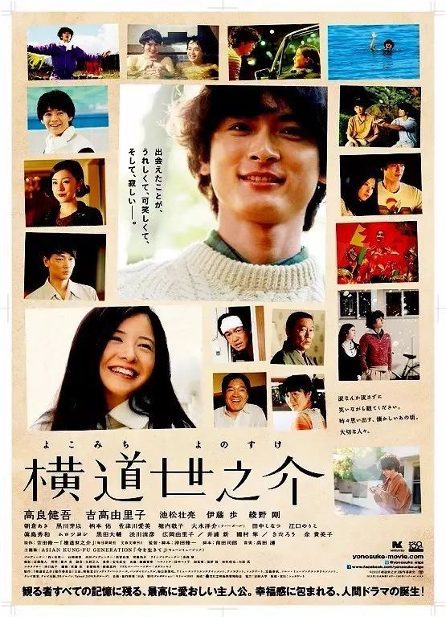

# 日语 | 24部日本电影堪称「此生必看」！

家欣  有道语言菌

**周末了，想必大家也想来个“葛优躺”，吃着小零食看电影吧。****今天，菌菌把分类整理出来的影评较好、触动人心的24部影片分享给大家，希望大家能有一个愉快的休息日~**

****— 故事类 —****

## 《Jose与虎与鱼们》
主演：妻夫木聪 、池胁千鹤

****剧情简介：****

本剧由田边圣子的同名短篇小说改拍而成。主要讲述了一位普通的大学生和一位行走不便的少女之间“不平衡”的恋爱故事。细腻的心理描绘既能触动人心，又能让观众们产生共鸣，不由得回忆起自身的恋爱经历。

## 《百万元和苦虫女》
主演：苍井优

****剧情简介：****

本剧讲述的是：离开老家的玲子给自己制定了一个“存够一百万就换地方”的有趣决定，这个决定对她的直接影响就是经常性地搬家。虽然跟外人的交流让玲子很困扰，但是这样的经历也在不知不觉中改变着玲子。

## 《恋人们》
主演：筱原笃、成岛瞳子、池田良

****剧情简介：****
该片由三段人物故事组成，分别是“妻子被无差别杀害”的丈夫、从地震灾区来的流亡人和被社会歧视的同性恋者。本片虽然大多数是由不出名的演员出演的，但个个都是实力派。

## 《编舟记》
主演：松田龙平、宫崎葵

****剧情简介：****

本剧由获得“本屋大賞”的浦しをん的同名小说改拍而成。在一家出版社的辞典编辑部里，以性格怪异的主人公马缔光也为中心展开的编辑部的故事。该片也包括男主与宫崎葵饰演的林香具矢之间的浪漫爱情故事。

## 《无人知晓》
主演：柳乐优弥

****剧情简介：****

以真实的被抛弃的孩子为背景，描述了生活艰难的兄弟姐妹的故事。本片经过15年的打磨后由是枝裕和执导而成。饰演长男的柳乐优弥也凭借此片成为戛纳国际电影节上年龄最小的最佳男主角。

## 《如父如子》
主演：福山雅治

****剧情简介：****
本片通过两个家庭抱错孩子的经历，让人们不由得发问，家庭是什么，羁绊和爱又是什么？是朝夕相处的感情珍贵还是血脉相连的羁绊重要。人生的十字路口该如何抉择？

## 《彩虹老人院》
主演：小田切让、柴崎幸、田中泯

****剧情简介：****
以同性恋这类比较敏感的话题和老人问题为题材，讲述了讨厌同性恋父亲的女儿和养老院里的人渡过的快乐时光。素颜出演女儿角色的柴崎幸和田忠泯饰演的父亲互飙演技！

****— 校园类 —****

## 《告白》（2010）
主演：松隆子

****剧情简介：****

由湊かなえ的同名畅销小说改拍而成。电影讲述了某一天身为班主任的悠子发现爱女被杀，虽然这起事件被认定为意外死亡，但她却向学生们宣告犯人就在班中，并展开了自己的复仇。

## 《琳达！琳达！琳达！》

主演：裴斗娜、前田亚季、香椎由宇…

****剧情简介：****
本片以鲜明的方式讲述了被bluehearts的音乐《琳达！琳达！琳达！》俘获内心的少女们，为了能在文化祭上现场表演这首歌所经受的考验。

## 《花和爱丽丝》
主演：铃木杏、苍井优

****剧情简介：****
青梅竹马的两个少女和男学长之间扭曲的三角关系。既有岩井俊二特有的执导方式作为点缀又有苍井优的绝妙演技来搭配。校园类必看！

## 《听说桐岛要退部》
主演：神木隆之介

****剧情简介：****

该片根据朝井辽的同名小说改拍。高中排球部的队长桐岛突然辞职的消息传遍整个校园，由此也产生了一些列的蝴蝶效应。校内的人际关系发生微妙变化，以变化时间轴和视点的方式呈现这场具有神秘意味的辞职风波……

****— 青春类 —****

## 《家鸭和野鸭的投币式寄物柜》
主演：滨田岳、瑛太

****剧情简介：****

由滨田岳和瑛太双主演，并由伊坂幸太郎的人气小说改拍而成。该片的主人公是刚搬到仙台求学的椎名和因某种原因要袭击书店的河崎。一开始深感迷惑的椎名觉得河崎是个怪人，随着和河崎交往的加深，椎名渐渐地了解了河崎的为人。在为年轻人的友情感动的同时，也不得不佩服导演魔术般的才能。

## 《关于莉莉周的一切》
主演：市原隼人、忍成修吾

****剧情简介：****
故事的主人公是一个崇拜艺术家莉莉周的少年。岩井俊二用印象深刻的背景音乐及其独特的影像美呈现出了陷于欺凌、援交的14岁少年的困扰。

****— 动画类 —****

## 《蜡笔小新之呼风唤雨！大人帝国的反击》
主演：矢岛晶子

****剧情简介：****

人气动漫《蜡笔小新》剧场版。一个神秘的组织在幼儿园里播放着20世纪的旧电影和电视节目，企图迷惑大人们，要让大人们都沉迷于过去的时光里。这到底是谁的阴谋，小新他能否粉碎这阴谋？

## 《夏日大作战》
主演：神木隆之介、樱庭奈奈美

****剧情简介：****
本片以网络社会与现实家庭间的羁绊为主题，描述了性格懦弱的健二与暗恋的学姐夏希、以及夏希的家人们共同联手对抗世界混乱危机的故事。

## 《你的名字》
主演：神木隆之介、上白石萌音

****剧情简介：****

本片主要讲述了东京少年和飞弹深山里的少女通过在梦中多次互换身体而互相吸引，并勇敢地对抗命运的故事。新海诚导演用他擅长的影像美及触动心弦的旋律给人以深刻的印象。后期的《天气之子》也很好看，还藏有很多彩蛋噢！~

## 《千与千寻》
主演：柊瑠美、入野自由

****剧情简介：****

本片描绘了在搬家途迷路，和父母一起进入到不可思议的世界里的女主千寻，一边在温泉屋老魔女的手下工作，一边想着如何回到现实世界的奋斗历程。本片连获多枚奖项，堪称日本动漫的代表作，它创下的304.0亿日元的票房至今仍无片能敌。

****— 恋爱类 —****

## 《百元之恋》
主演：安藤樱、新井浩文

****剧情简介：****

该片讲述了32岁的“家里蹲”一子，因某种原因不得不去百元店工作。为了摆脱不开心的日子，她全身心地投入到工作中，并在机缘巧合下结识拳击手狩野，通过拳击改变自己的故事。

## 《横道世之介》
主演：高良健吾、吉高由里子

****剧情简介：****
本片由吉田修一的同名小说改拍而成。本片讲述的是为了上大学而去东京的老好人横道世之介以及和他身边人的故事。以16年后的故事为切入点，是一部爱意满满的作品。

## 《三角》
主演：高冈苍甫、小野惠令奈、田畑智子

****剧情简介：****

三十岁的百濑和佳代是一对情侣，他们正在经历同居两年的厌倦期。佳代15岁的妹妹也住进来后，百濑的心也开始躁动起来。故事以此为开端，展开了奇妙的三角关系。是一部滑稽的爱情故事片。

## 《乐与路》
主演：宫崎葵、高良健吾

****剧情简介：****

由浅野いにお的同名漫画改拍。本片主要讲述了辞职的芽衣子和音乐路不顺的种田为梦前行的故事。导演在重视原作基调的基础上，细腻地呈现出了人生路途中的梦想和现实之间的矛盾。剧中宫崎葵所唱的《乐与路》也是值得一听的哦~

****— 悬疑＆恐怖类 —****

## 《嫌疑人X的献身》
主演：福山雅治、柴崎幸、堤真一

****剧情简介：****

该片由一宗被发现的男尸体被发现为开端，展开了帝都大学物理学教授汤川学和数学天才石神哲哉之间的斗智斗勇的故事。在感叹汤川作案手段严密的同时，也不得不为汤川为爱付出的精神所感动。虽然有很多版，但一直把日版奉为经典哈！

## 《死亡笔记》
主演：藤原龙也、松山健一

****剧情简介：****

该片由人气漫画《死亡笔记》改拍而成。一个名叫琉克的死神把一本“死亡笔记本”遗落在了人间。据说，名字被写在笔记本上的人都会死。拿到笔记本的青年夜神月与天才侦探L等人之间扑朔迷离的智力交锋即将上演。

## 《青之炎》
主演：二宫和也

****剧情简介：****

该片的主人公是一位十七岁的男生，本来和单亲妈妈及妹妹过着平凡的生活，但是和母亲结婚又离婚的继父打破了这个平静。栉森秀一本来打算用药水将继父增根杀于无形，来保护母亲和妹妹，结果却被同学发现，从此陷入无尽的深渊。

-END-