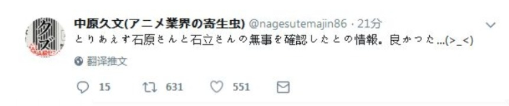
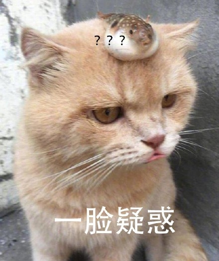
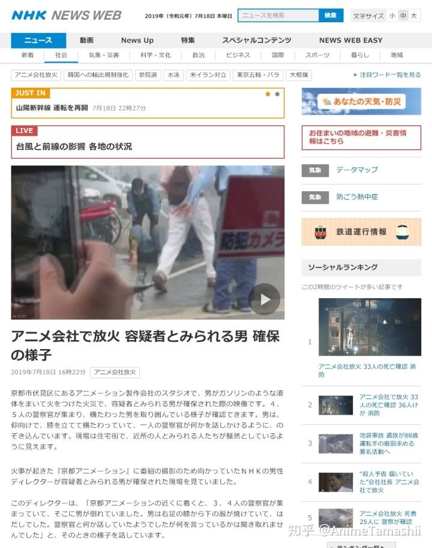

# [41岁宅男火烧京都，动画界史上最黑暗的一幕](http://www.leikeji.com/article/27630)

2019 年 7 月 19 日 14:38
小雷日常除了沉迷“搞机”以外，也是位醉心二次元动漫的死肥宅。
进宅历史能追究到十几年前，称得上大家童年回忆的——犬夜叉
更久远的还有“龙珠”、“铁臂阿童木”之流。

也看过霸占中国90后电视机十几年的“三大民工漫”：海贼王、火影忍者、死神。

如今国产大火的秦时明月之天行九歌、斗罗大陆、少年歌行统统有所涉猎。

小雷和很多90后、80后一样，伴随着动画一点点长大，从日本动画盛行，到今天国产动画崛起，个中点滴无一不历历在目、印刻心间。
二次元，早已成为众多动漫爱好者“欢乐”的代名词。
然而最近却发生一件骇人听闻，堪称动漫界有史以来最黑暗的事情。
京阿尼被纵火烧毁

日本时间18日10点30分，著名动漫公司“京都动画（京阿尼）”被人为纵火。

大火持续近5个小时，整栋大楼烧得漆黑一片，直至下午3点方扑灭火势。

此次事件造成33人遇难，其中男性12人，女性20人，1个分辨不出（可能是碳化了），还有36人受伤。

可能有的机友不太了解京阿尼，小雷简单科普下。
京阿尼不是间普通公司，在动画界有着“业界之光”之称，是日本巨星级动画公司。
成立于1985年，距今34年创造许多经典作品，甚至是神作。
如看哭无数人，伤过千万死宅心的三大催泪神作：Clannad、Air、Kanon。

还有一度刷屏称霸B站动画区的全金属狂潮、凉宫春日的忧郁、中二病也要谈恋爱、冰菓等。

是少数但凡出手，必属精品的良心公司。
凭借着实力收拢大批忠实的京粉，在日本和中国的二次元圈子里有着极大的影响力。

也因高质量的制作水平，被形容为：动画界冉冉升起的璀璨之星。
至于水平有多高，小雷用一张图给你们诠释。

就这样一家默默耕耘，只为做出优质作品的动画公司，却不幸得迎来了一把恶意之火。
大火与黑烟无情带走33位成员的生命，烧伤36人，还有无数的原稿、作品企划、设备化为灰烬。

不幸中的万幸，小雷通过推特了解到，京阿尼的核心成员“监督”在灾难中幸存下来。
京阿尼原画师原久文确认《Air》、《凉宫春日的忧郁》的监督“石原立也”和《境界彼方》、《紫罗兰的永恒花园》监督“石立太一”目前安全。

作曲家山口优表示《AIR》、《凉宫春日的忧郁》的监督“山田尚子”安全。

《境界的彼方》的原画师和监督“门胁未来”疑似通过熟人和亲戚报平安。

虽然重要人物存活下来，但日本动画公司如今普遍是无本买卖，没什么利润，大多数从业者用爱发光。
动画公司最重要资产还是人，画家的数量决定公司规模和实力，而京阿尼花费20年时间才积累这几十号人。
结果短短4个多小时死伤近70人，是京阿尼快一半的员工数，将要面临着没钱又没人的绝境。

雪上加霜的是，这把火烧的第一工作室，为京阿尼最重要的地方。
聚集了绝大部分的制作部门：原画、监督、演出、上色、CG、美术.....
我们以前看到的京阿尼动画和京阿尼内部照，基本全在这里制作与拍摄的。

大楼被毁、资料全失、员工伤亡近半，这次事件对京阿尼简直就是毁天灭地、世界崩坏式打击。
《龙女仆》、《电气目录》、《京紫剧场版》等作品怕是要无限延期。
未来还要着手重建大楼、修复资料、人才补充，穷苦的京阿尼不知道能否渡过劫难，恢复元气重回巅峰。

此次“京阿尼纵火事件”，是19年来除44人遇难“歌舞伎町大楼失火事件”外最惨重的一次火灾。

即使是上一次日本发生的恐怖袭击，世界上传得沸沸扬扬“东京地铁毒气事件”，实际遇害13人。
这次人为纵火却夺走了33条无辜的生命，严重程度有过之而无不及。
遂被日本最大的通讯社“共同通信社”定义为：平成以降最悪。

该事件的严重性与惨烈程度，甚至引来了诸多大人物的关注，纷纷为京阿尼祈福。
如安倍晋三，在火灾发生当天便表示出极度关心的态度，并为伤亡者送出祝福。

大牛级别作家，《秒速五厘米》的作者“新海诚”：希望京都动画的各位一定要平安无事。
然而被前京阿尼监督，奇葩山本宽回复：你闭嘴。

当然不能缺少我们如此爱好和平的国家，驻日大使也送上自己的一份心意。

甚至还有隔着太平洋，远在美国的苹果CEO库克，在推特上为京阿尼祈祷。

唉，除了和他们一样默默送上祝福，小雷也没办法做什么。
不过小雷有个疑惑，这位纵火之徒到底是什么仇什么冤，要做如此恶毒之事？
为何纵火？
据日本京都新闻报道，放火是一位41岁的中年男子。

报道里提到一个关键信息点：附近路人看到疑犯被捕时大喊“抄袭小说才放的火”。
难道这是一起抄袭小说导致的报复事件？
然而仅是路人的一面之词，根本不能作为判断依据。

（NHK公布纵火犯影像）
而且说京阿尼抄袭，鬼才信！日本对抄袭的容忍度极低，京阿尼作为明星公司更是受到多方关注。
不可能冒着破坏公司形象的风险，去抄一篇不知名的小说，而且多年来从未出现过抄袭传闻。
关键大部分作品以改编为主，从原画、分镜、CG、摄影几乎所有工作都是自己完成。

说京阿尼抄袭，如同宇宙帝国说孔子是他们的人。
另外小雷得到一个小道消息，该消息真假未知，大家可以纯当花边娱乐看看。
（来源：虎扑）
里面提到，该男子自创了一个词“barisaku”，后来因为京阿尼的动画出现“barisaku”一词。
认为是京阿尼抄袭他的自创词，所以进行报复，殊不知barisaku这词在更早以前被用来称呼“低音萨克斯”。
根本不是他的自创词。

真相到底如何，除了纵火犯自己，没有人知道。
而纵火犯因为被烧伤正在住院，目前也没法盘问。
小雷仅是提供自己找到的“信息”，供大家参考，切勿当真。

纵火可能早有预谋

根据NHK报道，在京阿尼火灾现场附近500米远的加油站的员工透露：
> 在当地10点，火灾发生30分钟前，有一名男子购买40升汽油，并装在两个油桶里放在手推车上，步行离开。
> 该男子说汽油的用途是：用在发电机上。

在当地19点21分，火灾完全浇灭的4个小时后，每日新闻报道：日本警方发现现场附近有两个油罐，推车、锤子与刀。
他们推测纵火犯用推车把油转移至京阿尼工作室内。
说明纵火犯确确实实把汽油运送到京阿尼工作室，并成功点燃引起火灾。

可是按照每日新闻所说，京阿尼工作室设有门锁，平时员工使用门卡进出。
纵火人是怎么进去的？

这时关键点出现了，NHK在新闻里提到：因为今天电视台拍摄节目，所以前去京阿尼现场。
原来是因为NHK拍节目，京阿尼在那天早上为了来客方便，取消了门锁。

才让纵火人有了可乘之机，而且现场附近发现的锤子和刀，正是为了破坏门锁而准备的。
这一切全是纵火人早已预谋好的事情，怪不得火灾发生得如此迅速又悄无声息。
其实京阿尼火灾不是突如其来的，在发生之前便收到“预告”。
动画公司被威胁屡见不鲜

火灾发生后，京阿尼社长八田英明接受媒体采访时表示：纵火者曾向公司发过“去死吧”等预告性质的邮件。

而且此类袭击，京阿尼并不是第一个发生的。
美术监督佐佐木洋透露：GAINAX公司在做《王立宇宙军》的时候，也曾被人泼过汽油。
幸好当时发现及时，才躲过一场火灾。

动画演出家西村大树也表示：看到过很多次怪人闯进公司，被警察带走的情形，希望动画公司加强戒备。

所以说，日本动画公司普遍遭受着来自未知的威胁，京阿尼是第一家受害者，但很可能不会是最后一家。
而威胁的原因有很多，动画拖更、作者拖稿、无法接受结局等，反正日本陈年宅男的想法，寻常人摸不透。

不管如何，小雷希望京阿尼渡过难关，制作出更多优质的作品。
也希望其他良心动画公司把安保重视起来，避免成为下一个京阿尼。
最后，献上一个无声的祝福：京阿尼，坚持住！
40143 人关注
本页面由 Flipboard 版面渲染引擎自动排版[查看原文](http://www.leikeji.com/article/27630)