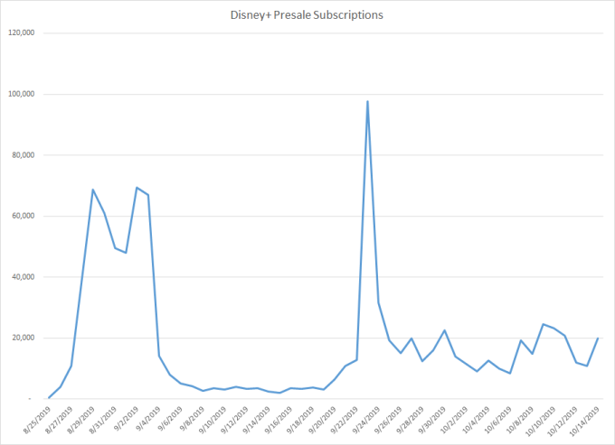

# Disney+正式发布前已有超过 100 万美国用户

在  2019.11.01  由  [Sarah Perez](https://techcrunch.cn/contributor/sarah-perez/)  ([@sarahintampa](https://twitter.com/sarahintampa))  发布

迪士尼最新的流媒体服务 Disney+要到 11 月中旬才会推出，但根据市场分析公司 Jumpshot 本周发布的最新数据，其美国的注册用户数可能已达到 100 多万。[Jumpshot](https://www.jumpshot.com/)  通过对在线消费者的调查得出这个结论。与此同时，它并不是唯一一家给出乐观预测的机构。

10 月中旬，瑞银分析师表示，他们调查了 1000 名消费者，86% 表示他们听说过 Disney+。此外，44% 的人表示他们 “可能” 付费订购。这一数字[领先于迪士尼 4 月份的内部预测](https://deadline.com/2019/08/disney-subscription-interest-outpacing-initial-company-targets-report-finds-1202706504/)。迪士尼当时预计，到 2024 年，美国的付费订购用户将达到 2000 万至 3000 万。（迪士尼同时预计，届时全球付费用户数将达到 6000 万至 9000 万。）

与 comScore 类似，Jumpshot 通过对 1 亿台设备的覆盖来收集消费者洞察。该公司宣称，能够获得有关消费者搜索、点击和交易的数据，包括那些封闭生态的数据，例如亚马逊、Netflix、谷歌等。

以 Disney+为例，Jumpshot 跟踪该服务注册页面的访问量，以及有多少用户付费购买。通过统计学校准，Jumpshot 可以推测出美国网民的整体情况。
Jumpsoht 的 Disney+数据仅限于美国，覆盖了从 8 月 25 日至 10 月 14 日预售时间范围内的移动端和桌面端的付费购买。
Jumpshot 也是首批收集 Disney+付费订购数据，制作消费者洞察的机构之一。

该公司发现，31% 的 Disney+订户已至少使用一个 OTT 流媒体平台，例如亚马逊、Hulu 或 Netflix。其中 19.4% 使用亚马逊 Prime，9.1% 使用 Hulu，18.5% 使用 Netflix。此外，12.5% 的付费用户已使用多个平台，这意味着他们打算用 Disney+补充自己的流媒体选择。

Jumpshot 的数据很有用，但还没有描绘出美国消费者对 Disney+兴趣的全貌。许多美国消费者可以通过 Verizon 获得这项新服务。[Verizon 与迪士尼合作](https://techcrunch.com/2019/10/22/verizon-is-giving-its-customers-12-free-months-of-disney/)，为其 4G LTE 和 5G 不限流量的新老客户提供一年的免费服务。其他人可能会在服务推出后注册付费用户，可能是通过电视平台应用，而不是 Disney+网站。

不过，Jumpshot 的数据是基于对消费者活动的跟踪，而不是调查。

其他研究也证实了消费者对 Disney+的浓厚兴趣。事实上，比起其他即将推出的竞品，他们对 Disney+的兴趣更大。例如，[HarrisX 的一项调查](https://www.broadcastingcable.com/news/21-of-households-intend-to-sign-up-for-disney-study)发现，21% 的美国家庭打算使用迪士尼的流媒体服务，而 HBO Max 只有 11%。[Hub 娱乐研究公司的调查](http://www.hubresearchllc.com/)发现，1/4 的美国电视用户表示，他们会注册 Disney+，而 Apple TV+的这一比例为 6%。

与此同时，[TV Time 和 UTA IQ 的一项研究](http://resources.mediamorph.com/white-paper-beyond-the-big-three)深入关注了品牌认知度。结果发现，在即将推出的服务中，Disney+和 Apple TV+的品牌认知度最高，分别为 88% 和 63%。随后是 HBO Max 的 37% 和 NBCU 旗下 Peacock 的 28%。

研究还发现，Disney+不仅仅对有孩子的家庭有吸引力。无论是否有孩子，家庭用户付费订购的可能性都差不多。这表明，迪士尼通过其知名 IP，如星球大战和漫威，在吸引成年观众方面表现得很好。

Disney+，Apple TV+，HBO Max，Peacock 和 Quibi 都即将在美国市场亮相，因此这场流媒体之战的结局还有待观察。毕竟，大多数消费者的预算都是有限的，而电视只是现在可以购买的众多订购服务之一。音乐、新闻、游戏等领域也都有各自的付费订购服务。

翻译：维金

