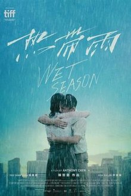

# 热带雨（新加坡2019发布）

| 热带雨   *Wet Season* |     |
| --- | --- |
|  |     |
| 基本资料 |     |
| 导演  | [陈哲艺](https://zh.wikipedia.org/wiki/%E9%99%B3%E5%93%B2%E8%97%9D "陈哲艺") |
| 编剧  | 陈哲艺 |
| 主演  | [杨雁雁](https://zh.wikipedia.org/wiki/%E6%A5%8A%E9%9B%81%E9%9B%81 "杨雁雁")   [许家乐](https://zh.wikipedia.org/wiki/%E8%A8%B1%E5%AE%B6%E6%A8%82 "许家乐") |
| 摄影  | Sam Care |
| 制片商 | 长景路电影工作室   赤角   新加坡电影委员会 |
| 片长  | 103分钟 |
| 产地  |  [新加坡](https://zh.wikipedia.org/wiki/%E6%96%B0%E5%8A%A0%E5%9D%A1 "新加坡") |
| 语言  | 华语   英语   部分福建话 |
| 上映及发行 |     |
| 上映日期 | - 2019年9月8日（多伦多电影节） - 2019年11月28日（新加坡） - 2020年1月31日（台湾） - 2020年3月12日（马来西亚） - 2020年4月30日（香港） |
| 发行商 | Golden Village电影 |

《**热带雨**》（英文：*Wet Season*）是一部2019年新加坡华语剧情片。本片讲述一位新加坡中学老师，在面临家庭和事业波折的当下，与自己的一位学生开始了特殊的感情。本片由[陈哲艺](https://zh.wikipedia.org/wiki/%E9%99%B3%E5%93%B2%E8%97%9D "陈哲艺")执导；[杨雁雁](https://zh.wikipedia.org/wiki/%E6%A5%8A%E9%9B%81%E9%9B%81 "杨雁雁")、[许家乐](https://zh.wikipedia.org/wiki/%E8%A8%B1%E5%AE%B6%E6%A8%82 "许家乐")、[李铭顺](https://zh.wikipedia.org/wiki/%E6%9D%8E%E9%93%AD%E9%A1%BA "李铭顺")、杨世彬主演。本片获得好评，并在[第56届金马奖](https://zh.wikipedia.org/wiki/%E7%AC%AC56%E5%B1%86%E9%87%91%E9%A6%AC%E7%8D%8E "第56届金马奖")荣获最佳女主角，于2020年3月12日在马来西亚上映。

本片在[第56届金马奖](https://zh.wikipedia.org/wiki/%E7%AC%AC56%E5%B1%86%E9%87%91%E9%A6%AC%E7%8D%8E "第56届金马奖")获得六项提名，包括最佳剧情片、最佳导演、最佳男配角，并由杨雁雁荣获最佳女主角一个奖项[\[1\]](#cite_note-1)。本片也于2019年11月28日在新加坡上映。

## 剧情简介\[[编辑](https://zh.wikipedia.org/w/index.php?title=%E7%86%B1%E5%B8%B6%E9%9B%A8&action=edit&section=1 "编辑章节：剧情简介")\]

剧情讲述从马来西亚移居新加坡的中文老师阿玲，结婚数年仍无法生育，与丈夫的关系日趋平淡。人工受孕失败、还有瘫痪在床的公公，让她更感沮丧。新加坡教育体制对中文课缺乏重视，让她在事业上面临挑战。南国的雨季，一场又一场的雨，阿玲和一个男学生展开了一段特殊的情感。几经波折，阿玲重新认识了自己。面对家庭变故，她该如何面对？

## 演员列表\[[编辑](https://zh.wikipedia.org/w/index.php?title=%E7%86%B1%E5%B8%B6%E9%9B%A8&action=edit&section=2 "编辑章节：演员列表")\]

| 演员  | 角色  | 简介  |
| --- | --- | --- |
| [杨雁雁](https://zh.wikipedia.org/wiki/%E6%A5%8A%E9%9B%81%E9%9B%81 "杨雁雁") | 阿玲  | 一所新加坡中学的中文老师 |
| [许家乐](https://zh.wikipedia.org/wiki/%E8%A8%B1%E5%AE%B6%E6%A8%82 "许家乐") | Weilun | 中学生，是阿玲的学生 |
| [李铭顺](https://zh.wikipedia.org/wiki/%E6%9D%8E%E9%93%AD%E9%A1%BA "李铭顺") | Andrew | 阿玲的丈夫 |
| 杨世彬 | 公公  | 阿玲的家公 |

## 制作\[[编辑](https://zh.wikipedia.org/w/index.php?title=%E7%86%B1%E5%B8%B6%E9%9B%A8&action=edit&section=3 "编辑章节：制作")\]

本片是新加坡导演[陈哲艺](https://zh.wikipedia.org/wiki/%E9%99%B3%E5%93%B2%E8%97%9D "陈哲艺")续六年后的第二部长片作品，其2013年的第一部长片《[爸妈不在家](https://zh.wikipedia.org/wiki/%E7%88%B8%E5%AA%BD%E4%B8%8D%E5%9C%A8%E5%AE%B6 "爸妈不在家")》在金马奖获得最佳电影，也在戛纳电电影节获得金摄影机奖[\[2\]](#cite_note-2)[\[3\]](#cite_note-3)。陈哲艺表示在第一部长片后，六年间只担任其他电影的监制[\[4\]](#cite_note-4)。他花了三年编写剧本，并用一年时间选角。马来西亚演员杨雁雁与新加坡演员许家乐在《爸妈不回家》后再次合作，前部饰演母子，本片则是师生关系。其他演员包括马来西亚演员李铭顺、资深舞台剧演员杨世彬。电影于2018年5月在新加坡拍摄。由于拍片档期并非雨季，所以幕后使用造雨机来制造大部分场景都需有的下雨背景。

## 发行\[[编辑](https://zh.wikipedia.org/w/index.php?title=%E7%86%B1%E5%B8%B6%E9%9B%A8&action=edit&section=4 "编辑章节：发行")\]

本片于2019年9月8日在[多伦多国际电影节](https://zh.wikipedia.org/wiki/%E5%A4%9A%E5%80%AB%E5%A4%9A%E5%9C%8B%E9%9A%9B%E9%9B%BB%E5%BD%B1%E7%AF%80 "多伦多国际电影节")上的“站台竞赛单元”举行首映[\[5\]](#cite_note-5)[\[6\]](#cite_note-6)；并于同年11月在2019年[新加坡国际电影节](https://zh.wikipedia.org/wiki/%E6%96%B0%E5%8A%A0%E5%9D%A1%E5%9B%BD%E9%99%85%E7%94%B5%E5%BD%B1%E8%8A%82 "新加坡国际电影节")和[金马国际电影节](https://zh.wikipedia.org/wiki/2019%E5%B9%B4%E9%87%91%E9%A6%AC%E5%9C%8B%E9%9A%9B%E5%BD%B1%E5%B1%95 "2019年金马国际电影节")上播映。本片将于2019年11月28日在新加坡上映[\[7\]](#cite_note-7)。马来西亚院线版本因国情因素，剧中内容存有激情床戏和露股情节被[马来西亚电检局](https://zh.wikipedia.org/w/index.php?title=%E9%A9%AC%E6%9D%A5%E8%A5%BF%E4%BA%9A%E7%94%B5%E6%A3%80%E5%B1%80&action=edit&redlink=1 "马来西亚电检局（页面不存在）")部分删剪，但仍保留了原版整体内容，不影响剧情[\[8\]](#cite_note-8)。

本片主题曲《热带雨》，由NEKO Highway猫速公路乐团的主唱卡爷负责作曲演唱，陈宇昕填词，邓志明制作与编曲[\[9\]](#cite_note-9)。

## 奖项及提名\[[编辑](https://zh.wikipedia.org/w/index.php?title=%E7%86%B1%E5%B8%B6%E9%9B%A8&action=edit&section=5 "编辑章节：奖项及提名")\]

本片在金马奖获得六项提名，包括最佳剧情片，陈哲远入围最佳导演和原创剧本，许家乐和杨世彬入围最佳男配角，而杨雁雁则获得最佳女主角奖。

| 年份  | 奖项  | 提名项 | 得奖者 | 结果  |
| --- | --- | --- | --- | --- |
| 2019 | [第3届平遥国际电影展](https://zh.wikipedia.org/wiki/%E5%B9%B3%E9%81%99%E5%9C%8B%E9%9A%9B%E9%9B%BB%E5%BD%B1%E7%AF%80#%E7%AC%AC%E4%B8%89%E5%B1%8A%EF%BC%882019%E5%B9%B4%EF%BC%89 "平遥国际电影节") | 费穆荣誉·最佳影片 | 《热带雨》 | 获奖  |
| 费穆荣誉·最佳女主角 | [杨雁雁](https://zh.wikipedia.org/wiki/%E6%A5%8A%E9%9B%81%E9%9B%81 "杨雁雁") | 获奖  |
| 影迷选择荣誉 | 《热带雨》 | 获奖  |
| [第56届金马奖](https://zh.wikipedia.org/wiki/%E7%AC%AC56%E5%B1%86%E9%87%91%E9%A6%AC%E7%8D%8E "第56届金马奖") | [最佳剧情长片](https://zh.wikipedia.org/wiki/%E9%87%91%E9%A6%AC%E7%8D%8E%E6%9C%80%E4%BD%B3%E5%8A%87%E6%83%85%E9%95%B7%E7%89%87 "金马奖最佳剧情长片") | 《热带雨》 | 提名  |
| [最佳导演](https://zh.wikipedia.org/wiki/%E9%87%91%E9%A6%AC%E7%8D%8E%E6%9C%80%E4%BD%B3%E5%B0%8E%E6%BC%94 "金马奖最佳导演") | [陈哲艺](https://zh.wikipedia.org/wiki/%E9%99%B3%E5%93%B2%E8%97%9D "陈哲艺") | 提名  |
| [最佳女主角](https://zh.wikipedia.org/wiki/%E9%87%91%E9%A6%AC%E7%8D%8E%E6%9C%80%E4%BD%B3%E5%A5%B3%E4%B8%BB%E8%A7%92 "金马奖最佳女主角") | [杨雁雁](https://zh.wikipedia.org/wiki/%E6%A5%8A%E9%9B%81%E9%9B%81 "杨雁雁") | 获奖  |
| [最佳男配角](https://zh.wikipedia.org/wiki/%E9%87%91%E9%A6%AC%E7%8D%8E%E6%9C%80%E4%BD%B3%E7%94%B7%E9%85%8D%E8%A7%92 "金马奖最佳男配角") | [许家乐](https://zh.wikipedia.org/wiki/%E8%A8%B1%E5%AE%B6%E6%A8%82 "许家乐") | 提名  |
| [最佳男配角](https://zh.wikipedia.org/wiki/%E9%87%91%E9%A6%AC%E7%8D%8E%E6%9C%80%E4%BD%B3%E7%94%B7%E9%85%8D%E8%A7%92 "金马奖最佳男配角") | [杨世彬](https://zh.wikipedia.org/w/index.php?title=%E6%A5%8A%E4%B8%96%E5%BD%AC&action=edit&redlink=1 "杨世彬（页面不存在）") | 提名  |
| [最佳原著剧本](https://zh.wikipedia.org/wiki/%E9%87%91%E9%A6%AC%E7%8D%8E%E6%9C%80%E4%BD%B3%E5%8E%9F%E8%91%97%E5%8A%87%E6%9C%AC "金马奖最佳原著剧本") | [陈哲艺](https://zh.wikipedia.org/wiki/%E9%99%B3%E5%93%B2%E8%97%9D "陈哲艺") | 提名  |

## 参考资料\[[编辑](https://zh.wikipedia.org/w/index.php?title=%E7%86%B1%E5%B8%B6%E9%9B%A8&action=edit&section=6 "编辑章节：参考资料")\]

## 外部链接\[[编辑](https://zh.wikipedia.org/w/index.php?title=%E7%86%B1%E5%B8%B6%E9%9B%A8&action=edit&section=7 "编辑章节：外部链接")\]

- 查看上映电影院和时间表：[马来西亚](http://www.cinema.com.my/movies/details.aspx?search=2019.15162.wetseason.31189&lang=mand&section=showtimes)
- [互联网电影数据库](https://zh.wikipedia.org/wiki/%E4%BA%92%E8%81%94%E7%BD%91%E7%94%B5%E5%BD%B1%E6%95%B0%E6%8D%AE%E5%BA%93 "互联网电影数据库")（IMDb）上《[热带雨](http://www.imdb.com/title/tt9822706)》的资料（英文）
- [豆瓣电影](https://zh.wikipedia.org/wiki/%E8%B1%86%E7%93%A3 "豆瓣")上《[热带雨](https://movie.douban.com/subject/30371819/)》的资料 （简体中文）
- [时光网](https://zh.wikipedia.org/wiki/%E6%97%B6%E5%85%89%E7%BD%91 "时光网")上《[热带雨](http://movie.mtime.com/263803/)》的资料（简体中文）
- [烂番茄](https://zh.wikipedia.org/wiki/%E7%88%9B%E7%95%AA%E8%8C%84 "烂番茄")上《[热带雨](https://www.rottentomatoes.com/m/wet_season)》的资料（英文）