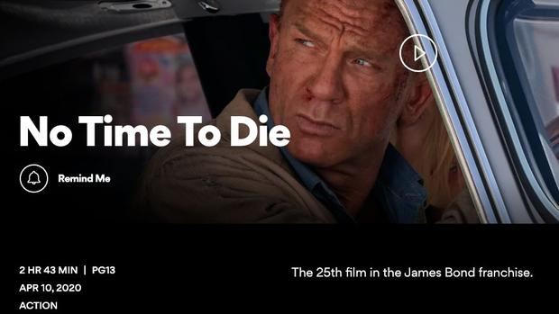

# 《007：无暇赴死》成片长最长邦德电影

**2个小时43分钟大挑战 4月全球陆续上映**

2020-02-27 09:02:33 [来源：Mtime时光网](http://www.mtime.com/)

这一把要玩大的，《007：无暇赴死》是片长最长的邦德电影。

  
  
　

幕后特辑之导演解读

**时光网讯** 多家预售票网确认，[《007：无暇赴死》](http://movie.mtime.com/194878/)最终片长为163分钟（2小时43分钟），超过[《007：幽灵党》](http://movie.mtime.com/194879/)的148分钟，创下007系列最长片长纪录。

  

　　据此前报道，[《007：无暇赴死》](http://movie.mtime.com/194878/)是“改变游戏规则”的一部邦德电影，尤其在对于邦女郎的塑造上。另外导演凯瑞·福永表示，本片是“这是集所有精华于一身的邦德电影” 。本片将于4月2日英国、4月10日北美公映。

  

[《007：无暇赴死》](http://movie.mtime.com/194878/)163分钟（最长）

[《007：幽灵党》](http://movie.mtime.com/194879/)148分钟

[《007：大战皇家赌场》](http://movie.mtime.com/31870/)144分钟

[《007：大破天幕危机》](http://movie.mtime.com/92774/)143分钟

[《007之女王密使》](http://movie.mtime.com/11478/)142分钟

[《007之择日而亡》](http://movie.mtime.com/11869/)133分钟

[《007之杀人执照》](http://movie.mtime.com/11689/)133分钟

  

[《007：大破量子危机》](http://movie.mtime.com/54334/)106分钟（最短）

编辑：小火纸

## 相关电影/影人

### [007：无暇赴死 (2020)](http://movie.mtime.com/194878/)

导演：[凯瑞·福永](http://people.mtime.com/1478907/)

主演：[丹尼尔·克雷格](http://people.mtime.com/911749/)

北京动艺时光网络科技有限公司Copyright 2006-2020 Mtime.com Inc. All rights reserved.  
[京ICP证050715号](http://feature.mtime.com/help/icp.htm)
[京ICP备06000714号-1](http://www.beian.miit.gov.cn/) 
[网络视听许可证0108265号](http://feature.mtime.com/help/videolicence.htm)
[网络文化经营许可证](http://feature.mtime.com/help/network.htm)
[广播电视节目制作经营许可证(京)字第1435号](http://feature.mtime.com/help/tvlicence.htm)
