速读摘要

在南方大部分地区，小年是腊月二十四日，也就是今天，是扫尘、祭灶的日子。那么今天，菌菌就跟随《唐探3》的正式预告片，在这一分半的预告片中，来和大家一起探寻，这部电影中的日本元素!泡温泉是很多人必不可少的生活形式，就算不去温泉，一家人在家泡浴缸，也是常见的生活日常。不同的温泉有不同的功效，游客可以在种文官网提前查好【温泉分析书别表】，温泉根据功效分为[一般适应症]和[泉质别适应症]。

原文约  2651  字  |  图片  33  张  |  建议阅读  6  分钟  |  [评价反馈](https://static.app.yinxiang.com/embedded-web/clipper/#/Evaluating?d=2020-01-19&nu=22c5dd0f-fc5f-497b-ad53-ec28f0e002fa&fr=myyxbj&ud=58b471&v=2&sig=048A195D6B45DDF664376F097DEB826F)

## 小年送票 | 跟随《唐人街探案3》探寻日本文化

原创  家欣  有道语言菌

“古传腊月二十四，灶君朝天欲言事。云车风马小留连，家有杯盘丰典祀。”过小年是民间传统的节目之一。

在南方大部分地区，小年是腊月二十四日，也就是今天，是扫尘、祭灶的日子。而清朝中后期开始，帝王家在腊月二十三完成祭天大典的同时，会为了“节约开支”而顺便拜灶王爷，因此北方地区多在腊月二十三日过小年。

因此，不管大家身处何处，菌菌都在这里补一句“小年快乐”啦！祝大家新年新气象，辞旧迎新~并为大家送上贺岁新片《唐人街探案3》的电影票！赢取电影票的方式就在文末，不要错过！

- 今日资讯 -

2020年1月18日 星期六
东京 4°C/2°C 阵雨

自从昨天的文章。。。发布以来，菌菌已经在后台收到了很多读者的截图，看来大家的热情很高涨呀，《唐人街探案3》不愧是过年贺岁片中最令人期待的电影之一！

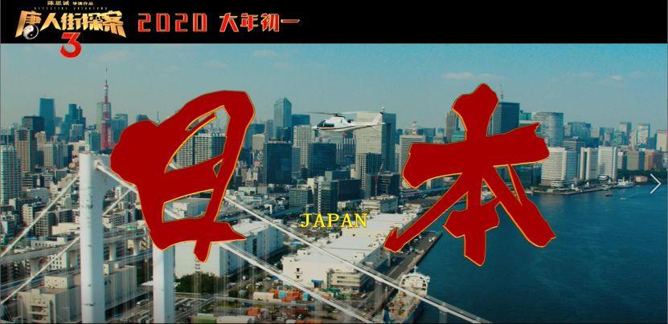

那么今天，菌菌就跟随《唐探3》的正式预告片，在这一分半的预告片中，来和大家一起探寻，这部电影中的日本元素！

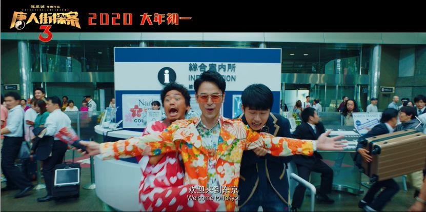

【*另外，已经集赞完成的同学们也稍安勿躁，继续等待菌菌的下一步指令，坐等中奖结果的宣布吧！】

预告一开篇，唐探CP就受邀来到日式泡汤馆，被一群黑帮按在水中接下了案子。黑帮、密室、泡汤、浮世绘等显著的日本元素扑面而来！就这样，唐探CP在东京的街头，开始了一场刺激的破案历险。

****黑帮****

提到黑帮，就不免想到日本的黑社会组织，各个穿着整齐干净的黑色西装，全身的纹身和手上拿着的铁棒。黑帮是日本文化中不可忽视的一种象征，更是维护治安的自发性组织，日本黑帮的等级制度和形式准则更是世界之最。

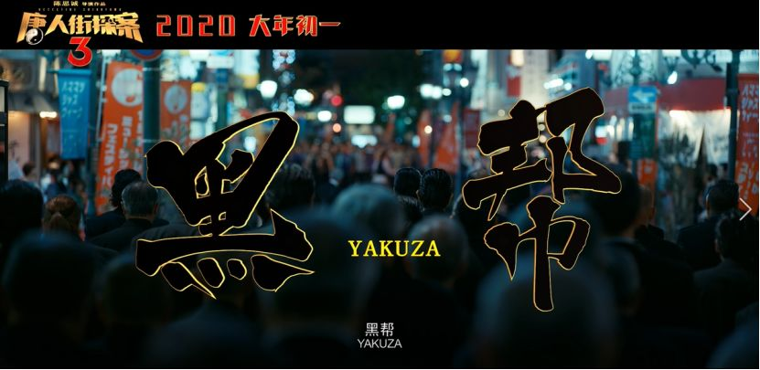

日本黑帮是全世界最独特的存在，黑社会组织的繁荣之初，是因为日本二战后经济萧条，国家机器无法正常运作，因此，黑社会组织担负起维护社会治安的责任，不仅在社会上获得声望，在群众中也广受尊重。

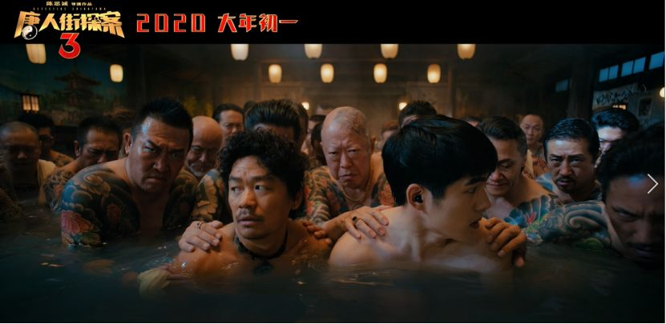

如果你生活在日本，要如何加入黑帮组织呢？上求职网站就可以了，黑社会/黑帮在日本的正式名称是【暴力团员Yakuza】，在日本，各帮派被称为暴力团，而其成员就是暴力团 员了。

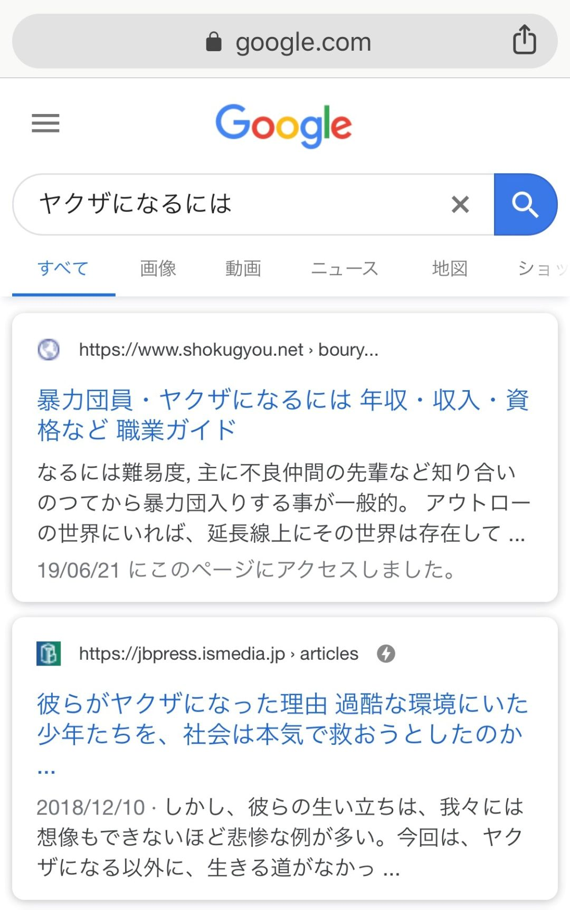

因此，黑帮在日本是一种职业，也会根据个人实力和等级来划分收入，不过日本黑帮更注重信仰，或是契约精神，【有觉悟再入行】，不可轻易金盆洗手。

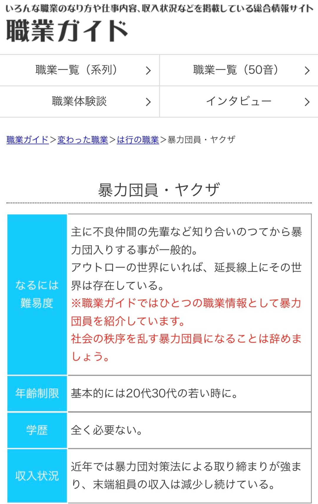

对于他们来说，职场环境不仅等级森严，工作强度更是比互联网996更恐怖，想要离职的话代价可能就是一只小手指了，而不是提前一周提交离职报告了..

****密室****
在日本，密室杀人案件在《名侦探柯南》中出现次数很多，也称之为“不可能犯罪”。而在本次的预告片中，也提到“密室”，不知道这次唐探CP会遇到什么样的案件呢？

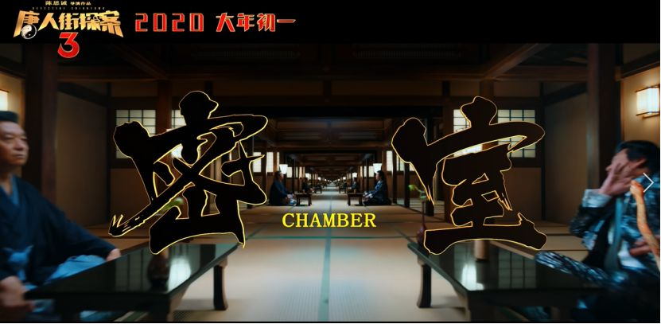

同时，不只是悬疑电影拥有超高人气，密室逃脱也广受年轻人的喜爱。日本的密室逃脱同时兼具了纤细精致的日本文化和经典的电影元素。用丰富逼真的场景道具，和缜密烧脑的逻辑思维，带来沉浸式的游戏体验。

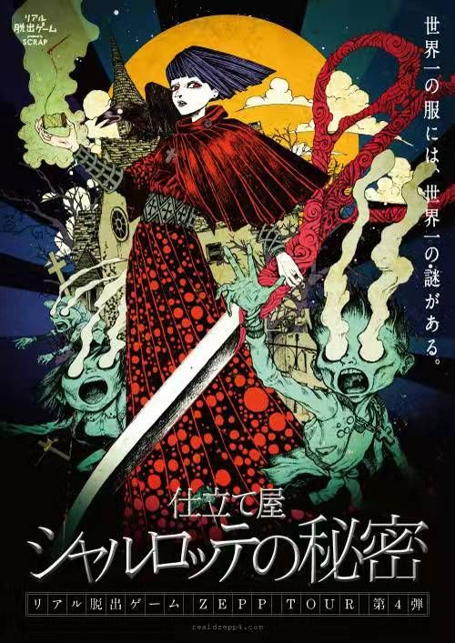

密室逃脱是指，实际参加者被困在某个空间内，通过解开谜题，旨在逃脱出来的互动游戏活动。经常在公寓的某1房间、夜晚的游乐场和东京巨蛋等地举办这样的活动。

这是日本最新的高人气密室逃脱，所谓“Escape from The NINE ROOMS”（逃出九重密室）是指，解开谜题，从连续的9个密室一个接一个地逃出，目标是逃出全部密室的体验型游戏活动。

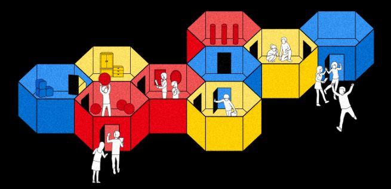

自2007年初次举办以来，已经有400多万人参与过这种形式的活动。不仅是日本，全世界都开始风靡，将参加者带入兴奋的漩涡中，无论男女老少，都喜爱这种体验型娱乐活动。

横浜ヒミツキチオブスクラップ 电话：〒220-0011
地址：神奈川県横浜市西区高島2丁目14−9　アソビル　2F
（ASOBUILD大楼2楼 Real Escape Room 横滨）
收费：门票 1人10分钟／800日元（当日仅限现金支付）

**泡汤 **
在日本，泡温泉是很多人必不可少的生活形式，就算不去温泉，一家人在家泡浴缸，也是常见的生活日常。

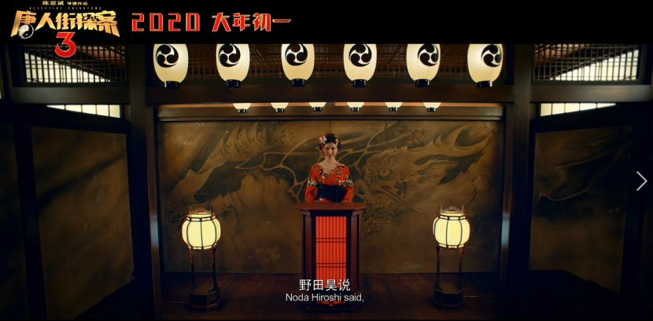

日本温泉一般分为男汤和女汤，在温泉的入口“男湯”、“殿方”门帘是供男性洗浴的，挂有“女湯”、“御妇人”的则是女性浴场。

一般在日本泡温泉是不能穿泳衣的，因为泳衣的材质可能会释放出有害物质，从而污染水源。一些严格的温泉甚至不让汤客带小毛巾入浴。

不仅是人，日本的雪猴也喜欢泡温泉啦！不同于澡堂，日本温泉的讲究可深了，如果你想去日本自由行，那温泉、樱花、寿司和神社，是旅游必不可少的打卡元素。但要选好一处温泉，是需要做好充足研究的。

在日本，不同的温泉有不同的功效，游客可以在种文官网提前查好【温泉分析书别表】，温泉根据功效分为[一般适应症]和[泉质别适应症]。

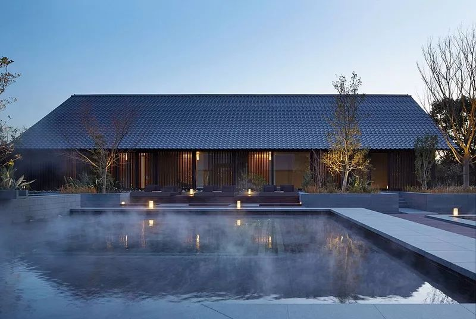

公认的一般适应症和家里的浴缸水没有什么区别，仅通过高温达到一种促进血液循环，保温热敷，舒缓紧张。而泉质别适应症的PH值、源泉温度、浸透度、特殊成分都更高级，可以针对性的缓解一些疾病。体验一次真正的温泉，可谓是终生难忘噢！~

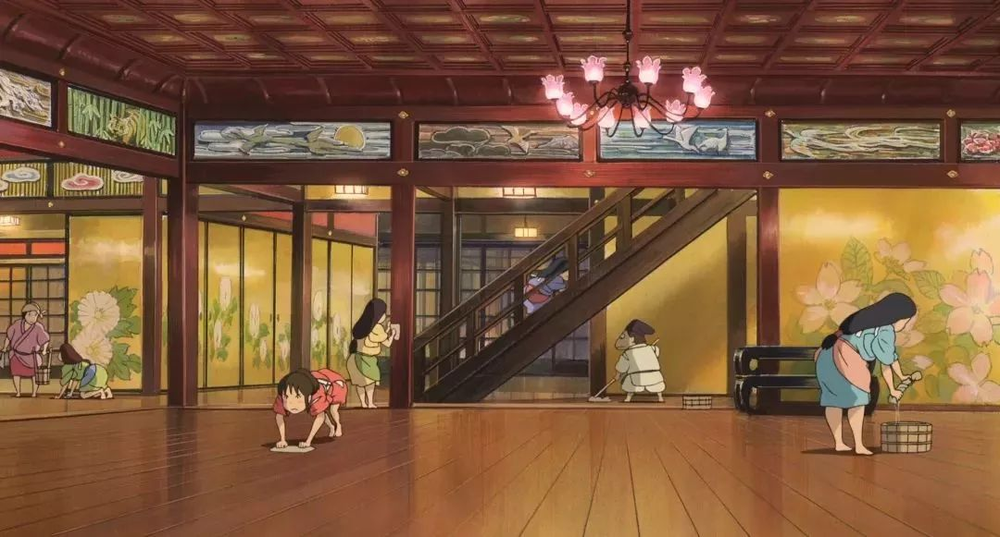

****中日文化****
第32届东京国际电影节开幕的第二天，由北京市电影局、北京国际电影节组委会主办的“中日电影合作交流·北京圆桌会”于东京召开。

日本文化厅、外务省亚洲大洋洲局、中国驻日本大使馆相关负责人，导演代表岩井俊二、陈思诚，及来自北京、东京两地20余家重要电影公司负责人约50余人参会。

此次圆桌会，是国内电影管理部门第一次在东京国际电影节期间举办较大规模的官方交流对话活动, 对推动中日电影实质性合作将产生积极影响。

在“中日电影合作交流·北京圆桌会”上，陈思诚也在现场分享了电影《唐人街探案3》的拍摄经历，“在中日电影人的共同协作下，克服了很多困难。涩谷、新宿、秋叶原这些拍摄地点都会在电影中一一呈现。”

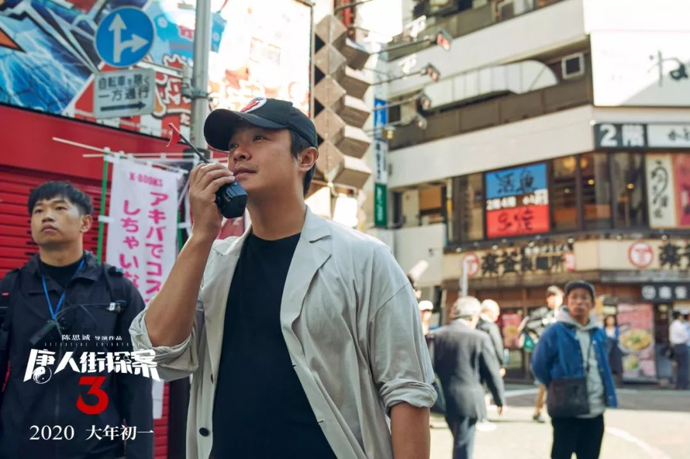

不仅如此，在预告片中，我们还可以看到很多其他日本文化，像是浮世绘、相扑、和服...还有画面中还有许多日本景点，那就等明天，菌菌再来慢慢给大家解密吧！

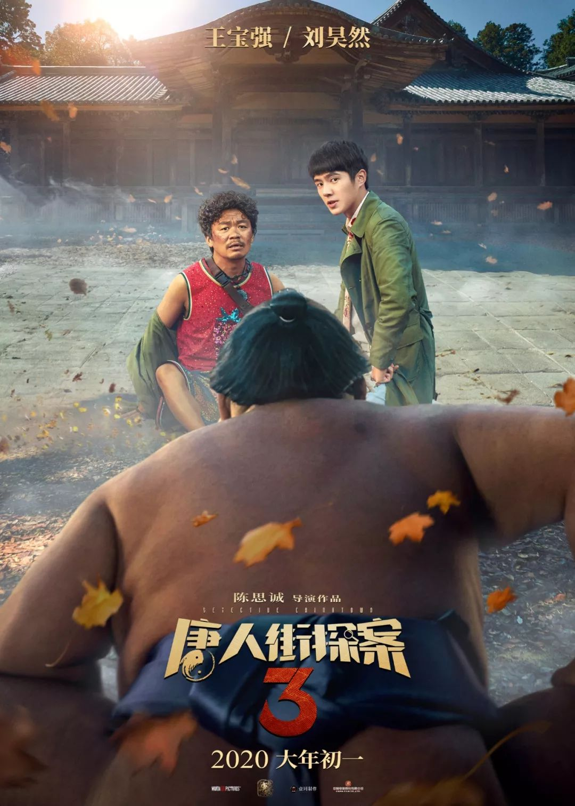

-END-
听说你想去日本自由行？
不会日语怎么行！

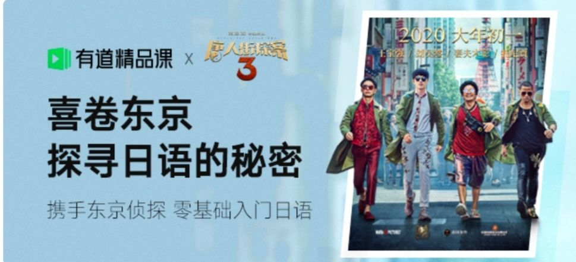

下周一跟随老王一起，
在《唐人街探案3》中探寻日语的秘密吧！

一路稳扎稳打的陈思诚会在第三部中讲述一个怎样的故事，又会用怎样的形式解开之前埋下的伏笔？2020年大年初一，让我们拭目以待。

在此之前，下周一有道精品课联合《唐人街探案3》，在下周的【有道日语公开课】上，王进老师携手KOKI老师，一起带大家了解《唐探3》电影中的日本文化，探寻日语的秘密，并且给学员送出《唐探3》的电影票！

具体玩法，请期待直播课上，老师跟大家说明吧！上图扫码听课，多种抢票方法，等你解锁！提高获奖概率噢！~更多惊喜都在公开课直播间【唐人街探案 探寻日语的秘密】等着大家！

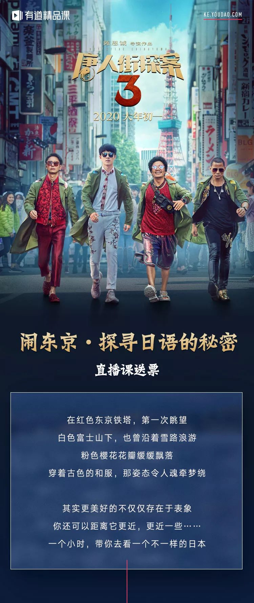

fú

福
lì

利