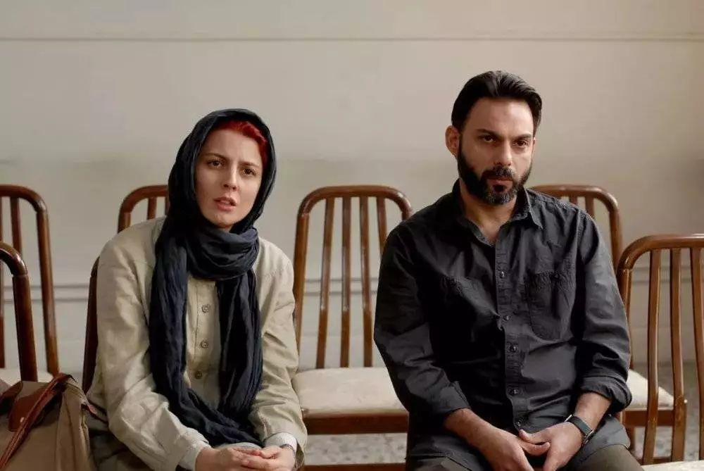

#  《寄生虫》的成功，是现实主义电影的没落（剧透慎入）

[虎嗅APP]()

本文来自微信公众号：看理想（ID：ikanlixiang），作者：李厚辰，编辑：提图，监制：猫爷，封面：电影《寄生虫》

终于看到了今年被寄予厚望的电影《寄生虫》。出自《杀人回忆》导演奉俊昊之手，又是戛纳新科大奖得主，自然很多人对这部电影有不同于寻常电影的期待。

我如此期待还有个人的原因，2011年的伊朗电影《一次别离》后，我认为世上已无好电影。当然还有些不错的作品，不过都短板明显。已经8年了，因此我一直期待着又一部能够真正称得上“好电影”的作品横空出世。

而奉俊昊值得这样的期待，他的影片《杀人回忆》是我心目中完美的电影，韩国影史首屈一指，剧情、人物、节奏，各种技术如入化境，难以想象这部电影仅仅是奉俊昊的第二部长篇作品。上映的2003年，他才年仅三十四岁，前途可谓不可限量。

不过事实还是令人沮丧的，《寄生虫》是一部完成水准很高又工整的悬疑片，但也仅此而已。

再要向这部电影多要一些什么，没有了。

****

**在我看来，饱受好评的《寄生虫》远不如《杀人回忆》，甚至比去年的《燃烧》都不如。**

当然《燃烧》也不能列入“真正的好电影”之列，只是其文学性好于《寄生虫》，后者甚至落入了很多商业电影的俗套，其中电影第一次高潮尤其如此：

当主人公一家人在富人出门露营后全家进入时，任何观影的人就都能猜到，这幕戏肯定会推进到富人突然回家让他们措手不及作为结束。

从这幕一开始，我就期待着奉俊昊是否能有不同的处理方式，不论是他们在富人家享受，或是富人回家后的反应。没想到，从他们一家人在其家里吃吃喝喝，到富人回家后藏藏躲躲，最终安排一个富人小儿子突然惊醒的戏码，一切都稀松平常，一场小鬼当家式的闹剧结束。

当然很多人对之后的一幕尤其津津乐道，也将这一幕作为之前处理方式的解释。从富人家逃出后，一家三口走过漫长而一路下降的道路和阶梯，回到原来的半地下室，已经是水漫金山。

这场戏很多影迷津津乐道，我却有点不以为然。**这就是表现为视觉奇观的“贫穷”，将其与富人家庭形成直观对比。**仿佛导演按着我的脖子，把我按到水淹的地下室，问我惨不惨、穷不穷。

而且，这幕戏采用了灾难片的手法拍摄，回到半地下室所在的那条街，一条街各处已经惨状环生，回到家中，甚至还安排了一个马桶喷污水的戏码。最后还有一家人乘坐门板逃离的镜头，最终所有人到体育馆过夜，拍得好看，刺激，放在一部以洪水为题材的灾难片中甚好。但冲击了这一幕本该因为“贫穷”而生出的触动，更像是一场无人负责的天灾而已。

是的，《寄生虫》充斥着各种视觉奇观，让人恍惚间感觉这是朴赞郁（韩国导演，代表作《老男孩》）的电影。尤其地下室的色调和地下室男人的造型和气质，他可怖地笑着喃喃自语的样子，突然用英文大叫“Respect”的神态，包括那场戏也用了维瓦尔第的《冬》作为配乐，完全是《老男孩》的路数。

可惜《老男孩》是彻头彻尾的荒诞剧，从影片开始到结尾，要的就是闹剧的大开大合。但《寄生虫》以现实主义切入，也想探讨贫富差距问题，却在电影一半时突然切入荒诞剧情，让人无法理解，这部电影表现的重心是什么？穷人被富人和社会逼疯了？疯到住在地下室里半囚禁的状态？这真的是对贫富差距好的表达方式吗？

如此对比，可能李玉的《苹果》里面对贫穷的冲突和描写都要高出几分。

《苹果》剧照

这是韩国电影的优势，也是一种“增上慢”（佛学用语，指对于教理或修行境地尚未有所得，却起高傲自大之心），韩国电影擅长塑造悬疑和犯罪奇观。但与现实主义结合，总是让电影气短——

《燃烧》中，富人和穷人的冲突是富人喜欢变态的杀害年轻女孩，没什么道理，就是因为他们“空虚”。《出租车司机》中，政权和人民的冲突是便衣警察的搜捕和追车？《寄生虫》中，富人和穷人的冲突是对他们气味的延误？这都是韩国电影对悬疑构造和象征主义的执迷，但这些到底象征了哪种冲突？《燃烧》中象征了富人不把穷人当人看，就像是“仓房”吗？

**真正的“非人化”是将穷人看作他们报表上的KPI，看作庄稼一样的作物，富人通过漫长的官僚化企业组织，以经济能力驱策着穷人们的生活。**

《燃烧》没有带来这样的冲突。而《寄生虫》中想体现的那种“人格蔑视”，其实在富人沙发上与妻子的那场激情戏中有所表现，穷人的特征，被当作富人追求性刺激的素材，这是高明的手法，但贯穿全片的对“气味”厌恶，则仅仅是为了推进剧情的一个，被滥用的符号。

****

《一次别离》中，中产和穷人的冲突是中产能言善辩，撒谎都撒得更令人可信，在司法机器前，穷人的言辞和脾气完全落于下风，意味着在现代规则中，中产完全以他们的能力和教育掌控着这些规则，甚至中产更加缺乏宗教的束缚，可以肆无忌惮地玩弄这些规则。

**《一次别离》剧照

这个冲突构造则非常真实，震撼十足，看完让自己惊觉可能自己就是这样的人。但在韩国电影里面，真正有这种冲突张力的恐怕是《辩护人》，可惜其人物太过脸谱化，难以承载这部电影的重量。

当然《寄生虫》还有很多问题，里面剧情无法自圆其说之处比比皆是，假山石等符号突出的方式太过刻意，富人一家“丑化式”的塑造也让人对他们恨不起来，因此最后男主人公一刀捅进富人身体，这个报复的动机完全不令人信服，难道他不该马上开车送自己女儿去医院么？导演在无数地方生硬地强化“味道”的冲突，最后还把这个变成一场凶杀的动机，处处“前后照应”，但却很难令人感同身受。

**这部电影犯了“把话说透”的毛病，把剧情逻辑讲清楚，讲明白，生怕观众没看懂，没理解，一副二流悬疑片的手法，太过工整。**

自然看完之后，这部电影什么都没留下。对贫富差距问题的更多理解？对穷人的同情？对富人阶级的反思？我甚至没有去看第二遍的冲动，无法反复观看的电影，肯定不是好电影。

****

贫富差距是现实主义题材，比朝韩冲突还要现实，是任何资本主义晚期社会的大问题，也是电影塑造基本剧情架构的不竭源泉。

最糟糕的，像是《极乐空间》和《战斗天使阿利塔》，要的还是打怪升级神功附体的一刻；好一些的，是例如《天注定》，有一股生猛气息，但还是犯罪片的框架；到韩国的《燃烧》和《寄生虫》，落入悬疑片的框架。

这让我想起黑泽明的那句感叹，大意是，只要是电影，端起来放入画框，就是“美国味”，不管里面装的是什么故事。

我想其原因就是电影类型，《七武士》是西部片，《乱》是莎士比亚舞台剧，《罗生门》是侦探悬疑。黑泽明是顶级大师，一定更懂类型片对电影表达的深刻限制，也懂类型片在电影工业体系里面，作为一套思维定势有多么的根深蒂固。

因此，**可以突破类型的，唯有“现实主义”——现实生活是各有不同的**。

在黑泽明的时代，日本本土影人则更偏爱小津安二郎、沟口健二这样本土气质与现实气质更强的导演。没有什么是比现实更加感染人的，但这对编剧和导演的功力就有了极高的要求。拍出可以引人入胜的现实生活，尤其是日常生活，其实非常困难。我想落入类型片的俗套，也是因为那是一条easy way吧。拍出有本地风格的现实主义电影，才是那条hard way，也是令真正好电影可以重新回到我们生活中的方法。

《寄生虫》成功了，点燃全球市场，拿下大奖，表面上风风光光，但它也最彻底失败了。

这让我想起另一部现实性很强的好电影《杰出公民》最开始时，主人公在获颁诺贝尔文学奖时候的致辞，他这样说：

“我感到非常遗憾，接受这样的册封。我相信这样一致的认可与赞誉，与一名艺术家的没落，有着直接且确凿无疑的关系。”

**票房、大众口碑、奖项赞誉——这些就是现实主义题材和好电影没落的真正原因吧。**这也没什么深刻的。

