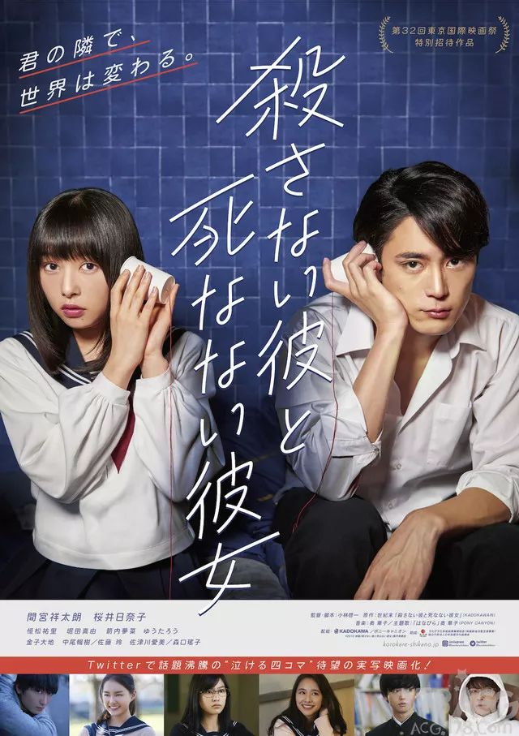

## 【日本24小时】除了生命我们还剩下什么，他们来告诉你。

家欣  有道语言菌

「杀不掉的他和死不了的她」改编自世紀末的漫画，电影版由间宫祥太朗和樱井日柰子主演。该作讲述了患有智能手机依存症的无气力少年·小坂和一心寻死的消极少女·鹿野的爱情故事。

### 《殺さない彼と死なない彼女》

上 映：2019-11-15
地 区：日本
导 演：小林启一
主 演：间宫祥太朗樱井日奈子恒松祐里堀田真由箭内梦菜

原作是在推特上连载的四格漫画，是描写了高中生真实又笨拙的心情的群像剧。

间宫祥太朗饰演傲娇的男主角小坂，樱井日奈子饰演思想负面的温柔女主角鹿野。

SNS漫画家世紀末の代表作を実写化した本作は、退屈な学生生活を送る高校3年生の小坂れい（間宮）と、心優しい一面を持ちながらネガティブな言動で周囲から孤立するリストカット常習者の鹿野なな（桜井）を中心に描く青春群像劇。

本次公布的海报是二人手拿纸杯电话的画面。而特报则展现了小坂阻止鹿野跳楼的场景，当鹿野问：“智能手机和我哪个更重要”的时候，小坂冷淡的说“智能手机”。

　原作漫画《杀不死的他和死不了的她》（日文：「殺さない彼と死なない彼女」）描述了容易生气、喜欢说“去死吧”的傲娇男和自残惯犯、口头禅是”想死”的女高中生之间日常。

又是一部治愈的校园爱情，冬日里觉得冷吗，看一部好的爱情片，可以让你释然、放下伤痛，对爱情重新燃起期盼。

在那些孤独落寞的日子里，你的出现，就是一束光。

有了你的陪伴，我才发现，爱的力量无限大。

**好啦！~今天的推荐就到这里啦！**
**这个冬日，有人给你取暖吗？**
**希望大家，都有人陪。**

以上图片均来自于网络
侵删

在看