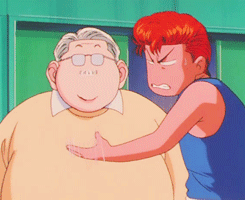
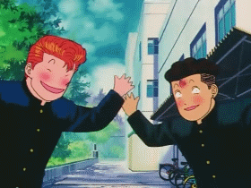
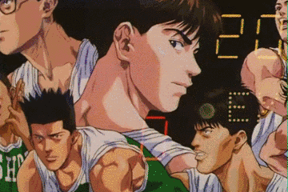

速读摘要

1967年1月12日，《灌篮高手》作者井上雄彦出生。灌篮高手教会我们的人生哲理是"直到最后一刻，都不要放弃希望"。在为他庆生的同时，我们来怀念一下，那个属于我们的篮球梦想和青春!

原文约  525  字  |  图片  21  张  |  建议阅读  1  分钟  |  [评价反馈](https://static.app.yinxiang.com/embedded-web/clipper/#/Evaluating?d=2020-01-13&nu=0b712fbe-b27a-4fcf-b6c4-7b763fc5f773&un=oroOQuApHkpyza24tejIG7htQj5A&sig=5755DAE35716BA3E1057C53E582F44A4)

## 【日本24小时】当年，你和谁一起追的《灌篮高手》？

家欣  有道语言菌
**鼠年大吉**
**HAPPY 2020'S NEW YEAR**

- 今日影视 -

【1月13日 星期一】  东京
14°C/4°C 大部多云

*还记得樱木花道、流川枫、三井寿吗？**还记得胖胖的安西教练吗？**当年，《灌篮高手》曾掀起篮球热潮，与《足球小将》《棒球英豪》并列日本运动漫画的巅峰。**1967年1月12日，《灌篮高手》作者井上雄彦出生。**当年，你和谁一起追《灌篮高手》？**你最爱哪句台词？*

**PART  01**

灌篮高手教会我们的人生哲理是“直到最后一刻，都不要放弃希望”。昨天是*《灌篮高手》作者井上雄彦*的生日，在为他庆生的同时，我们来怀念一下，那个属于我们的篮球梦想和青春！

谛めたらそこで试合终了ですよ。放弃的话比赛也就到此结束了哦。

败因はこの私，陵南の选手たちは最高のプレイをした!
失败的原因是我，陵南的所有选手都是最佳球员!

「あいつも3年间がんばってきた男なんだ。侮ってはいけなかった」
“他也是努力过3年的男人，不能小看他。”

**PART  02**

最后まて、希望を舍てちゃいかん、あきらめたら、そこて试合终了だ。
直到最后一刻也不能放弃希望，一但死心的话，比赛就结束了。( 安西老师 )

《灌篮高手》可以说是一部影响了一代人的漫画作品，里面的每一个人物都有血有肉有性格。他们的这些台词，你还记得吗？这些台词背后的故事还能让你热泪盈眶吗？

以上图片来源网络
侵删

**PART  03**

-END-