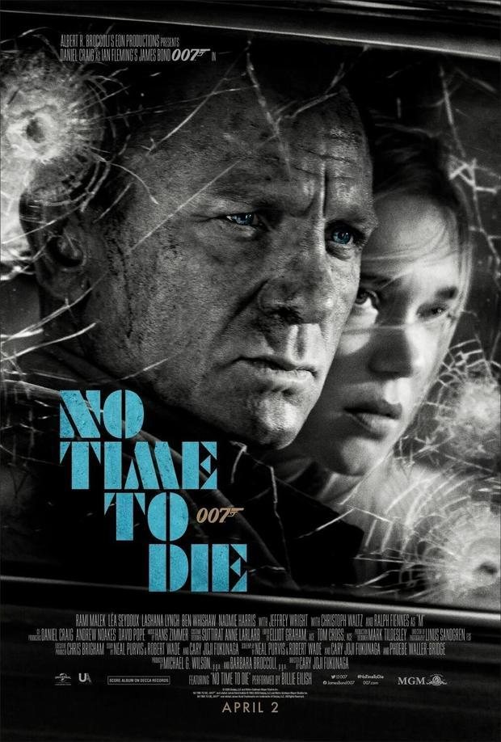
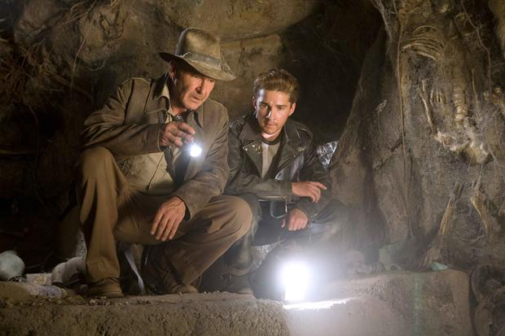

# 时光早报："花木兰"成本高达2亿美元

### "无暇赴死"创007片长纪录 "夺宝奇兵5"或换导演

2020-02-27 07:11:59 [来源：Mtime时光网](http://www.mtime.com/)

早上好~在你睡觉的时候，全球电影圈发生了哪些大事？
过去12小时内，全球影视新闻哪些值得关注？时光网为你专业甄选。

**01.真人版[《花木兰》](http://movie.mtime.com/223155/)成本高达2亿美元**

**  
  
**

[刘亦菲](http://people.mtime.com/1176638/)和[《花木兰》](http://movie.mtime.com/223155/)导演[妮基·卡罗](http://people.mtime.com/904583/)登上最新一期《好莱坞报道者》杂志封面，并接受采访。文章揭示，影片的成本高达2亿美元，是迪士尼真人翻拍电影中最贵之一，迪士尼为此承受相当高的风险。目前爆发的新型冠状病毒疫情，不仅使得中国是否能够在3月27日同步上映成谜，很多世界其他地方状况也不明朗。

  

  
  

由于本片成本高达2亿美元，迪士尼寄希望于中国，也对本土的北美市场非常重视。去年刘亦菲在社交平台针对香港的政治性言论，在海外社交媒体中引起争议，迪士尼对此一直非常小心翼翼。对此，刘亦菲首次公开做出回应，她说：“我认为这是一个非常复杂的情况，而且我也不是专家。我只是希望这个问题能够尽快解决。我认为这是一个非常敏 感的情况。”

  

本片首支预告片出现了福建土楼，史学界一般认为福建土楼始建于明朝嘉靖年间，与花木兰所处年代相距甚远。对此，知名制作人江志强表示“没必要太在意历史的准确性，花木兰虽然出名，但毕竟是虚构的，并非历史人物。”

  

  

  

另外，迪士尼还曾为中国观众改动[《花木兰》](http://movie.mtime.com/223155/)剧情。本片曾在中国进行内部试映，在早期版本里，木兰和陈洪辉有一场桥上的吻别戏，妮基·卡罗表示尽管这场戏非常美，但中国这边给出的意见是“不能这么拍，对于中国观众来说不合适。”所以就删掉了。

  

**02.《花木兰》首曝动作戏幕后特辑**

  

  
  

《花木兰》动作戏幕后特辑

迪士尼真人版《花木兰》曝动作戏幕后特辑，超多新的动作场面首度曝光！导演妮基·卡罗形容效果“非常炸裂”；刘亦菲表示开拍前训练3个月，每天六七个小时，“非常有挑战”。

  

此前摄影师曾透露影片非常“真实”，影片的几个大战斗场面都是实景拍摄，而非如今好莱坞流行的靠CG后期；刘亦菲自己演了90%的特技戏份。

**03.[《007：无暇赴死》](http://movie.mtime.com/194878/)片长曝光：史上最长007电影**

  

  
  

多家预售票网确认，[《007：无暇赴死》](http://movie.mtime.com/194878/)最终片长为163分钟（2小时43分钟），超过[《007：幽灵党》](http://movie.mtime.com/194879/)的148分钟，创下007系列最长片长纪录。

  

据此前报道，[《007：无暇赴死》](http://movie.mtime.com/194878/)是“改变游戏规则”的一部邦德电影，尤其在对于邦女郎的塑造上。另外导演凯瑞·福永表示，本片是“这是集所有精华于一身的邦德电影” 。本片将于4月2日英国、4月10日北美公映。

  

**04.[《美国恐怖故事》](http://movie.mtime.com/147648/)第十季曝卡司预告**

  

  
  

《美恐》第十季卡司预告

[《美国恐怖故事》](http://movie.mtime.com/147648/)第十季曝卡司预告，“快银”伊万·彼得斯、香蕉姐莎拉·保罗森、凯茜·贝茨等众多熟面孔回归，而《小鬼当家》主演[麦考利·卡尔金](http://people.mtime.com/925596/)新加盟。

  

麦考利·卡尔金童星出身，后来经历父母离婚争产、未成年婚姻、吸毒等种种争议事件后，逐渐消失在大众的视野。[《美国恐怖故事》](http://movie.mtime.com/147648/)将是他首次作为电视剧固定班底亮相。

  

**05.詹姆斯·曼高德或代替斯皮尔伯格执导[《夺宝奇兵5》](http://movie.mtime.com/114507/)**

  

  
  

[詹姆斯·曼高德](http://people.mtime.com/898922/)（[《致命ID》](http://movie.mtime.com/11688/)[《金刚狼3》](http://movie.mtime.com/209688/)）商谈执导[《夺宝奇兵5》](http://movie.mtime.com/114507/)，代替斯皮尔伯格。

  

首部《夺宝奇兵》诞生于1981年，史蒂文·斯皮尔伯格执导，哈里森·福特主演。在该系列中，福特饰演的考古学教授印第安纳·琼斯，经历了各种神秘的冒险，每次都会化险为夷。

  

哈里森·福特已确认回归，原预计今年夏天开拍。

  

  

**01.看电影实名登记！北京电影行业复工指引**

  
  

2月26日，北京市电影局联合北京疾病预防控制中心发布《新冠肺炎流行期间北京市电影行业复工防疫指引（1.0版）》。文中写道：电影院复工初期，售票处实行观众信息登记制，需登记姓名、性别、住址、身份证号、联系电话、观影影片及放映时间、影厅号和座位号等信息。

  

影院复映后，洗手间等场所应配备洗手液或消毒用品，公共区域每天消毒不少于8次，每个影厅每部影片放映结束后须彻底消毒一次，并进行通风。

  

对于电影制片单位复工，《指引（1.0版）》也给予明确要求，“固定办公地点按照属地规定和要求具备条件可复工”，“剧组室外或室内拍摄人员50人以下（包括演员、工作人员），可在本市复工拍摄。

  

剧组人员体温不能高于37.3度，除演员表演时可不戴口罩外，剧组其它人员和演员表演以外时间须佩戴口罩。”剧组聚集人数超过50人以上的，在疫情结束前原则上不得在本市开工开拍。该指引还规定，在疫情结束前，来自（或途经）疫区的演职人员暂时不得参加剧组工作。

   编辑：SaSa
