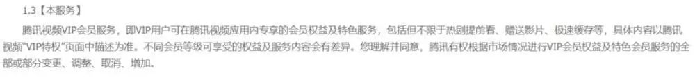

# 《陈情令》花式卖钱，腾讯视频有谱不？

虎嗅APP
文/金错刀频道  祥燎

**“腾讯可能是想钱想疯了。”**

这是一位用户对腾讯视频最近的一次举动做出的评价。

8月7日晚，腾讯视频正式推出了业内闻所未闻的神操作——超前点播。

“超前点播”让电视剧《陈情令》提前迎来了结局，单集付费每集6元，六集“打包”购买30元。而且，只有腾讯会员用户才有资格购买。

有不少人认为，腾讯视频意在让会员多掏一份钱，趁着最后的热度在赤裸裸地“割韭菜”。

腾讯视频新浪微博的评论区，不出意外地充斥了各种不友好的声音。

然而，嘴上说不要身体却很诚实。

不到24小时，就有超过250万人解锁了提前结局，直接为腾讯视频带来了超过7500万元的利润！

如此说来，让用户提前看明明是“顺应民意”。被痛骂的腾讯视频，是不是太冤了？

在刀哥看来，腾讯视频被骂得一点不冤。

用户忍不住痛骂，原因在于用户体验大打折扣，而体验受损则是因为在用户眼中，腾讯视频的言行前后不一，存在欺骗性。

如何前后不一？这得从《陈情令》说起。

在开播之初，《陈情令》并不怎么被看好，豆瓣评分低至4.8分，仿佛预定了烂剧的位置。

但很快，观众就迎来了“真香定律”。

《陈情令》的豆瓣评分一路攀升至7.7，打分人数超过30万。

与口碑一同发酵的，还有播放量，自播放至今已超过41亿！这一成绩，也让同期的《长安十二时辰》《九州缥缈录》逊色许多。

就连每张20元的电视剧音乐专辑，在QQ音乐上的销量也超过了64万张！

或许正是因为太过火热，腾讯视频改变了播放策略。

原本，《陈情令》每周一、二、三晚8点更新2集。如果是腾讯视频的VIP会员，就能多看4集。

按照这个节奏，该剧应当在8月14日正式收官。

然而，7月29日，腾讯视频官方表示，8月7日将“超前点播”直通结局。因为“超前点播”只有会员能买，腾讯视频还称之为“会员福利升级”....

毫无疑问，这个“会员福利升级”彻底激怒了腾讯视频会员。

在以前，腾讯会员享受到的权益，是“会员始终多看四集”。因此，大部分会员认为，腾讯视频的“超前点播”让“会员多看四集”的承诺成了空头支票。

此外，《陈情令》盗版泛滥，也极大侵犯了会员权益。

要知道，当初腾讯视频可是信心十足地向用户保证，“我们有强大的正版保护技术”.....

甚至有的用户认为，《陈情令》从不被看好到爆火，观众、粉丝起到了至关重要的作用，腾讯视频过河拆桥。“腾讯视频你怎么敢割我们韭菜？！”

这就是为什么在用户眼中，腾讯视频的言行前后不一。

被腾讯视频激怒的用户，随后在腾讯视频宣布“超前点播”的微博下，痛骂了120多万次！

后来，用以补充解释的官方说明，也收获了超过10万条评论，点赞最多的是“滚”。

相应的抵制活动，也看似如火如荼地展开。

但怎奈腾讯视频精准洞察了粉丝心理。

只要有一人忍不住提前看，就会有第二人第三人，最终人数会如滚雪球般壮大，毕竟谁都不想被剧透啊！

果不其然，不到24小时就有250万人乖乖掏钱！这些二次付费的观众，还被腾讯视频亲切地称为“小伙伴”。

不过由于骂声不止，很快《陈情令》的超前点播页面上就不再显示具体的解锁人数了。

由于“超前点播”是会员专享，腾讯视频一来能让现有的会员多掏份钱，二来能让普通用户买会员，一箭双雕。

挖掘用户剩余价值，还是腾讯系有一手啊。

认为自己被当成“韭菜”的人义愤填膺，甚至扬言要告腾讯视频。但在腾讯视频面前，仍是too young too simple。

腾讯视频VIP会员的服务协议属于格式合同，腾讯视频具有单方解释权。

也就是说，除非该合同被相关部门裁定为霸王条款，否则别说将“超前点播”定价30元，哪怕定价300，腾讯视频也没有违背契约精神。

但是，不违法就够了吗？

在互联网时代，所有企业都在谈用户思维、用户体验，但只会动嘴皮子，嘴上一套背后一套，就别抱怨被人痛骂了。

或许，腾讯视频以为自己白纸黑字地写清楚了条款，用户就该对用户体验有相应的期待。期待过高，是用户的错。

但现实不是这么简单的。

一个视频网站会员用户，在充值成为会员时，恐怕有大概率是不会认真读那些冗长的条款的。

虽然不认真看条款，但所有用户的心里都有种朴素的想法，那就是成为会员后，可以免广告、提前看、免费看海量资源等等——事实上，这也是大部分视频网站吸引用户买会员的宣传点。

然而现在呢？视频网站的小心思，把用户的朴素想法打出千疮百孔。

例如，成为爱奇艺会员后，有时还得观看所谓的“会员推荐”视频，尽管这种广告能手动关闭。身为会员还有用户体验可言吗？

至于“提前看”的会员福利，我们已经见识了腾讯视频的“超前点播”，但类似模式并不新鲜。

在爱奇艺播出《独家记忆》时，会员一次性看全集，但是在后半程推出了“会员解锁”模式，即：就算已经是会员，也需分享链接给三名好友，被助力后才能继续看接下来的剧集。

并且这样的模式在网页版上并不提示，仅仅在手机端才能看到，让相当一部分观众以为剧集没有按时更新。

比起腾讯视频简单粗暴地收费，爱奇艺的谜之操作令观众深感莫名其妙，剧集热度也因此折损。

再说“免费看海量资源”这项会员权益，更是众矢之的。

一，资源太少。尤其是国外资源，以及热门电视剧、综艺、动漫，三大视频网站都在追求独播，兴趣稍微广泛些或喜欢热门节目的朋友，如果只有一家会员，绝对无法满足需求。

二，删减太多。观看欧美电影电视剧，你永远不知道被删了多少。虽然这点不能让视频网站背锅，但跳跃的剧情无疑令视频网站的体验大打折扣。

二，会员还需付费。以为会员就能免费看视频网站的资源？太天真了。

例如，点开爱奇艺的“付费”电影就能发现，有些电影连会员都需要额外付费，而且还有时间限制。唯一的好消息是，会员有优惠...

相比之下，优酷的收费好似做贼心虚。在选片的页面，它并不提示哪些影片需要付费，仿佛会员能免费看所有电影，但当你点开某些电影后，它便会提醒你需要“观影券”...

猜猜哪部电影需要用“观影券”？

防不胜防啊。

至于把预告片、花絮，放在影片库里“伪装”正片滥竽充数，令人白高兴一场的做法，也已屡见不鲜。

除了令观看体验受损，视频网站的其他策略，比如“不断细分会员种类”，打造“会员中的会员”，同样不断在挑战用户的认知底线。

真要细数这些小心思的话，视频网站可谓罄竹难书了。

虽然视频网站的所作所为并不违法，绝大多数用户与之对簿公堂只能败诉，但法律是生活和商业的底线，以底线标准对待用户，显然不妥。

诚然，视频网站几乎都在亏损，过得很艰难，因此需要想方设法地增收。

但罔顾用户体验的发展之道，无疑是饮鸩止渴，也是在损害整个行业。正规渠道越是陷阱重重，盗版市场越是生机勃勃。

更令人担心的是，只怕是口口声声为了正版，却只是借这张大旗，蝇营狗苟。

这样的视频网站被用户骂得再惨，也一点不冤。
