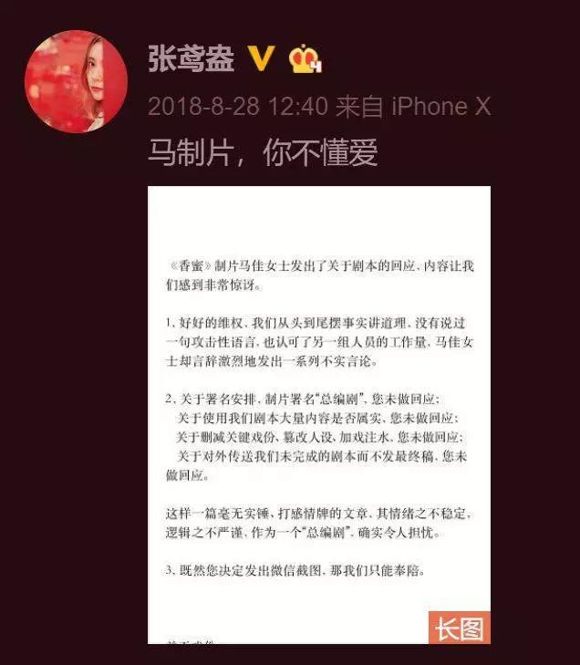
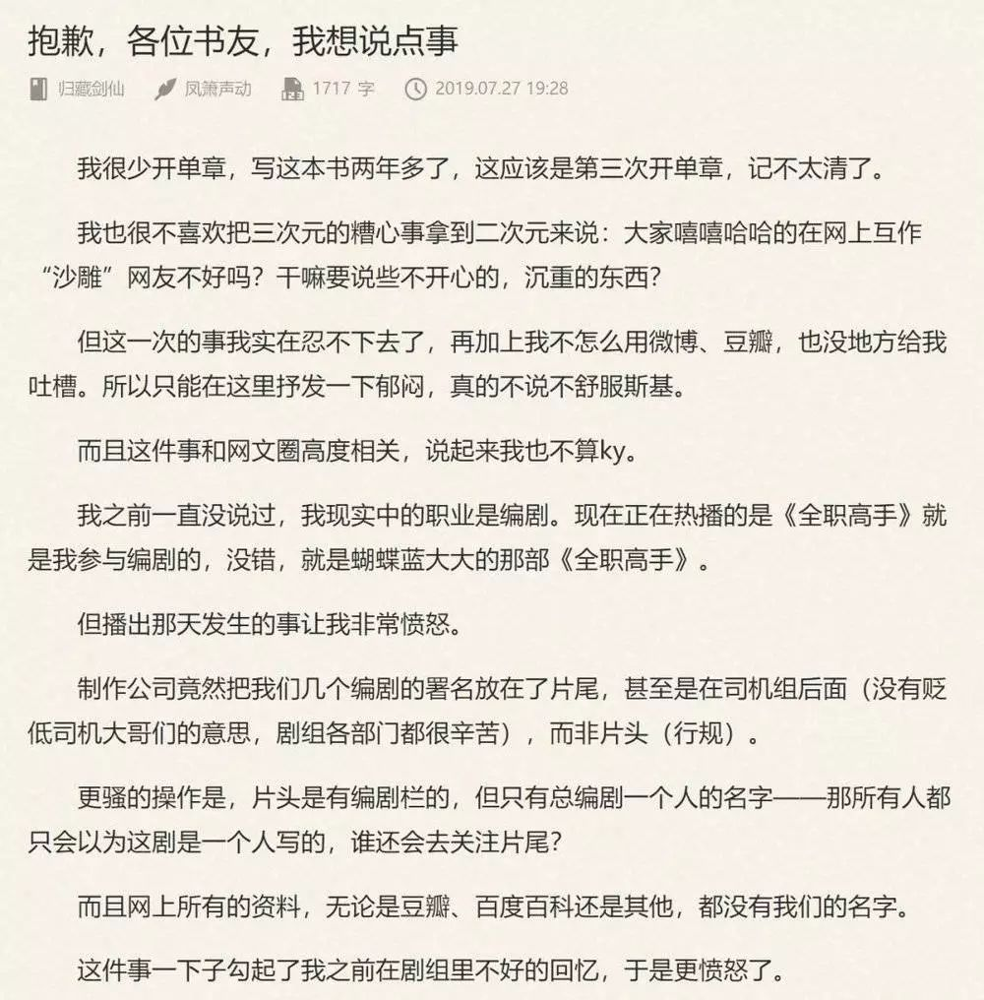

# 国产烂剧多，都是编剧的锅？

虎嗅APP

本文来自微信公众号：刺猬公社（ID：ciweigongshe），作者：许嘉婧，标题图来自视觉中国

2019年上半年，继《好先生》之后，孙红雷时隔三年再次参演电视连续剧，饰演男主黄成栋。观众们期待演技派“颜王”能给他们带来新意，但《带着爸爸去留学》却不如想象中耐看。

黄成栋穿着一身嘻哈风格的套装出现在机场，带着自己的儿子去美国。他们被海关拦下，爸爸对英语一窍不通，给边检人员唱了一首民歌，比着手语，竟然就逗笑了边检人员，被成功放行。

在美国，闹别扭的儿子在公路上乱走，寻找儿子的爸爸误闯民宅。先不说非法入侵，被美国居民发现的爸爸，神奇地操作着全英文的系统，帮外国人修好了汽车，和人家称兄道弟。

## 《带着爸爸去留学》
遭到海外留学生们的强烈批判。“剧情毫无逻辑，编剧明显没出过国，几个人在屋里全凭臆想。我们留学生过得很辛苦，才不是天天逃课谈恋爱。”

**现在很多国产剧集，时常被观众吐槽“降智”。各种没有常识，不符合逻辑，人物分裂的桥段频出。不管什么题材的剧，最后都会变成无脑爱情剧。**

## 《甜蜜暴击》
中，鹿晗饰演的明天是一个大学生。上课时，老师在黑板上写下追击问题，全班只有明天同学答出了小学数学题，并收获了全班同学赞美的掌声。

图源：爱奇艺截图，《甜蜜暴击》第2集课堂答题

然而，很多逻辑古怪、情节令人迷惑的电视剧，大家想骂，都找不到人骂。剧集上大都没有具体的编剧署名，只有一个冠名的大编剧，大家也不知道是谁写出了此等脑残情节。

智商税，真的该给编剧上吗？国产剧存在的问题，只有编剧需要背锅吗？其实，编剧只是整个国产电视剧生产线上的前端，要找个背锅侠，还要从流水线一一说起。

通常来讲，一部电视剧的生产，在经历前期投资立项、中期拍摄、后期剪辑处理后才与大家见面。编剧处于食物链底端，他们完成的是最前期的工作。

业内制作方的责编李芳告诉刺猬公社，**责编与编剧协调剧本，在反复修改后将剧本定稿交给制片方，前期工作就算完成了。一般而言，前期创作剧本的编剧不会过多地参与到中期和后期制作。**

拍摄过程中，制片方、投资方、平台方都会提出不同的要求修改剧本，有时会返回给原编剧修改，有时则直接由导演或跟组编剧修改，不会经过原编剧的同意。

在生产流水线上，编剧看不到片场，即使剧本被改得面目全非，也要被扣上一顶帽子，成为观众们口诛笔伐的“背锅侠”。

## 《香蜜沉沉烬如霜》
2018年热播的电视剧《香蜜沉沉烬如霜》，开播即大热。而剧集播放到中后期，配角戏份骤增，男女主角戏份越来越少，剧情走向也很奇怪。

观众们攻击编剧后期注水，香蜜编剧张鸢盎发文称：原定剧本为36集，而委托方要求剧集为50集，最后《香蜜》实际硬被拉长到63集。最终拍摄的剧本与她们先前提交的43集剧本并不相同。

张鸢盎还指出，**编剧署名也发生了变化。之前与她们对接的甲方三位责编和策划成了编剧，并且在改编过程中，甲方始终不允许编剧团队与原著作者进行接触。**对此，制片方马佳则回应，延长剧集是发行方的要求，制片方作为甲方，编剧和导演理应满足自己的需求。

图源：编剧张鸢盎微博截图

**知乎上一位编剧网友做了这样的比喻：“剧本就像编剧的亲孩子，我们把孩子辛辛苦苦养大，结果被别人领走，断手断脚，在街上乞讨卖艺，路人看见这孩子还要骂你怎么把亲生孩子养成这样。”**

这个“别人”，就是各位投资的爸爸。编剧作为乙方，只能满足甲方的要求提交剧本，而制片方作为中间人，又要满足平台方的发行要求。此外，还要满足导演和演员的拍摄要求。

据李芳说，平台方可能觉得剧本不适合市场，投资方觉得花费太高，大牌明星演员又觉得剧本不符合他们的形象，都会要求二次修改剧本。曾经就出现过这种情况，演员的经纪人认为角色形象不够吸粉，要求添加剧情。

“有些编剧会选择跟组，有些就不会。跟组编剧和前期编剧团队不一定是同一批人，为了满足导演和明星的各种要求，跟组编剧们还会修改剧本。有的导演会卡剧情，少掉的、新增的剧情可能会显得人物前后矛盾，最后的剧本已经不知道经过几批人修改了。”李芳说。

**很多国产剧集都存在大大小小的问题。比如高开低走、后期烂尾、人物角色的行为逻辑前后不一致等问题。一位业内编剧刘蓉总结到，出现各类问题，无外乎是资金投入不足、剧本经过多次修改、制作周期短和编剧水平不足等原因。**

例如在《斗破苍穹》电视剧中，被原著粉们广泛吐槽的“斗气化马”。在原著中，斗宗强者们越过大雪山使用的是“斗气化翼”。本应该华丽飞过去的大场面，在电视剧中变成了一群人浩浩荡荡骑马而去。原著粉们戏称为，“斗气化马，恐怖如斯”。

战力值成谜、武打戏草率、特效五毛，原因汇聚成两个字：省钱。

*** 

## 《斗破苍穹》

网友截图吐槽：斗气化翼仿佛鸡翅膀

而另一些“人格分裂”型国产剧，常出现在各类都市爱情、武侠仙侠题材中。塑造失败的角色，总给人一种当面一套、背后一套的感觉。

对于这个问题，刘蓉给刺猬公社讲述了自己的经历：曾经写过一个短剧的本子，制片方请来两位导演，一位是做后期的，一位是抖音短视频的运营者。本质上，他们都不理解戏剧创作，算是外行。提交了剧本后，两位导演随意修改，没有过问编剧的意见，改出来的剧本惨不忍睹，最后项目拍了两三集就搁浅了。

“我作为编剧进行创作，起码要保证自己笔下的人物设定和背景要符合逻辑。但这个行业就是有很多外行觉得编剧很好干、门槛低，他自己也可以改本子，没必要问你。”她说。

还有最后一种情况，由于资方的要求，项目制作周期可能很短，导致了“神剧”出现。

编剧赵婷告诉刺猬公社，一个电视剧项目成型，一般是先交剧本大纲，再提交分集梗概，最后才是分集剧情。为了让项目尽快成型，制片方一般会跳过分集环节，先交三到五集剧情给平台方审核。而一旦平台方认可，制片方就会尽快把项目提上日程，让编剧尽早完成剧本创作。

刘蓉提到，自己曾经参加过某编剧工作室的执行制片人助理岗位。由于项目周期短，一些编剧拖延交稿，导演又催得紧，自己作为助理也要临时顶上，帮着代写一两集剧本，酬劳另算。

**电视剧生产行业工序复杂，编剧恰恰是其中最没有话语权的一环。**

## 《长安十二时辰》
近期热播的《长安十二时辰》，故事紧凑、制作用心、口碑极佳，而大家想夸夸编剧时，在百度上搜索却只能查到曹盾和马伯庸。

曹盾是该剧的导演兼编剧，马伯庸则是原书作者。

受访时，导演曹盾曾提到，《长安十二时辰》第一集剧本44分钟的剧情，编剧们苦熬了23个版本，写了四个月。而实际上，这些编剧们只有“爪子工作室”的署名，大家想夸都找不到人。

赵婷提到，国产编剧大多以工作室为单位活动，一个人是很难创作全集剧本的。一般都是一位大编剧带着小编剧们活动，剧集只署大编剧或工作室的名字。有名的大编剧身价高，一般都是进行方向性的指导，再由小编剧们创作分集剧情，每个人写7~8集。

7月底上映的《全职高手》电视剧版也闹出过署名纠纷。起点网文作家凤箫声动称，自己是《全职》的编剧团队人员之一，也是《全职》原著的粉丝。做《全职》编剧7个月，每天都在酒店里足不出户，为了赶周期，熬夜是常态。

播出剧集后，制作公司把几位编剧的署名放在片尾，而非片头。片头的编剧栏只有总编剧一个人的名字。豆瓣、百度百科上也都搜不到其他编剧的名字。

凤箫声动在起点发表的小说《归藏剑仙》中的章节

这份声明发表在凤箫声动在起点连载的作品《归藏剑仙》的“本章说”中，没有激起很大水花。

编剧行业内，署名权问题十分严重，甚至已经成为编剧界的共识。刘蓉说，网上在招的很多坐班编剧并不是真正的编剧，有些是枪手，意思是没有署名、帮忙代写、拿钱走人的编剧们，还有些工作是脚本编写、短视频运营。

真正的编剧，很少在网上找工作，大多经人介绍。

李芳告诉刺猬公社，有时，制片方找一个大编剧写剧本，而实际创作者可能并不是这个大编剧。有的大编剧会把项目“外包”给小编剧，小编剧也有可能再“外包”给更小的编剧。几轮转手后，制片方可能花了大价钱，却收到一个烂剧本。

**夸编剧不知道夸谁，同样，骂编剧也不知道骂谁。甚至有的编剧，连被骂的权利都没有。每年虽然有很多电视剧立项，但大多都半途夭折，能拍出来的少之又少。**

刘蓉称，自己写过三四个电影大纲、一个舞台剧、两部电视剧、几个“IP 开发”的原创小说，但一个都没有拍出来。

“做编剧心态一定要好。本子写出来，资方不一定投，投了也不一定拍，拍了也不一定能播，播了也不一定能火，火的时候不一定署你的名。”她说。

李芳也提到，自己认识一位编剧，写了很多年，才有一部能署名的剧集播出。很多参与的项目在剧本大纲状态就因为资金或其他问题搁浅了。

有的编剧运气好，入行就跟了大导演，有了名气、身价涨了，也好接活儿了。而更多水平不差的编剧，项目黄掉了、资金短缺了、拖欠工资的，什么都有。

谈到编剧的收入，编剧一般是按项目阶段拿钱的。签完合同后，制片方会支付十分之一的总稿酬，然后根据大纲、分集剧情提交，分阶段给钱，一集在3~10万不等，钱交给工作室，再分给小编剧们。另外，也会出现拖欠尾款的情况。

在一次次挫败中，很多编剧已经心态放宽，能拿到一个阶段的薪酬，已经算成功了一步。

“电视剧制作中，编剧的能动性很低，周期短、公司逼得紧，编剧连自己的生活都没有，根本写不出有思考性的内容，实在交不上稿就只能去参考、去抄别人。”刘蓉说。

**比起创作，编剧这个职位，更像个打工仔。**

其实，要给国产剧上智商税，整个生产流水线都该交税。目前来看，国产剧生产环境还有很大限制。

## 《七月与安生》

首先，国产剧经常被诟病内容注水，一部剧拿出来就是平均50集的长度。近期，爱奇艺上线的《七月与安生》剧版，一共53集。

而它的原作小说仅仅是安妮宝贝的短篇作品，长度一万七千字。原著党们不知道一部不到半个小时就能读完的小说，是怎样改编成50多集连续剧的。

《七月与安生》电影版与剧版宣传图

赵婷告诉刺猬公社，国内电视剧制作采取制播分离模式，由制片方进行开发制作，再将成片卖给电视台或视频网站，集数越多，制片方的盈利会越多，平台方也能获得更好的收益。剧集注水在所难免。

另外，目前国内电视剧产业越来越强调“IP”。原创剧本创作周期长，加上国内编剧数量少，投资原创剧本风险大。而对编剧自身而言，花几年时间打磨原创剧本，也不一定能获得投资、成功开拍。

在没有名气之前，小编剧们只能做流水线上的生产工，贴补家用。

国内影视编剧还没有成熟的产业体系。李芳提到，制片方大多靠人脉关系找剧本团队，影视圈是一个庞杂的人脉圈。

**比起名气大、要价高的编剧，没名气的枪手显然更加合适。电视剧宣传都会以明星演员、IP开发作为噱头，很少有用编剧带动流量的。**

在国产剧环境中，可选题材也很少。7月31日，广电总局电视剧司下发通知，八月起不得播出娱乐性较强的古装剧、偶像剧。国产剧集不像国外市场，竞争驱动剧本，一些博人眼球的刺激性题材是没办法出现在荧幕上的。

这也引出另一个问题，国产剧集竞争稀缺。国产剧的生产不同于美剧、英剧、日剧等，一个国产剧项目能不能启动，主要看内容大纲和分集梗概的质量。编剧们会在大纲中投入很多精力，而一旦确认投资，项目就可能出现分集剧情越来越水的情况。

而竞争激烈的美剧，在项目开拍前就要看到完整的剧本。杀出重围的剧本是从海量竞争对手中脱颖而出的、最精华的剧本。美剧采取边拍边播模式，可以根据观众的反响和剧本的质量调整剧集，剧本质量下降就面临着被腰斩的危险。

美国的编剧拥有很大的权力，甚至可以指定自己心仪的演员。

**国产剧集在制作过程中没有市场作为参考，还被资本和其他多方干预，编剧很难决定剧集的走向。名气大的编剧有话语权，青年编剧则依靠机遇，单靠作品和能力，想闯出自己一片天地，不容易。**

“青年编剧还是要熬，熬久了总会有代表作的。”刘蓉说，这一行看起来光鲜亮丽，其实不然，单靠理想是不够发电的。

“很多编剧就是为了挣钱，署名什么的已经不在乎了，能写就写了。写完了交稿，钱到手就走人，后边怎么拍、甚至能不能拍出来，也都不是我能左右的。”她说。

（注：应受访者要求，李芳、赵婷、刘蓉均为化名）

