#  新世纪以来最伟大的100部电影，第一你绝对想不到

原创： 日灼 [Mtime时光网]()**

每年都有许多媒体乐此不疲的以不同维度、不同视角为我们总结各类电影榜单，显然，同一份榜单不可能让所有人满意，每每都伴随着争议甚至争吵。

但至少，在那些优秀的榜单中，我们可以看到媒体人、影评人对电影理解的独到视角。

近日，英国《卫报》就选出了一份新世纪以来，**最伟大的100部电影榜单**。自然的，英国影评人所选的榜单免不了有很多英国元素，但这也为我们了解更多文化背景的电影，提供了一个不同的角度。

今天，时光君就将这个榜单完整奉上，有槽点，但也有可取之处，归根结底，希望大家能够通过它了解到更多的好电影，这才是我们喜爱电影的初衷。

**100.《好莱坞往事》昆汀·塔伦蒂诺**

**时光评价：**榜单上最年轻的影片之一，今年五月刚刚在戛纳电影节上完成首映。《好莱坞往事》片如其名，借波兰斯基之妻莎朗·塔特遇害一事为背景，将60年代的疯狂，好莱坞的浮华，虚虚实实的故事以昆汀·塔伦蒂诺的方式重新演绎。

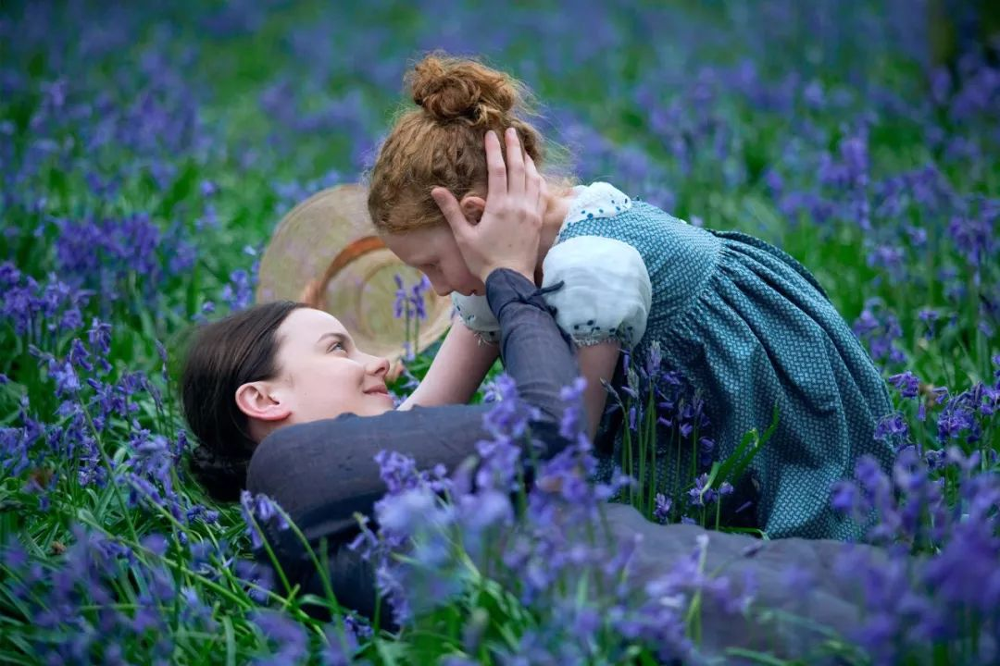
**99.《明亮的星》简·坎皮恩**
**时光评价：**澳洲女性导演简·坎皮恩，以她特有的诗意、温柔又深沉的笔触，再次探索女性精神世界的细腻情感，与她早年间的金棕榈影片《钢琴师》互为呼应。

**98.《蝙蝠侠：黑暗骑士》克里斯托弗·诺兰**

**时光评价：**在《小丑》之前普遍被认为代表了超级英雄电影的上限，诺兰用通俗却不失深度的态度，挖掘“小丑”悲剧性的一面，塑造了影史上最经典的反派形象之一，影响力延续至今。或许在这个榜单上它可以排的更前一些。

**97.《华氏911》迈克尔·摩尔**

**时光评价：**昆汀2004年成为戛纳评委会主席时，将金棕榈大奖授予了这部饱受争议的纪录片。迈克尔·摩尔的政治立场显然是预设的，而非客观的，以近乎戏谑的态度对布什政府的所作所为进行控诉。

**96.《私人生活》塔玛拉·詹金斯**
**时光评价：**同样是榜单上一部年轻的电影，口味纯正的纽约客独立喜剧，轻松幽默中不乏睿智。

**95.《请以你的名字呼唤我》卢卡·瓜达尼诺**
**时光评价：**从相遇到相知，从相爱再到分手，《CMBYN》刻画了爱情中几乎所有的时刻，也道出爱情的反面即是痛苦。

**94.《角斗士》雷德利·斯科特**
**时光评价：**现如今已经不多见的古罗马史诗电影，雷德利·斯科特将其一贯的政治意味、普世观念融入其中。影片荣获第73届奥斯卡金像奖最佳影片。

**93.《你还活着》罗伊·安德森**
**时光评价：**瑞典电影大师罗伊·安德森唯一一部上榜的影片，以北欧电影特有的疏离气质，缓缓道出人生的荒诞与虚无。

**92.《拆弹部队》凯瑟琳·毕格罗**
**时光评价：**凯瑟琳·毕格罗处理战争场面的气魄不输任何男导演，同时展现出人文视野与反思态度，恰到好处的手持摄影为影片的增色不少。

**91.《山村犹有读书声》尼古拉·菲利伯特**
**时光评价：**纪录片独有的优势，在远离城市喧嚣的法国乡村，真实捕捉到了一位普通教师如何教学，如何启蒙孩子们的心智的故事，真挚而感人。

**90.《伊甸园》米娅·汉森-洛夫**

**时光评价：**对于米娅·汉森-洛夫来说入围的影片不是更负盛名的《将来的事》，而是这部电影多少有些意外，影片是以90年代法国电子乐为背景的“青春”故事，喧嚣中也透露出现实世界的无奈。

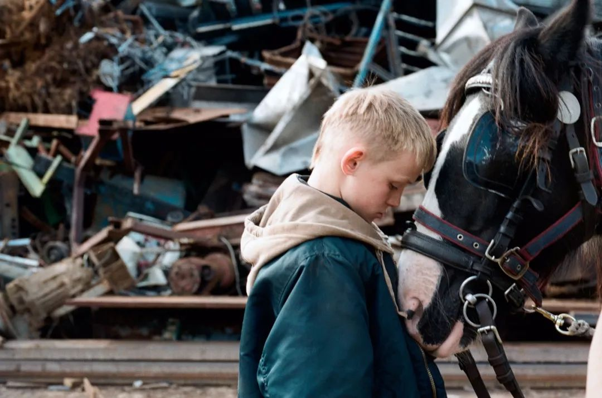
**89.《自私的巨人》克里欧·巴纳德**

**时光评价：**英国影评人对自家年轻导演也颇为追捧，在《自私的巨人》里你可以看到英国左派现实主义电影的传统，对底层少年生活的写实描绘，叛逆的脸上写满无路可走。

**88.《格莫拉》马提欧·加洛尼**

**时光评价：**以最写实的角度，展现意大利黑手党真实活动的状态：并非犯罪电影中那么优雅，而是底层生活的苟且一面。同时在影片中能够看到意大利新现实主义美学的延续。

**87.《风吹麦浪》肯·洛奇**

**时光评价：**英国电影大师肯·洛奇展现北爱尔兰共和军的名作，深度挖掘了惨烈革命背后真实状态，有如肯·洛奇在获得金棕榈大奖时所言：如果我们敢于说出历史的真相，那么我们就敢于说出今天的真相。

**86.《老无所依》伊桑·科恩、乔尔·科恩**

**时光评价：**科恩兄弟的名作不用多言，有趣的是在当年戛纳电影节上，评委会内部对《老无所依》和《四月三周两天》都有高度评价，但权衡之下将金棕榈颁发给了来自“小国”罗马尼亚的电影。

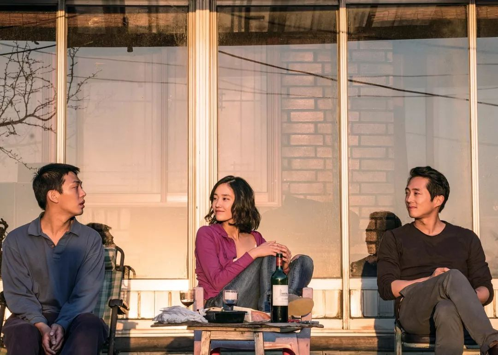
**85.《燃烧》李沧东**

**时光评价：**《燃烧》拿到了戛纳电影节历史场刊最高分3.8分，却依然没有得到金棕榈大奖。影片是韩国电影大师李沧东时隔8年的新作，改编自村上春树的小说《烧仓房》。

**84.《热带疾病》阿彼察邦·韦拉斯哈古**

**时光评价：**阿彼察邦是东南亚电影过去二十多年崛起的标志性人物。《热带疾病》延续了他一贯的神秘主义美学，将个体的生命体验延展到东方文化语境中，也是泰国首部在欧洲三大电影节获奖的影片。

**83.《儿子的房间》南尼·莫莱蒂**
**时光评价：**意大利作者导演南尼·莫莱蒂自编自导自演的佳作，获得戛纳电影节金棕榈大奖认可。

**82.《我们讲述的故事》萨拉·波莉**
**时光评价：**用平时的镜头纪录导演本人的家庭故事，萨拉·波莉以真诚的态度，私人的“讲述”方式，带我们从微观角度领略家人之间的情感。

**81.《鱼缸》安德里亚·阿诺德**
**时光评价：**英国女导演阿诺德的名作，深度挖掘底层少女的成长故事，有悲惨的一面，却也有动人的描绘。

**80.《梦之安魂曲》达伦·阿伦诺夫斯基**
**时光评价：**阿伦诺夫斯基的代表作，以近乎炫技的镜头语言表现瘾君子的迷离生活，它虽然亢奋但却孤独。

**79.《我在伊朗长大》文森特·帕兰德、玛嘉·莎塔琵**
**时光评价：**以动画的形式与个人的生活体验，展现伊朗几十年的历史变迁，对观众的情绪掌控极佳，在极力渲染浪漫幽默的叙事氛围时，让历史的沉重取而代之。

**78.《十一罗汉》史蒂文·索德伯格**
**时光评价：**独立片导演索德伯格展示出了对好莱坞商业类型片的出色掌控力，影片的豪华明星阵容也堪称空前绝后。

**77.《迷失东京》索菲亚·科波拉**
**时光评价：**两个孤独的灵魂在异国的一段相遇，长于科波拉对人物情感的暧昧表现。

**76.《十段生命的律动》阿巴斯·基亚罗斯塔米**
**时光评价：**几段女出租车司机与乘客的对话，芸芸众生的情感体验跃然纸上，实际上也探讨了伊朗社会诸多核心问题。

**75.《菲洛梅娜》斯蒂芬·弗雷斯**
**时光评价：**根据纪实文学改编，展现了保守社会氛围所造成的历史创伤，如何在今天愈合，朱迪·丹奇的表演很具感染力。

**74.《预言者》雅克·欧迪亚**
**时光评价：**反传统的法国黑帮电影，实际探讨的是法国人特有的生活哲学。影片获得戛纳金棕榈提名，并在当年也征服了北美影评界。

**73.《爱情与友谊》惠特·斯蒂尔曼**
**时光评价：**改编自简·奥斯汀的讽刺小说，300年前的故事放在今天依然受用。

**72.《和巴什尔跳华尔兹》阿里·福尔曼**

**时光评价：**罕见的以动画形式拍摄的纪录电影，展现1982年黎巴嫩贝鲁特萨巴拉与沙提拉巴勒斯坦难民营大屠杀的历史悲剧。影片同时获得戛纳金棕榈和奥斯卡金像奖的提名。

**71.《何以为家》娜丁·拉巴基**
**时光评价：**以儿童视角展现社会冷暖是现实主义电影常见的方式，尽管不新鲜，但《何以为家》依然真诚、感人。

**70.《王牌播音员》亚当·麦凯**
**时光评价：**初代烂仔帮成员大集合的恶俗喜剧，出现在榜单中确实蛮令人意外，那时候的威尔·法瑞尔还不是票房毒药。

**69.《帕丁顿熊2》保罗·金**

**时光评价：**英国人自然舍不得将《帕丁顿熊2》排除在榜单之外，尽管传统到复古的程度，但影片的成功之处也得益于此，当然许多形式层面的内容借鉴于《布达佩斯大饭店》。

**68.《透纳先生》迈克·李**
**时光评价：**讲述英国画家约翰·透纳传奇又充满创作激情的一生，是一部非常扎实的传记电影，同时也非常英国。

**67.《狗牙》欧格斯·兰斯莫斯**
**时光评价：**希腊导演欧格斯·兰斯莫斯的成名作，已经能够看到他以奇情设定构建自己政治隐喻的野心，随后延续到了《龙虾》之中。

**66.《断背山》李安**
**时光评价：**李安导演还是回到了最擅长对家庭题材的描绘，因为《断背山》表现的是传统家庭的反面——另一种亲人关系的邂逅和离别，感人至深。

**65.《幸福的拉扎罗》阿莉切·罗尔瓦赫尔**
**时光评价：**罗尔瓦赫尔以极其精巧的剧本设定串联起两个时空的对话，从而完成对当代欧洲社会的批判。

**64.《超人总动员》布拉德·伯德**
**时光评价：**它的超前，它的反类型，它对好莱坞核心情感的展示，让它出现在这里。

**63.《凯文怎么了》琳恩·拉姆塞**
**时光评价：**琳恩·拉姆塞用个人化的视听语言与复杂的叙事结构结合，以此展现焦灼、复杂的亲子关系，同时蒂尔达·斯文顿的演绎也出神入化。

**62.《期待幸福》阿伯德拉马纳·希萨柯**

**时光评价：**可能大部分影迷这辈子都不会观看一部来自非洲毛里塔尼亚的电影，这部入围戛纳一种关注单元的影片，为我们展示了非洲延续了近半个世纪的主题：传统与现代之间的矛盾关系。

**61.《纪念品：第一部分》乔安娜·霍格**

**时光评价：**今年圣丹斯电影节评审团大奖获奖影片，也是这位英国女导演带给我们的惊喜之作，围绕一桩恋情与一对母子之间展开故事，蒂尔达·斯文顿再次挑战了一位复杂的母亲角色。

**60.《泰迪熊》塞思·麦克法兰**
**时光评价：**《泰迪熊》的入围，再次说明了英国影评人对屎尿屁喜剧以及玩具熊（误）的偏爱，尽管低俗但真挚感人。

**59.《瓦塞浦黑帮》阿努拉格·卡施亚普**
**时光评价：**一部不多见的印度版“美国往事”。描写黑帮，也是描写历史，描写印度社会的变迁。

**58.《呼啸山庄》安德里亚·阿诺德**

**时光评价：**作为英国导演，阿诺德没有“免俗”的执导了这部英国传统文学电影，但她将自己的作者风格完全凌驾于原著之上，形式收放自如，再次证明一个受限的文本依然可以让导演充分展示自己技巧和风格。

**57.《不留痕迹》黛布拉·格兰尼克**

**时光评价：**黛布拉·格兰尼克于去年拍摄了这部影片，以父女之间的小格局故事，将美国主流价值体系、现代主义等复杂议题融入其中，两位演员的表演也十分具有说服力。

**56.《烛台背后》史蒂文·索德伯格**
**时光评价：**一部电视电影能够入围榜单，足见其扎实的叙事和迈克尔·道格拉斯精彩的表演，索德伯格的个人风格倒有所收敛。

**55.《俄罗斯方舟》亚历山大·索科洛夫**

**时光评价：**一镜到底的电影现在已经诞生了很多，但论调度的复杂程度和传递的思想深度依然没有几部可以与索科洛夫的这部旷世奇片相提并论，在历史的角度下和一个90分钟的镜头下，通过意象展示一个国家的兴衰。

**54.《社交网络》大卫·芬奇**
**时光评价：**大卫·芬奇新世纪最出色的作品，无论选材还是叙事都展示出当代好莱坞体制内作者导演的最高水准，艺术与商业的完美结合，尤其影片的收尾举重若轻。

**53.《海上火焰》吉安弗兰科·罗西**
**时光评价：**《海上火焰》十分难得的以一部纪录片获得柏林电影节金熊大奖，是当代左派政治立场的宣言书，也是欧洲社会现实的一个剖面。

**52.《爱情是狗娘》亚利桑德罗·冈萨雷斯·伊纳里图**
**时光评价：**伊纳里图来到好莱坞之前，在墨西哥留下的最精彩的影片，用复杂的环形叙事结构，串联起不同小人物间的爱恨纠葛，同时也对社会问题点到为止。

**51.《卧虎藏龙》李安**
**时光评价：**东方奇想故事的诗意演绎，面子上是江湖上的刀光剑影，骨子里还是李安擅长描绘的人际情欲。

**50.《爱在日落黄昏时》理查德·林克莱特**
**时光评价：**“爱在”系列几乎成为当代爱情神话，尽管这个故事的细腻、浪漫、伤感似乎见怪不怪，但林克莱特却赋予它独特的切入点——时间。

**49.《24小时狂欢派对》迈克尔·温特伯顿**
**时光评价：**性、大麻、摇滚，构成英国电影特有的腔调，在《24小时狂欢派对》中，刻画了包括Joy Division在内的诸多英国乐队曾经的辉煌时代。

**48.《欢乐之家》特伦斯·戴维斯**
**时光评价：**英国著名导演、剧作家特伦斯·戴维斯的代表作，在《欢乐之家》中吉莲·安德森塑造了一个极其复杂的女性形象。

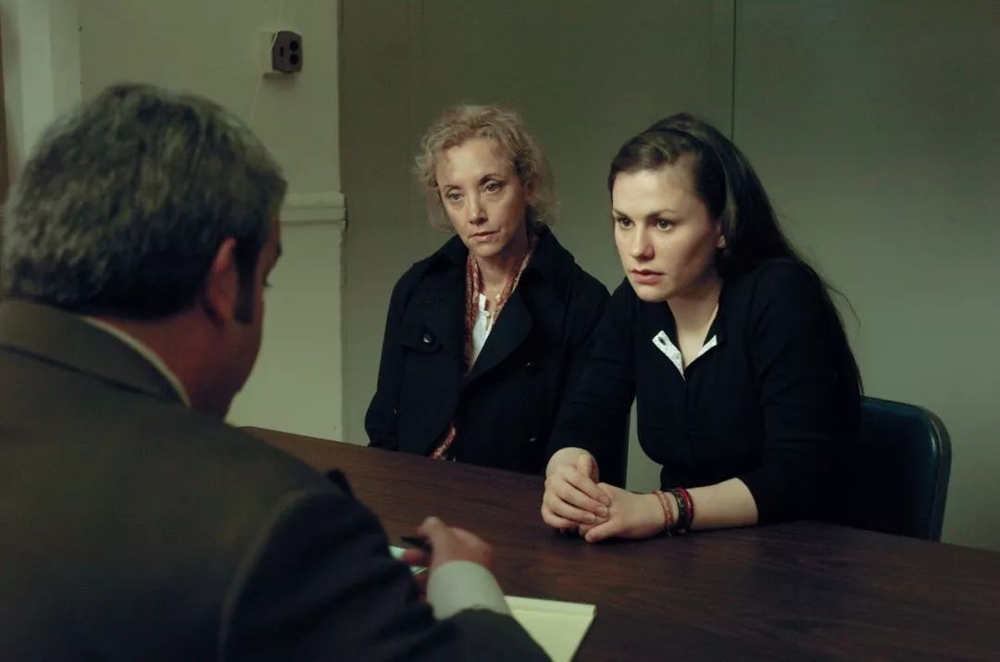
**47.《玛格丽特》肯尼思·洛纳根**
**时光评价：**一场意外事件改变了一个女孩平凡的生活，安娜·帕奎因将女主角渴望逃离噩梦又懦弱的心理层次表现了出来，影片也被BBC评选为21世纪百佳影片之一。

**46.《回归》佩德罗·阿莫多瓦**
**时光评价：**阿莫多瓦用这部《回归》向世人宣告了其创作巅峰的延续，一贯的女性主义主题与百转千回的情节剧，转化为对女性力量的颂歌。

**45.《第十三修正案》艾娃·德约列**
**时光评价：**在这份榜单中，多部名不见经传但关注现实的影片入围，《第十三修正案》展示了黑人群体的历史困境，也是对特朗普政府上台前夕的一种危机感展示。

**44.《托尼·厄德曼》玛伦·阿德******

**时光评价：******《托尼·厄德曼》有一种古怪的幽默感，它虽然以父女为题材，但处处展现人际关系中尴尬的缝隙，此外对当代女性在职场上的困境展示也完成了另一层指涉。

**43.《华尔街之狼》马丁·斯科塞斯**

**时光评价：**马丁·斯科塞斯创作状态依然生猛，调动丰富的视听体系对华尔街的浮华进行展示和批判，私人来说《华尔街之狼》里小李子的疯癫演绎更有理由拿到奥斯卡最佳男主角。

**42.《四月三周两天》克里斯蒂安·蒙吉**

**时光评价：**击败《老无所依》拿到了2007年戛纳电影节金棕榈大奖，似乎也在奖项层面上宣告罗马尼亚新浪潮达到了自己的巅峰。影片关注的是苏联解体前罗马尼亚社会的现实，真实而刺骨。

**41.《小姐》朴赞郁**
**时光评价：**朴赞郁回到韩国拍摄的第一部影片，改编自英国作家萨拉·沃特斯的原著小说《禁忌之城》，也难怪英国影评人对影片赞赏有加。

**40.《与我无关》乔安娜·霍格**
**时光评价：**导演乔安娜·霍格入围榜单的另一部影片，也是她的处女作，由汤姆·希德勒斯顿主演。虽然成本低廉，但精准刻画了潜藏在英国中产阶级中的精神危机。

**39.《米克的近路》凯莉·雷查德**

**时光评价：**凯莉·雷查德越来越被影评人重视，《米克的近路》是这位美国女导演2010年拍摄的影片，以女性的视角展示西部拓荒的时代，由此完成对西部片的回溯和反类型。

**38.《小亚细亚往事》努里·比格·锡兰**
**时光评价：**土耳其电影大师锡兰的代表作，以一起凶杀案为线索，串联起当代土耳其社会的群像电影，精心雕琢的镜头让人完成对影像的凝视。

**37.《狗镇》拉斯·冯·提尔
**
**时光评价：**拉斯·冯·提尔的传世名作，妮可·基德曼在片中闯入了一座保守的美国小镇，在特殊环境的建构下，映射出人性本恶的嘴脸。

**36.《一次别离》阿斯哈·法哈蒂
**

**时光评价：**伊朗导演人才辈出，阿斯哈·法哈蒂以这部《一次别离》震惊世人，将当代伊朗社会的道德困境展现的淋漓尽致，影片包揽了柏林金熊奖、奥斯卡最佳外语片、金球奖最佳外语片等多项大奖。

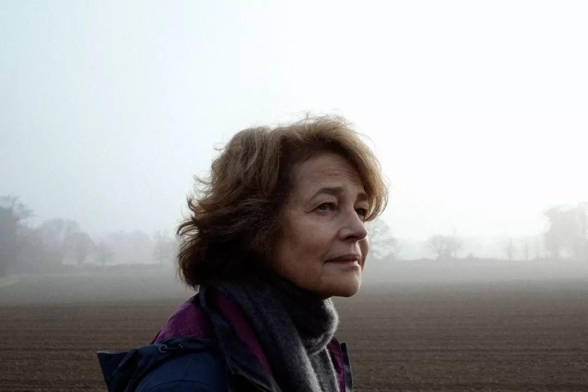
**35.《45周年》安德鲁·海格
**
**时光评价：**这份榜单再次对英国作者导演示好，安德鲁·海格在《45周年》用常规生活的节奏，展示了一对老夫妻饱经风霜的婚姻生活摇摇欲坠的一面，冰冷却深邃。

**34.《孩子》让-皮埃尔·达内、吕克·达内**
**时光评价：**达内兄弟一贯的现实主义风格，用一个突然降临的孩子展现底层青年面临的各种困境。导演在摄影机与角色之间保留了一丝缝隙，这其中缺席的是社会的责任。

**33.《天才一族》韦斯·安德森**
**时光评价：**像交响乐一般赋予一个家族故事史诗感，同时韦斯·安得森的作者美学也让影片保持了纯真的童话气质，是他个人风格集大成的作品之一。

**32.《地心引力》阿方索·卡隆
**
**时光评价：**一部另类的太空题材电影，开片的长镜头就完美的令人屏息。

**31.《失常》查理·考夫曼、杜克·约翰逊**
**时光评价：**一位撰写心灵鸡汤的作者，当他遇到中年危机时如何走出？这个故事看似平常，但用动画形式展示时，在表达上就有了很多全新的尝试。

**30.《利维坦》安德烈·萨金塞夫**
**时光评价：**俄罗斯当代社会的百态，尽在这部影片当中。

**29.《内布拉斯加》亚历山大·佩恩
**
**时光评价：**佩恩二十年来饶有趣味的拍摄着风格一致的独立电影，也许是因为题材的缘故，这部影片比起他之前的作品少了几分锐利，但多了很多细腻、幽默。

**28.《生命之树》泰伦斯·马力克
**
**时光评价：**泰伦斯·马力克用流动的影像探讨严肃的哲学命题，却像诗歌一样细腻、凝重。

**27.《布达佩斯大饭店》韦斯·安德森
**
**时光评价：**韦斯·安德森个人形式的癫狂之作，如果热爱他之前的每一部影片，你能够得到莫大的满足，反之会觉得机械与刻意。

**26.《一一》杨德昌
**
**时光评价：**《一一》是入围榜单的唯一一部台湾新电影，但个人觉得影片的排名似乎可以靠前一些。

**25.《逃出绝命镇》乔丹·皮尔**
**时光评价：**《逃出绝命镇》道出了了那个人尽皆知的真相，这也令他从一众惊悚片中脱颖而出，但排名如此之高多少有些出人意料。

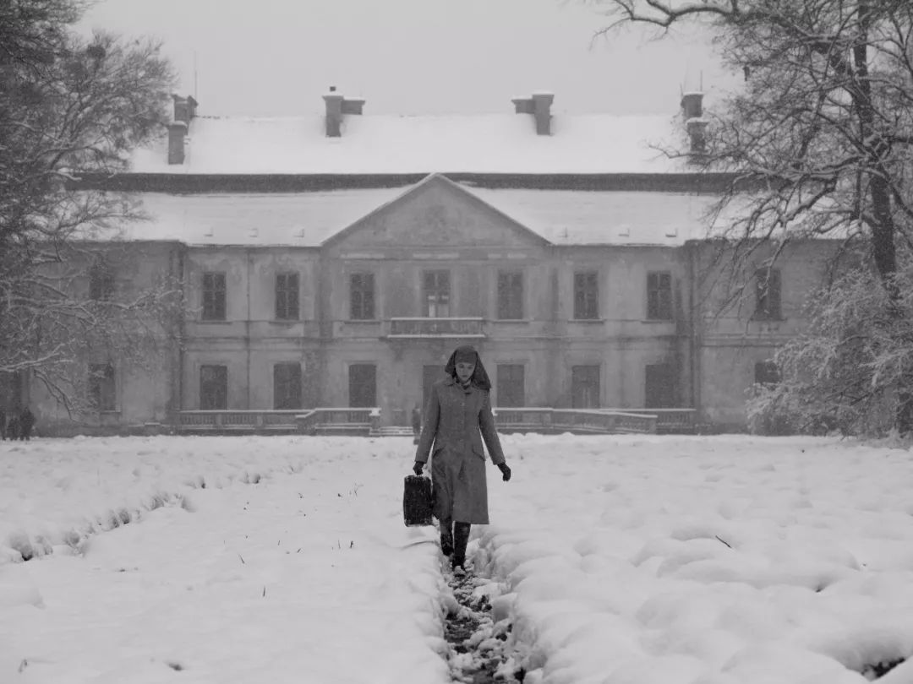
**24.《修女艾达》帕维乌·帕夫利科夫斯基**
**时光评价：**用极致的摄影凸显影像形式之美，不仅获得了欧洲电影奖观众选择奖，更出人意料的夺得奥斯卡最佳外语片。

**23.《波拉特》拉里·查尔斯**

**时光评价：**英国影评人的恶趣味x3，《波拉特》不是第一部伪纪录片，但很可能是第一部屎尿屁伪纪录片，借用一个第三世界闯入者的身份，对美国文化和社会极尽讽刺，其中也暗含政治化的表达。

**22.《千与千寻》宫崎骏**
**时光评价：**或许是榜单上大家最熟悉的一部影片，迄今为止唯一一部夺得三大电影节最高奖的动画电影，也是宫崎骏的巅峰代表作之一。

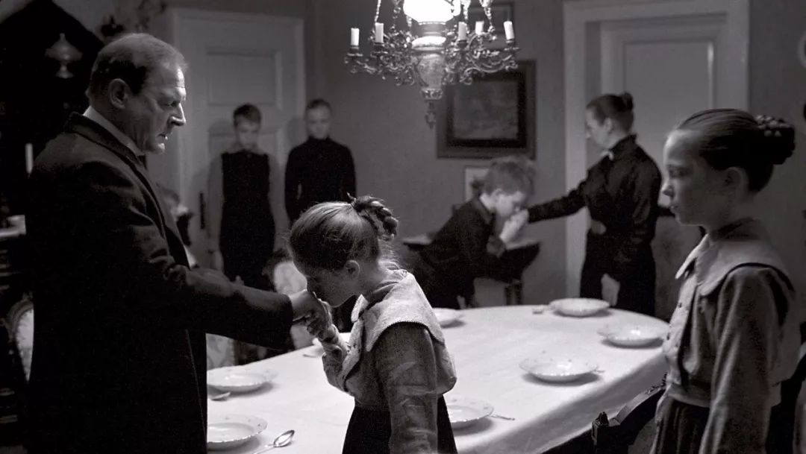
**21.《白丝带》迈克尔·哈内克**

**时光评价：**正好前几天刚刚为大家推送了《白丝带》的回顾文章，可以[点击阅读浏览](http://mp.weixin.qq.com/s?__biz=MjM5ODUzNTM1Mg==&mid=2650221715&idx=1&sn=85f5ac848fae73cb58dadc296dfd3706&chksm=becac54489bd4c527013818d11c0a3d3a51cb0aebc3160422371de787d97fcdcb70257d00296&scene=21#wechat_redirect)。

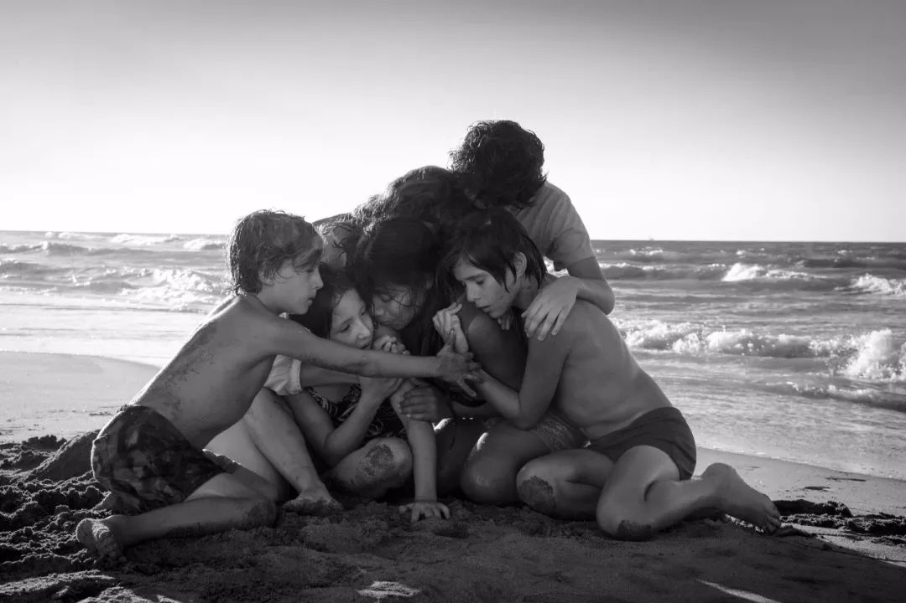
**20.《罗马》阿方索·卡隆**
**时光评价：**卡隆带有自传性质的“墨西哥往事”，将历史、个体、情感、社会融于流动的影像中。

**19.《林肯》史蒂文·斯皮尔伯格
**
**时光评价：**斯皮尔伯格的回勇之作，以个人传记的角度书写历史，丹尼尔·戴·刘易斯凭借本片夺得奥斯卡影帝。

**18.《严肃的男人》伊桑·科恩、乔尔·科恩**

**时光评价：**一个现实中一丝不苟的人遭遇到生活的多重打击，他的认真如何与生活的荒诞斗争？《严肃的男人》在科恩兄弟的作品序列中并不是最优秀的作品，但个人风格却得到延续。

**17.《绝美之城》保罗·索伦蒂诺
**
**时光评价：**可以看到源自意大利电影黄金时期的遗产，来自费里尼的，来自维斯康蒂的，以极佳的视听氛围营造，唤起人们在往日中寻找“美”的愿景。

**16.《杀戮演绎》约书亚·奥本海默**
**时光评价：**《杀戮演绎》模糊了纪录片与剧情片的界限，它以情节设计倒推过去悲惨历史的方式，重新唤起了人们凝视过去的勇气。

**15.《小偷家族》是枝裕和
**
**时光评价：**扎实、沉稳、自然的将每个角色的身份和前史娓娓道来，是枝裕和对画外空间的意识和调度构建了影片中最令人屏息凝视的时刻，细节的掌控颇有大师风范。

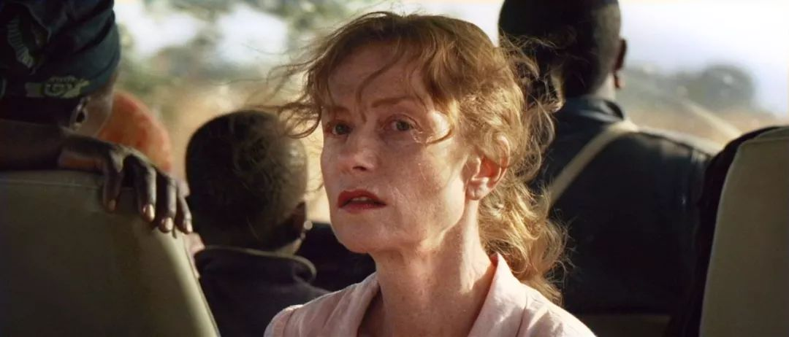
**14.《白色物质》克莱尔·德尼**

**时光评价：**克莱尔·德尼可以虚化了影片的历史背景，而将人物置于神秘的非洲大陆之上，以极具个人化的视角和风格讲述后殖民时代的个体故事，于佩尔的表演也非常出色。

**13.《远离天堂》托德·海因斯**

**时光评价：**《远离天堂》翻拍自道格拉斯·赛克的经典作品《深锁春光一院愁》，这也是这个故事的第三个版本，另一个版本是法斯宾德的名作《恐惧吞噬灵魂》。有两部珠玉在前，托德·海因斯用非常复古的美学完成了致敬，同时也融入了时代特色。

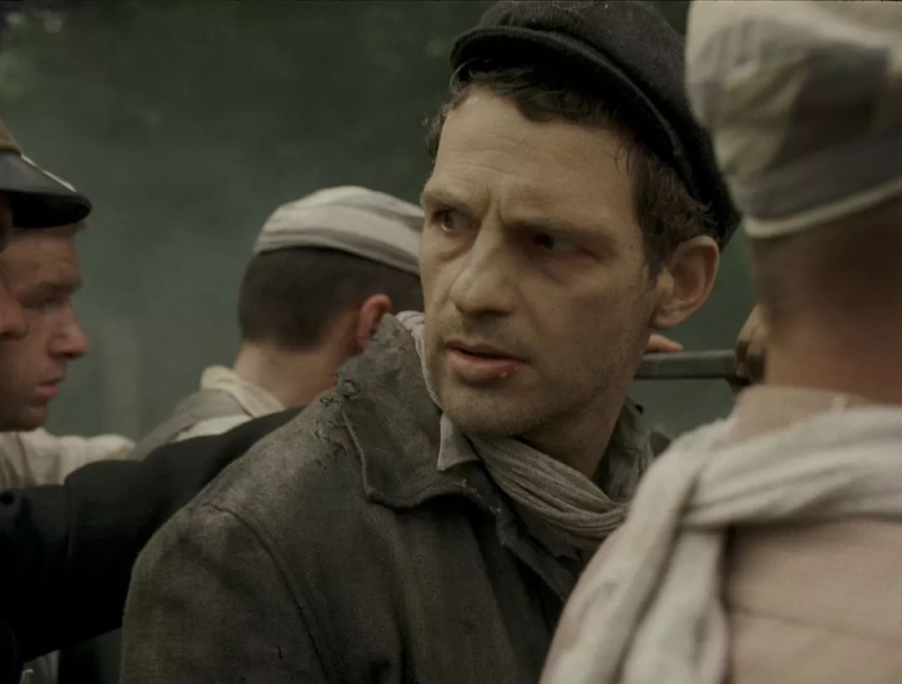
**12.《索尔之子》拉斯洛·奈迈施**
**时光评价：**用极致的视听语言强化了观众的感官，以此来完成对历史的展示：犹太人在奥斯维辛集中营的悲惨遭遇。

**11.《穆赫兰道》大卫·林奇**
**时光评价：**尽管排在第11，但依然低了。《穆赫兰道》对梦境体验的塑造依然难有作品望其项背。

**10.《美国战队：世界警察》崔·帕克**

**时光评价：**《南方公园》的超长电影版。只拍摄《南方公园》显然满足不了崔·帕克拿美国政治开涮的欲望，在《美国战队》中依然有《南》里那种话糙理不糙的美式哲学。

**9.《扎马》卢奎西亚·马特尔**

**时光评价：**马特尔被更多人熟知，可能还是前不久将金狮奖颁给了《小丑》，而她本人却早已成为当今国际影坛最具创造力的女性作者导演。影片讲述西班牙殖民时期南美腹地的故事，将个人的困境与历史、时代杂糅在一起。

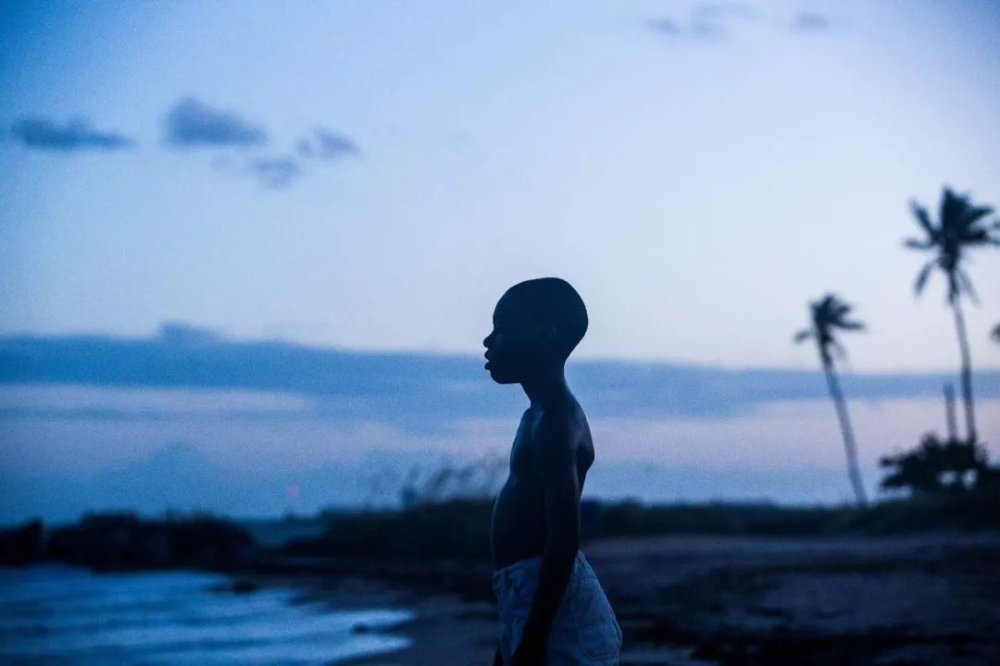
**8.《月光男孩》巴里·詹金斯**
**时光评价：**《月光男孩》所代表的是黑人电影美学层面的另辟蹊径，同时也将时代议题贯穿其中，将伤感的情愫延展。尽管如此排在如此高的位置还是有些出人意料。

**7.《纽约提喻法》查理·考夫曼
**
**时光评价：**查理·考夫曼的巅峰作品，“戏中戏”结构的极致演绎，导演内心世界的丰富展示让人联想到《八部半》这样伟大的作品。

**6.《隐藏摄像机》迈克尔·哈内克
**
**时光评价：**毫无疑问，哈内克是控制观众的大师，他迫使观众参与到叙事当中去，待你发现影片中暗藏的惊悚一面时，他又以最克制的方式讲完整个故事，抽身离去。

**5.《花样年华》王家卫**
**时光评价：**在诸多榜单中位列新世纪最佳影片的《花样年华》，在这里只排到第五，其实可以更靠前一些。

**4.《皮囊之下》乔纳森·格雷泽**
**时光评价：**又一部英国独立电影人的作品，一部气氛诡异的科幻电影，一部高概念强视听的现代电影！

**3.《少年时代》理查德·林克莱特**

**时光评价：**如前文中所说，林克莱特不仅擅长通过时间的维度展现人的演变，而且有足够的耐心旁观、捕捉这个真实的过程。在他这里，电影不是压缩时间的魔术家，而是纪录时间的忠实摄影师。

**2.《为奴十二年》史蒂夫·麦奎因**

**时光评价：**麦奎因从英国来到好莱坞拍摄的第一部电影，就获得了巨大的成功，摘得奥斯卡最佳影片。虽然是常见的黑人奴隶题材，但史蒂夫·麦奎因高超的导演技巧却让它在同类作品里出类拔萃。

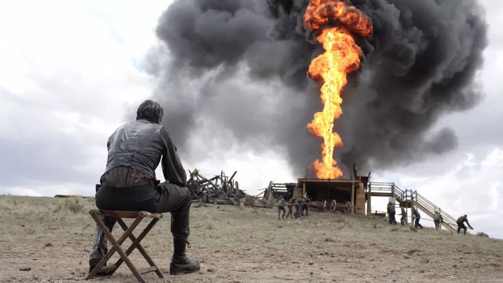
**1.《血色将至》保罗·托马斯·安德森
**
**时光评价：**保罗·托马斯·安德森的作品会随着时间越来越彰显它的伟大，史诗级的叙事、调度、镜头运动让人叹为观止！

**以上这一百部电影，你看过多少部？**
**
**
**—End—**

**往期精选回顾：******

在看