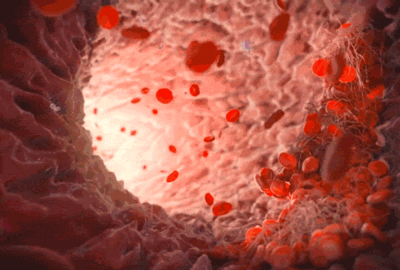

# 日本动漫，难以忘怀

原创：  橘子  小花生网

橘子：今天主要跟大家安利一部最近超级火爆的日本科普动漫-**《工作细胞》**，朋友圈很多在推荐，我“跟风” 看了几集之后，真心觉得好。如果孩子们的生物课能这么上，就太棒了！

> 这是一个关于你自身的故事。你体内的故事。
> 人的身体，是一个有序的世界。
> 每天，大约37兆2千亿个细胞在这里精神十足、无休无眠地工作 ...
> 运送着氧气的红细胞，与细菌战斗的白细胞……！
> 这里，有着细胞们不为人知的故事。

有个资深影评人说过，日本动漫最神奇的一点是就是，万物皆可拟人化。这部动画里，人体内的红细胞、白细胞、血小板等等，都化作有趣的人物，**通过精彩纷呈的动漫故事让孩子明白人体的运作原理。**

这部今年7月份新推出的动漫在豆瓣收获了9.2的高分（与同类作品相比特别高），在国内网站的播放量超过2000万了。

我自己看了，一下子就被故事带进去了，然后在不知不觉收获了好多人体科学知识。因为想跟上情节，所以看得特别认真，难怪有网友说，边看着边忍不住想做笔记...

特别推荐这部片子给孩子们看。人体科学是孩子们的必修课，然而，这门学科并不容易学懂，因为身体内部的事儿，看不见、摸不着啊，感觉很抽象。**看了这样的动画片，等于开开心心上了特别优秀的生物课。**

《工作细胞》以外，今天还会推荐两部人体纪录片，文末有获取观看链接的方法，不要错过哦。

**工作细胞**

## ****这才是理想的生物课堂****

**豆瓣评分：9.2**

这部动漫非常有新意，整个作品用“拟人化”的手法，把我们身体塑造成一个庞大的“生命世界”，每个细胞都各司其职，为“身体”这个系统的健康安全工作。在疫苗事件发生的当下，这样的故事还格外有科普意义，值得咱们和孩子们都看看。

每天，在我们每个人的身体内，有大约37兆2千亿个细胞在精神十足的工作，这个世界也非常严谨有序...

有承担运输氧气和二氧化碳工作的红细胞，下面是真实的红细胞照片，可是单看这些照片，没学过生物的人可看不出红细胞的功能...

可是在动漫里，一眼就get到了。这里红细胞化身为一个个兢兢业业的小红帽快递员萌妹子，看她手上抱的是什么？不就是氧气吗，是不是一下就明白了。

结果，“红细胞”却经常犯糊涂，横冲直撞来到防止血液逆流的静脉瓣膜，因单向通行而被闸门拦截。

什么是“静脉瓣膜”？是不是有点懵，不要担心，影片会时不时对这些专业名字进行解释，配上好玩的故事情节，不想记住都难。

> 静脉瓣膜：防止血液逆流，将流淌在静脉中的血液单向输送到心脏

还有一位主角，白血球，也就是中性粒细胞，单看下面这张课本上的图，没什么特别感觉...

但是，动漫里的“白细胞”很酷很厉害，主要工作就是保卫人体，因为要随时与病毒作战，所以身上总是挂彩，这样的脑洞将“白细胞”的功能深深印在我的脑海里...

血小板，是一群超级萌的小朋友！！集体行动，擅长修修补补，功能强大，为什么是这样的形象呢？

因为在血管损伤时，血小板会集合起来堵住伤口止血。有的网友看了后表示，以后伤口的疤再也不随便乱揭了，这可是血小板努力让我们痊愈的成果...

血小板们工作起来那个认真劲头，太可爱了。

下面正是在呈现血小板的工作原理，一切都可视化了，看得好明白！

在台湾已经有孩子们开始cosplay（装扮）血小板啦。

影片又是怎么讲述病毒入侵的原理呢？

当病毒侵入人体，被病毒寄生了的细胞就会不断增加，能引起人们发烧、疼痛，这里的细胞好像变成了“僵尸”，而且还在不断壮大..

这时仅靠白细胞杀菌肯定是远远不够的，还需要杀伤性强的巨噬细胞。

动漫里就是下面这位啦，外表甜美，关键时刻，扛起大刀，比谁都能打。不过巨噬细胞不只是单打独斗，人体是一个系统，这里也讲团体作战。

巨噬细胞发现病毒后，还会通知给树突状细胞, 然后树突状细胞小哥会通知各个器官，让杀手T细胞立刻赶来支援。只看这段文字，有点无聊是吧，但是你看下面的树突状细胞，明显就是个邮差小伙，现在明白他的功能了吧，很简单，就是传递信息嘛。

如果说白细胞是普通警察，杀手T细胞就是“特警”啦，病毒太难缠，他们就出手了。

杀手T细胞中还有一部分是记忆T细胞，这位的功能又是什么，看下面他手中的小本本，对于每次的反攻，他可是会做记录的，以备下次再用，下次处理会更高效！

除了这些守护我们身体的正面角色，反面角色有哪些？当然是各种病毒了。病毒这个词我们倒是整天说，可是你知道是什么样子吗？

先说说“肺炎链球菌”吧，真实的模样：

动漫里是这样，看了下面这个猖狂的家伙，下次见到微观照片是不是很容易就认出来了？

接下来这段很多看过的朋友都喜欢，因为“打喷嚏”这件特别的事儿原来背后有这么有趣的故事！

又回到肺炎链球菌，这个家伙有一次入侵身体，最终被白细胞打败，消灭的方法就是用“打喷嚏”。具体是这样，细菌被白细胞引到支气管，最终乘坐喷嚏一号火箭，发射出体外，这个过程就是“打喷嚏”，真是太形象了。

看到这里，总算彻头彻尾明白，万万不能对着别人打喷嚏啊，谁知道里面有什么呢。

这样有意思的情节非常多，网友们看完后最大的感触是，原来人体知识这么好玩！原来我身体里的各位好辛苦啊！他们一直工作，没有年假，看来真的要好好对待自己的身体。

### > @ugu没有顾是> ：生物知识抓起来！原来我活着是这么的不容易，身体内这么多兆的细胞那么努力的工作。

> @冬虫夏草> ：剧情让我瞬间想起“菌菌国王入侵地球”，我家小朋友最喜欢的图画书肺炎链球菌，巨噬细胞，白细胞，血小板，四岁的小朋友听得津津有味，这个动漫必须收下！

# **国家地理《人体内旅行》**

****用90分钟了解人体成长规律****
****豆瓣评分：9.2****

****

国家地理频道采用各种技术，带领大家一起进入人体的肌肤深处，从出生讲到衰老，看人体是如何运作、成长和成熟的。

从我们的第一声啼哭到最后一次呼吸，我们的身体都经历着不断的微妙变化。我们的每一个本能动作以及从外界受到的每一次刺激，都通过我们的皮肤、骨骼、器官、肌肉以及细胞得以体现。这些微妙变化很重要，但我们看不到，甚至都感受不到。

> @八卦：> 看了后了解到，> 由于青少年期是神经突触建立最快的时期，所以青少年期是最好的学习期；学习有很多种模式，课堂之外，大千世界也是学习的课堂，我们可以通过亲身经历来学习，尽管有时候这种学习并不愉快；年轻的大脑总渴望新鲜事物...

# ****BBC《人体奥秘》****

# **普及人体常识、生命知识的纪录片**

# ****豆瓣评分：9.2****

BBC的这部纪录片对人体的介绍更细致，从生命起源 - 胚胎讲起，介绍呼吸和消化系统如何运作，解释了大脑的发展，最后介绍了奇妙的人体防御系统。看完这部，我们会更了解自己的身体，也更明白孩子的成长规律...

### > @风雨骑老师 ：> 利用通俗的特效、不凡的事例和深入浅出的解说来完成科学和心灵的双向教育，足以称之为伟大，全世界的教科书都应该向BBC学习。

在小花生微信公众号对话框中回复消息 细胞，会收到自动回复，里面整理了这些影片的观看链接（大部分是免费资源）！注意再注意 ：不是给这篇文章留言哦，也不是给花编发消息，是给公众号发消息留言。

———— / END / ————

相关阅读：

- [暑假观影大全：最优秀的电影、动画片和纪录片都在这里啦 ...](http://mp.weixin.qq.com/s?__biz=MjM5MTgzNDM0MA==&mid=2651264157&idx=1&sn=85d3893acaa13707225a473d3b92357a&scene=21#wechat_redirect)
- [20部根据经典绘本改编的影片，假期正好看！（可在线观影）](http://mp.weixin.qq.com/s?__biz=MjM5MTgzNDM0MA==&mid=2651312047&idx=1&sn=80d6f43901ac374bdaff8314cb2c6b66&chksm=bd5ce6248a2b6f32b99bf53c029ceb36b406a4b10e9f35d1ea01c34c3434f7bb219f05486c29&scene=21#wechat_redirect)
- [10部近年来最受外国孩子欢迎的动画片，看故事学英语，暑假正好用！](http://mp.weixin.qq.com/s?__biz=MjM5MTgzNDM0MA==&mid=2651310159&idx=1&sn=4165c9108beed3d0ea497c50e9b16351&chksm=bd5ce1c48a2b68d25720c474422c8bbc27b8447d9fcc78f565559faffe2b5ae9bb26037190ad&scene=21#wechat_redirect)

****欢迎参加小花生2018暑假阅读活动****
今年的暑假活动，特别有仪式感：
和孩子用“小花生小程序”快速建立一个书单，
读完一本书，标记“完成”；
如果达到本次活动的“阅读挑战”目标，
还会得到来自小花生的一份奖励！
戳下方图片进入小程序?

感谢订阅 “小花生网”

****和你分享世界上先进的教育资源****
周一：英文原版书开团
周二：看世界，开视野
周三：怎么阅读，怎么学英语
周四：美好生活画报
周末：新知、观点 & 新书预告