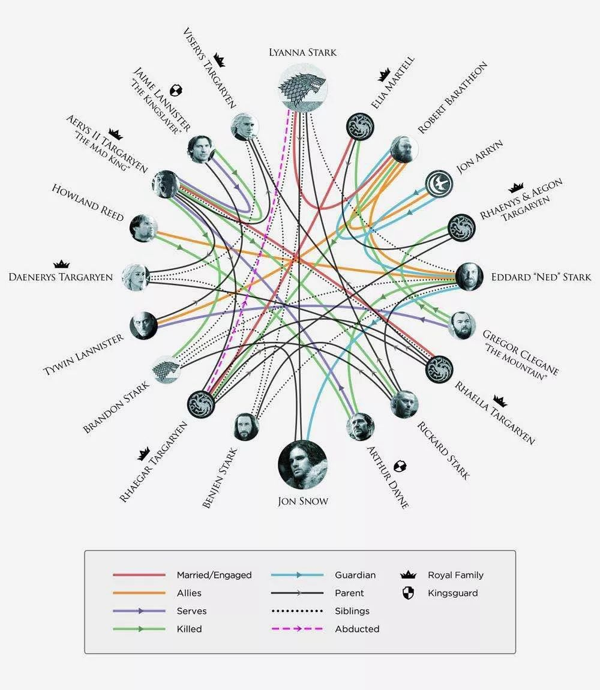

# 《**权力的游戏**》大结局2019年回归，然而讲完故事还只是开始
星期五, 七月 27, 2018
1:57 下午
原创： 彭倩  [36氪]()
***
在权游最终季开播之前，你搞明白各大家族之间的关系了吗？

### 权游最终季开播时间越来越近了。

外媒The Hollywood Reporter称，本周在电视评论家协会的新闻发布会上，HBO总裁Casey Bloys透露，《权力的游戏》最终季将在2019年上半年回归，最终季（即第八季）将只有六集。但对于龙妈、雪诺等人最后的冒险故事和最终命运，他依旧守口如瓶，只说了一句：“真的特别棒”。

Bloys还表示，在相关衍生剧集方面，已被预订播集的“长夜”系列将在明年第一季度进行拍摄。故事发生在原剧的数千年前，编剧制作人为马丁和Jane Goldman，目前正在寻找导演，但其他四部前传衍生剧集尚无具体计划。

### 《权力的游戏》人物关系图

《权力的游戏》改编自美国奇幻小说《冰与火之歌》，是一部描写中世纪史诗奇幻世界的电视剧。该剧以架空的时代、王国和人物，展现了虚构的中世纪里发生的宫廷权利斗争、王国部落厮杀，以及与魔幻人物对抗的故事，融合了性与欲望、暴力与野蛮、背叛与复仇、尔虞我诈与权力制衡等多种美剧常见元素。自2011年开播以来仅在美国本土就拥有上千万忠粉，在中国也吸了不少剧粉。目前在中国官方播放平台腾讯视频已积累了近30亿的播放量（仅前七季有版权）。

**权游女主，银发紫眼的大美人丹尼莉丝·坦格利安，粉丝昵称龙妈**

该剧在各大社交平台的数据十分亮眼。官方百度贴吧粉丝已达118万，发帖累计483万。目前在中国播出的前七季豆瓣评分均超过9分，累计超过80万人评分。虽然没有开通官方微博和中文官网，但粉丝自发成立了各种“权力的游戏中国站”。

由于故事时空设定为中世纪，且王朝、人物均为虚构，因此存在文化隔离的中国粉丝在追《权游》时经历了从“完全看不懂”到“爱上雪诺龙妈”的适应过程。随着剧情的不断深入，大部分一开始雾里看花的观众成了越看越爱的剧粉，不少剧迷开始主动研究剧中出现的七国地图和各国资源，并在知乎、百度贴吧、新浪微博等各大社交媒体上开贴讨论。贯彻整部剧集的狼族族语“Winter is coming”则成了剧粉的口头禅，配上主角们的表情包在社交媒体上广为流传。

### 《权游》前三季最经典剧情：血色婚礼，奠定其成为一部经典美剧

血色婚礼场景经典台词
追剧七八年，吸引剧粉的绝不仅是主角们的美颜、精良的制作或者国内影视剧中罕见的大尺度镜头。讲出一个好故事才是剧粉们持续追剧的根本动力。

把背景复杂、世界观宏大的故事讲好本身已属不易，权游还做了很多反套路的剧情设计。与国内影视剧主角常常开金手指拥有免死金牌+Happy ending不同，作为《权游》剧迷，你不得不接受喜欢的角色分分钟领了盒饭，不喜欢的角色也纷纷领了盒饭；没领盒饭的则各种被虐。这种不按套路出牌的剧情也让整部剧集充满悬念，激发观众的好奇心，持续追剧。

剧迷评的十五大精彩瞬间之一，男主雪诺死亡

不仅剧情设计高级，故事精神内核也很有深度。在看剧的过程中，你不得不面对各类人性中的黑暗面并引发剧迷的反思。此外，该剧将色情、伦理、宗教、背叛等多个具有争议性的话题融合，无论从哪个方面都能引发争议和思考。

一个有趣的现象是，《权游》揭示的权力斗争吸引了很多投资人剧粉，他们用看项目的方式来观剧。他们将剧中三大家族比作三个理财项目，其他参与权力局的人实际上就是在做一项投资：随着剧情的不断深入，整个权力争霸局面基本明晰，各路追随家族也做出选择，将自己的宝压在狮家、狼家或龙家三家身上。

作为近年来最受关注的美剧，《权游》即将迎来大结局。但对于一个优秀的IP而言，讲完故事还只是开始。

