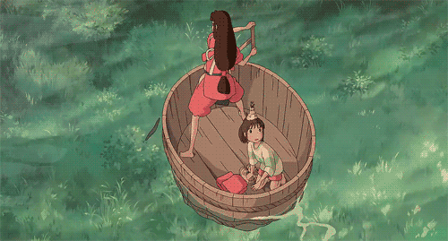
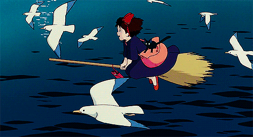

#  来深图看“宫崎骏电影”吧

[深圳图书馆]()**

立秋已至，
深圳仍是炎炎夏日。
抓住暑假的尾巴，
深图为您献上与宫崎骏电影的一周约会。

宫崎骏电影广受中国观众的喜爱，
奇幻而温暖的故事、
华丽唯美的场景、
悠扬动听的配乐与意味深远的寓意带给我们深深的感动。

除《龙猫》《千与千寻》等知名度极高的作品以外，宫崎骏电影还有许多经典之作，我们选取了六部电影，分六天时间播放，与读者一同感受其中纯真童趣、妙想奇思；一起思考电影表达的人与人、人与自然与人类文明发展的现实问题。

? 8月13日：
**《风之谷》**（1984年）

【内容简介】工业文明的高度发展，却最终带来灾难，一场为期7天的虫族毁灭战争摧毁了人类文明。一千年后，工业文明遗留下来的症结仍在困扰这个星球。带有强烈毒性的植物组成了令人望而却步的“腐海”森林，蚕食周边世界。在一片腐海森林的旁边，居住着一群御风而行的人类。某一天，战火烧到了这里，毁灭战争一触即发，人类的命运将会如何……

? 8月14日：
**《心之谷》**（1995年）

【内容简介】正在读初三的月岛雯是一个喜欢看书的女孩，她每次都能在借书卡上看到一个叫天泽圣司名字，因此她对这个人充满了好奇。认识了圣司的雯，在听到他到意大利学习做小提琴的理想后，也激发了追求自己理想的信念，决定要专心写作。面临着毕业抉择的他们，坚定地选择了自己向往的道路……

? 8月15日：
**《红猪》**（1992年）

【内容简介】波鲁克是一战中意大利空军的王牌飞行员，但中了魔法变成一头猪。他成为了一名赏金猎人，专门打击在亚地里亚海空域作恶的空中劫匪。匪徒们为了对付他，请来了美国超级飞行员卡地士，卡地士在对决中将波鲁克击落。波鲁克把飞机送到老朋友保可洛处修理时，遇上了保可洛的孙女菲奥。菲奥完美地修复了波鲁克的飞机，和他一起重返蓝天。这时，卡地士再度出现，并对菲奥一见钟情。为了争夺菲奥的爱，两人再次一决胜负……

? 8月16日：
**《猫的报恩》**（2002年）

【内容简介】吉冈春是一名普通的高中生。某天放学的路上，善良的她从车轮下救了一只猫的性命，小猫竟然站起来以人类的方式对她表示感谢。原来小猫是猫王国的王子，为了报答小春的恩情，猫王国举国上下展开了令人啼笑皆非的报恩行动。不久后，小春接受王国的邀请前去做客，期间竟稀里糊涂答应成为王子的妃子。女孩眼看就彻底变成了一只猫，神秘的男爵成为她的救命稻草……

? 8月17日：
**《千与千寻》**（2001年）

【内容简介】女孩千寻和爸妈一同驱车前往新家，在郊外的小路上不慎进入了神秘的隧道，去到了一个奇特的世界——不劳动的人会被魔法变成别的东西。千寻的爸爸妈妈因贪吃变成了猪，千寻仓皇逃出，期间遇见了白龙，一个既聪明又冷酷的少年。在白龙的帮助下，千寻获得了一份在浴池打杂的工作。白龙被魔法所伤后，为了拯救白龙，千寻踏上了她的冒险之旅……

? 8月18日：
**《魔法公主》**（1997年）

【内容简介】为了拯救危难中的村民，有着和平主义理想的虾夷族青年阿席达卡中了凶煞神的诅咒。为了寻求解除诅咒的方法，阿席达卡前往西方，却卷入了以幻姬为代表的人类与以幽灵公主珊为代表的自然之间的战争中……

? **光** / **影** / **世** / **界** ?
**——宫崎骏经典影片展映周**

时间：**8月13日-8月18日  19:00 至 21:00**
地点：**深圳图书馆  五楼报告厅**
主（协）办单位：**深圳图书馆**

**? ****展映电影排期******（时间 & 电影名称）
8月13日  **《风之谷》**
8月14日  **《心之谷》**（又名《侧耳倾听》）
8月15日  **《红猪》**
8月16日  **《猫的报恩》**
8月17日  **《千与千寻》**
8月18日  **《魔法公主》**（又名《幽灵公主》）

还等什么？
赶紧约起吧！

**·****·****·**

|     |     |
| --- | --- |
|  |  关注深图服务号 开启图书馆之旅 |

➥  或许你还对这些活动感兴趣...

[【权威报告】2019深圳“图书馆之城”阅读报告?](http://mp.weixin.qq.com/s?__biz=MjM5NTY5Njc4MQ==&mid=2651040998&idx=1&sn=2cad9db4d3a57ab00ec359b1d9f9ab42&chksm=bd0395048a741c127497cf554f61a931df5850673f7fb12f002acc4cdad30e74d22a7cd6304a&scene=21#wechat_redirect)

[【重磅发布】2019南书房家庭经典阅读书目（30种）?](http://mp.weixin.qq.com/s?__biz=MjM5NTY5Njc4MQ==&mid=2651040946&idx=1&sn=52d269ded2fd62b7da0c73f30ddfcd13&chksm=bd0395508a741c46e42d158a216c224aa447cbb49060ff66c9ff946bc2eccd2824dd15bd5578&scene=21#wechat_redirect)

[【活动公告】2019“南书房家庭经典阅读书目”主题征文比赛?](http://mp.weixin.qq.com/s?__biz=MjM5NTY5Njc4MQ==&mid=2651041049&idx=1&sn=8a9a35403a2e2f8594fb6cfe0846a2af&chksm=bd0394fb8a741ded536050091bb3cb36f04167603fb240d653da8a4bfc41e1566f51d8cce8a2&scene=21#wechat_redirect)

在看